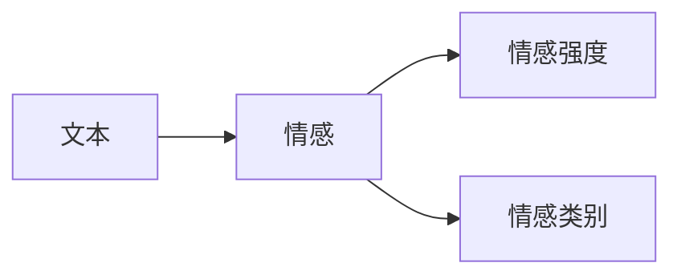

                 


# 情感分析：让AI Agent具备情商

> 关键词：情感分析，自然语言处理，AI Agent，深度学习，文本挖掘

> 摘要：情感分析是一种自然语言处理技术，用于识别和分类文本中的情感倾向。本文将详细探讨情感分析的核心概念、算法原理、系统架构设计、项目实战以及未来发展趋势，帮助读者全面理解情感分析的技术与应用。

---

## 第一部分：情感分析背景与核心概念

### 第1章：情感分析概述

#### 1.1 情感分析的基本概念

情感分析（Sentiment Analysis），又称情绪分析，是自然语言处理（NLP）领域的重要任务之一。它旨在识别和分类文本中表达的情感倾向，例如积极、消极或中性。情感分析不仅帮助我们理解文本内容，还能揭示作者的态度和情绪。

情感分析的应用场景非常广泛，包括社交媒体分析、产品 reviews 分析、客户服务反馈分析等。通过情感分析，企业可以更好地理解用户需求，优化产品和服务。

#### 1.2 情感分析的核心问题

情感分析的核心问题包括：

1. **情感分类**：将文本分类为积极、消极或中性。
2. **情感强度分析**：确定情感的强度，例如“非常喜欢”与“喜欢”的区别。
3. **情感定位**：识别文本中情感的关键部分，例如关键词或短语。

情感分析的边界与外延需要明确，例如如何处理混合情感的文本（如“产品不错，但价格太高”）。

#### 1.3 情感分析与自然语言处理的关系

情感分析是自然语言处理的一个重要分支。它依赖于词法分析、句法分析和语义分析等技术。情感分析与其他 NLP 任务（如文本分类、信息抽取）密切相关。

---

### 第2章：情感分析的核心概念

#### 2.1 情感分析的特征与属性

情感分析的特征包括：

- **词语特征**：高频词、情感词典中的词汇。
- **句法特征**：句子的结构和语法关系。
- **语义特征**：词语的上下文含义。

下表对比了情感分析中常用特征的属性：

| 特征类型 | 具体特征                  | 示例               |
|----------|--------------------------|--------------------|
| 词语特征 | 情感词、否定词、疑问词    | "喜欢"、"讨厌"      |
| 句法特征 | 主语、谓语、宾语          | "用户喜欢产品"       |
| 语义特征 | 情感强度、情感类别        | 积极、消极          |

#### 2.2 情感分析的分类方法

情感分析的分类方法包括：

1. **基于情感词典的方法**：利用预定义的情感词典进行情感分类。
2. **基于机器学习的方法**：使用特征工程和机器学习算法（如 SVM、随机森林）进行分类。
3. **基于深度学习的方法**：利用神经网络（如 CNN、RNN、BERT）进行情感分析。

下图展示了情感分析的实体关系图：



---

## 第二部分：情感分析的算法原理

### 第3章：情感分析算法原理

#### 3.1 基于词袋模型的情感分析算法

词袋模型是一种简单的文本表示方法，它将文本表示为单词的集合，不考虑单词的顺序。以下是基于词袋模型的情感分析算法的流程图：


以下是基于词袋模型的 Python 实现代码：

```python
from sklearn.feature_extraction.text import CountVectorizer
from sklearn.svm import SVC

# 示例数据
text = ["I love this product!", "I hate it!"]

# 分词和特征提取
vectorizer = CountVectorizer()
X = vectorizer.fit_transform(text)

# 模型训练
model = SVC()
model.fit(X, ["positive", "negative"])

# 预测
print(model.predict(vectorizer.transform(["This is great!"])))
```

#### 3.2 基于情感词典的情感分析算法

基于情感词典的情感分析算法通过预定义的情感词汇进行情感分类。以下是情感词典分类方法的流程图：


以下是基于情感词典的 Python 实现代码：

```python
import nltk
from nltk.sentiment import SentimentIntensityAnalyzer

# 示例数据
text = "This product is terrible!"

# 情感分析
analyzer = SentimentIntensityAnalyzer()
scores = analyzer.polarity_scores(text)

print(scores)
```

#### 3.3 基于深度学习的情感分析算法

深度学习模型（如 CNN、RNN、BERT）在情感分析中表现出色。以下是基于 BERT 的情感分析流程图：


以下是基于 BERT 的 Python 实现代码：

```python
from transformers import BertTokenizer, BertModel
import torch

# 示例数据
text = "I love this product!"

# 分词和编码
tokenizer = BertTokenizer.from_pretrained('bert-base-uncased')
model = BertModel.from_pretrained('bert-base-uncased')

inputs = tokenizer(text, return_tensors='pt')
with torch.no_grad():
    outputs = model(**inputs)

# 提取特征并分类（简化示例）
feature = outputs.last_hidden_state[:, 0, :].squeeze()
print(feature)
```

---

## 第三部分：情感分析的系统架构与设计

### 第4章：情感分析系统架构

#### 4.1 情感分析系统功能设计

情感分析系统的功能模块包括：

1. **文本输入**：接收用户输入的文本。
2. **预处理**：分词、去除停用词等。
3. **特征提取**：提取文本特征。
4. **模型训练与分类**：使用训练好的模型进行情感分类。
5. **结果输出**：输出情感分类结果。

下图展示了情感分析系统的领域模型：

```mermaid
classDiagram
    class TextAnalyzer {
        string text;
        int polarity;
        string result;
    }
    class SentimentAnalyzer {
        void analyze() {
            // 分析情感
        }
    }
    class MainWindow {
        void displayResult() {
            // 显示结果
        }
    }
    TextAnalyzer o SentimentAnalyzer
    TextAnalyzer o MainWindow
```

#### 4.2 情感分析系统的架构设计

情感分析系统的架构包括：

1. **输入层**：接收用户输入。
2. **预处理层**：进行文本预处理。
3. **特征提取层**：提取文本特征。
4. **分类层**：使用模型进行分类。
5. **输出层**：显示结果。

下图展示了情感分析系统的整体架构：


---

## 第四部分：情感分析的项目实战

### 第5章：情感分析项目实战

#### 5.1 环境安装与数据准备

首先安装所需的库：

```bash
pip install scikit-learn nltk transformers
```

准备数据集，例如 Twitter 数据集。

#### 5.2 情感分析模型实现

以下是情感分析模型的实现代码：

```python
from sklearn.feature_extraction.text import TfidfVectorizer
from sklearn.svm import SVC

# 数据预处理
data = ["I love this!", "I hate this!"]
labels = ["positive", "negative"]

# 特征提取
vectorizer = TfidfVectorizer()
X = vectorizer.fit_transform(data)

# 模型训练
model = SVC()
model.fit(X, labels)

# 测试
print(model.predict(vectorizer.transform(["This is great!"])))
```

#### 5.3 案例分析与结果解读

分析一个案例：

输入文本："The service is terrible!"

预处理：分词、去除停用词。

特征提取：使用 TF-IDF。

分类：模型预测结果为“negative”。

---

## 第五部分：最佳实践与未来展望

### 第6章：最佳实践与未来展望

#### 6.1 最佳实践

- **数据预处理**：确保数据清洗和分词的质量。
- **特征选择**：选择合适的特征提取方法。
- **模型选择**：根据任务选择合适的模型。

#### 6.2 未来展望

- **多模态情感分析**：结合图像和文本进行情感分析。
- **情感增强生成**：生成带有情感的文本。
- **实时情感分析**：实时处理情感分析任务。

---

## 结语

情感分析是让 AI Agent 具备情商的重要技术。通过本文的详细讲解，读者可以全面理解情感分析的核心概念、算法原理和系统设计，并通过项目实战掌握情感分析的实现方法。未来，情感分析将在更多领域发挥重要作用。

---

## 作者

作者：AI天才研究院/AI Genius Institute & 禅与计算机程序设计艺术 /Zen And The Art of Computer Programming

