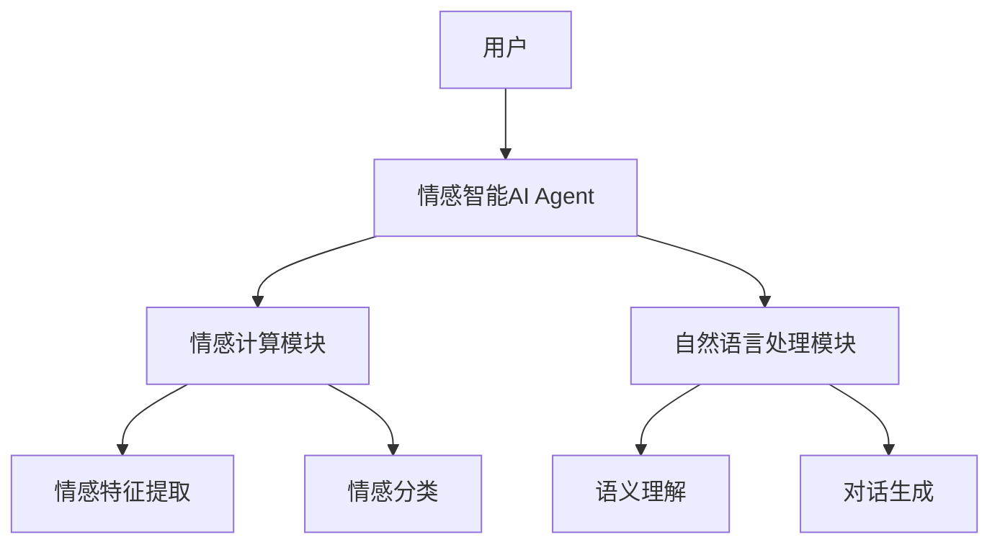
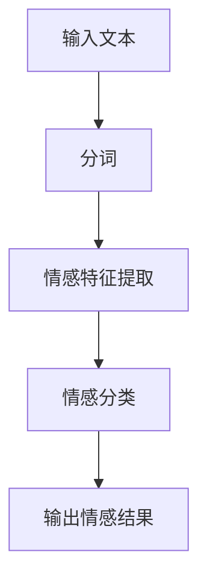
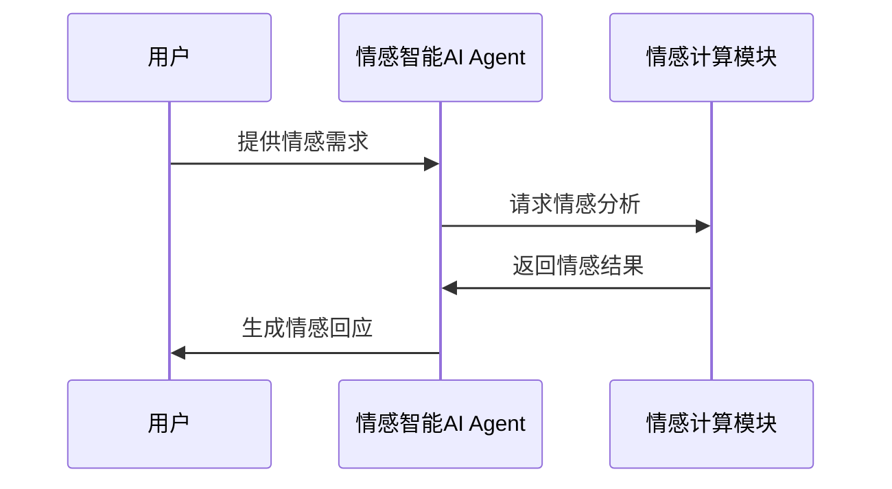

                 


# 情感智能 AI Agent：在 LLM 中植入 EQ

## 关键词：
- 情感智能，AI Agent，EQ，LLM，深度学习，情感计算，人机交互

## 摘要：
本文探讨了如何在大语言模型（LLM）中植入情感智能（EQ），以打造更自然、更人性化的AI代理。文章从情感智能的基本概念出发，详细分析了其在AI Agent中的应用，探讨了情感计算的数学模型和算法实现，提出了情感智能AI Agent的系统架构，并通过实际案例展示了如何在LLM中实现情感智能。最后，本文总结了情感智能AI Agent的优势与挑战，并展望了其未来的发展方向。

---

## 第一部分：情感智能与 AI Agent 的背景介绍

### 第1章：情感智能与 AI Agent 的概念

#### 1.1 情感智能的定义与核心要素
- **情感智能（EQ）**是指个体识别、理解和管理自己及他人情感的能力。在AI领域，情感智能的核心在于让机器能够理解和回应人类的情感需求。
- 情感智能的核心要素包括：
  - **情感识别**：通过语言、语调、表情等方式感知情感。
  - **情感理解**：分析情感背后的意义和意图。
  - **情感回应**：生成符合情感语境的自然语言回应。

#### 1.2 情感智能在 AI Agent 中的应用
- **情感支持**：帮助用户缓解负面情绪，提供情感上的支持。
- **用户体验优化**：通过情感分析改善人机交互体验。
- **个性化服务**：根据用户情感状态提供定制化建议。

#### 1.3 LLM 的基本原理与情感智能的结合
- **大语言模型（LLM）**：基于大规模数据训练的深度学习模型，能够生成自然语言文本。
- **情感智能与LLM的结合**：通过在LLM中植入情感计算模块，使其能够理解并回应用户的情感需求。

---

## 第二部分：情感智能 AI Agent 的核心概念与联系

### 第2章：情感智能的核心概念与原理

#### 2.1 情感计算的数学模型
- **情感计算的特征提取**：
  - 基于词袋模型（Bag of Words）提取情感相关的关键词。
  - 使用词嵌入（如Word2Vec）捕捉词语之间的语义关系。
- **情感计算的分类模型**：
  - 使用支持向量机（SVM）或随机森林（Random Forest）进行情感分类。
  - 基于深度学习的情感分类模型（如LSTM、Transformer）。

#### 2.2 情感智能与传统 AI 的区别
- **传统AI**：注重逻辑推理和事实处理，缺乏情感理解能力。
- **情感智能AI**：能够感知和回应情感，具备更强的交互性和人性化。

#### 2.3 情感智能 AI Agent 的实体关系图



---

## 第三部分：情感智能 AI Agent 的算法原理

### 第3章：情感分析算法的实现

#### 3.1 情感分析算法的原理
- **基于规则的情感分析**：
  - 通过预定义的情感词汇表进行情感判断。
  - 例如：如果文本中包含“开心”、“满意”，则判断为正面情感。
- **基于统计的情感分析**：
  - 使用机器学习算法（如SVM、Naive Bayes）进行情感分类。
- **基于深度学习的情感分析**：
  - 使用神经网络（如LSTM、Transformer）捕捉文本中的情感信息。

#### 3.2 情感分析的数学模型
- **情感分类的损失函数**：
  $$ L = -\sum_{i=1}^{n} y_i \log(p_i) + (1 - y_i) \log(1 - p_i) $$
  其中，\( y_i \) 是真实标签，\( p_i \) 是模型预测的概率。
- **情感分类的优化目标**：
  $$ \min_{\theta} L + \lambda \|\theta\|^2 $$
  其中，\( \theta \) 是模型参数，\( \lambda \) 是正则化系数。

#### 3.3 情感分析的流程图



---

## 第四部分：情感智能 AI Agent 的系统架构

### 第4章：情感智能 AI Agent 的系统架构

#### 4.1 系统功能设计
- **领域模型**：
  ```mermaid
  classDiagram
  class 用户 {
    string 用户输入
    string 用户情感状态
  }
  class 情感智能AI Agent {
    string 情感分析结果
    string 对话回应
  }
  class 情感计算模块 {
    string 情感特征
    string 情感分类结果
  }
  用户 --> 情感智能AI Agent
  情感智能AI Agent --> 情感计算模块
  ```

- **系统架构图**：
  ```mermaid
  graph TD
  A[用户] --> B[情感智能AI Agent]
  B --> C[情感计算模块]
  B --> D[自然语言处理模块]
  C --> E[情感特征提取]
  C --> F[情感分类]
  D --> G[语义理解]
  D --> H[对话生成]
  ```

#### 4.2 系统接口设计
- **输入接口**：
  - 用户输入：文本或语音形式。
- **输出接口**：
  - 情感分析结果：正面、负面或中性。
  - 对话回应：生成的自然语言文本。

#### 4.3 系统交互流程图



---

## 第五部分：情感智能 AI Agent 的项目实战

### 第5章：情感支持 AI 代理的实现

#### 5.1 环境配置
- **工具与库**：
  - Python 3.8+
  - TensorFlow 2.0+
  - NLTK 或 spaCy
  - Flask（用于构建API）

#### 5.2 核心代码实现

```python
import numpy as np
from tensorflow.keras.models import Sequential
from tensorflow.keras.layers import Dense, LSTM, Embedding

# 情感特征提取
def extract_emotion_features(text):
    # 假设已经进行了分词和词向量化
    return feature_vector

# 情感分类模型
model = Sequential()
model.add(Embedding(input_dim=10000, output_dim=32))
model.add(LSTM(units=64))
model.add(Dense(units=1, activation='sigmoid'))
model.compile(optimizer='adam', loss='binary_crossentropy', metrics=['accuracy'])

# 对话生成
def generate_response(emotion, context):
    if emotion == 'positive':
        return "听起来你心情很好，有什么我可以帮你的吗？"
    elif emotion == 'negative':
        return "看来你心情不太好，有什么我可以帮忙的吗？"
    else:
        return "请继续告诉我你的需求吧。"

# 整体流程
def process_input(text):
    features = extract_emotion_features(text)
    emotion = model.predict(features)
    response = generate_response(emotion, text)
    return response
```

#### 5.3 功能解读与案例分析
- **功能解读**：
  - 情感特征提取：从用户输入中提取情感相关特征。
  - 情感分类：根据特征生成情感判断结果。
  - 对话生成：根据情感结果生成回应文本。
- **案例分析**：
  - 用户输入：“我今天心情特别好！”
    - 情感特征：正面情感关键词。
    - 情感分类：正面情感。
    - 对话回应：生成积极的回应。

---

## 第六部分：情感智能 AI Agent 的最佳实践

### 第6章：情感智能 AI Agent 的优势与挑战

#### 6.1 优势
- **提升用户体验**：通过情感智能，AI代理能够更自然地与用户互动。
- **个性化服务**：根据不同情感状态提供定制化建议。
- **情感支持**：在心理健康领域提供初步支持。

#### 6.2 挑战
- **情感计算的准确性**：如何提高情感分析的准确率。
- **多模态情感识别**：结合语音、表情等多种模态信息。
- **隐私与伦理问题**：如何保护用户的情感数据。

### 第7章：小结与注意事项

#### 7.1 小结
- 情感智能AI Agent的核心在于理解并回应用户的情感需求。
- 通过在LLM中植入情感计算模块，可以显著提升人机交互的自然性和智能化水平。

#### 7.2 注意事项
- **数据隐私**：确保用户情感数据的安全性。
- **算法优化**：持续优化情感计算模型，提高准确率。
- **伦理规范**：在设计和应用中遵守伦理规范。

### 第8章：拓展阅读与参考文献

- **推荐书籍**：
  - 《深度学习入门：基于Python的理论与实践》
  - 《自然语言处理入门：算法与应用》
- **推荐阅读论文**：
  - "A Deep Learning Approach for Sentiment Analysis"
  - "Emotion-aware AI Agents in Human-Computer Interaction"

---

## 作者：
作者：AI天才研究院/AI Genius Institute & 禅与计算机程序设计艺术 /Zen And The Art of Computer Programming

---

以上是完整的技术博客文章内容，涵盖了情感智能AI Agent在LLM中的核心概念、算法实现、系统架构以及实际应用案例。

