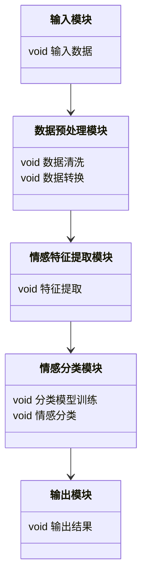
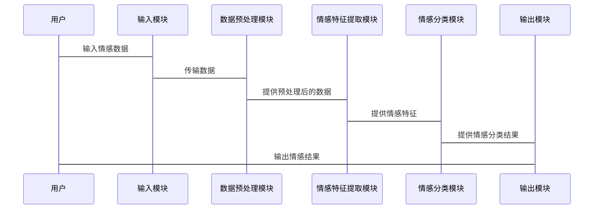

                 


# 情感计算：增强AI Agent的情感智能

> 关键词：情感计算，AI Agent，人机交互，情感智能，深度学习，自然语言处理，计算机视觉

> 摘要：情感计算是人工智能领域的重要研究方向，旨在通过理解和模拟人类情感，增强AI Agent的情感能力，使其能够更好地与人类进行交互。本文将从情感计算的背景、核心概念、算法原理、系统架构设计、项目实战等多个方面进行深入探讨，结合实际案例和代码实现，帮助读者全面理解情感计算在增强AI Agent情感智能中的应用。

---

# 第一部分：情感计算背景与基础

# 第1章：情感计算的背景与概述

## 1.1 情感计算的定义与核心概念

### 1.1.1 情感计算的定义

情感计算（Affective Computing）是一种通过计算机技术来识别、理解和模拟人类情感的新兴领域。它旨在通过分析人类的情感状态，使计算机能够以更自然、更人性化的方式与人类交互。

### 1.1.2 情感计算的核心概念

- **情感特征**：指人类情感的基本维度，如快乐、悲伤、愤怒等。
- **情感分类**：将人类情感归类到特定的情感类别中。
- **情感计算模型**：用于表示和处理情感数据的数学模型。

### 1.1.3 情感计算与AI Agent的关系

AI Agent（智能体）是能够感知环境并采取行动以实现目标的实体。情感计算通过增强AI Agent的情感能力，使其能够更好地理解用户的情感状态，从而提供更智能化的服务。

## 1.2 情感计算的发展历程

### 1.2.1 情感计算的起源

情感计算的概念最早可以追溯到20世纪60年代，但真正的发展始于20世纪90年代。随着计算机技术的进步，情感计算逐渐从理论研究走向实际应用。

### 1.2.2 情感计算的发展阶段

1. **早期阶段**：基于规则的情感分类方法。
2. **发展阶段**：引入机器学习技术，提高情感分类的准确性。
3. **当前阶段**：深度学习技术的应用，使得情感计算更加智能化。

### 1.2.3 当前情感计算的研究热点

- **多模态情感计算**：结合文本、语音、图像等多种信息源进行情感分析。
- **情感计算的实时性**：提高情感计算的处理速度，使其能够实时应用于实际场景。

## 1.3 情感计算的技术基础

### 1.3.1 自然语言处理

自然语言处理（NLP）是情感计算的重要技术基础。通过分析文本中的情感倾向，可以提取出用户的情感状态。

### 1.3.2 计算机视觉

计算机视觉技术可以分析图像中的情感信息，如面部表情和肢体语言。

### 1.3.3 语音识别与合成

语音识别技术可以识别用户的语音情感，而语音合成技术可以生成具有特定情感的语音输出。

## 1.4 情感计算的应用领域

### 1.4.1 情感计算在人机交互中的应用

通过情感计算，AI Agent可以更好地理解用户的情感状态，从而提供更个性化的服务。

### 1.4.2 情感计算在教育中的应用

情感计算可以用于教育领域的学生情感监测，帮助教师更好地了解学生的学习状态。

### 1.4.3 情感计算在医疗中的应用

情感计算可以用于患者的病情监测，帮助医生更好地理解患者的心理状态。

## 1.5 本章小结

本章介绍了情感计算的定义、发展历程、技术基础和应用领域，为后续章节的学习奠定了基础。

---

# 第2章：情感计算的核心概念与联系

## 2.1 情感计算的核心概念

### 2.1.1 情感特征分析

- **情感特征**：指人类情感的基本维度，如快乐、悲伤、愤怒等。
- **情感特征的提取**：通过分析文本、语音、图像等信息源，提取出情感特征。

### 2.1.2 情感分类模型

- **情感分类**：将人类情感归类到特定的情感类别中。
- **情感分类模型**：用于情感分类的数学模型，如支持向量机（SVM）、随机森林（Random Forest）等。

### 2.1.3 情感计算的数学模型

- **情感计算模型**：用于表示和处理情感数据的数学模型。
- **情感计算模型的构建**：基于情感特征和情感分类模型，构建情感计算的数学模型。

## 2.2 情感计算的核心特征对比

### 2.2.1 情感特征的属性对比表

| 情感特征 | 描述 |
|----------|------|
| 快乐     | 表示积极的情感 |
| 悲伤     | 表示消极的情感 |
| 愤怒     | 表示负面的情感 |
| 焦虑     | 表示紧张的情感 |

### 2.2.2 情感计算的实体关系图


## 2.3 情感计算的流程图

### 2.3.1 情感计算的基本流程


### 2.3.2 情感计算的详细流程


## 2.4 本章小结

本章详细讲解了情感计算的核心概念和联系，包括情感特征分析、情感分类模型和情感计算的数学模型，并通过图表展示了情感计算的流程。

---

# 第3章：情感计算的算法原理

## 3.1 情感计算的主要算法

### 3.1.1 基于规则的情感分类算法

- **基于规则的情感分类**：通过预定义的规则对情感进行分类。
- **规则的制定**：根据情感特征制定分类规则。

### 3.1.2 基于机器学习的情感分类算法

- **机器学习情感分类**：通过训练数据训练情感分类模型。
- **常用算法**：支持向量机（SVM）、随机森林（Random Forest）等。

### 3.1.3 基于深度学习的情感分类算法

- **深度学习情感分类**：通过神经网络模型进行情感分类。
- **常用模型**：卷积神经网络（CNN）、循环神经网络（RNN）、Transformer模型等。

## 3.2 情感计算的数学模型

### 3.2.1 情感分类的数学公式

情感分类的数学公式可以表示为：

$$ P(y|x) = \frac{P(x|y)P(y)}{P(x)} $$

其中，$P(y|x)$ 是条件概率，表示在给定输入$x$的情况下，输出$y$的概率。

### 3.2.2 情感计算的损失函数

情感计算的损失函数可以表示为：

$$ L = -\sum_{i=1}^{n} y_i \log p_i + (1 - y_i) \log (1 - p_i) $$

其中，$y_i$ 是标签，$p_i$ 是模型预测的概率。

## 3.3 情感计算的算法实现

### 3.3.1 基于规则

```python
# 示例代码：基于规则的情感分类
def classify_emotion(text):
    positive_words = ['happy', 'joy', 'love']
    negative_words = ['sad', 'anger', 'fear']
    
    words = text.lower().split()
    positive_count = sum(1 for word in words if word in positive_words)
    negative_count = sum(1 for word in words if word in negative_words)
    
    if positive_count > negative_count:
        return 'positive'
    elif negative_count > positive_count:
        return 'negative'
    else:
        return 'neutral'
```

### 3.3.2 基于机器学习

```python
# 示例代码：基于机器学习的情感分类
from sklearn.feature_extraction.text import TfidfVectorizer
from sklearn.svm import SVC

# 数据预处理
texts = [...]  # 输入文本数据
labels = [...]  # 对应的情感标签

vectorizer = TfidfVectorizer()
X = vectorizer.fit_transform(texts)
model = SVC()
model.fit(X, labels)
```

### 3.3.3 基于深度学习

```python
# 示例代码：基于深度学习的情感分类
import tensorflow as tf
from tensorflow.keras import layers

# 数据预处理
texts = [...]  # 输入文本数据
labels = [...]  # 对应的情感标签

# 建立模型
model = tf.keras.Sequential()
model.add(layers.Embedding(input_dim=..., output_dim=...))
model.add(layers.Conv1D(filters=..., kernel_size=..., activation='relu'))
model.add(layers.MaxPooling1D(pool_size=...))
model.add(layers.Flatten())
model.add(layers.Dense(units=..., activation='relu'))
model.add(layers.Dense(units=2, activation='softmax'))
model.compile(optimizer='adam', loss='sparse_categorical_crossentropy', metrics=['accuracy'])
model.fit(X_train, y_train, epochs=..., batch_size=...)
```

## 3.4 本章小结

本章详细讲解了情感计算的主要算法，包括基于规则、机器学习和深度学习的情感分类算法，并通过代码示例展示了算法的实现过程。

---

# 第四部分：情感计算的系统架构设计

# 第4章：情感计算的系统架构设计

## 4.1 情感计算系统的总体架构


## 4.2 情感计算系统的设计原则

### 4.2.1 模块化设计

情感计算系统应采用模块化设计，每个模块负责特定的功能。

### 4.2.2 高可扩展性

情感计算系统的模块应具有高可扩展性，便于后续的功能扩展。

### 4.2.3 高性能

情感计算系统的模块应具有高性能，能够快速处理大量数据。

## 4.3 情感计算系统的实现

### 4.3.1 系统模块设计



### 4.3.2 系统交互设计



## 4.4 本章小结

本章详细讲解了情感计算系统的总体架构、设计原则和实现过程，并通过类图和序列图展示了系统的模块设计和交互设计。

---

# 第五部分：情感计算的项目实战

# 第5章：情感计算的项目实战

## 5.1 项目背景与目标

### 5.1.1 项目背景

本项目旨在通过情感计算技术，实现一个能够识别用户情感状态的AI Agent。

### 5.1.2 项目目标

- 实现情感特征提取功能。
- 实现情感分类功能。
- 实现情感计算结果的输出功能。

## 5.2 项目环境与工具

### 5.2.1 开发环境

- 操作系统：Windows 10
- 编程语言：Python 3.8
- 开发工具：PyCharm

### 5.2.2 依赖库

- scikit-learn
- numpy
- pandas
- tensorflow

## 5.3 项目核心代码实现

### 5.3.1 环境配置

```python
# 示例代码：环境配置
import os
import numpy as np
from sklearn.feature_extraction.text import TfidfVectorizer
from sklearn.svm import SVC
```

### 5.3.2 情感特征提取

```python
# 示例代码：情感特征提取
def extract_features(texts):
    vectorizer = TfidfVectorizer()
    X = vectorizer.fit_transform(texts)
    return X
```

### 5.3.3 情感分类模型训练

```python
# 示例代码：情感分类模型训练
def train_model(X_train, y_train):
    model = SVC()
    model.fit(X_train, y_train)
    return model
```

### 5.3.4 情感分类与结果输出

```python
# 示例代码：情感分类与结果输出
def predict_emotion(X_test, model):
    y_pred = model.predict(X_test)
    return y_pred
```

## 5.4 项目功能测试与结果分析

### 5.4.1 功能测试

- 输入测试文本，测试情感特征提取功能。
- 输入测试文本，测试情感分类功能。

### 5.4.2 测试结果分析

通过测试结果，分析情感分类的准确率、召回率和F1值。

## 5.5 项目小结

本章通过一个实际项目，详细讲解了情感计算的环境配置、代码实现和功能测试，帮助读者更好地理解和应用情感计算技术。

---

# 第六部分：情感计算的扩展与应用

# 第6章：情感计算的扩展与应用

## 6.1 情感计算在教育中的应用

### 6.1.1 教育领域的应用背景

在教育领域，情感计算可以用于学生情感监测，帮助教师更好地了解学生的学习状态。

### 6.1.2 情感计算在教育中的具体应用

- 学生情感监测
- 个性化教学策略制定

## 6.2 情感计算在医疗中的应用

### 6.2.1 医疗领域的应用背景

在医疗领域，情感计算可以用于患者病情监测，帮助医生更好地了解患者的心理状态。

### 6.2.2 情感计算在医疗中的具体应用

- 患者情感监测
- 个性化治疗方案制定

## 6.3 情感计算在人机交互中的应用

### 6.3.1 人机交互领域的应用背景

在人机交互领域，情感计算可以用于增强AI Agent的情感能力，使其能够更好地与人类进行交互。

### 6.3.2 情感计算在人机交互中的具体应用

- 情感驱动的对话系统
- 情感驱动的虚拟助手

## 6.4 本章小结

本章详细讲解了情感计算在教育、医疗和人机交互等领域的具体应用，展示了情感计算技术的广泛应用潜力。

---

# 第七部分：情感计算的挑战与未来

# 第7章：情感计算的挑战与未来

## 7.1 情感计算当前的挑战

### 7.1.1 数据获取与处理的挑战

- 情感数据的获取难度较大。
- 情感数据的处理复杂。

### 7.1.2 情感计算的模型精度

- 情感分类模型的精度有待提高。
- 多模态情感计算的模型精度需要进一步优化。

## 7.2 情感计算的未来发展方向

### 7.2.1 多模态情感计算

- 综合分析文本、语音、图像等多种信息源。
- 提高情感计算的准确性和实时性。

### 7.2.2 情感计算的个性化

- 根据用户的个性化需求，提供定制化的情感计算服务。
- 情感计算的实时性与高效性。

## 7.3 本章小结

本章分析了情感计算当前面临的挑战，并展望了情感计算未来的发展方向，为读者提供了进一步研究的思路。

---

# 第八部分：总结

# 第8章：总结与展望

## 8.1 本章总结

本文详细介绍了情感计算的背景、核心概念、算法原理、系统架构设计和项目实战，并通过实际案例展示了情感计算在增强AI Agent情感智能中的应用。

## 8.2 进一步学习与研究方向

- 深入研究情感计算的算法原理。
- 探讨情感计算在更多领域的应用。
- 研究情感计算的模型优化方法。

## 8.3 本章小结

本章总结了全文的主要内容，并为读者提供了进一步学习和研究的建议。

---

# 作者

作者：AI天才研究院/AI Genius Institute & 禅与计算机程序设计艺术/Zen And The Art of Computer Programming

---

通过以上目录大纲和文章内容，您可以按照需要逐步撰写完整的文章。

