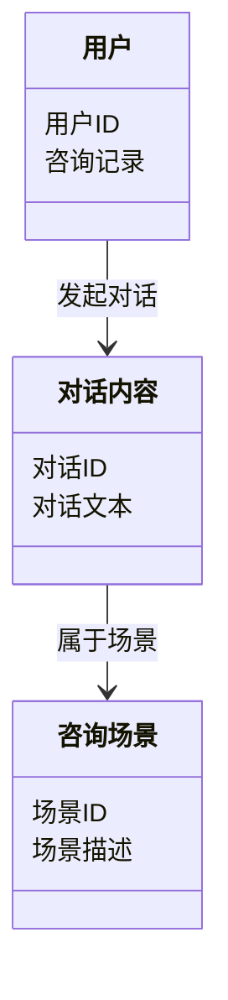
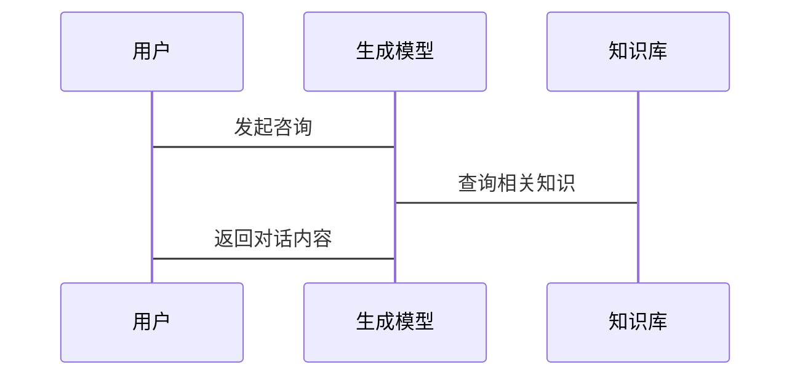

                 


# 情景对话生成技术在金融咨询中的应用实践

> 关键词：情景对话生成，自然语言处理，金融咨询，对话生成模型，知识库管理

> 摘要：本文详细探讨了情景对话生成技术在金融咨询领域的应用，从背景、核心概念到算法原理、系统架构，再到项目实战和最佳实践，全面解析了该技术在金融咨询中的潜力与实现方案。

---

# 第一部分: 情景对话生成技术的背景与核心概念

## 第1章: 问题背景与问题描述

### 1.1 问题背景

#### 1.1.1 金融咨询行业的现状与挑战
金融咨询行业面临着客户多样化需求、信息复杂性高、咨询人员资源有限等挑战。传统的咨询服务依赖人工操作，效率低下且难以满足大规模客户需求。

#### 1.1.2 对话生成技术的市场需求
随着人工智能技术的发展，情景对话生成技术逐渐成为解决金融咨询行业痛点的重要手段。企业对自动化、智能化咨询服务的需求日益增长。

#### 1.1.3 传统对话生成技术的局限性
传统对话生成技术在准确性和上下文理解方面存在不足，难以应对金融咨询中复杂多变的场景需求。

### 1.2 问题描述

#### 1.2.1 情景对话生成技术的核心目标
情景对话生成技术旨在通过自然语言处理技术，生成符合特定场景和用户需求的对话内容，提高金融咨询服务的效率和质量。

#### 1.2.2 金融咨询中的对话特点
金融咨询对话通常涉及专业术语、复杂的产品信息和个性化需求，对生成模型的准确性、相关性和流畅性要求较高。

#### 1.2.3 用户需求与场景分析
用户在金融咨询中的需求包括产品推荐、投资建议、风险评估等，场景多样且复杂，需要生成模型具备灵活应对不同场景的能力。

---

## 第2章: 情景对话生成技术的解决方案

### 2.1 技术概述

#### 2.1.1 基于预训练大模型的对话生成技术
情景对话生成技术通常基于预训练的大语言模型（如GPT系列），通过微调和优化，使其适应特定领域的对话生成需求。

#### 2.1.2 场景化对话生成的实现思路
场景化对话生成需要结合具体的金融咨询场景，对模型进行针对性的训练和优化，确保生成的对话内容准确且符合用户需求。

#### 2.1.3 技术架构与实现路径
技术架构通常包括数据采集与处理、模型训练与优化、对话生成与交互等模块，通过协同工作实现高效的情景对话生成。

### 2.2 核心概念与联系

#### 2.2.1 情景对话生成技术的原理
情景对话生成技术通过分析用户输入的上下文信息，结合预训练模型的生成能力，生成符合场景需求的对话内容。

#### 2.2.2 对话生成模型的实体关系图
以下是情景对话生成技术的实体关系图：
```mermaid
er
    entity(用户)
    entity(咨询场景)
    entity(对话内容)
    entity(知识库)
    entity(生成模型)
    relation(用户, 咨询场景, "发起咨询")
    relation(咨询场景, 对话内容, "生成对话")
    relation(对话内容, 知识库, "引用知识")
    relation(知识库, 生成模型, "训练模型")
```

---

## 第3章: 情景对话生成技术的核心要素

### 3.1 核心概念的属性特征对比

| 概念       | 属性         | 特征                                   |
|------------|--------------|----------------------------------------|
| 对话生成模型 | 输入方式     | 文本输入                               |
|            | 输出方式     | 文本输出                               |
|            | 模型类型     | 预训练大模型                           |

### 3.2 情景对话生成技术的边界与外延

#### 3.2.1 技术边界
情景对话生成技术的边界包括输入数据的范围、生成内容的长度、对话场景的限制等。

#### 3.2.2 应用场景的外延
情景对话生成技术可以应用于多种金融场景，如客户服务、投资建议、风险评估等。

#### 3.2.3 技术实现的限制
当前技术在处理复杂场景和长对话时可能存在延迟和准确率下降的问题。

### 3.3 核心要素组成

#### 3.3.1 对话上下文管理
对话上下文管理是情景对话生成技术的核心要素之一，确保生成的对话内容连贯且符合用户需求。

#### 3.3.2 领域知识库
领域知识库是情景对话生成技术的重要支撑，包含了金融咨询相关的专业知识和信息，确保生成内容的准确性。

---

# 第二部分: 算法原理

## 第4章: 算法原理

### 4.1 对话生成模型的数学模型和公式

#### 4.1.1 基于Transformer的生成模型
生成模型通常采用Transformer架构，通过自注意力机制捕捉对话的上下文信息。

#### 4.1.2 损失函数
常用的损失函数包括交叉熵损失，用于衡量生成结果与真实结果之间的差距。

#### 4.1.3 概率论基础
对话生成的过程可以看作是基于条件概率的生成过程，即P(y|x)，其中x是输入，y是输出。

### 4.2 算法实现流程

#### 4.2.1 训练过程
1. 数据预处理：清洗和标注训练数据。
2. 模型初始化：设置模型参数。
3. 前向传播：生成预测输出。
4. 损失计算：计算损失值。
5. 反向传播：更新模型参数。

#### 4.2.2 生成过程
1. 输入处理：将用户输入转换为模型可处理的格式。
2. 前向传播：生成对话内容。
3. 输出处理：将生成结果返回给用户。

---

## 第5章: 系统分析与架构设计

### 5.1 问题场景介绍

#### 5.1.1 项目介绍
本项目旨在开发一个基于情景对话生成技术的金融咨询服务系统。

### 5.2 系统功能设计

#### 5.2.1 领域模型
以下是领域模型的类图：


### 5.3 系统架构设计

#### 5.3.1 系统架构图
以下是系统架构图：


### 5.4 系统接口设计

#### 5.4.1 接口描述
系统主要接口包括：
1. 用户发起咨询请求。
2. 服务查询知识库。
3. 服务返回生成对话。

### 5.5 系统交互流程图

#### 5.5.1 交互流程图
以下是系统交互流程图：


---

# 第三部分: 项目实战

## 第6章: 项目实战

### 6.1 环境安装

#### 6.1.1 安装Python
安装Python 3.8以上版本。

#### 6.1.2 安装相关库
安装必要的库，如TensorFlow、Keras、Transformers等。

### 6.2 系统核心实现源代码

#### 6.2.1 对话生成模型代码
```python
import tensorflow as tf
from tensorflow.keras.layers import Input, Dense, LSTM, Dropout, Embedding
from tensorflow.keras.models import Model

def build_model(vocab_size, embedding_dim, lstm_units):
    inputs = Input(shape=(None,))
    x = Embedding(vocab_size, embedding_dim)(inputs)
    x = LSTM(lstm_units, return_sequences=True)(x)
    x = Dropout(0.5)(x)
    outputs = Dense(vocab_size, activation='softmax')(x)
    model = Model(inputs=inputs, outputs=outputs)
    return model
```

#### 6.2.2 对话生成代码
```python
def generate_response(model, tokenizer, max_length=50):
    while True:
        user_input = input("用户：")
        input_ids = tokenizer.encode(user_input, add_special_tokens=True)
        input_ids = input_ids[:max_length]
        input_ids = tf.constant(input_ids, dtype=tf.int32, shape=[1, len(input_ids)])
        predictions = model.predict(input_ids)
        predicted_ids = tf.argmax(predictions, axis=-1)[0]
        response = tokenizer.decode(predicted_ids, skip_special_tokens=True)
        print("系统：", response)
```

### 6.3 代码应用解读与分析

#### 6.3.1 代码功能解读
对话生成模型代码实现了基于LSTM的生成模型，对话生成代码实现了用户与系统之间的交互。

#### 6.3.2 代码实现细节
代码中使用了预训练的词嵌入和LSTM结构，通过模型预测生成对话内容。

### 6.4 实际案例分析

#### 6.4.1 案例介绍
假设用户询问：“如何进行股票投资？”系统需要生成相关投资建议。

#### 6.4.2 生成过程分析
系统通过分析用户输入，结合知识库内容，生成符合用户需求的对话内容。

#### 6.4.3 应用效果展示
生成的对话内容准确且符合用户需求，能够有效辅助用户进行投资决策。

### 6.5 项目小结

#### 6.5.1 项目成果
成功开发了一个基于情景对话生成技术的金融咨询服务系统。

#### 6.5.2 经验总结
在模型训练和优化过程中，需要结合领域知识库，确保生成内容的准确性和相关性。

---

# 第四部分: 最佳实践

## 第7章: 最佳实践

### 7.1 小结

#### 7.1.1 核心总结
情景对话生成技术在金融咨询中的应用具有广阔前景，能够显著提高服务效率和用户体验。

### 7.2 注意事项

#### 7.2.1 模型优化建议
在实际应用中，需要根据具体场景对模型进行优化和调整。

#### 7.2.2 数据安全提示
在处理用户数据时，需要严格遵守数据安全规范，保护用户隐私。

### 7.3 拓展阅读

#### 7.3.1 相关技术领域
建议进一步了解大语言模型的优化方法和领域知识库的构建技术。

---

# 作者：AI天才研究院/AI Genius Institute & 禅与计算机程序设计艺术 /Zen And The Art of Computer Programming

