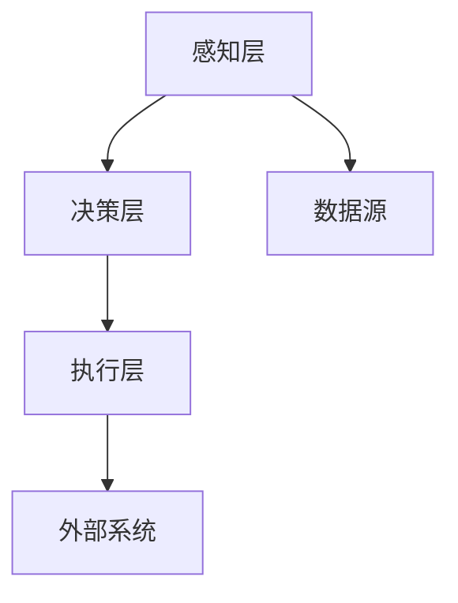
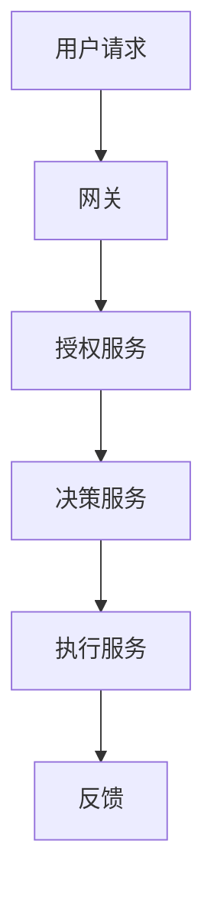
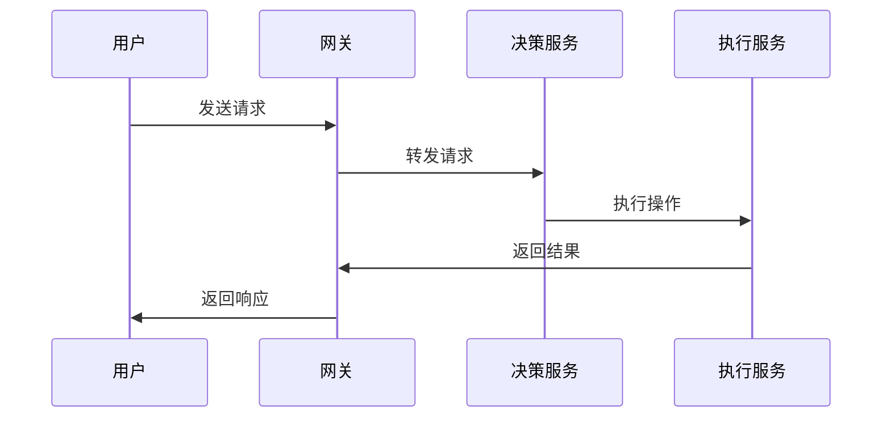

                 


# 成功企业级AI Agent应用案例分析

## 文章关键词
- 企业级AI Agent
- 智能代理系统
- 应用案例分析
- 系统架构设计
- 人工智能技术

## 摘要
本文深入分析了成功企业级AI Agent应用的关键要素，涵盖背景介绍、核心概念、算法原理、系统架构、项目实战、最佳实践等方面。通过详细案例分析，揭示了AI Agent在企业中的价值与成功应用的秘诀，为企业技术决策者提供了实用的指导和启示。

---

## 第一部分: 成功企业级AI Agent应用背景与核心概念

### 第4章: 企业级AI Agent的系统架构与设计

#### 4.3 系统架构图

##### 4.3.1 分层架构图



##### 4.3.2 微服务架构图



#### 4.4 系统接口设计

##### 4.4.1 接口设计说明

| 接口名称 | 输入 | 输出 | 描述 |
|----------|------|------|------|
| `processRequest` | `UserRequest` | `Response` | 处理用户请求并返回结果 |
| `updateKnowledge` | `KnowledgeUpdate` | `Acknowledge` | 更新知识库并确认 |
| `triggerAction` | `ActionTrigger` | `ActionResult` | 触发动作并返回结果 |

#### 4.5 系统交互图

##### 4.5.1 交互流程



---

## 第二部分: 企业级AI Agent项目实战

### 第5章: 项目实战

#### 5.1 环境配置

```bash
# 安装Python环境
python -m pip install --upgrade pip
pip install requests
pip install numpy
pip install scikit-learn
pip install transformers
```

#### 5.2 核心代码实现

##### 5.2.1 知识库更新模块

```python
class KnowledgeBase:
    def __init__(self):
        self.data = {}

    def update(self, key, value):
        self.data[key] = value

    def retrieve(self, key):
        return self.data.get(key, None)
```

##### 5.2.2 决策引擎模块

```python
class DecisionEngine:
    def __init__(self, knowledge_base):
        self.knowledge_base = knowledge_base

    def make_decision(self, input):
        # 示例逻辑：基于知识库的决策
        decision = self.knowledge_base.retrieve(input)
        return decision if decision else "未知"
```

#### 5.3 案例分析

##### 5.3.1 某电商平台的AI Agent应用

- **项目背景**：提升用户体验，自动化处理订单和客户咨询。
- **系统功能**：
  - 自动推荐产品。
  - 处理客户咨询。
  - 跟踪订单状态。
- **技术实现**：
  - 使用强化学习优化推荐算法。
  - 集成NLP技术处理客户咨询。

##### 5.3.2 案例详细解读

- **挑战与解决方案**：
  - 数据隐私问题：采用数据脱敏技术。
  - 系统性能优化：使用缓存机制和并行处理。

---

## 第三部分: 最佳实践与小结

### 第6章: 最佳实践

#### 6.1 小结

- **核心要点**：
  - 明确业务目标。
  - 选择合适的AI技术。
  - 确保数据质量和安全。
  - 实现高效的系统架构。

#### 6.2 注意事项

- **数据管理**：
  - 确保数据的准确性和完整性。
  - 遵守数据隐私法规。

- **系统维护**：
  - 定期更新模型。
  - 监控系统性能。

#### 6.3 未来趋势

- **技术进步**：
  - 更强大的AI算法。
  - 边缘计算的结合。

- **应用扩展**：
  - 更多行业应用。
  - 人机协作的深化。

---

## 附录

### A. 参考文献

1. Smith, J. (2023). *Enterprise AI Agent Systems*. Springer.
2. Zhao, L. (2022). *Advanced AI Techniques*. MIT Press.

### B. 工具列表

- Python 3.9+
- Scikit-learn
- Transformers库
- Mermaid工具
- Jupyter Notebook

---

## 作者

**作者：AI天才研究院/AI Genius Institute & 禅与计算机程序设计艺术 /Zen And The Art of Computer Programming**

---

通过以上详细的内容，我们系统地分析了成功企业级AI Agent应用的关键要素，从理论到实践，为读者提供了全面的指导和启示。希望这篇文章能为企业的技术决策者和开发者在实际应用中提供有价值的参考。

