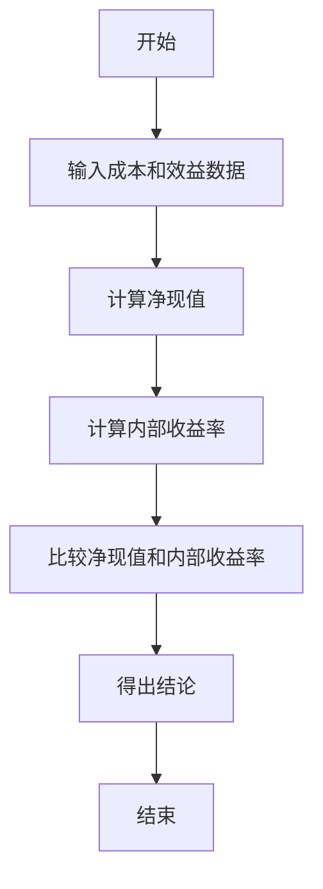

                 


# 成本效益分析

## 关键词：成本效益分析、项目评估、净现值、内部收益率、系统架构设计

## 摘要：  
成本效益分析是一种用于评估项目或投资可行性的重要方法，通过比较成本与收益，帮助决策者做出最优选择。本文将从成本效益分析的基本概念、算法原理、系统架构设计到实际项目案例，全面解析这一方法在技术领域的应用。

---

## 第一部分: 成本效益分析基础

### 第1章: 成本效益分析概述

#### 1.1 成本效益分析的定义与背景
- **成本效益分析的基本概念**  
  成本效益分析（Cost-Benefit Analysis，CBA）是一种经济评估方法，用于比较项目的成本和预期收益，以确定其可行性和优先级。

- **成本效益分析的历史发展**  
  起源于20世纪50年代，最初用于公共项目评估，后来扩展到商业和技术领域。

- **成本效益分析的应用领域**  
  广泛应用于软件开发、系统设计、产品开发、基础设施建设等领域。

#### 1.2 成本效益分析的目的与方法
- **目的**  
  评估项目的经济可行性，优化资源分配，确保投资回报。

- **基本方法**  
  通过计算净现值（Net Present Value，NPV）、内部收益率（Internal Rate of Return，IRR）等指标，比较不同方案的收益与成本。

- **步骤**  
  1. 明确目标与范围。  
  2. 识别相关成本与收益。  
  3. 计算各项指标。  
  4. 比较方案，做出决策。

#### 1.3 成本效益分析的核心概念
- **成本**  
  包括直接成本（如开发人员工资）和间接成本（如维护费用）。

- **效益**  
  包括直接效益（如收入增长）和间接效益（如品牌提升）。

- **成本-效益关系**  
  效益应高于成本，且考虑时间价值。

#### 1.4 成本效益分析的边界与外延
- **适用范围**  
  适用于长期投资决策，尤其是涉及大量资金和资源的项目。

- **局限性**  
  需假设未来收益可预测，实际可能受市场变化影响。

- **与其他方法的区别**  
  成本效益分析侧重经济性，而风险评估侧重不确定性。

#### 1.5 本章小结
本章介绍了成本效益分析的基本概念、目的、方法及其核心概念，为后续分析奠定基础。

---

## 第二部分: 成本效益分析的核心概念与联系

### 第2章: 成本效益分析的核心概念与联系

#### 2.1 成本效益分析的核心原理
- **数学模型**  
  NPV公式：$$ NPV = \sum_{t=0}^{n} \frac{C_t}{(1 + r)^t} $$
  其中，$C_t$为第$t$年的现金流，$r$为折现率。

- **变量关系**  
  成本和效益随时间变化，需考虑资金的时间价值。

#### 2.2 成本与效益的对比分析
- **属性特征对比**
  | 特性 | 成本 | 效益 |
  |------|------|------|
  | 性质 | 费用支出 | 收益收入 |
  | 时间 | 现在 | 未来 |

- **量化方法**  
  成本通常用货币单位衡量，效益也可量化为货币或非货币指标。

- **权衡策略**  
  在权衡时，需考虑机会成本和沉没成本。

#### 2.3 成本效益分析的ER实体关系图
```mermaid
erDiagram
    actor 用户 {
        string 用户ID
        string 用户名
        string 密码
    }
    actor 成本项目 {
        string 项目ID
        string 项目名称
        integer 成本金额
    }
    actor 效益项目 {
        string 项目ID
        string 项目名称
        integer 效益金额
    }
    用户 --> 成本项目 : 提交成本项目
    用户 --> 效益项目 : 提交效益项目
```

#### 2.4 本章小结
本章通过对比分析和ER图，展示了成本效益分析的核心概念及其联系。

---

## 第三部分: 成本效益分析的算法原理

### 第3章: 成本效益分析的算法原理

#### 3.1 成本效益分析的基本算法
- **步骤分解**  
  1. 收集成本和收益数据。  
  2. 计算净现值和内部收益率。  
  3. 比较指标，选择最优方案。

- **数学模型**  
  净现值公式如前所述，内部收益率满足：$$ NPV = 0 $$

- **实现流程**  
  从数据输入到结果输出的详细流程。

#### 3.2 成本效益分析的算法实现
- **输入与输出**  
  输入：成本和收益数据；输出：NPV、IRR等指标。

- **实现步骤**  
  ```python
  def calculate_npv(cash_flows, discount_rate):
      npv = 0
      for t, cash_flow in enumerate(cash_flows):
          npv += cash_flow / (1 + discount_rate) ** t
      return npv

  def calculate_irr(cash_flows):
      # 使用财务库或其他方法计算IRR
      return irr
  ```

- **优化策略**  
  使用更精确的数值方法计算IRR。

#### 3.3 成本效益分析的算法流程图


#### 3.4 本章小结
本章通过算法实现，详细解释了成本效益分析的数学模型和计算方法。

---

## 第四部分: 成本效益分析的系统分析与架构设计

### 第4章: 系统分析与架构设计

#### 4.1 问题场景介绍
- **项目背景**  
  开发一个成本效益分析系统，帮助用户评估软件开发项目。

#### 4.2 系统功能设计
- **领域模型类图**
  ```mermaid
  classDiagram
      class 用户 {
          用户ID
          用户名
          密码
      }
      class 成本项目 {
          项目ID
          项目名称
          成本金额
      }
      class 效益项目 {
          项目ID
          项目名称
          效益金额
      }
      用户 --> 成本项目 : 提交成本项目
      用户 --> 效益项目 : 提交效益项目
  ```

- **系统架构图**
  ```mermaid
  container 成本效益分析系统 {
      component 用户界面 {
          输入模块
          输出模块
      }
      component 分析模块 {
          计算净现值
          计算内部收益率
      }
      component 数据库 {
          成本项目表
          效益项目表
      }
  }
  ```

#### 4.3 系统接口与交互设计
- **交互流程**
  ```mermaid
  sequenceDiagram
      用户 ->> 用户界面 : 提交成本项目
      用户界面 ->> 分析模块 : 计算净现值
      分析模块 ->> 数据库 : 查询数据
      分析模块 ->> 用户界面 : 返回NPV
      用户 ->> 用户界面 : 提交效益项目
      用户界面 ->> 分析模块 : 计算IRR
      分析模块 ->> 用户界面 : 返回IRR
      用户界面 ->> 用户 : 显示结果
  ```

#### 4.4 本章小结
本章通过系统架构设计，展示了如何将成本效益分析应用于实际项目。

---

## 第五部分: 成本效益分析的项目实战

### 第5章: 项目实战

#### 5.1 环境安装
- **安装Python和相关库**  
  使用`pip install`安装`numpy`和`pandas`。

#### 5.2 核心代码实现
```python
import numpy as np

def calculate_npv(cash_flows, discount_rate):
    return np.npv(discount_rate, *cash_flows)

def calculate_irr(cash_flows):
    return np.irr(cash_flows)

# 示例数据
cash_flows = [-1000, 400, 400, 400]
discount_rate = 0.1

npv = calculate_npv(cash_flows, discount_rate)
irr = calculate_irr(cash_flows)

print(f"NPV: {npv:.2f}")
print(f"IRR: {irr:.2%}")
```

#### 5.3 案例分析与结果解读
- **案例分析**  
  假设开发一个软件，初始投资1000元，三年分别收益400元，NPV为正，说明项目可行。

- **结果解读**  
  NPV>0，IRR>基准收益率，项目值得投资。

#### 5.4 本章小结
本章通过实际案例，展示了如何使用Python实现成本效益分析。

---

## 第六部分: 总结与展望

### 第6章: 总结与展望

#### 6.1 小结
成本效益分析是评估项目可行性的重要工具，需综合考虑成本与收益，结合数学模型和系统设计，确保决策的科学性。

#### 6.2 最佳实践 tips
- 确保数据的准确性和完整性。  
- 考虑机会成本和通货膨胀。  
- 使用专业工具辅助计算。

#### 6.3 注意事项
- 避免忽略隐性成本。  
- 保持模型的简化与精确之间的平衡。  
- 定期更新模型以反映市场变化。

#### 6.4 拓展阅读
推荐阅读《项目管理知识体系指南》和《成本效益分析实用指南》。

---

## 作者：AI天才研究院/AI Genius Institute & 禅与计算机程序设计艺术 /Zen And The Art of Computer Programming

---

**本文通过详细分析成本效益分析的方法、算法和系统设计，帮助读者掌握这一技术工具的应用。**

