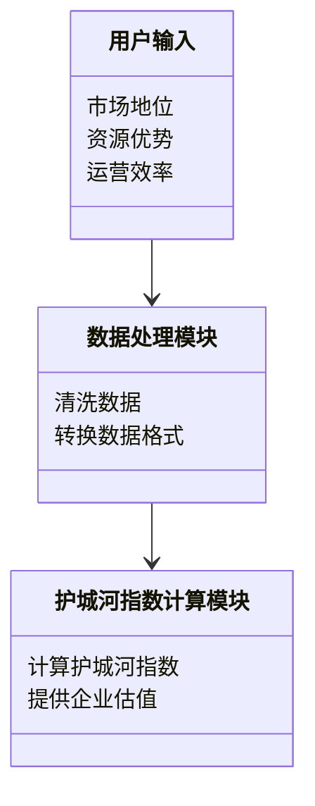
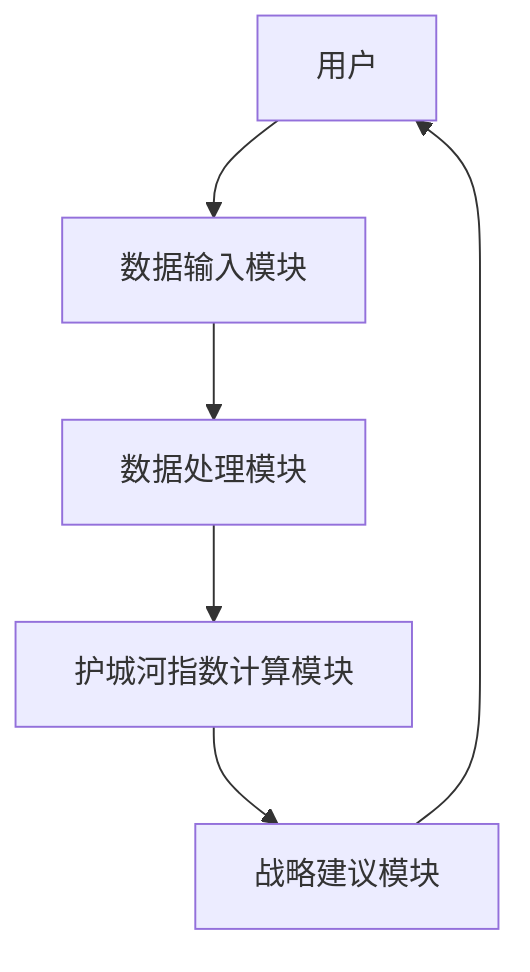

                 


# 戴维·多德的护城河评估体系

> 关键词：戴维·多德，护城河，投资，企业战略，风险管理

> 摘要：本文深入探讨了戴维·多德提出的护城河评估体系，从概念、理论、算法到实际应用，全面解析护城河在投资和企业战略中的重要性。文章通过多维度分析、数学模型、系统设计和实际案例，展示了如何利用护城河评估体系来评估企业竞争优势，制定长期战略，并有效管理风险。

---

## 第1章: 护城河的基本概念与背景

### 1.1 护城河的定义与核心要素

#### 1.1.1 护城河的定义
护城河（Moat）是企业在市场竞争中建立的长期竞争优势，使其能够在面对竞争对手时保持领先地位。戴维·多德提出的护城河评估体系强调，护城河不仅仅是企业的某个优势，而是多维度综合能力的体现。

#### 1.1.2 护城河的核心要素
护城河的核心要素包括市场地位、资源、运营效率和财务表现。这些要素共同构成了企业在市场中的竞争优势。

#### 1.1.3 护城河的边界与外延
护城河的边界是指企业竞争优势的范围，外延则包括企业如何利用这些优势进行市场扩张和产品创新。

### 1.2 护城河的历史发展与演变

#### 1.2.1 护城河概念的起源
护城河的概念起源于军事领域，后被引入商业领域，用于描述企业的竞争优势。

#### 1.2.2 多德对护城河理论的贡献
多德通过系统的分析，将护城河分为成本优势、品牌优势、网络效应等类型，并提出了具体的评估方法。

#### 1.2.3 护城河理论的现代发展
随着市场竞争的加剧，护城河理论不断发展，涵盖更多维度，如技术创新和客户忠诚度。

---

## 第2章: 护城河在投资中的应用

### 2.1 护城河与投资策略

#### 2.1.1 护城河在价值投资中的作用
护城河是价值投资者评估企业长期盈利能力的重要指标，帮助投资者识别具有持续竞争优势的企业。

#### 2.1.2 护城河与企业竞争优势的关系
企业竞争优势是护城河的核心，护城河强的企业往往能够在市场中占据主导地位。

#### 2.1.3 护城河评估对企业估值的影响
护城河指数与企业估值密切相关，企业估值可以通过护城河指数和市场规模的乘积来计算。

### 2.2 护城河评估的核心指标

#### 2.2.1 市场地位
企业在市场中的份额和影响力是护城河的重要指标。

#### 2.2.2 资源优势
企业拥有的独特资源，如专利和技术，是护城河的重要组成部分。

#### 2.2.3 运营效率
企业内部管理效率和成本控制能力也是护城河的重要因素。

#### 2.2.4 财务表现
企业的财务健康状况是护城河评估的重要指标，包括利润率和成长性。

---

## 第3章: 护城河与企业战略

### 3.1 护城河与企业长期战略

#### 3.1.1 护城河在企业战略规划中的地位
护城河是企业战略的核心，帮助企业制定长期发展目标。

#### 3.1.2 护城河与企业核心竞争力的关系
护城河是企业核心竞争力的体现，帮助企业在市场中保持领先地位。

#### 3.1.3 护城河对企业扩张的指导作用
护城河评估可以帮助企业识别扩张机会，并制定相应的战略。

### 3.2 护城河与风险管理

#### 3.2.1 护城河在风险管理中的作用
护城河可以帮助企业识别和应对潜在风险，提高抗风险能力。

#### 3.2.2 护城河与企业抗风险能力的关系
护城河越强的企业，抗风险能力越强，能够在市场波动中保持稳定。

#### 3.2.3 护城河评估中的风险因素分析
在护城河评估中，需要考虑行业风险、政策风险和技术风险等因素。

---

## 第4章: 护城河评估的核心原理

### 4.1 护城河的多维度分析

#### 4.1.1 市场地位分析
通过市场份额和品牌影响力评估企业的市场地位。

#### 4.1.2 资源优势分析
分析企业拥有的独特资源，如专利、技术等。

#### 4.1.3 运营效率分析
评估企业的内部管理效率和成本控制能力。

### 4.2 护城河的数学模型与公式

#### 4.2.1 护城河指数计算公式
$$ 护城河指数 = \frac{市场地位 + 资源优势 + 运营效率}{3} $$

#### 4.2.2 护城河与企业价值的关系
$$ 企业价值 = 护城河指数 \times 市场规模 $$

### 4.3 护城河的对比分析

#### 4.3.1 护城河与竞争优势的对比
护城河是竞争优势的长期体现，竞争优势是护城河的核心。

#### 4.3.2 护城河与核心竞争力的对比
护城河和核心竞争力都强调企业的独特优势，但护城河更注重长期的竞争优势。

#### 4.3.3 护城河与企业壁垒的对比
护城河和企业壁垒都强调企业的防御能力，但护城河更注重主动构建竞争优势。

---

## 第5章: 护城河评估的系统架构设计

### 5.1 护城河评估系统概述

#### 5.1.1 系统目标
帮助企业评估护城河，提供竞争优势分析和战略建议。

#### 5.1.2 系统功能模块
- 数据输入模块：接收企业数据
- 数据处理模块：清洗和转换数据
- 护城河指数计算模块：计算护城河指数
- 战略建议模块：提供战略建议

### 5.2 护城河评估系统的架构设计

#### 5.2.1 系统功能设计


#### 5.2.2 系统架构设计


### 5.3 系统接口设计

#### 5.3.1 输入接口
用户通过输入模块提交企业数据。

#### 5.3.2 输出接口
系统输出护城河指数和战略建议。

### 5.4 系统交互设计

#### 5.4.1 交互流程
用户输入数据 → 数据处理 → 护城河指数计算 → 提供战略建议。

---

## 第6章: 项目实战与最佳实践

### 6.1 环境安装

#### 6.1.1 安装Python
安装Python 3.8及以上版本。

#### 6.1.2 安装依赖库
安装numpy和pandas库：
```bash
pip install numpy pandas
```

### 6.2 核心代码实现

#### 6.2.1 护城河指数计算代码
```python
import numpy as np
import pandas as pd

def calculate_ho

