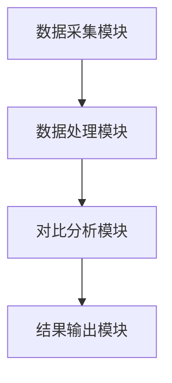
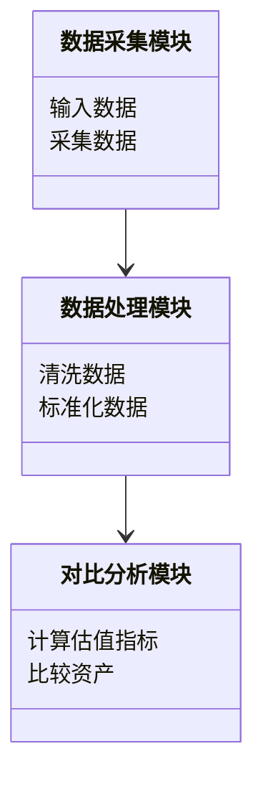

                 


# 戴维·德雷曼的对比资产价值投资策略

## 关键词：戴维·德雷曼，资产价值投资，对比分析，价值评估，投资策略

## 摘要：本文详细探讨了戴维·德雷曼的对比资产价值投资策略，通过分析其核心概念、算法原理和系统架构设计，展示了如何利用对比分析方法进行资产价值评估和投资决策。文章结合实际案例和代码实现，为读者提供了从理论到实践的全面指导。

---

# 第1章: 价值投资与对比分析的背景

## 1.1 价值投资的起源与发展

### 1.1.1 价值投资的核心理念

价值投资是一种以基本面分析为基础的投资策略，强调通过深入研究企业的财务状况、行业地位和竞争优势，寻找被市场低估的资产。其核心理念是“买入低于内在价值的资产”，并长期持有，等待其价值回归。

戴维·德雷曼（David Dreman）作为价值投资领域的权威，提出了“对比分析”的独特方法。这种方法通过比较不同资产、行业或公司的财务指标，发现市场中的估值异常，从而找到被低估的投资机会。

### 1.1.2 戴维·德雷曼的贡献与影响力

戴维·德雷曼是价值投资领域的先驱，他的研究和实践对现代投资理论和实践产生了深远影响。他提出的对比分析方法，不仅丰富了价值投资的工具箱，还为投资者提供了一种高效的投资策略。

### 1.1.3 对比分析在价值投资中的作用

对比分析通过横向和纵向比较不同资产的估值指标，帮助投资者识别出市场价格与内在价值存在显著差异的资产。这种方法能够有效降低投资风险，提高投资收益。

## 1.2 资产价值评估的基本概念

### 1.2.1 资产价值的定义

资产价值是指资产在未来能够产生的现金流的现值。它不仅包括资产的市场价值，还包括其内在价值。内在价值是基于资产的未来现金流折现计算得出的，而市场价值则是由市场供需决定的。

### 1.2.2 资产价值评估的方法

资产价值评估的方法主要包括相对估值法和绝对估值法。相对估值法通过比较资产与可比资产的估值指标（如市盈率、市净率等）来确定其价值。绝对估值法则通过贴现现金流模型等方法计算资产的内在价值。

### 1.2.3 对比分析的必要性与优势

对比分析的必要性在于，单个资产的估值可能受到市场情绪、行业周期等多种因素的影响，而通过对比分析可以更客观地评估资产的真实价值。其优势在于能够发现市场中的估值异常，帮助投资者做出更明智的投资决策。

---

# 第2章: 戴维·德雷曼对比分析框架

## 2.1 对比分析的核心框架

### 2.1.1 资产类别对比分析

资产类别对比分析是通过比较不同资产类别（如股票、债券、房地产等）的估值指标，寻找具有相对优势的资产类别。例如，比较股票的市盈率和债券的收益率，可以帮助投资者选择更具吸引力的投资标的。

### 2.1.2 行业对比分析

行业对比分析是通过比较同一行业内的不同公司，识别出具有竞争优势的公司。例如，比较同一行业的市盈率、市净率和ROE（净资产收益率），可以找到估值较低且盈利能力强的公司。

### 2.1.3 公司基本面对比分析

公司基本面对比分析是通过比较不同公司的财务指标，评估其财务健康状况和盈利能力。例如，比较公司的收入增长率、净利润率和资产负债率，可以帮助投资者识别出具有成长性和低风险的公司。

## 2.2 资产质量与估值的对比方法

### 2.2.1 资产质量的评估指标

资产质量的评估指标包括收入质量、利润质量、资产质量等。例如，收入质量可以通过应收账款周转率和收入增长率来衡量，利润质量可以通过净利润率和毛利率来衡量。

### 2.2.2 资产估值的对比方法

资产估值的对比方法主要包括相对估值法和绝对估值法。相对估值法通过比较资产与可比资产的估值指标（如市盈率、市净率等）来确定其价值。绝对估值法则通过贴现现金流模型等方法计算资产的内在价值。

### 2.2.3 资产安全边际的计算

资产安全边际是指资产的市场价格低于其内在价值的部分。通过计算安全边际，投资者可以识别出具有较高投资价值的资产。安全边际的计算公式为：

$$ \text{安全边际} = \text{内在价值} - \text{市场价格} $$

## 2.3 对比分析的实践步骤

### 2.3.1 数据收集与整理

对比分析的第一步是收集相关资产的财务数据和市场数据。数据来源包括公司财报、行业报告、市场指数等。收集的数据需要进行清洗和标准化处理，确保数据的准确性和一致性。

### 2.3.2 数据清洗与标准化

数据清洗的目的是去除错误数据和异常值，确保数据的完整性和准确性。数据标准化则是将不同来源的数据统一到相同的单位和格式，方便后续的对比分析。

### 2.3.3 数据分析与对比

数据分析与对比是通过计算和比较不同资产的估值指标，识别出具有相对优势的资产。例如，比较不同资产的市盈率、市净率、ROE等指标，寻找估值较低且盈利能力强的资产。

## 2.4 本章小结

本章详细介绍了戴维·德雷曼对比分析的核心框架，包括资产类别对比分析、行业对比分析和公司基本面对比分析。通过对资产质量与估值的对比方法的探讨，帮助投资者识别出具有投资价值的资产。

---

# 第3章: 资产价值评估的数学模型

## 3.1 资产价值评估的基本公式

### 3.1.1 资产的内在价值公式

资产的内在价值是通过将未来现金流折现计算得出的。其基本公式为：

$$ V = \sum_{t=1}^{n} \frac{CF_t}{(1+r)^t} $$

其中，\( V \) 是资产的内在价值，\( CF_t \) 是第 \( t \) 年的现金流，\( r \) 是折现率，\( n \) 是现金流的时间跨度。

### 3.1.2 资产的贴现现金流模型

贴现现金流模型（DCF模型）是资产价值评估的核心方法之一。其基本公式为：

$$ V = \frac{CF}{r - g} $$

其中，\( CF \) 是永续年金的现金流，\( r \) 是折现率，\( g \) 是现金流的永续增长率。

## 3.2 对比分析的数学模型

### 3.2.1 相对估值法

相对估值法通过比较资产与可比资产的估值指标，确定其相对价值。其常用指标包括市盈率（P/E）、市净率（P/B）和市销率（P/S）等。例如，比较资产的市盈率与行业平均市盈率，可以判断其估值是否合理。

### 3.2.2 绝对估值法

绝对估值法通过计算资产的内在价值，确定其市场价格是否被低估或高估。其常用方法包括贴现现金流模型和股利折现模型（DDM模型）。例如，使用DDM模型计算股票的内在价值，公式为：

$$ P = \frac{D}{r - g} $$

其中，\( P \) 是股票的内在价值，\( D \) 是预期股利，\( r \) 是折现率，\( g \) 是股利增长率。

## 3.3 德雷曼对比分析的算法流程

### 3.3.1 数据输入与预处理

算法流程的第一步是输入相关数据并进行预处理。数据预处理包括数据清洗、标准化和格式转换，确保数据的准确性和一致性。

### 3.3.2 财务指标计算

财务指标计算是通过分析资产的财务报表，计算其关键财务指标。例如，计算公司的收入增长率、净利润率和资产负债率等。

### 3.3.3 对比分析与结果输出

对比分析是通过比较不同资产的估值指标，确定其投资价值。例如，比较不同资产的市盈率和ROE，寻找估值较低且盈利能力强的资产。结果输出包括生成报告和可视化图表，便于投资者理解和决策。

## 3.4 本章小结

本章详细介绍了资产价值评估的数学模型，包括内在价值公式、贴现现金流模型、相对估值法和绝对估值法。通过对德雷曼对比分析的算法流程的探讨，帮助投资者更好地理解和应用这些模型。

---

# 第4章: 对比分析系统的架构设计

## 4.1 系统功能设计

### 4.1.1 数据采集模块

数据采集模块负责从多个数据源（如公司财报、行业报告、市场数据）获取相关数据。数据采集可以通过API接口或手动输入完成。

### 4.1.2 数据处理模块

数据处理模块负责对采集的数据进行清洗、标准化和转换。例如，清洗异常值、标准化数据格式、转换数据单位等。

### 4.1.3 对比分析模块

对比分析模块负责计算和比较不同资产的估值指标，生成对比分析结果。例如，计算资产的市盈率、市净率和ROE，比较不同资产的估值指标。

## 4.2 系统架构设计

### 4.2.1 系统模块划分

系统模块划分包括数据采集模块、数据处理模块和对比分析模块。每个模块负责不同的功能，模块之间通过接口进行数据交互。

### 4.2.2 系统交互流程图

以下是系统交互流程图，展示了模块之间的交互过程：



### 4.2.3 系统架构图

以下是系统架构图，展示了系统的整体架构：



## 4.3 系统接口设计

### 4.3.1 数据接口

数据接口用于不同模块之间的数据交互。例如，数据采集模块通过API接口将数据传递给数据处理模块。

### 4.3.2 用户接口

用户接口是投资者与系统的交互界面。例如，用户可以通过输入资产代码查询资产的估值指标和对比分析结果。

## 4.4 本章小结

本章详细介绍了对比分析系统的架构设计，包括系统功能设计、系统架构设计和系统接口设计。通过对系统的整体架构和模块划分的探讨，帮助投资者更好地理解和应用对比分析方法。

---

# 第5章: 项目实战

## 5.1 环境安装与配置

### 5.1.1 安装Python和相关库

首先，安装Python和相关库，例如Pandas、NumPy、Matplotlib和Scipy。安装命令如下：

```bash
pip install pandas numpy matplotlib scipy
```

### 5.1.2 数据获取

通过API获取相关资产的财务数据和市场数据。例如，使用Yahoo Finance API获取股票的收盘价、市盈率等数据。

## 5.2 核心代码实现

### 5.2.1 数据清洗与标准化

以下是数据清洗与标准化的代码示例：

```python
import pandas as pd

# 读取数据
data = pd.read_csv('data.csv')

# 删除缺失值
data.dropna(inplace=True)

# 标准化数据
data['revenue'] = data['revenue'].astype(float)
data['net_profit'] = data['net_profit'].astype(float)
```

### 5.2.2 估值指标计算

以下是估值指标计算的代码示例：

```python
import pandas as pd

# 计算市盈率
data['PE'] = data['price'] / data['eps']

# 计算市净率
data['PB'] = data['price'] / data['book_value']

# 计算ROE
data['ROE'] = data['net_profit'] / data['total_equity']
```

### 5.2.3 对比分析与结果输出

以下是对比分析与结果输出的代码示例：

```python
import pandas as pd
import matplotlib.pyplot as plt

# 比较市盈率
data['PE'].plot.hist(bins=20)
plt.title('市盈率分布')
plt.show()

# 比较ROE
data['ROE'].plot.bar()
plt.title('ROE对比')
plt.show()
```

## 5.3 案例分析

### 5.3.1 数据清洗与标准化

通过清洗和标准化数据，确保数据的准确性和一致性。例如，删除缺失值和异常值，标准化数据格式。

### 5.3.2 估值指标计算

计算资产的估值指标，例如市盈率、市净率和ROE。比较不同资产的估值指标，识别出具有投资价值的资产。

### 5.3.3 对比分析与结果输出

通过对比分析，生成可视化图表，展示不同资产的估值指标对比结果。例如，绘制市盈率分布图和ROE对比图，帮助投资者直观地识别出具有投资价值的资产。

## 5.4 本章小结

本章通过实际案例分析，展示了如何利用Python和相关库进行数据清洗、估值指标计算和对比分析。通过对具体数据的处理和分析，帮助投资者更好地理解和应用德雷曼的对比分析策略。

---

# 第6章: 最佳实践与总结

## 6.1 最佳实践

### 6.1.1 数据清洗与标准化的重要性

数据清洗和标准化是对比分析的基础，确保数据的准确性和一致性。例如，删除缺失值和异常值，标准化数据格式。

### 6.1.2 估值指标的选择

选择合适的估值指标是对比分析的关键。例如，市盈率和ROE是常用的估值指标，可以帮助投资者识别出具有投资价值的资产。

### 6.1.3 对比分析的可视化

通过可视化图表展示对比分析结果，帮助投资者直观地识别出具有投资价值的资产。例如，绘制市盈率分布图和ROE对比图。

## 6.2 小结

通过对戴维·德雷曼对比资产价值投资策略的深入探讨，我们不仅掌握了其核心概念和算法原理，还通过实际案例分析和系统设计，帮助投资者更好地理解和应用这一策略。

## 6.3 注意事项

在实际应用中，投资者需要注意以下几点：

1. 数据来源的可靠性：确保数据的准确性和完整性。
2. 模型的适用性：根据具体情况选择合适的模型和方法。
3. 风险控制：合理分散投资风险，避免过度集中。

## 6.4 拓展阅读

以下是一些拓展阅读资料，供读者进一步学习和研究：

1. 德雷曼的经典著作《投资心理学》。
2. 价值投资领域的经典书籍《安全边际》。
3. 对比分析的最新研究和实践。

---

# 作者：AI天才研究院 & 禅与计算机程序设计艺术

---

以上是《戴维·德雷曼的对比资产价值投资策略》的技术博客文章，详细探讨了戴维·德雷曼的对比资产价值投资策略的核心概念、算法原理和系统架构设计。通过实际案例分析和系统设计，帮助投资者更好地理解和应用这一策略。

