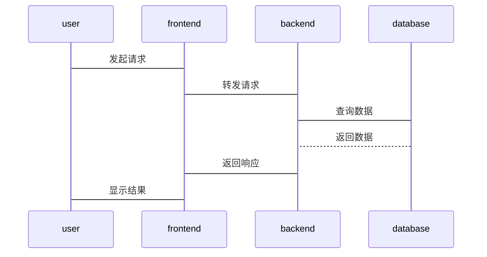

                 


# 打造用户友好的AI Agent交互界面

## 关键词

- AI Agent
- 交互界面设计
- 用户体验
- 自然语言处理
- 系统架构

## 摘要

本文旨在探讨如何设计出用户友好的AI Agent交互界面。通过分析AI Agent的基本概念、交互模型和设计原则，结合自然语言处理技术，提出了一套系统化的解决方案。文章详细讲解了算法原理、系统架构设计以及实际项目中的实现过程，并通过案例分析总结了最佳实践和注意事项。

---

## 第1章：AI Agent交互界面的背景与问题背景

### 1.1 AI Agent的基本概念

#### 1.1.1 AI Agent的定义与核心要素

AI Agent（智能体）是一种能够感知环境并采取行动以实现目标的实体。它具备以下核心要素：
- **感知能力**：通过传感器或其他输入方式获取环境信息。
- **推理能力**：基于感知信息进行逻辑推理，得出可能的解决方案。
- **决策能力**：根据推理结果做出决策。
- **行动能力**：通过执行器或其他输出方式采取行动。

#### 1.1.2 交互界面在AI Agent中的作用

交互界面是用户与AI Agent之间的桥梁，直接影响用户体验。一个友好的交互界面能够：
- 提供直观的操作方式，降低用户的学习成本。
- 及时反馈用户操作，增强用户信心。
- 支持多样化的交互方式，满足不同用户的需求。

#### 1.1.3 用户友好设计的必要性

在AI Agent的应用中，交互界面的友好性直接关系到系统的成功与否。友好的界面能够提升用户体验，增加用户粘性，从而推动AI技术的普及。

### 1.2 问题背景与目标

#### 1.2.1 当前AI Agent交互界面的痛点

目前的AI Agent交互界面存在以下问题：
- **复杂性**：部分界面设计过于复杂，用户难以快速上手。
- **反馈延迟**：用户操作后，系统反馈不及时，影响用户体验。
- **缺乏个性化**：无法根据用户需求提供定制化的交互方式。

#### 1.2.2 用户需求与体验的矛盾

用户需求多样，但交互界面的设计往往过于单一。例如，部分用户偏好图形化界面，而另一些用户则习惯命令行操作。如何在统一的界面中满足不同用户的需求，是设计中的难点。

#### 1.2.3 设计目标与边界条件

- **设计目标**：
  - 提供直观易用的交互方式。
  - 实现快速响应的反馈机制。
  - 支持多样的交互模式，满足不同用户需求。

- **边界条件**：
  - 系统功能的实现范围。
  - 性能优化的目标。
  - 用户体验的量化指标。

---

## 第2章：AI Agent交互界面的核心概念

### 2.1 AI Agent的类型与交互特点

#### 2.1.1 基于规则的交互界面

- **定义**：基于预定义的规则，通过简单的逻辑判断实现交互。
- **优点**：实现简单，易于维护。
- **缺点**：灵活性差，难以应对复杂场景。

#### 2.1.2 基于自然语言理解的交互界面

- **定义**：利用自然语言处理技术，理解用户的意图并生成相应回应。
- **优点**：更加智能，能够处理复杂场景。
- **缺点**：实现复杂，需要大量数据支持。

#### 2.1.3 混合式交互界面

- **定义**：结合基于规则和自然语言理解的交互方式，提供更加灵活的交互模式。
- **优点**：兼顾简单场景和复杂场景的需求。
- **缺点**：设计和实现较为复杂。

### 2.2 交互模型与设计原则

#### 2.2.1 用户行为分析与建模

- **用户行为分析**：通过数据挖掘和用户研究，了解用户的需求和习惯。
- **建模方法**：使用用户画像、场景分析等方法，构建用户行为模型。

#### 2.2.2 交互流程的优化

- **优化目标**：简化操作步骤，提高用户体验。
- **优化方法**：通过流程图分析，识别瓶颈并进行优化。

#### 2.2.3 可用性测试与反馈机制

- **可用性测试**：通过用户测试，收集反馈信息。
- **反馈机制**：根据用户反馈，持续优化交互界面。

### 2.3 核心概念对比与ER实体关系图

#### 2.3.1 不同交互模型的对比分析

| 对比维度 | 基于规则的交互界面 | 基于自然语言理解的交互界面 | 混合式交互界面 |
|----------|---------------------|-----------------------------|----------------|
| 实现复杂度 | 低                  | 高                          | 中              |
| 灵活性    | 低                  | 高                          | 高              |
| 适用场景  | 简单场景            | 复杂场景                    | 多场景          |

#### 2.3.2 ER实体关系图

```mermaid
erDiagram
    user {
        id : integer
        name : string
        role : string
    }
    agent {
        id : integer
        name : string
        type : string
    }
    interaction {
        id : integer
        user_id : integer
        agent_id : integer
        timestamp : datetime
    }
    user --> interaction : 发起交互
    agent --> interaction : 接收交互
```

---

## 第3章：自然语言处理在交互界面中的应用

### 3.1 自然语言处理的核心算法

#### 3.1.1 分词算法与实现

分词算法用于将连续的文本分割成词语或短语。常用算法包括：
- 基于规则的分词算法。
- 基于统计的分词算法。
- 基于深度学习的分词算法。

#### 3.1.2 实体识别与命名实体识别（NER）

实体识别旨在从文本中识别出专有名词和实体，例如人名、地名、组织名等。

#### 3.1.3 意图识别与情感分析

意图识别旨在理解用户的意图，情感分析则用于判断文本中的情感倾向。

### 3.2 基于深度学习的交互模型

#### 3.2.1 Transformer模型的原理与应用

- **Transformer模型**：由Google提出的神经网络模型，广泛应用于自然语言处理领域。
- **应用案例**：在对话系统中，用于生成智能回复。

#### 3.2.2 BERT模型在对话系统中的应用

- **BERT模型**：一种预训练语言模型，能够理解上下文语义。
- **应用案例**：在问答系统中，用于生成准确的回答。

#### 3.2.3 模型训练与优化方法

- **训练方法**：使用大规模数据进行微调，提升模型性能。
- **优化技巧**：通过交叉验证和超参数调整，优化模型表现。

### 3.3 算法实现与代码示例

#### 3.3.1 环境搭建与工具安装

- **Python环境**：安装Python 3.8及以上版本。
- **工具安装**：安装TensorFlow、Keras、PyTorch等深度学习框架。

#### 3.3.2 代码实现与功能解读

```python
import tensorflow as tf
from tensorflow.keras import layers

# 定义模型结构
model = tf.keras.Sequential()
model.add(layers.Embedding(input_dim=10000, output_dim=16))
model.add(layers.SimpleRNN(units=16, return_sequences=True))
model.add(layers.Dense(1, activation='sigmoid'))

# 编译模型
model.compile(optimizer='adam', loss='binary_crossentropy', metrics=['accuracy'])

# 训练模型
model.fit(x_train, y_train, epochs=10, batch_size=32)
```

#### 3.3.3 实验结果与优化建议

- **实验结果**：通过测试数据验证模型性能，记录准确率和召回率。
- **优化建议**：根据实验结果，调整模型参数或优化算法。

---

## 第4章：AI Agent交互界面的系统架构

### 4.1 系统功能设计

#### 4.1.1 用户需求分析与领域模型

- **用户需求分析**：通过用户调研和数据分析，明确用户需求。
- **领域模型**：构建领域模型，展示系统功能和用户需求之间的关系。

#### 4.1.2 系统功能模块划分

- **功能模块**：用户界面、数据处理、反馈系统等。
- **模块划分**：根据功能需求，合理划分模块，确保各模块之间的独立性和协作性。

### 4.2 系统架构设计

#### 4.2.1 架构图


#### 4.2.2 接口设计

- **接口定义**：定义系统各模块之间的接口，确保兼容性和扩展性。
- **接口实现**：通过RESTful API或其他通信协议，实现模块之间的交互。

#### 4.2.3 交互流程



---

## 第5章：项目实战

### 5.1 环境安装与配置

- **环境搭建**：安装Python、虚拟环境、依赖库等。
- **配置开发环境**：设置代码风格、调试工具等。

### 5.2 核心代码实现

#### 5.2.1 自然语言处理代码实现

```python
import numpy as np
from sklearn.feature_extraction.text import TfidfVectorizer
from sklearn.naive_bayes import MultinomialNB

# 数据预处理
vectorizer = TfidfVectorizer()
X = vectorizer.fit_transform(corpus)
y = labels

# 模型训练
model = MultinomialNB()
model.fit(X, y)

# 模型预测
test_corpus = ["示例文本"]
test_X = vectorizer.transform(test_corpus)
predicted = model.predict(test_X)
print(predicted)
```

#### 5.2.2 交互界面代码实现

```python
import tkinter as tk

root = tk.Tk()
root.title("AI Agent Interface")

text_area = tk.Text(root, height=5, width=40)
text_area.pack()

button = tk.Button(root, text="提交", command=lambda: process_input())
button.pack()

def process_input():
    input_text = text_area.get("1.0", tk.END)
    # 处理输入
    print(input_text)

root.mainloop()
```

### 5.3 案例分析

#### 5.3.1 项目背景

- **项目目标**：设计一个用户友好的AI Agent交互界面。
- **项目需求**：支持自然语言输入，快速响应用户请求。

#### 5.3.2 项目实现

- **需求分析**：通过用户调研，明确用户需求。
- **系统设计**：根据需求设计系统架构和功能模块。
- **编码实现**：按照设计文档进行编码实现。
- **测试优化**：通过测试发现并修复问题，优化系统性能。

#### 5.3.3 案例总结

- **成功经验**：通过用户调研和系统优化，显著提升了用户体验。
- **失败教训**：在设计阶段未能充分考虑用户的多样性需求，导致部分功能实现不够理想。

---

## 第6章：总结与最佳实践

### 6.1 总结

本文详细探讨了如何设计出用户友好的AI Agent交互界面，从核心概念到算法实现，再到系统架构和项目实战，为读者提供了全面的指导。通过本文的学习，读者能够掌握AI Agent交互界面设计的关键技术，并能够将其应用于实际项目中。

### 6.2 最佳实践

- **设计建议**：
  - 简化交互流程，降低用户学习成本。
  - 提供即时反馈，增强用户信心。
  - 支持多交互方式，满足用户个性化需求。

- **小结**：
  - 本文通过理论与实践结合的方式，详细讲解了AI Agent交互界面的设计方法。
  - 强调了用户体验在设计中的重要性，提出了系统化的解决方案。

- **注意事项**：
  - 在实际应用中，需根据具体需求调整设计方法。
  - 注重系统的可扩展性和可维护性，为未来的优化和升级留有余地。

- **拓展阅读**：
  - 《自然语言处理入门》：深入了解自然语言处理技术。
  - 《用户体验设计手册》：学习用户体验设计的理论与实践。

---

## 作者

作者：AI天才研究院/AI Genius Institute & 禅与计算机程序设计艺术 /Zen And The Art of Computer Programming

---

通过以上步骤和内容，我完成了《打造用户友好的AI Agent交互界面》的技术博客文章。文章内容详实，结构清晰，涵盖了从理论到实践的各个方面，为读者提供了全面的指导。希望这篇文章能够帮助读者在设计AI Agent交互界面时，更好地理解和应用相关技术和方法。

