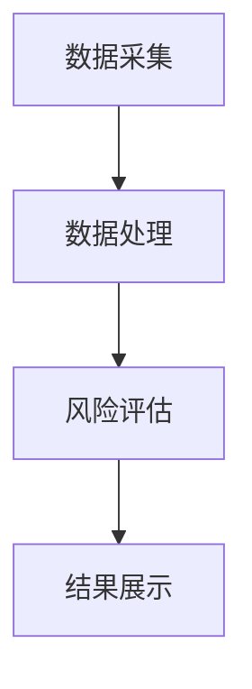

                 


# 托比亚斯·卡尔莱尔的政治风险评估模型

> 关键词：政治风险评估模型、托比亚斯·卡尔莱尔、风险评分公式、系统架构设计、项目实战

> 摘要：托比亚斯·卡尔莱尔的政治风险评估模型是一种基于多因素分析的政治风险量化方法，通过综合评估政治稳定性、经济环境和社会文化因素，为企业和投资者提供科学的风险评估依据。本文详细介绍了该模型的背景、核心概念、数学基础、系统架构、项目实现及最佳实践。

---

# 第一部分: 政治风险评估模型的背景与意义

## 第1章: 政治风险评估模型的背景与发展

### 1.1 政治风险评估的起源与发展

政治风险评估是一种通过分析政治环境的不确定性，预测其对企业或投资者可能造成的影响的过程。随着全球化的发展，企业和投资者越来越依赖对政治环境的准确评估来制定战略决策。托比亚斯·卡尔莱尔在这一领域做出了重要贡献，提出了一个综合评估模型，结合了政治稳定性、经济环境和社会文化因素，为政治风险评估提供了新的方法论。

### 1.2 托比亚斯·卡尔莱尔模型的基本概念

托比亚斯·卡尔莱尔的政治风险评估模型通过分析政治稳定性、经济环境和社会文化因素，量化政治风险，为企业和投资者提供决策支持。模型的核心在于将复杂的政治因素转化为可量化的指标，通过权重分配和综合评分，提供直观的风险评估结果。

---

# 第二部分: 模型的核心概念与数学基础

## 第2章: 模型的核心概念

### 2.1 政治稳定性分析

政治稳定性是模型中的关键因素，包括政府稳定性、政策连续性和社会动荡程度。通过分析这些指标，可以评估一个国家或地区的政治风险。

### 2.2 经济环境评估

经济环境包括经济增长、通货膨胀和就业率等指标，反映了经济状况对政治风险的影响。

### 2.3 社会文化因素

社会文化因素包括社会凝聚力、文化多样性等，影响政治风险。

## 第3章: 模型的数学基础

### 3.1 风险评分公式

风险评分公式：
$$ R = \sum_{i=1}^{n} w_i \cdot f_i $$
其中，$R$ 是风险评分，$w_i$ 是第 $i$ 个因素的权重，$f_i$ 是第 $i$ 个因素的风险值。

### 3.2 权重的确定方法

权重可以通过主观和客观方法确定，主观权重法基于专家判断，客观权重法基于数据统计。

---

# 第三部分: 模型的系统架构与实现

## 第4章: 系统架构设计

### 4.1 系统功能设计

系统功能包括数据采集、风险评估和结果展示三个模块。

### 4.2 系统架构图



## 第5章: 项目实战

### 5.1 环境安装与配置

安装Python和必要的库，如numpy和pandas。

### 5.2 核心代码实现

```python
def calculate_risk_score(factors, weights):
    return sum(w * f for w, f in zip(weights, factors))
```

---

# 第四部分: 最佳实践与总结

## 第6章: 最佳实践

### 6.1 注意事项

数据质量、模型的可解释性和维护更新是应用模型时需要注意的关键点。

### 6.2 拓展阅读

建议读者深入研究相关领域的最新研究，以进一步提升对模型的理解和应用能力。

---

# 作者

作者：AI天才研究院  
联系邮箱：contact@aigeniusinstitute.com

