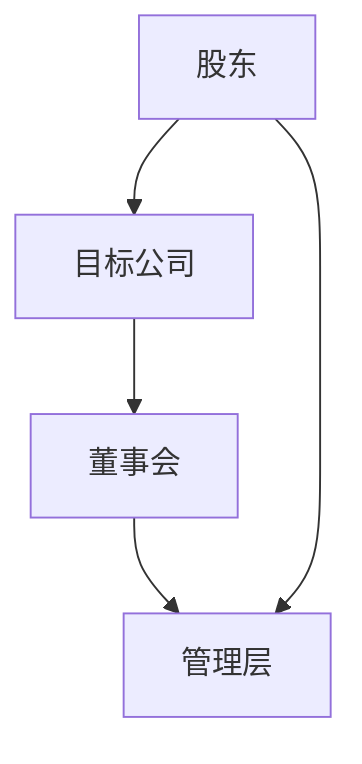
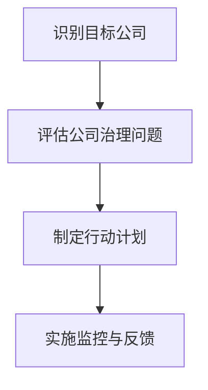
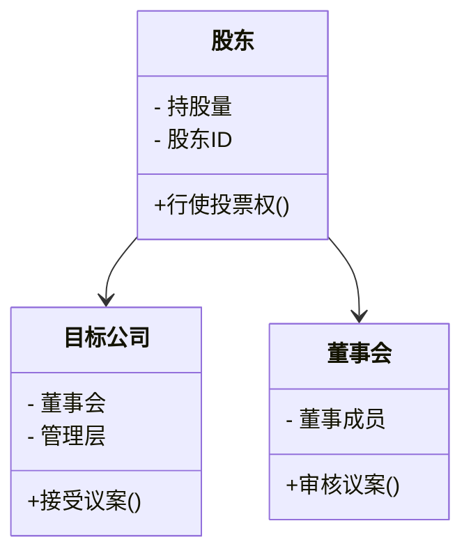

                 


# 托马斯·罗恩的股东积极主义策略

## 关键词：股东积极主义, 投资策略, 公司治理, 股东影响力, 数字化投资

## 摘要：  
托马斯·罗恩的股东积极主义策略是一种以技术驱动、数据支持的投资理念，通过主动参与公司治理和优化股东权利，帮助投资者实现长期价值最大化。本文将从背景、核心概念、算法原理、系统架构等多维度深度解析这一策略，探讨其在数字化时代下的应用与挑战。

---

## 第一部分: 股东积极主义的背景与核心概念

### 第1章: 股东积极主义的起源与发展

#### 1.1 股东积极主义的定义与背景
- **股东积极主义的定义**：股东积极主义是一种投资策略，强调股东不仅仅是资本提供者，而是公司治理的积极参与者，通过行使投票权、监督管理层等方式影响公司决策。
- **背景**：传统投资策略往往关注短期收益，而股东积极主义更注重长期价值创造，尤其是在数字化时代，技术驱动的公司治理模式为股东提供了更多主动参与的机会。
- **与传统投资的区别**：传统投资注重财务回报，而股东积极主义强调通过治理参与实现价值提升。

#### 1.2 股东积极主义的现状与趋势
- **全球发展现状**：近年来，股东积极主义在全球范围内逐渐兴起，特别是在科技公司治理中表现突出。
- **数字化时代的影响**：技术进步使得股东能够更便捷地获取信息、行使权利，数字化工具为股东积极主义提供了新的可能性。
- **未来趋势**：随着人工智能和大数据技术的普及，股东积极主义将更加数据化、智能化。

---

### 第2章: 股东积极主义的核心要素

#### 2.1 股东权利与义务
- **股东的基本权利**：包括知情权、投票权、监督权等。
- **股东的义务与责任**：股东需要遵守公司章程，履行相应的义务，避免滥用权利。

#### 2.2 股东积极主义的核心策略
- **参与公司治理的途径**：通过董事会选举、股东投票等方式影响公司决策。
- **如何影响公司决策**：通过提出议案、监督管理层等方式推动公司改进。

#### 2.3 股东积极主义的边界与外延
- **边界**：股东积极主义应尊重公司治理的法律框架，避免过度干预。
- **外延**：与环境、社会和治理（ESG）投资理念相结合，推动可持续发展。

---

## 第二部分: 股东积极主义的核心概念与联系

### 第3章: 股东积极主义的原理

#### 3.1 股东积极主义的理论基础
- **治理理论**：强调股东在公司治理中的角色和责任。
- **代理理论**：分析股东与管理层之间的代理关系，优化利益协调。

#### 3.2 股东积极主义的核心要素对比
- **积极股东与消极股东的对比**：
| 特征 | 积极股东 | 消极股东 |
|------|----------|----------|
| 投票行为 | 主动参与 | 被动接受 |
| 监督力度 | 强度高 | 弱度低 |
| 影响力 | 较大 | 较小 |

#### 3.3 股东积极主义的ER实体关系图


---

## 第三部分: 股东积极主义的算法原理

### 第4章: 股东积极主义的算法流程

#### 4.1 股东积极主义的算法流程


#### 4.2 股东积极主义的数学模型
- **股东影响力评估公式**：
$$ I = k \times S $$
其中，$I$ 表示股东影响力，$S$ 表示持股量，$k$ 为比例常数。

#### 4.3 举例说明
假设某股东持股比例为 $S = 10\%$，$k = 0.5$，则影响力为 $I = 0.5 \times 0.1 = 0.05$，即5%。

---

## 第四部分: 股东积极主义的系统架构设计方案

### 第5章: 股东积极主义的系统分析

#### 5.1 问题场景介绍
- **公司治理中的问题**：管理层决策低效、股东权利未被充分行使等。

#### 5.2 项目介绍
- **目标**：构建一个基于股东积极主义的公司治理优化系统。
- **核心功能**：信息监控、议案提交、投票管理。

#### 5.3 系统功能设计


#### 5.4 系统架构设计


---

## 第五部分: 股东积极主义的项目实战

### 第6章: 项目实战

#### 6.1 环境安装
- **工具**：使用Python进行数据分析，结合SQL数据库存储治理数据。
- **技术栈**：Python、Pandas、Matplotlib、Flask。

#### 6.2 系统核心实现源代码
```python
def calculate_influence(shares, k=0.5):
    return k * shares

shares = 0.1  # 10% 的持股量
influence = calculate_influence(shares)
print(f"股东影响力为: {influence}")
```

#### 6.3 代码应用解读与分析
- **代码功能**：计算股东影响力，帮助投资者评估其在目标公司中的影响力。

#### 6.4 实际案例分析
- **案例分析**：假设某股东持股比例为10%，通过计算发现其影响力为5%，低于预期，需进一步增加持股量。

---

## 第六部分: 总结与展望

### 第7章: 总结与展望

#### 7.1 最佳实践 tips
- **数据驱动**：利用数据分析工具优化投资决策。
- **技术辅助**：借助AI和大数据技术提升治理效率。

#### 7.2 小结
托马斯·罗恩的股东积极主义策略通过技术手段优化公司治理，为投资者提供了新的价值创造路径。

#### 7.3 注意事项
- **法律风险**：需遵守相关法律法规，避免越界干预。
- **道德风险**：坚持透明和公正，避免滥用股东权利。

#### 7.4 拓展阅读
- 推荐阅读《公司治理与股东权利》和《技术驱动的投资策略》。

---

## 作者：AI天才研究院/AI Genius Institute & 禅与计算机程序设计艺术 /Zen And The Art of Computer Programming

