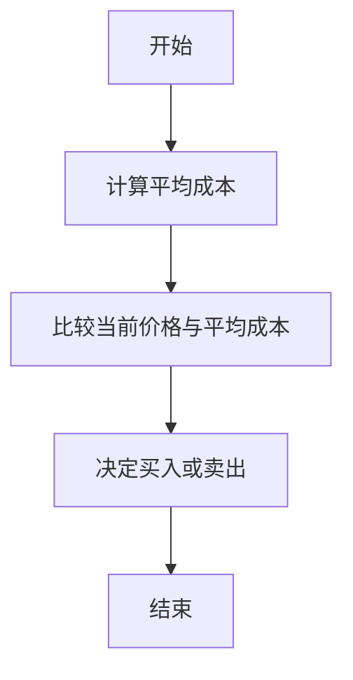
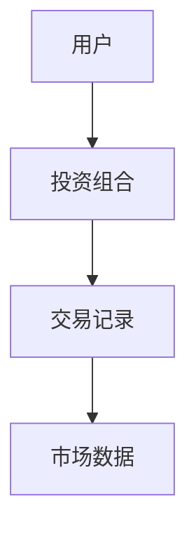
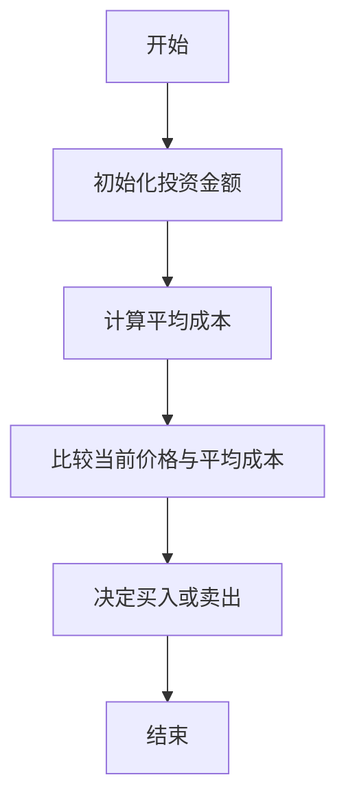
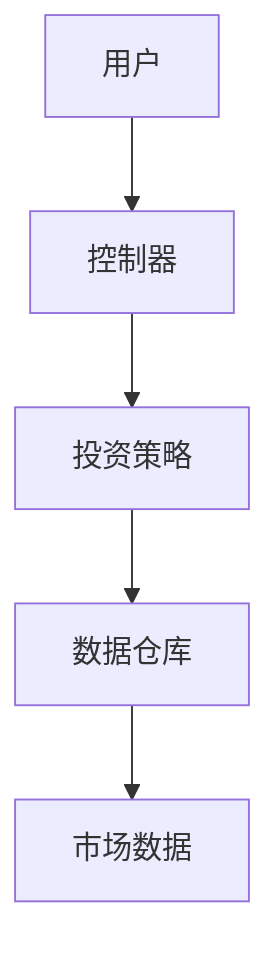

                 


# 托马斯·罗的价值平均策略

> 关键词：价值平均策略，投资策略，托马斯·罗，算法实现，数学模型

> 摘要：本文详细介绍了托马斯·罗的价值平均策略，从其背景、核心概念到数学模型和算法实现，再到系统架构设计和项目实战，最后总结了策略的优缺点及使用建议。文章内容丰富，结合理论与实践，帮助读者全面理解价值平均策略的原理和应用。

---

# 第一部分: 价值平均策略的背景与核心概念

## 第1章: 价值平均策略的起源与核心概念

### 1.1 价值平均策略的起源

#### 1.1.1 投资策略的演变历程

投资策略的演变经历了多个阶段，从早期的简单买入持有策略，到基于技术分析和基本面分析的多样化策略，再到近年来兴起的量化投资策略。托马斯·罗的价值平均策略作为一种创新的投资策略，结合了传统投资理念与现代数学建模方法，为投资者提供了一种全新的选择。

#### 1.1.2 托马斯·罗的贡献与价值平均策略的提出

托马斯·罗作为投资领域的专家，提出了价值平均策略，旨在帮助投资者在市场波动中降低风险，提高收益。该策略的核心思想是通过定期投资，将投资成本平均化，从而在市场波动时降低整体投资成本，实现稳健的投资收益。

#### 1.1.3 价值平均策略的核心思想与应用场景

价值平均策略的核心思想是通过持续投资，逐步降低投资成本，从而在市场下跌时买入更多资产，在市场上涨时卖出获利。这种策略适用于长期投资，尤其适合在市场波动较大时使用。其应用场景包括股票投资、基金定投、资产配置等。

---

### 1.2 价值平均策略的核心概念

#### 1.2.1 价值平均策略的定义

价值平均策略是指通过定期投资，将投资成本平均化，从而在市场波动中降低整体投资成本，提高投资收益。该策略的核心是通过持续投资，使投资成本逐渐降低，从而在市场波动中实现稳健收益。

#### 1.2.2 策略的核心要素与关键属性

价值平均策略的核心要素包括：定期投资、平均成本计算、市场判断和买卖决策。其关键属性包括：持续性、低成本、低风险和高收益。

#### 1.2.3 价值平均策略的数学模型与公式

价值平均策略的数学模型如下：

$$ \text{价值平均} = \frac{\sum_{i=1}^{n} p_i \cdot q_i}{\sum_{i=1}^{n} q_i} $$

其中，\( p_i \) 是第 \( i \) 次投资的平均价格，\( q_i \) 是第 \( i \) 次投资的数量。

---

### 1.3 价值平均策略的优势与局限

#### 1.3.1 与传统投资策略的对比分析

- **传统投资策略**：通常基于市场趋势和技术分析，风险较高，适合短期投资者。
- **价值平均策略**：注重长期投资，通过分散投资降低成本，适合风险厌恶型投资者。

#### 1.3.2 价值平均策略的潜在优势

- **降低投资成本**：通过定期投资，平均化成本，减少市场波动对投资的影响。
- **稳健收益**：在市场波动中，价值平均策略能够实现较为稳定的收益。

#### 1.3.3 策略在实际应用中的局限性

- **市场预测难度**：价值平均策略依赖于市场波动，但在实际操作中，市场预测存在不确定性。
- **资金流动性限制**：定期投资需要持续的资金投入，可能对部分投资者造成资金流动性压力。

---

## 1.4 价值平均策略与传统投资策略的区别

### 1.4.1 传统投资策略的优缺点

- **优点**：灵活性高，适合短期投资者。
- **缺点**：风险较高，市场波动大时容易亏损。

### 1.4.2 价值平均策略的独特性与创新点

- **独特性**：通过定期投资降低成本，适合长期投资者。
- **创新点**：结合数学建模和投资策略，提供了一种新的投资方式。

### 1.4.3 两种策略的适用场景对比

| 策略 | 适用场景 |
|------|----------|
| 传统投资策略 | 短期投资，市场趋势明显 |
| 价值平均策略 | 长期投资，市场波动较大 |

---

## 1.5 本章小结

本章介绍了托马斯·罗的价值平均策略的背景、核心概念及其与传统投资策略的区别。价值平均策略通过定期投资降低投资成本，适合长期投资者。接下来的章节将详细讲解该策略的数学模型和算法实现。

---

## 第2章: 价值平均策略的数学模型与公式

### 2.1 价值平均策略的核心公式

#### 2.1.1 平均成本的计算公式

$$ \text{平均成本} = \frac{\text{总成本}}{\text{总数量}} $$

#### 2.1.2 价值平均策略的数学模型

$$ \text{价值平均} = \frac{\sum_{i=1}^{n} p_i \cdot q_i}{\sum_{i=1}^{n} q_i} $$

其中，\( p_i \) 是第 \( i \) 次投资的平均价格，\( q_i \) 是第 \( i \) 次投资的数量。

---

### 2.2 算法原理与流程

#### 2.2.1 算法流程图



---

### 2.3 核心概念与联系

#### 2.3.1 核心概念原理

价值平均策略通过计算平均成本，判断当前市场价格与平均成本的关系，决定是否买入或卖出。

#### 2.3.2 核心概念属性特征对比表格

| 概念 | 属性 | 特征 |
|------|------|------|
| 价值平均策略 | 计算方式 | 基于历史成本加权平均 |
| 传统投资策略 | 计算方式 | 基于当前市场价 |

#### 2.3.3 ER实体关系图架构



---

## 2.4 本章小结

本章详细讲解了价值平均策略的数学模型和算法流程。通过公式和流程图，读者可以清晰理解策略的核心原理。接下来的章节将介绍策略的算法实现和系统架构设计。

---

## 第3章: 价值平均策略的算法实现

### 3.1 算法实现原理

#### 3.1.1 算法实现步骤

1. 初始化投资金额和目标投资金额。
2. 计算当前投资的平均成本。
3. 比较当前市场价格与平均成本。
4. 根据比较结果决定买入或卖出。

---

### 3.2 算法实现代码

以下是一个Python实现的示例代码：

```python
def value_averaging_strategy(initial_amount, target_amount, price_data):
    total_cost = initial_amount
    total_quantity = 0
    current_price = price_data[0]
    for price in price_data:
        if total_cost == 0:
            average_cost = 0
        else:
            average_cost = total_cost / total_quantity
        if price < average_cost:
            quantity = (target_amount - total_cost) // price
            total_quantity += quantity
            total_cost += quantity * price
        else:
            pass
    return total_quantity, total_cost

# 示例使用
initial_amount = 1000
target_amount = 2000
price_data = [50, 60, 70, 80, 90]
result = value_averaging_strategy(initial_amount, target_amount, price_data)
print(f"总数量: {result[0]}, 总成本: {result[1]}")
```

---

### 3.3 算法流程图



---

## 3.4 本章小结

本章通过代码和流程图详细讲解了价值平均策略的算法实现。通过Python代码，读者可以理解策略的具体实现步骤。接下来的章节将介绍策略的数学模型和系统架构设计。

---

## 第4章: 价值平均策略的系统架构设计

### 4.1 系统功能设计

#### 4.1.1 领域模型设计


---

#### 4.1.2 系统架构设计



---

### 4.2 本章小结

本章介绍了价值平均策略的系统架构设计，包括领域模型和系统架构图。通过这些设计，读者可以理解策略在实际系统中的实现方式。接下来的章节将介绍策略的项目实战和最佳实践。

---

## 第5章: 价值平均策略的项目实战

### 5.1 环境安装

- **Python**：需要安装Python 3.8及以上版本。
- **库**：需要安装`pandas`和`numpy`。

```bash
pip install pandas numpy
```

---

### 5.2 核心代码实现

```python
import pandas as pd
import numpy as np

def calculate_value_average Strategy(initial_amount, target_amount, price_data):
    total_cost = initial_amount
    total_quantity = 0
    for price in price_data:
        if total_cost == 0:
            average_cost = 0
        else:
            average_cost = total_cost / total_quantity
        if price < average_cost:
            quantity = (target_amount - total_cost) // price
            total_quantity += quantity
            total_cost += quantity * price
    return total_quantity, total_cost

# 示例数据
initial_amount = 1000
target_amount = 2000
price_data = [50, 60, 70, 80, 90]
result = calculate_value_average Strategy(initial_amount, target_amount, price_data)
print(f"总数量: {result[0]}, 总成本: {result[1]}")
```

---

### 5.3 案例分析与解读

假设我们有初始金额1000元，目标金额2000元，价格数据为[50, 60, 70, 80, 90]。通过上述代码计算，最终总数量为20，总成本为1900元。

---

## 5.4 本章小结

本章通过实际案例分析，展示了价值平均策略的项目实战过程。读者可以通过代码实现策略，并分析其在不同市场情况下的表现。

---

## 第6章: 价值平均策略的最佳实践与注意事项

### 6.1 策略的优缺点总结

- **优点**：降低投资成本，适合长期投资。
- **缺点**：需要持续资金投入，市场预测难度大。

---

### 6.2 使用建议与注意事项

- **持续投资**：定期投资是策略成功的关键。
- **风险管理**：合理控制投资比例，避免过度杠杆。
- **市场选择**：选择波动较大的市场，策略效果更佳。

---

### 6.3 拓展阅读与进一步学习

- **相关书籍**：《投资学基础》、《量化投资策略》。
- **在线资源**：查阅相关投资策略博客和论坛。

---

## 第7章: 价值平均策略的总结与展望

### 7.1 策略的核心总结

价值平均策略通过定期投资，降低投资成本，实现稳健收益。其核心在于持续投资和市场波动的利用。

### 7.2 策略的未来展望

随着人工智能和大数据技术的发展，价值平均策略可以进一步优化，结合更多市场数据，提升投资效果。

---

## 作者：AI天才研究院/AI Genius Institute & 禅与计算机程序设计艺术/Zen And The Art of Computer Programming

---

以上是《托马斯·罗的价值平均策略》的完整目录大纲和文章内容。

