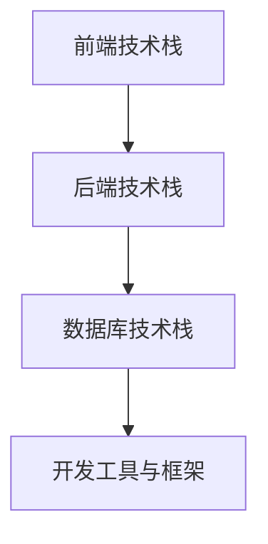
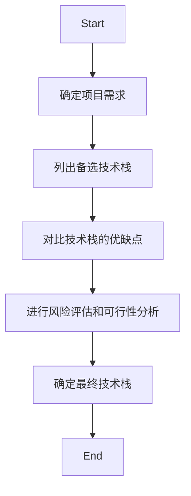
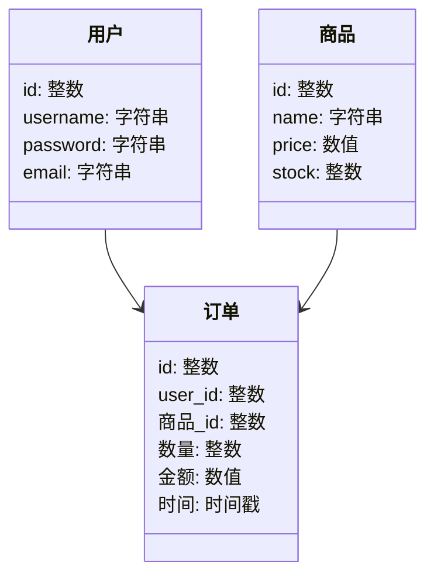

                 


# 技术栈选择与评估

> 关键词：技术栈选择、技术评估、系统架构、技术选型、开发效率、项目管理

> 摘要：  
在现代软件开发中，技术栈的选择与评估是决定项目成功的关键因素之一。本文将从技术栈的核心概念出发，逐步分析技术栈选择的背景、方法和流程，并结合实际案例，深入探讨如何通过科学的评估方法选择合适的技术栈，以满足项目需求和未来发展。通过本文的系统分析和实践指导，读者可以掌握技术栈选择与评估的核心技巧，从而做出更明智的技术决策。

---

# 第一部分: 技术栈选择与评估的背景与基础

## 第1章: 技术栈选择与评估的背景介绍

### 1.1 技术栈的基本概念

#### 1.1.1 技术栈的定义
技术栈是指在软件开发过程中，用于构建系统的所有技术、工具、框架和库的集合。它包括前端、后端、数据库、开发工具等多个部分，是一个完整的技术组合。

#### 1.1.2 技术栈的组成部分
技术栈通常由以下几个部分组成：
- **前端技术栈**：用于处理用户界面的部分，如HTML、CSS、JavaScript及其框架（React、Vue等）。
- **后端技术栈**：用于处理业务逻辑和数据存储的部分，如Spring Boot、Node.js等。
- **数据库技术栈**：用于存储和管理数据的部分，如MySQL、MongoDB等。
- **开发工具与框架**：如IDE、版本控制工具（Git）、构建工具（Webpack）等。

#### 1.1.3 技术栈的重要性
技术栈的选择直接影响项目的开发效率、系统性能、维护成本以及团队能力。选择合适的技术栈可以提高开发效率、降低技术风险，并确保系统的可扩展性和可维护性。

### 1.2 技术栈选择的背景与问题背景

#### 1.2.1 当前技术发展的多样性
随着技术的进步，可供选择的技术栈种类越来越多。前端有React、Vue、Angular等多种框架，后端有Spring Boot、Django、Node.js等多种选择，数据库也有关系型和非关系型等多种类型。这种多样性为企业提供了更多的选择，但也带来了更大的挑战。

#### 1.2.2 企业技术选型的挑战
企业在选择技术栈时，需要综合考虑以下几个方面：
- **项目需求**：项目的类型（Web应用、移动应用、桌面应用等）、规模（小项目、中型项目、大型项目）。
- **团队能力**：开发团队的技术背景、经验和技能。
- **技术成熟度**：技术栈的成熟度、社区支持和生态系统。
- **成本因素**：开源与商业软件的成本、开发效率和维护成本。
- **未来扩展性**：技术栈是否能够支持未来的业务扩展和系统升级。

#### 1.2.3 技术栈选择的核心问题
技术栈选择的核心问题是：如何在有限的资源和时间内，选择最适合当前项目需求的技术栈，同时确保系统的可扩展性和可维护性。

### 1.3 技术栈选择的必要性

#### 1.3.1 技术栈选择对企业的影响
- **提升开发效率**：选择合适的技术栈可以减少开发时间，提高开发效率。
- **降低技术风险**：选择成熟的技术栈可以降低技术风险，避免因技术问题导致项目失败。
- **提高产品质量**：合适的技术栈可以提高系统的性能、安全性和用户体验。

#### 1.3.2 技术栈选择对项目的影响
- **项目进度**：技术栈的选择直接影响项目的开发进度。
- **项目成本**：技术栈的选择影响项目的开发成本和维护成本。
- **项目质量**：技术栈的选择影响系统的性能、可扩展性和可维护性。

#### 1.3.3 技术栈选择对团队的影响
- **团队能力**：技术栈的选择需要团队具备一定的技术能力，但也需要团队不断学习新技术。
- **团队效率**：合适的技术栈可以提高团队的开发效率，降低学习成本。

### 1.4 本章小结
本章介绍了技术栈的基本概念、选择的背景与必要性，强调了技术栈选择对企业、项目和团队的重要性。接下来，我们将深入探讨技术栈的核心概念与联系，帮助读者更好地理解技术栈的组成和关系。

---

## 第2章: 技术栈的核心概念与联系

### 2.1 技术栈的核心要素

#### 2.1.1 前端技术栈
前端技术栈是用户与系统交互的部分，主要关注用户体验和界面设计。常见的前端技术栈包括：
- **HTML/CSS/JavaScript**：网页开发的基础技术。
- **前端框架**：如React（基于JavaScript的组件化框架）、Vue（基于Vue.js的渐进式框架）、Angular（全栈式框架）等。
- **构建工具**：如Webpack、Vite等，用于优化和打包前端代码。

#### 2.1.2 后端技术栈
后端技术栈是系统的核心部分，主要处理业务逻辑和数据存储。常见的后端技术栈包括：
- **语言**：如Java、Python、JavaScript等。
- **框架**：如Spring Boot（基于Java的全栈框架）、Django（基于Python的全栈框架）、Node.js（基于JavaScript的后端框架）等。
- **服务发现与调用**：如Spring Cloud、dubbo等，用于服务发现和 RPC 调用。

#### 2.1.3 数据库技术栈
数据库是系统的核心存储部分，分为关系型和非关系型数据库：
- **关系型数据库**：如MySQL、PostgreSQL，适合结构化数据存储。
- **非关系型数据库**：如MongoDB、Redis，适合处理大量非结构化数据和缓存。

#### 2.1.4 开发工具与框架
开发工具和框架是开发过程中不可或缺的部分，如：
- **IDE**：如IntelliJ IDEA、VS Code等。
- **版本控制工具**：如Git，用于代码管理和协作。
- **构建工具**：如Maven、npm等，用于依赖管理和构建。

### 2.2 技术栈的分类与对比

#### 2.2.1 常见技术栈分类
技术栈可以根据不同的维度进行分类：
- **按功能划分**：前端、后端、数据库。
- **按语言划分**：Java栈、Python栈、JavaScript栈等。
- **按架构风格划分**：MVC、MVP、MVVM等。

#### 2.2.2 技术栈对比表格
以下是几种常见技术栈的对比表格：

| 技术栈         | 优点                                                                 | 缺点                                                                 |
|----------------|----------------------------------------------------------------------|----------------------------------------------------------------------|
| **React**      | 组件化开发，易于维护，社区活跃                                             | 学习曲线较高，适合中大型项目                                         |
| **Vue**        | 易用性高，轻量级，适合中小项目                                             | 社区支持相对较少，插件生态不如React成熟                                 |
| **Spring Boot** | 开发效率高，社区支持强大，适合Java开发                                     | 对底层技术了解不足，不适合需要底层优化的场景                         |
| **Node.js**    | 轻量级，适合快速开发，非阻塞I/O性能优越                                    | 性能不如传统语言（如Java），不适合高并发场景                         |

#### 2.2.3 实体关系图
以下是技术栈的核心要素之间的关系图：



### 2.3 技术栈的联系与应用
技术栈的选择需要综合考虑各部分的联系，例如：
- 前端选择React，后端选择Spring Boot，数据库选择MySQL，开发工具选择IntelliJ IDEA。
- 前端选择Vue，后端选择Node.js，数据库选择MongoDB，开发工具选择VS Code。

### 2.4 本章小结
本章详细讲解了技术栈的核心要素及其分类，并通过对比表格和实体关系图展示了各部分的联系。接下来，我们将探讨技术栈选择与评估的方法，帮助读者掌握如何科学地选择技术栈。

---

## 第3章: 技术栈选择与评估的方法

### 3.1 技术栈选择的评估方法

#### 3.1.1 项目需求分析
在选择技术栈之前，必须对项目进行全面的需求分析，包括：
- **项目目标**：明确项目的功能需求和非功能需求。
- **项目规模**：确定项目的大小（小项目、中型项目、大型项目）。
- **团队能力**：评估团队的技术能力和经验。
- **预算和时间限制**：明确项目的预算和时间表。

#### 3.1.2 技术栈对比
根据项目需求，对比不同技术栈的优缺点，例如：
- 前端：React vs Vue
- 后端：Spring Boot vs Node.js
- 数据库：MySQL vs MongoDB

#### 3.1.3 风险评估与可行性分析
在选择技术栈时，必须进行风险评估和可行性分析，包括：
- **技术风险**：技术栈的成熟度和社区支持。
- **性能风险**：技术栈是否能够满足系统的性能需求。
- **维护风险**：技术栈的维护成本和未来发展。

### 3.2 技术栈评估的指标体系

#### 3.2.1 项目需求匹配度
技术栈的选择必须满足项目的核心需求，例如：
- 是否支持分布式架构。
- 是否支持微服务架构。
- 是否支持实时性需求。

#### 3.2.2 技术成熟度
技术栈的成熟度包括：
- 开源社区的支持程度。
- 技术的更新频率和版本支持。

#### 3.2.3 开发效率
开发效率包括：
- 开发工具和框架的易用性。
- 开发周期和团队生产力。

#### 3.2.4 成本因素
成本因素包括：
- 开源与商业软件的成本。
- 人力成本和培训成本。

#### 3.2.5 扩展性与维护性
扩展性与维护性包括：
- 技术栈的可扩展性。
- 系统的可维护性和可升级性。

### 3.3 技术栈选择的决策模型

#### 3.3.1 技术栈选择的流程
技术栈选择的流程如下：
1. 确定项目需求和目标。
2. 列出备选技术栈。
3. 对比技术栈的优缺点。
4. 进行风险评估和可行性分析。
5. 确定最终的技术栈。

#### 3.3.2 技术栈选择的决策模型
以下是技术栈选择的决策模型：



### 3.4 本章小结
本章详细讲解了技术栈选择的评估方法，包括需求分析、技术对比、风险评估和决策模型。接下来，我们将通过实际案例来展示技术栈选择与评估的流程。

---

## 第4章: 技术栈选择的系统分析与架构设计

### 4.1 系统分析

#### 4.1.1 问题场景介绍
假设我们需要为一家电商公司开发一个在线购物系统，项目需求包括：
- 用户注册与登录。
- 商品展示与管理。
- 订单管理与支付。
- 用户评价与反馈。

#### 4.1.2 项目介绍
项目名称：在线购物系统  
项目目标：提供一个安全、高效、用户友好的在线购物平台。  
项目规模：中型项目，预计开发周期为3个月，开发团队由5人组成。

### 4.2 系统功能设计

#### 4.2.1 领域模型设计
以下是在线购物系统的领域模型图：



### 4.3 系统架构设计

#### 4.3.1 架构设计
以下是在线购物系统的架构图：


#### 4.3.2 接口设计
系统的主要接口包括：
- 用户登录接口：POST /api/login
- 商品查询接口：GET /api/products
- 下单接口：POST /api/order

### 4.4 本章小结
本章通过实际案例展示了技术栈选择与评估的系统分析与架构设计过程，包括领域模型设计和架构图的绘制。接下来，我们将通过项目实战来展示技术栈选择的具体实现。

---

## 第5章: 项目实战——电商系统技术栈选择与实现

### 5.1 环境搭建

#### 5.1.1 开发工具安装
安装所需的开发工具：
- **前端**：安装Node.js和npm，安装React或Vue框架。
- **后端**：安装Java和Maven，安装Spring Boot。
- **数据库**：安装MySQL或MongoDB。

#### 5.1.2 代码仓库初始化
使用Git进行代码管理，初始化代码仓库：
```bash
git init
git remote add origin git@github.com:username/repo.git
```

### 5.2 核心代码实现

#### 5.2.1 前端实现
以下是React前端实现的代码示例：
```javascript
// App.js
import React from 'react';
import { BrowserRouter as Router, Route, Switch, Redirect } from 'react-router-dom';
import Home from './pages/Home';
import ProductList from './pages/ProductList';
import ProductDetail from './pages/ProductDetail';
import Cart from './pages/Cart';
import Checkout from './pages/Checkout';
import { createStore } from 'redux';
import rootReducer from './reducers';
import { Provider } from 'react-redux';

function App() {
  const store = createStore(rootReducer);
  return (
    <Provider store={store}>
      <Router>
        <Switch>
          <Route path="/" exact component={Home} />
          <Route path="/products" component={ProductList} />
          <Route path="/product/:id" component={ProductDetail} />
          <Route path="/cart" component={Cart} />
          <Route path="/checkout" component={Checkout} />
          <Redirect from="*" to="/" />
        </Switch>
      </Router>
    </Provider>
  );
}

export default App;
```

#### 5.2.2 后端实现
以下是Spring Boot后端实现的代码示例：
```java
// ProductController.java
import org.springframework.web.bind.annotation.GetMapping;
import org.springframework.web.bind.annotation.RequestMapping;
import org.springframework.web.bind.annotation.RestController;
import java.util.List;
import java.util.Map;

@RestController
@RequestMapping("/api/products")
public class ProductController {
    private final ProductService productService;

    public ProductController(ProductService productService) {
        this.productService = productService;
    }

    @GetMapping
    public List<Product> getProducts() {
        return productService.findAll();
    }
}
```

#### 5.2.3 数据库设计
以下是MySQL数据库设计：
```sql
CREATE TABLE users (
    id INT AUTO_INCREMENT PRIMARY KEY,
    username VARCHAR(255) NOT NULL UNIQUE,
    password VARCHAR(255) NOT NULL,
    email VARCHAR(255) NOT NULL UNIQUE
);

CREATE TABLE products (
    id INT AUTO_INCREMENT PRIMARY KEY,
    name VARCHAR(255) NOT NULL,
    price DECIMAL(10, 2) NOT NULL,
    stock INT NOT NULL DEFAULT 0
);

CREATE TABLE orders (
    id INT AUTO_INCREMENT PRIMARY KEY,
    user_id INT NOT NULL,
    product_id INT NOT NULL,
    quantity INT NOT NULL,
    amount DECIMAL(10, 2) NOT NULL,
    order_time DATETIME NOT NULL,
    FOREIGN KEY (user_id) REFERENCES users(id),
    FOREIGN KEY (product_id) REFERENCES products(id)
);
```

### 5.3 项目实战小结
本章通过电商系统的实战，展示了技术栈选择与评估的具体实现过程，包括环境搭建、代码实现和数据库设计。通过实际操作，读者可以更好地理解技术栈选择的流程和方法。

---

## 第6章: 技术栈选择与评估的最佳实践

### 6.1 最佳实践与经验分享

#### 6.1.1 技术选型的灵活性
在技术选型时，应优先选择灵活且可扩展的技术栈，以应对未来的需求变化。

#### 6.1.2 技术栈的可维护性
选择易于维护的技术栈，确保系统的长期可维护性和可升级性。

#### 6.1.3 团队能力与技术栈的匹配
技术栈的选择应与团队的能力和经验相匹配，避免选择过于复杂或不熟悉的技术栈。

#### 6.1.4 关注社区与生态系统
选择具有活跃社区和丰富生态系统的技术栈，以获得更好的支持和更多的扩展资源。

### 6.2 小结与注意事项

#### 6.2.1 小结
技术栈的选择与评估是一个复杂而重要的过程，需要综合考虑项目需求、团队能力、技术成熟度和成本等因素。通过科学的评估方法和系统的架构设计，可以确保技术栈的选择能够满足项目需求，并为未来的扩展和维护奠定基础。

#### 6.2.2 注意事项
- **保持灵活性**：技术栈的选择应具备一定的灵活性，以应对未来的变化。
- **关注风险**：在选择技术栈时，必须进行充分的风险评估。
- **持续学习**：技术发展迅速，团队需要不断学习新技术，以应对新的挑战。

### 6.3 拓展阅读

#### 6.3.1 推荐的技术书籍
- 《重构：改善既有代码的设计》
- 《Spring Boot 实战》
- 《深入理解Node.js》

#### 6.3.2 技术博客与社区
- [Spring Boot 官方文档](https://spring.io/projects/spring-boot)
- [React 官方文档](https://react.dev)
- [MongoDB 官方文档](https://www.mongodb.com)

---

# 作者：AI天才研究院 & 禅与计算机程序设计艺术

---

以上就是《技术栈选择与评估》的完整目录和文章内容。通过系统地分析和实际案例的展示，读者可以掌握技术栈选择与评估的核心方法，并能够根据实际项目需求做出明智的技术决策。

