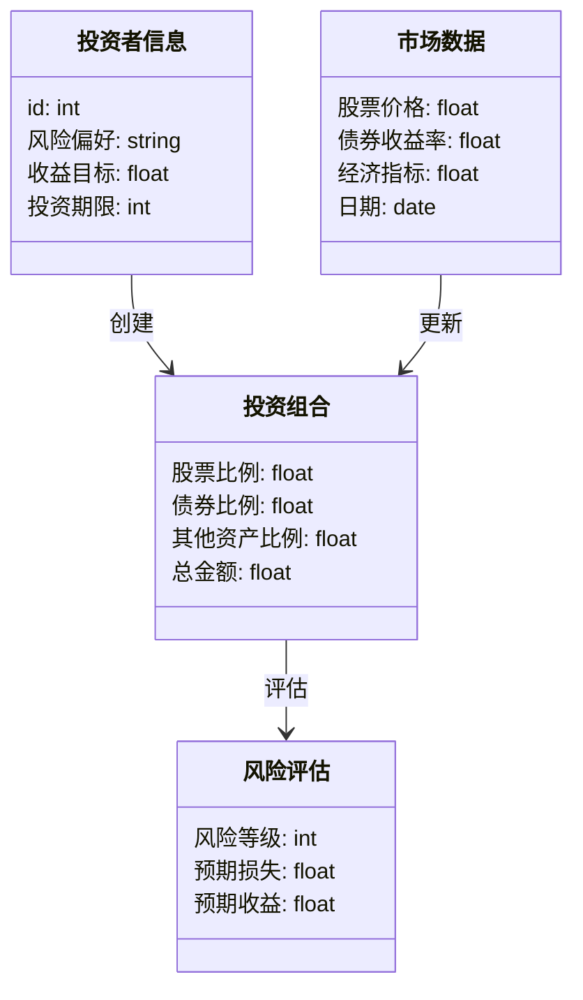
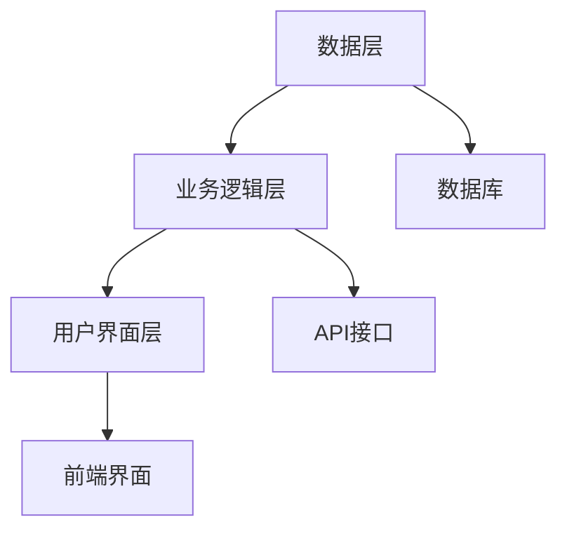
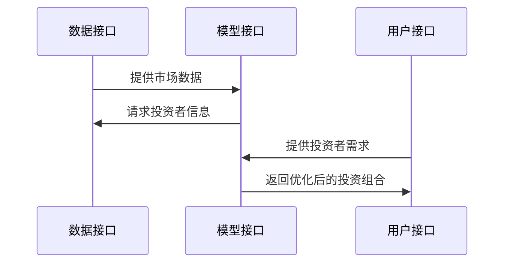

                 


# 投资建议生成与优化

## 关键词：投资建议、生成模型、优化模型、AI技术、数据驱动

## 摘要：本文详细探讨了投资建议生成与优化的核心概念、算法原理、系统架构设计以及项目实战。通过分析投资建议生成与优化的背景、核心概念与联系、数学模型和公式、系统分析与架构设计、项目实战、优化建议和注意事项，帮助读者全面理解投资建议生成与优化的技术和实践。

---

## 第一部分：投资建议生成与优化的背景与基础

### 第1章：投资建议生成与优化的背景

#### 1.1 投资的基本概念

##### 1.1.1 投资的基本定义

投资是将资源（如资金）投入到某种资产或项目中，以期在未来获得收益的行为。投资的本质是通过资源的合理配置，实现价值的最大化。投资的对象可以是股票、债券、房地产、基金等多种形式。

##### 1.1.2 投资的主要类型

1. **股票投资**：通过购买公司股权，成为股东，分享公司盈利的一种投资方式。
2. **债券投资**：通过购买政府或企业的债券，定期获得利息收益。
3. **房地产投资**：通过购买房地产资产，获得租金收入或资产增值。
4. **基金投资**：通过购买基金份额，间接投资于股票、债券等资产。
5. **其他投资**：包括黄金、艺术品、私募股权等多样化投资方式。

##### 1.1.3 投资的基本原则

1. **分散投资**：不要将所有资金投入单一资产，以降低风险。
2. **长期投资**：耐心持有优质资产，避免频繁交易。
3. **风险控制**：根据自身风险承受能力选择合适的投资标的。
4. **价值投资**：寻找具有长期竞争优势的企业进行投资。

#### 1.2 生成与优化投资建议的必要性

##### 1.2.1 传统投资建议的局限性

1. **信息过载**：市场数据庞大，投资者难以快速获取和处理。
2. **主观性**：传统投资建议可能受到分析师个人偏见的影响。
3. **滞后性**：传统分析可能无法及时捕捉市场变化。

##### 1.2.2 数据驱动投资的优势

1. **数据全面性**：利用大数据技术，获取多维度市场数据。
2. **分析精准性**：通过机器学习算法，提高投资建议的准确性。
3. **实时性**：数据驱动的投资可以实时跟踪市场动态，及时调整策略。

##### 1.2.3 AI技术在投资建议中的应用前景

1. **自动化分析**：AI可以快速处理海量数据，生成个性化的投资建议。
2. **预测准确性**：通过深度学习模型，提高市场趋势预测的准确性。
3. **风险管理**：AI可以帮助投资者识别潜在风险，优化投资组合。

#### 1.3 问题背景与目标

##### 1.3.1 投资者的需求分析

1. **个性化需求**：不同投资者的风险承受能力和收益目标不同，需要个性化的投资建议。
2. **实时性需求**：投资者需要及时了解市场动态，获取实时的投资建议。
3. **决策支持需求**：投资者需要借助专业工具和方法进行决策支持。

##### 1.3.2 投资建议生成的核心问题

1. **如何准确理解投资者的需求**：不同投资者的财务状况、风险偏好和收益目标不同，需要个性化的分析。
2. **如何处理海量数据**：金融市场数据庞大且复杂，如何高效处理并提取有用信息是关键。
3. **如何保证建议的准确性**：投资建议的准确性直接影响投资者的收益和风险，必须建立可靠的模型和方法。

##### 1.3.3 优化投资建议的目标

1. **提高建议的准确性**：通过优化模型，提高投资建议的科学性和可操作性。
2. **降低投资风险**：通过优化模型，识别潜在风险，制定有效的风险管理策略。
3. **提升用户体验**：优化投资建议的呈现方式，使其更易于理解和执行。

#### 1.4 问题解决的思路

##### 1.4.1 数据驱动的解决方案

1. **数据采集**：通过数据爬取、API接口等方式获取市场数据。
2. **数据清洗**：对获取的原始数据进行去噪、填补缺失值等预处理。
3. **特征提取**：提取对投资决策有影响的关键特征，如市场趋势、公司基本面等。
4. **模型训练**：基于提取的特征，训练生成和优化模型。
5. **结果输出**：根据模型输出的结果，生成投资建议，并进行优化。

##### 1.4.2 AI技术的应用策略

1. **使用机器学习算法**：如随机森林、支持向量机等，进行分类和回归分析。
2. **深度学习技术**：如神经网络、LSTM等，用于时间序列分析和预测。
3. **自然语言处理**：用于分析财务报告、新闻等文本数据，提取情感和关键词。

##### 1.4.3 多目标优化的实现路径

1. **定义目标函数**：如最大化收益、最小化风险等。
2. **建立约束条件**：如投资组合的总金额、资产分配比例等。
3. **选择优化算法**：如遗传算法、粒子群优化等，进行全局优化。

---

## 第2章：投资建议生成与优化的核心概念

### 2.1 生成与优化模型的基本结构

#### 2.1.1 输入数据的特征

1. **投资者信息**：包括风险偏好、收益目标、投资期限等。
2. **市场数据**：包括股票价格、债券收益率、经济指标等。
3. **历史数据**：包括过去的投资表现、市场波动等。

#### 2.1.2 模型的输出形式

1. **投资组合建议**：包括推荐的资产配置、具体的投资标的等。
2. **风险评估报告**：包括潜在风险、风险承受能力等。
3. **市场预测报告**：包括未来市场的走势、行业趋势等。

#### 2.1.3 模型的评估指标

1. **准确性**：模型预测的准确率，如准确率、召回率等。
2. **收益性**：投资建议的实际收益与预期收益的差距。
3. **风险性**：投资建议的风险程度与投资者的承受能力的匹配度。

### 2.2 生成与优化模型的联系

#### 2.2.1 生成模型的作用

1. **生成潜在投资组合**：基于投资者需求和市场数据，生成多个潜在的投资组合。
2. **提供多样化选择**：生成多种可能的资产配置方案，供投资者选择。
3. **动态调整**：根据市场变化，动态调整生成的组合，保持其适应性。

#### 2.2.2 优化模型的作用

1. **优化投资组合**：根据生成的潜在组合，优化其收益和风险。
2. **风险控制**：确保投资组合的风险在投资者可承受的范围内。
3. **目标导向**：优化投资组合以达到投资者的收益目标。

#### 2.2.3 生成与优化的协同关系

1. **生成为优化提供基础**：生成模型提供多种潜在组合，优化模型在这些组合中选择最优解。
2. **优化提升生成效果**：优化模型的反馈可以指导生成模型的改进，提高生成结果的质量。
3. **动态协同**：生成和优化模型可以动态交互，共同适应市场变化和投资者需求的变化。

### 2.3 核心概念的属性对比

#### 2.3.1 生成模型的特征

| 特性         | 描述                                         |
|--------------|----------------------------------------------|
| 输入数据     | 包括投资者需求和市场数据                     |
| 输出形式     | 多种潜在的投资组合                           |
| 目标函数     | 生成多样化的组合，满足投资者的需求           |
| 算法类型     | 如聚类算法、生成对抗网络等                   |

#### 2.3.2 优化模型的特征

| 特性         | 描述                                         |
|--------------|----------------------------------------------|
| 输入数据     | 生成模型提供的潜在组合                     |
| 输出形式     | 优化后的投资组合                           |
| 目标函数     | 最小化风险，最大化收益                       |
| 算法类型     | 如遗传算法、粒子群优化等                   |

#### 2.3.3 生成与优化模型的对比分析

| 对比维度     | 生成模型                       | 优化模型                       |
|--------------|--------------------------------|--------------------------------|
| 目标         | 生成多样化的组合               | 找到最优解                     |
| 输入数据     | 投资者需求和市场数据             | 生成模型提供的潜在组合         |
| 输出形式     | 多种潜在组合                   | 优化后的单一最优组合           |
| 算法类型     | 如聚类、生成对抗网络             | 如遗传算法、粒子群优化         |

### 2.4 生成与优化模型的数学表达

#### 2.4.1 生成模型的数学基础

生成模型的目标是通过一定的算法生成多样化的投资组合。常见的生成模型包括聚类模型和生成对抗网络（GAN）。

##### 聚类模型的数学表达

聚类模型将市场数据进行聚类，生成不同的投资组合类别。常用的距离度量方法包括欧几里得距离和曼哈顿距离。

$$ d(x, y) = \sqrt{\sum_{i=1}^{n}(x_i - y_i)^2} \quad \text{（欧几里得距离）} $$

$$ d(x, y) = \sum_{i=1}^{n}|x_i - y_i| \quad \text{（曼哈顿距离）} $$

##### GAN模型的数学表达

生成对抗网络由生成器和判别器两部分组成，通过对抗训练生成逼真的数据。

$$ G(z) = \text{生成器网络，输入噪声 } z \text{，输出生成的数据} $$

$$ D(x) = \text{判别器网络，输入真实数据 } x \text{ 或生成数据 } G(z)，输出概率判别结果 $$

##### 损失函数

生成器的损失函数为：

$$ \mathcal{L}_G = -\mathbb{E}[\log(D(G(z)))] $$

判别器的损失函数为：

$$ \mathcal{L}_D = -\mathbb{E}[\log(D(x)) + \log(1 - D(G(z)))] $$

#### 2.4.2 优化模型的数学基础

优化模型的目标是根据生成的潜在组合，找到最优的投资组合。常见的优化方法包括线性规划和非线性规划。

##### 线性规划模型

目标函数为最大化收益，约束条件为风险可控和投资比例限制。

$$ \max \sum_{i=1}^{n} w_i r_i $$

$$ \text{subject to } \sum_{i=1}^{n} w_i = 1 $$

$$ \text{and } \sum_{i=1}^{n} w_i^2 \leq \sigma^2 $$

##### 非线性规划模型

目标函数为最大化夏普比率（夏普比率 = 收益 - 无风险利率 / 标准差）。

$$ \max \frac{\sum_{i=1}^{n} w_i (r_i - r_f)}{\sqrt{\sum_{i=1}^{n} w_i^2 \sigma_i^2}} $$

$$ \text{subject to } \sum_{i=1}^{n} w_i = 1 $$

#### 2.4.3 生成与优化模型的联合优化

联合优化模型的目标是在生成多种潜在组合的基础上，找到最优的投资组合。其数学表达为：

$$ \max \sum_{i=1}^{n} w_i r_i - \lambda \sum_{i=1}^{n} w_i^2 \sigma_i^2 $$

$$ \text{subject to } \sum_{i=1}^{n} w_i = 1 $$

其中，$\lambda$ 是风险惩罚系数，用于平衡收益和风险。

---

## 第3章：投资建议生成与优化的数学模型

### 3.1 生成模型的数学基础

#### 3.1.1 生成模型的输入输出形式

生成模型的输入包括投资者的需求和市场数据，输出为多样化的投资组合。例如，生成模型可以生成多个股票组合，每个组合包含不同比例的股票和债券。

#### 3.1.2 生成模型的损失函数

生成模型的损失函数通常为生成器和判别器的损失函数之和。

$$ \mathcal{L} = \mathcal{L}_G + \mathcal{L}_D $$

其中，$\mathcal{L}_G$ 和 $\mathcal{L}_D$ 分别为生成器和判别器的损失函数。

#### 3.1.3 生成模型的优化目标

生成模型的优化目标是生成多样化的投资组合，覆盖不同的风险和收益水平。

### 3.2 优化模型的数学基础

#### 3.2.1 优化模型的输入输出形式

优化模型的输入是生成模型提供的潜在组合，输出为最优的投资组合。例如，优化模型可以将生成的多个股票组合优化为一个最优的资产配置方案。

#### 3.2.2 优化模型的损失函数

优化模型的损失函数通常为收益与风险的函数。例如，夏普比率可以表示为：

$$ \text{夏普比率} = \frac{\text{收益} - \text{无风险利率}}{\text{标准差}} $$

#### 3.2.3 优化模型的优化目标

优化模型的优化目标是最大化收益，同时控制风险。

---

## 第4章：投资建议生成与优化的系统架构设计

### 4.1 问题场景介绍

投资建议生成与优化系统需要处理大量数据，包括市场数据和投资者数据，并根据这些数据生成和优化投资组合。系统需要具备高效的数据处理能力、强大的算法计算能力和良好的用户交互界面。

### 4.2 项目介绍

本项目旨在开发一个智能化的投资建议生成与优化系统，通过数据驱动和AI技术，为投资者提供个性化的投资建议，并优化其投资组合，以实现收益最大化和风险最小化。

### 4.3 系统功能设计

#### 4.3.1 领域模型设计

领域模型包括投资者信息、市场数据、投资组合、风险评估等多个模块。以下是领域模型的Mermaid类图：



#### 4.3.2 系统架构设计

系统架构采用分层设计，包括数据层、业务逻辑层和用户界面层。以下是系统架构的Mermaid架构图：



#### 4.3.3 系统接口设计

系统主要接口包括数据接口、模型接口和用户接口。以下是系统接口的Mermaid序列图：



---

## 第5章：投资建议生成与优化的项目实战

### 5.1 环境安装

#### 5.1.1 安装Python

安装Python 3.8或更高版本，可以从官网下载安装包。

#### 5.1.2 安装必要的库

安装以下Python库：

```bash
pip install numpy pandas scikit-learn tensorflow
```

### 5.2 核心代码实现

#### 5.2.1 数据预处理

##### 5.2.1.1 数据清洗

读取股票数据并清洗：

```python
import pandas as pd

# 读取数据
df = pd.read_csv('stock_data.csv')

# 删除缺失值
df.dropna(inplace=True)

# 去除异常值
z_scores = (df - df.mean()).abs() / df.std()
df = df[(z_scores < 3).all(axis=1)]
```

##### 5.2.1.2 特征提取

提取股票的收盘价和成交量：

```python
# 提取收盘价
close_prices = df['收盘价']

# 提取成交量
volumes = df['成交量']
```

#### 5.2.2 模型训练

##### 5.2.2.1 生成模型训练

使用聚类算法生成潜在组合：

```python
from sklearn.cluster import KMeans

# 初始化KMeans模型
kmeans = KMeans(n_clusters=5, random_state=0)

# 训练模型
kmeans.fit(df[['收盘价', '成交量']])

# 获取聚类结果
clusters = kmeans.predict(df[['收盘价', '成交量']])
```

##### 5.2.2.2 优化模型训练

使用随机森林进行优化：

```python
from sklearn.ensemble import RandomForestRegressor

# 初始化随机森林模型
rf = RandomForestRegressor(n_estimators=100, random_state=0)

# 训练模型
rf.fit(df[['收盘价', '成交量']], df['收益率'])
```

#### 5.2.3 优化模型调用

##### 5.2.3.1 生成潜在组合

根据聚类结果生成潜在组合：

```python
# 为每个聚类生成一个潜在组合
potential_combinations = []
for cluster in range(5):
    combination = {
        'cluster_id': cluster,
        'stocks': df[clusters == cluster]['股票代码'].tolist()
    }
    potential_combinations.append(combination)
```

##### 5.2.3.2 优化组合

使用随机森林对潜在组合进行优化：

```python
# 对每个潜在组合进行优化
optimized_combinations = []
for comb in potential_combinations:
    # 预测每个组合的收益率
    predicted_returns = rf.predict(pd.DataFrame([comb['stocks']]))
    # 优化组合
    optimized_combinations.append({
        'cluster_id': comb['cluster_id'],
        'stocks': comb['stocks'],
        'predicted_return': predicted_returns[0]
    })
```

#### 5.2.4 优化结果分析

分析优化后的组合，选择收益率最高的组合作为最终投资建议：

```python
# 找到收益率最高的组合
max_return = max([comb['predicted_return'] for comb in optimized_combinations])
best_comb = [comb for comb in optimized_combinations if comb['predicted_return'] == max_return]

print(f"最佳投资组合：{best_comb[0]['stocks']}")
```

### 5.3 项目小结

通过本项目，我们成功地利用聚类算法和随机森林模型，生成并优化了投资组合，最终为投资者提供了个性化的投资建议。

---

## 第6章：投资建议生成与优化的优化建议和注意事项

### 6.1 最佳实践 tips

1. **数据清洗**：确保数据的完整性和准确性，避免噪声数据对模型的影响。
2. **模型选择**：根据具体问题选择合适的算法，如聚类和优化算法的结合使用。
3. **风险控制**：在优化过程中，始终关注风险控制，确保投资组合的稳健性。

### 6.2 小结

通过本文的详细讲解，我们系统地介绍了投资建议生成与优化的核心概念、算法原理、系统架构设计以及项目实战。希望读者能够通过本文，掌握投资建议生成与优化的技术和实践方法。

### 6.3 注意事项

1. **模型的泛化能力**：在生成和优化模型时，要注意模型的泛化能力，避免过拟合。
2. **数据的实时性**：投资建议需要根据最新的市场数据进行调整，确保建议的时效性。
3. **用户体验**：在实现过程中，要注重用户体验，使投资者能够方便地理解和使用投资建议。

### 6.4 拓展阅读

1. 《机器学习实战》——Python实现的机器学习算法详解。
2. 《深度学习》——深度学习的基本原理和应用。
3. 《投资学原理》——投资学的基本理论和方法。

---

## 作者：AI天才研究院/AI Genius Institute & 禅与计算机程序设计艺术/Zen And The Art of Computer Programming

---

以上是《投资建议生成与优化》的技术博客文章的详细内容，希望对您有所帮助！

