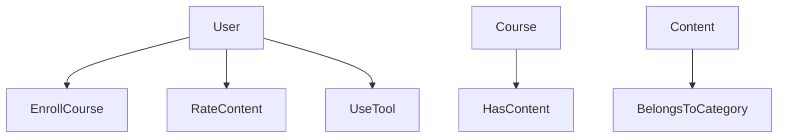
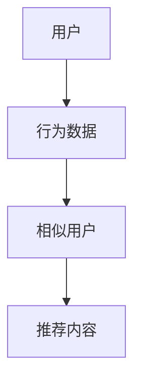
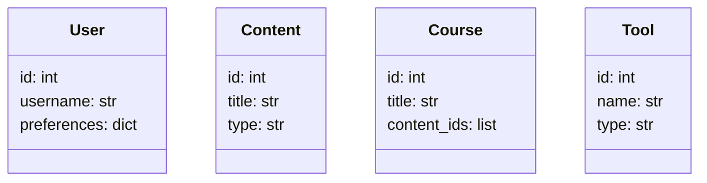
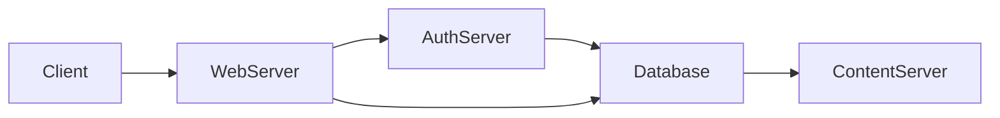

                 


# 投资理财教育平台的集成

**关键词**：投资理财教育平台、系统集成、协同过滤推荐算法、用户画像、个性化学习、系统架构设计

**摘要**：本文探讨了投资理财教育平台的集成，涵盖背景分析、核心概念、算法原理、系统架构及项目实战。通过协同过滤推荐算法和系统设计，展示了如何构建一个高效、个性化的投资理财教育平台，助力用户掌握投资知识，优化决策过程。

---

# 1. 背景介绍

## 1.1 问题背景

### 1.1.1 投资理财教育的重要性
投资理财是个人财务管理和财富增长的关键，然而，许多人缺乏系统的投资知识和技能，导致投资决策失误。

### 1.1.2 当前问题
- 理财知识碎片化，缺乏系统性学习。
- 投资者教育资源分散，难以整合。

## 1.2 问题解决

### 1.2.1 平台目标
整合优质教育资源，提供个性化学习路径，降低投资门槛。

### 1.2.2 解决方案
- **整合资源**：汇聚课程、工具、社区等多维资源。
- **个性化推荐**：基于用户行为推荐学习内容。

## 1.3 边界与外延

### 1.3.1 平台功能边界
- 学习内容：课程、文章、视频。
- 工具：模拟器、计算器、分析工具。
- 社区：互动讨论、经验分享。

### 1.3.2 外部系统连接
- 第三方支付、认证系统。

## 1.4 核心要素

### 1.4.1 用户
- 注册、登录、个人信息管理。

### 1.4.2 内容
- 文章、视频、课程，分类管理。

### 1.4.3 工具
- 投资模拟器、财务计算器。

### 1.4.4 服务
- 个性化推荐、互动社区。

---

# 2. 核心概念与联系

## 2.1 核心概念

### 2.1.1 用户画像
- 利用数据分析构建用户特征，包括投资目标、风险偏好、知识水平。

### 2.1.2 内容推荐
- 基于协同过滤算法，推荐个性化学习内容。

## 2.2 实体关系图

### 2.2.1 ER图


---

# 3. 算法原理讲解

## 3.1 协同过滤推荐算法

### 3.1.1 算法流程图


### 3.1.2 Python实现
```python
def collaborative_filtering(user_id, user_similarity_matrix):
    similar_users = user_similarity_matrix[user_id].argsort()[::-1]
    recommended_contents = set()
    for user in similar_users:
        recommended_contents.update(contents[user])
    return recommended_contents
```

### 3.1.3 数学模型
$$\text{相似度} = \frac{\sum_{i=1}^{n}(x_i - \mu)(y_i - \mu)}{\sqrt{\sum_{i=1}^{n}(x_i - \mu)^2} \sqrt{\sum_{i=1}^{n}(y_i - \mu)^2}}$$

---

# 4. 系统分析与架构设计

## 4.1 系统功能设计

### 4.1.1 领域模型


## 4.2 系统架构设计

### 4.2.1 总体架构图


## 4.3 接口设计

### 4.3.1 REST接口
- GET /users/{id}/recommendations

---

# 5. 项目实战

## 5.1 环境安装

### 5.1.1 安装Python
```bash
python --version
pip install requests
pip install numpy
```

## 5.2 核心代码实现

### 5.2.1 协同过滤实现
```python
def collaborative_filtering(user_id, user_similarity_matrix, contents):
    similar_users = user_similarity_matrix[user_id]
    recommended_contents = set()
    for user in similar_users:
        if user != user_id:
            recommended_contents.update(contents[user])
    return recommended_contents
```

---

# 6. 最佳实践

## 6.1 数据安全
- 用户数据加密存储，防止泄露。

## 6.2 用户体验
- 简化操作流程，优化界面设计。

## 6.3 技术选型
- 使用高效框架，如Django或Flask。

---

# 7. 小结

本文详细探讨了投资理财教育平台的集成，从背景分析到系统设计，再到项目实战，为构建高效平台提供了理论与实践指导。

---

# 作者：AI天才研究院/AI Genius Institute & 禅与计算机程序设计艺术 /Zen And The Art of Computer Programming

