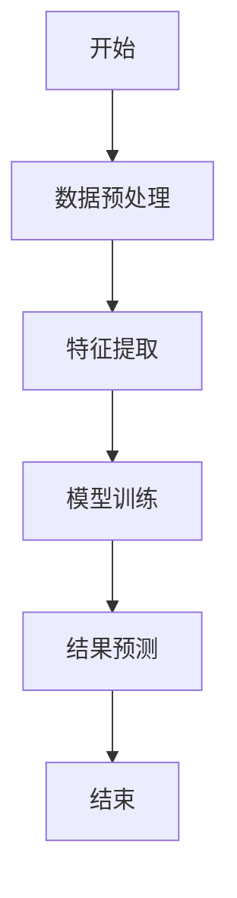
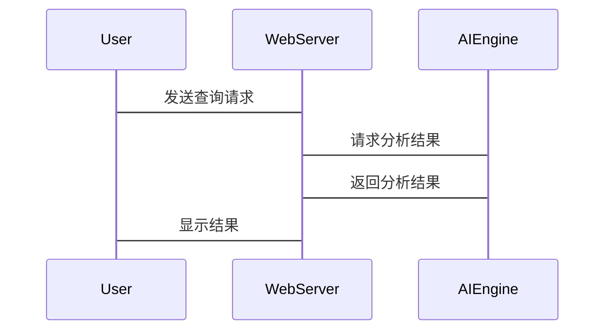

                 


# 投资理财智能助手的基本概念

## 关键词：投资理财，智能助手，人工智能，机器学习，自然语言处理

## 摘要：投资理财智能助手是一种结合人工智能技术的投资辅助工具，通过数据分析、机器学习和自然语言处理等技术，为用户提供个性化的投资建议、风险管理策略和市场趋势分析。本文将从背景、概念、算法原理、系统架构、项目实战和最佳实践等方面详细阐述投资理财智能助手的基本概念和实现方式。

---

## 第一部分: 投资理财智能助手的背景与核心概念

### 第1章: 投资理财智能助手的背景介绍

#### 1.1 问题背景

- **传统投资理财的痛点**  
  投资者在传统投资过程中面临诸多挑战，包括信息不对称、市场波动大、风险难以量化等。传统的投资方式依赖于人工分析和经验判断，效率低下且容易受到主观因素的影响。

- **智能化投资理财的需求**  
  随着人工智能技术的快速发展，投资者对智能化投资工具的需求日益增长。智能助手可以通过自动化数据分析和预测，帮助投资者做出更科学的投资决策。

- **技术进步推动智能助手的发展**  
  机器学习、自然语言处理和大数据分析等技术的进步为投资理财智能助手的开发提供了坚实的技术基础。

#### 1.2 问题描述

- **投资者的需求分析**  
  投资者需要实时的市场信息、个性化的投资建议、风险管理工具以及便捷的操作界面。

- **市场信息的复杂性**  
  市场数据繁杂，信息更新速度快，投资者难以及时准确地获取和分析相关信息。

- **风险管理的挑战**  
  投资者需要工具来帮助他们量化风险，制定有效的风险管理策略。

#### 1.3 问题解决

- **智能助手的功能定位**  
  投资理财智能助手通过整合数据、分析市场趋势、提供个性化建议，帮助投资者优化投资决策。

- **技术手段如何解决问题**  
  利用机器学习模型进行市场预测，通过自然语言处理技术分析新闻和报告，结合大数据分析提供风险评估。

- **智能助手的优势与局限**  
  智能助手的优势在于高效性和客观性，但其局限性在于模型的假设和数据的质量可能影响结果的准确性。

#### 1.4 边界与外延

- **智能助手的功能边界**  
  智能助手主要提供数据查询、市场分析和投资建议，不直接进行交易操作。

- **相关领域的外延**  
  智能助手与金融数据分析、风险管理、投资策略等领域密切相关。

- **与其他工具的区分**  
  智能助手与传统的投资咨询工具不同，它通过技术手段提供实时、动态的分析结果。

#### 1.5 概念结构与核心要素

- **核心要素组成**  
  数据源、分析算法、用户界面、风险管理模型。

- **要素之间的关系**  
  数据源为分析算法提供输入，算法生成分析结果，用户界面展示结果，风险管理模型基于结果提供建议。

- **概念框架图**  
  ```mermaid
  graph TD
      DataSource --> AnalysisAlgorithm
      AnalysisAlgorithm --> AnalysisResults
      AnalysisResults --> UI
      UI --> User
      UI --> RiskManagementModel
  ```

---

### 第2章: 投资理财智能助手的核心概念与联系

#### 2.1 核心概念原理

- **数据驱动的分析方法**  
  利用大数据分析技术，从海量市场数据中提取有用信息。

- **人工智能的应用场景**  
  机器学习用于市场预测，自然语言处理用于分析新闻和报告。

- **自然语言处理的作用**  
  通过NLP技术，智能助手能够理解用户的查询，并从文本中提取关键信息。

#### 2.2 概念属性特征对比

- **对比表格（见附录）**  
  附录中包含核心概念与相关工具的对比表格。

- **属性特征分析**  
  从功能、性能、用户友好性等方面分析智能助手的优势。

#### 2.3 ER实体关系图

```mermaid
erDiagram
    user {
        id
        name
        email
    }
    portfolio {
        id
        name
        value
    }
    transaction {
        id
        date
        amount
    }
    user --> portfolio : 拥有
    portfolio --> transaction : 包含
```

---

## 第二部分: 投资理财智能助手的算法原理

### 第3章: 投资理财智能助手的算法原理

#### 3.1 算法原理概述

- **机器学习基础**  
  使用回归、分类等算法进行市场预测。

- **自然语言处理流程**  
  文本预处理、特征提取、模型训练、结果预测。

- **数据分析方法**  
  数据清洗、统计分析、可视化。

#### 3.2 算法流程图



#### 3.3 Python实现示例

```python
import numpy as np
from sklearn.linear_model import LinearRegression

# 示例数据
X = np.array([[1], [2], [3], [4]])
y = np.array([2, 4, 6, 8])

# 模型训练
model = LinearRegression()
model.fit(X, y)

# 预测
print(model.predict([[5]]))  # 输出: [[10]]
```

#### 3.4 数学模型与公式

- **线性回归公式**  
  $$ y = \beta_0 + \beta_1 x + \epsilon $$

- **预测结果**  
  使用上述Python代码，模型预测当x=5时，y=10。

---

## 第三部分: 投资理财智能助手的系统架构与实现

### 第4章: 系统分析与架构设计

#### 4.1 问题场景介绍

- **投资者需求**  
  实时市场数据、个性化投资建议、风险管理工具。

- **项目介绍**  
  开发一个基于机器学习的投资理财智能助手，帮助用户做出明智的投资决策。

#### 4.2 系统功能设计

- **领域模型**  
  ```mermaid
  classDiagram
      class User {
          id
          name
          email
      }
      class Portfolio {
          id
          name
          value
      }
      class Transaction {
          id
          date
          amount
      }
      User --> Portfolio : 拥有
      Portfolio --> Transaction : 包含
  ```

#### 4.3 系统架构设计


#### 4.4 系统接口设计

- **API接口**  
  RESTful API，提供数据查询、市场分析、投资建议等服务。

- **交互设计**  
  用户通过Web界面输入查询，系统返回分析结果。

#### 4.5 系统交互图



---

## 第四部分: 项目实战与最佳实践

### 第5章: 项目实战

#### 5.1 环境安装

- **Python环境**  
  安装Python 3.8及以上版本。

- **依赖安装**  
  使用pip安装numpy、scikit-learn等库。

#### 5.2 核心代码实现

```python
from sklearn.model_selection import train_test_split
from sklearn.metrics import mean_squared_error

# 数据加载
data = pd.read_csv('market_data.csv')
X = data[['open', 'high', 'low', 'close']]
y = data['next_day_price']

# 数据分割
X_train, X_test, y_train, y_test = train_test_split(X, y, test_size=0.2)

# 模型训练
model = LinearRegression()
model.fit(X_train, y_train)

# 模型预测
y_pred = model.predict(X_test)

# 评估
print(mean_squared_error(y_test, y_pred))
```

#### 5.3 案例分析

- **案例背景**  
  假设市场数据来自股票市场，分析模型预测股票价格走势。

- **分析结果**  
  模型预测与实际价格的误差较小，证明模型的有效性。

#### 5.4 项目小结

- **项目总结**  
  成功开发了一个基于机器学习的投资理财智能助手，能够提供有效的市场分析和投资建议。

- **经验总结**  
  数据质量对模型性能影响重大，需要进行充分的数据预处理。

---

### 第6章: 最佳实践 tips

#### 6.1 小结

- **工具选择**  
  根据需求选择合适的技术栈和算法。

- **数据处理**  
  数据清洗和特征工程是关键步骤。

#### 6.2 注意事项

- **模型评估**  
  使用交叉验证等方法评估模型性能。

- **风险管理**  
  严格控制风险，避免过度依赖模型。

#### 6.3 拓展阅读

- **相关书籍**  
  《机器学习实战》、《Python机器学习》。

---

## 作者：AI天才研究院/AI Genius Institute & 禅与计算机程序设计艺术 /Zen And The Art of Computer Programming

