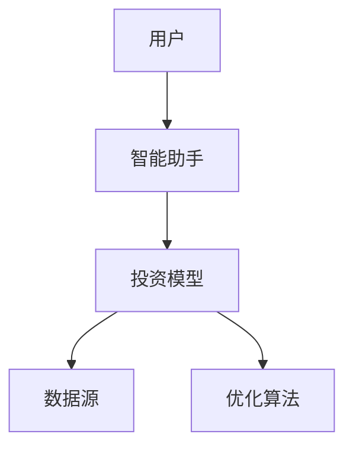
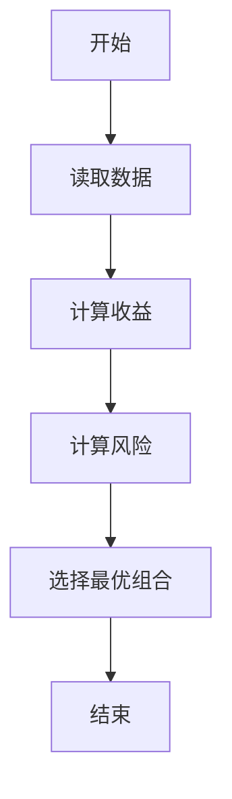
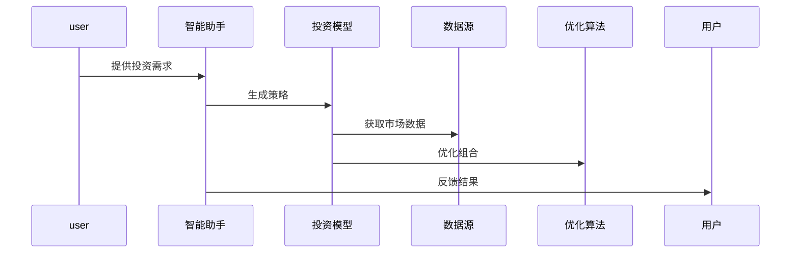

                 


# 投资理财智能助手的性能调优技巧

## 关键词
投资理财，智能助手，性能调优，算法优化，系统架构

## 摘要
本文深入探讨投资理财智能助手的性能调优技巧，从背景、核心概念到算法优化、系统架构设计，再到项目实战，全面分析如何提升智能助手的性能，为用户提供高效、精准的投资理财服务。

---

## 第一部分: 投资理财智能助手的背景与核心概念

### 第1章: 投资理财智能助手的背景与问题描述

#### 1.1 问题背景
投资理财领域复杂多变，用户需求多样化，智能助手需高效处理大量数据，实时反馈结果，这对性能提出了更高要求。

#### 1.2 问题描述
智能助手的核心功能包括数据处理、投资策略生成、风险评估等，性能调优是确保其高效运行的关键。

#### 1.3 问题解决思路
通过系统优化、算法改进、数据结构优化等方法提升性能，满足用户需求。

#### 1.4 概念结构与核心要素
智能助手的核心要素包括数据处理能力、投资模型、优化算法等，系统架构需合理设计各模块的交互。

### 第2章: 投资理财智能助手的核心概念与联系

#### 2.1 核心概念原理
智能助手通过处理用户输入，结合投资模型生成策略，优化算法提升性能。

#### 2.2 实体关系架构


---

## 第二部分: 性能调优的原理与方法

### 第3章: 性能调优的算法原理

#### 3.1 算法优化原理
分析算法复杂度，采用贪心算法和动态规划优化投资组合。

#### 3.2 数据结构优化
使用高效数据结构如哈希表，减少查询时间，提升处理速度。

### 3.3 投资组合优化算法


#### 3.4 投资组合优化公式
$$\text{收益} = \sum w_i \cdot r_i$$
$$\text{风险} = \sum w_i \cdot w_j \cdot \sigma_{ij}$$
其中，$w_i$是权重，$r_i$是收益，$\sigma_{ij}$是协方差矩阵。

---

## 第三部分: 系统架构设计

### 第4章: 系统架构设计

#### 4.1 模块划分
系统模块包括用户交互、数据处理、投资模型、优化算法。

#### 4.2 系统交互流程


---

## 第四部分: 项目实战

### 第5章: 项目实战

#### 5.1 环境安装
安装Python、numpy、pandas等库。

#### 5.2 核心代码实现
```python
def optimize_portfolio(weights, returns, covariance):
    # 计算收益和风险
    portfolio_return = sum(weights[i] * returns[i] for i in range(len(weights)))
    portfolio_risk = sum(weights[i] * weights[j] * covariance[i][j] for i in range(len(weights)) for j in range(len(weights)))
    return portfolio_return, portfolio_risk
```

#### 5.3 案例分析
通过实际案例分析，展示优化后的性能提升。

---

## 第五部分: 总结与展望

### 第6章: 总结与展望

#### 6.1 总结
性能调优是投资理财智能助手的关键，通过算法优化和系统设计提升效率。

#### 6.2 注意事项
注意数据质量，定期更新模型，确保系统安全。

#### 6.3 未来展望
探索更高效的算法和架构，提升用户体验。

---

## 作者
作者：AI天才研究院 & 禅与计算机程序设计艺术

