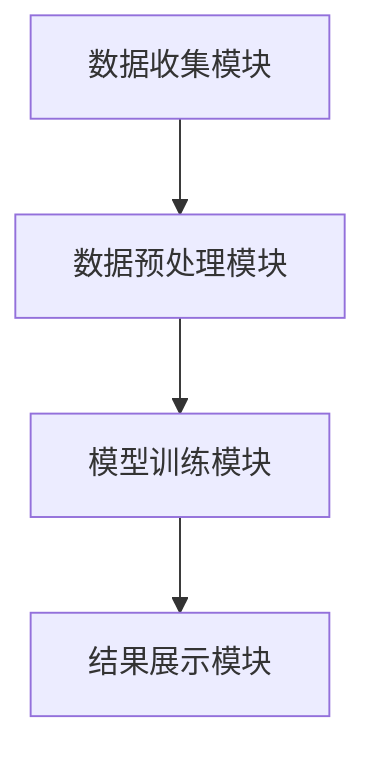

                 


# 投资理财智能助手的数据收集与预处理技巧

## 关键词：数据收集，数据预处理，投资理财，金融数据分析，智能助手

## 摘要：本文深入探讨投资理财智能助手在数据收集与预处理过程中的关键技巧。从数据源的选择到数据清洗、格式转换、缺失值处理、异常值处理、数据标准化等预处理步骤，结合实际案例，详细分析如何高效、准确地处理金融数据，为投资决策提供可靠支持。文章还介绍了系统架构设计与项目实战，帮助读者掌握从数据收集到策略构建的全过程。

---

# 第一部分：投资理财智能助手的背景与数据收集基础

## 第1章：投资理财智能助手的背景介绍

### 1.1 数据在投资理财中的作用

#### 1.1.1 数据在投资决策中的重要性
在现代投资理财中，数据是决策的核心依据。通过分析历史价格、市场趋势、经济指标等数据，投资者可以识别潜在机会和风险，优化投资组合。

#### 1.1.2 数据驱动的投资理财新趋势
传统投资依赖经验判断，而数据驱动的方法通过算法和模型提供量化支持，显著提高了决策的科学性和效率。大数据技术的应用使得实时监控和预测成为可能。

#### 1.1.3 数据收集与预处理的必要性
高质量的数据是模型准确性的基础。数据收集阶段需要确保数据的完整性和准确性，预处理则进一步优化数据，使其适合模型输入。

### 1.2 数据收集的挑战与意义

#### 1.2.1 数据收集的常见挑战
- 数据来源复杂，包括股票、基金、新闻等，格式和频率各不相同。
- 数据可能存在缺失或错误，需进行清洗。
- 高频数据处理对计算能力要求高。

#### 1.2.2 数据预处理的重要性
预处理是确保数据质量的关键步骤，包括清洗、格式转换、标准化等，直接影响模型性能。

#### 1.2.3 数据质量对投资结果的影响
低质量数据可能导致错误的分析结果，进而影响投资决策。高质量数据能提高模型准确性和投资回报率。

## 第2章：数据收集的核心概念与方法

### 2.1 数据收集的定义与分类

#### 2.1.1 数据收集的定义
通过系统化方法获取各种数据，用于分析和建模。

#### 2.1.2 数据的类型与分类
- 结构化数据：表格形式，如股票价格。
- 非结构化数据：文本、图像等。
- 时间序列数据：按时间顺序记录的数据。

#### 2.1.3 数据收集的常见方法
- API接口：从金融平台获取实时数据。
- 网络爬取：从新闻网站获取文本数据。
- 数据库查询：从本地数据库提取数据。

### 2.2 投资理财相关数据源

#### 2.2.1 金融市场的数据源
- 股票、基金、债券等价格数据。
- 涵盖多个金融市场的API接口，如Yahoo Finance API。

#### 2.2.2 社交媒体与用户行为数据
- Twitter、Reddit等平台的用户评论和情绪分析数据。
- 用户搜索行为和交易记录。

#### 2.2.3 经济指标与新闻数据
- GDP、失业率等宏观经济指标。
- 新闻标题和文章内容，用于情绪分析。

### 2.3 数据预处理的基础知识

#### 2.3.1 数据清洗
- 处理缺失值：删除或插值。
- 去重：去除重复数据。
- 去噪：去除异常值和噪声。

#### 2.3.2 数据格式转换
- 将不同格式的数据统一为适合分析的形式，如时间序列标准化。

#### 2.3.3 数据标准化
- 标准化：使数据具有相同的尺度，常用于机器学习模型。

---

# 第二部分：数据预处理的技巧与实践

## 第3章：数据清洗与格式转换

### 3.1 数据清洗的常见方法

#### 3.1.1 处理缺失值
- 删除含有缺失值的样本。
- 使用均值、中位数或插值法填补缺失值。

#### 3.1.2 去除重复数据
- 识别和删除重复的记录，确保数据唯一性。

#### 3.1.3 去除异常值
- 使用统计方法（如Z-score）或机器学习方法检测并剔除异常值。

### 3.2 数据格式转换

#### 3.2.1 时间序列数据的处理
- 将不同时间频率的数据统一转换为相同频率，如将日数据转换为周数据。

#### 3.2.2 文本数据的处理
- 分词、去除停用词，提取关键词或使用TF-IDF进行降维。

## 第4章：数据标准化与特征工程

### 4.1 数据标准化

#### 4.1.1 最小-最大归一化
公式：$X_{\text{norm}} = \frac{X - X_{\text{min}}}{X_{\text{max}} - X_{\text{min}}}$

#### 4.1.2 Z-score标准化
公式：$X_{\text{norm}} = \frac{X - \mu}{\sigma}$

### 4.2 特征工程

#### 4.2.1 特征选择
- 使用相关性分析或Lasso回归选择重要特征。

#### 4.2.2 特征变换
- 将高维数据降维，如主成分分析（PCA）。

---

# 第三部分：系统架构与项目实战

## 第5章：系统架构设计

### 5.1 问题场景介绍
构建一个实时监测和预测的投资理财助手，帮助用户优化投资组合。

### 5.2 系统功能设计

#### 5.2.1 数据收集模块
- 实时采集股票价格、社交媒体数据等。

#### 5.2.2 数据预处理模块
- 清洗、转换、标准化数据。

#### 5.2.3 模型训练模块
- 使用机器学习算法训练预测模型。

#### 5.2.4 结果展示模块
- 可视化分析结果，提供投资建议。

### 5.3 系统架构图



## 第6章：项目实战

### 6.1 环境安装

```bash
pip install pandas numpy scikit-learn requests beautifulsoup4
```

### 6.2 核心代码实现

#### 6.2.1 数据收集

```python
import requests
from bs4 import BeautifulSoup

def get_stock_price(ticker):
    url = f"https://finance.yahoo.com/quote/{ticker}"
    response = requests.get(url)
    soup = BeautifulSoup(response.text, 'html.parser')
    price = soup.find('div', {'class': 'price'}).text
    return float(price)
```

#### 6.2.2 数据预处理

```python
import pandas as pd
import numpy as np

data = pd.DataFrame({
    'date': ['2023-01-01', '2023-01-02', '2023-01-03'],
    'price': [100, 105, np.nan]
})

# 处理缺失值
data['price'].fillna(data['price'].mean(), inplace=True)
```

### 6.3 案例分析与结果解读
通过实际数据展示预处理后的效果，分析对投资策略的影响。

---

# 第四部分：总结与展望

## 第7章：最佳实践与注意事项

### 7.1 最佳实践
- 定期更新数据源，确保数据新鲜。
- 使用交叉验证评估模型性能。
- 结合多种数据源提高分析准确性。

### 7.2 注意事项
- 注意数据隐私和合规性。
- 预处理过程中避免信息泄露。
- 定期监控模型性能，及时调优。

## 第8章：未来展望

### 8.1 数据收集与预处理的未来趋势
- 更加智能化的预处理工具。
- 结合AI技术的自动化数据处理。

### 8.2 对投资理财的深远影响
- 数据驱动的投资将更加普及。
- 更加个性化的投资建议。

---

# 结语

投资理财智能助手的成功离不开高效的数据收集与预处理。通过本文的详细讲解，读者可以掌握关键技巧，构建强大的数据处理系统，为投资决策提供可靠支持。

---

# 作者

作者：AI天才研究院/AI Genius Institute & 禅与计算机程序设计艺术 /Zen And The Art of Computer Programming

---

以上是《投资理财智能助手的数据收集与预处理技巧》的完整大纲和内容概览，涵盖了从背景介绍到系统实现的全过程。

