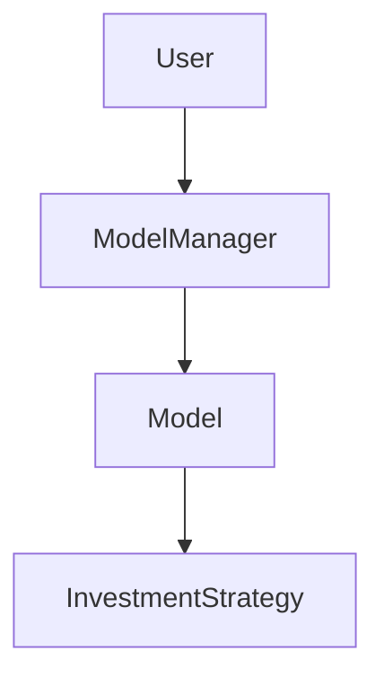
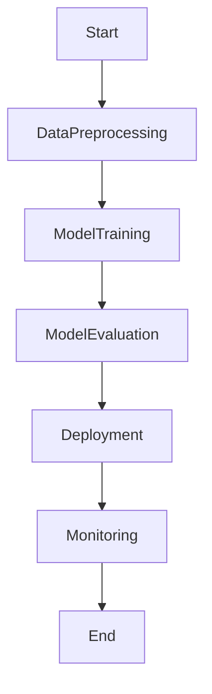
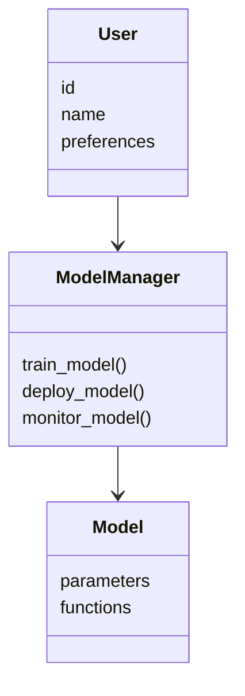

                 


# 投资理财智能助手的机器学习模型管理方法

## 关键词：投资理财，机器学习，模型管理，智能助手，算法，系统架构

## 摘要：本文系统地探讨了投资理财智能助手的机器学习模型管理方法，涵盖了模型的背景需求、核心概念、算法原理、系统架构、项目实战以及最佳实践等多方面内容。通过详细的技术分析和实际案例，本文为读者提供了从理论到实践的全面指导。

---

# 第1章：投资理财智能助手的背景与需求

## 1.1 问题背景

### 1.1.1 投资理财领域的现状与挑战
随着金融市场的复杂化，投资者面临的风险和不确定性增加，传统的投资理财工具难以满足个性化和动态化的投资需求。

### 1.1.2 传统投资理财工具的局限性
传统工具如基金、股票等，依赖人工分析，耗时且易受主观因素影响，难以快速适应市场变化。

### 1.1.3 机器学习在投资理财中的潜力
机器学习能够通过数据分析预测市场趋势，优化投资组合，提供个性化建议，提高投资效率和准确性。

## 1.2 问题描述

### 1.2.1 投资理财智能助手的目标
帮助用户制定投资策略，优化资产配置，实时监控市场动态，降低投资风险。

### 1.2.2 用户需求分析
用户需求包括个性化投资建议、风险评估、市场预测和实时监控等。

### 1.2.3 系统功能边界与外延
系统边界包括数据采集、模型训练、策略生成和用户交互；外延部分涉及市场数据源和第三方API。

## 1.3 问题解决

### 1.3.1 机器学习模型的作用
通过数据分析和预测，提供实时、精准的投资建议。

### 1.3.2 系统功能设计
包括数据预处理、模型训练、结果分析和用户界面设计。

## 1.4 概念结构与核心要素

### 1.4.1 核心概念
包括用户、模型、数据、策略和监控。

### 1.4.2 概念属性对比
| 概念 | 属性 | 描述 |
|------|------|------|
| 用户 | 需求 | 投资者的需求 |
| 模型 | 类型 | 监督学习、无监督学习 |
| 数据 | 来源 | 市场数据、用户行为数据 |

### 1.4.3 核心要素
包括数据采集模块、模型训练模块、策略生成模块和用户交互模块。

---

# 第2章：机器学习模型管理的核心概念

## 2.1 核心概念与定义

### 2.1.1 机器学习模型的基本概念
机器学习模型通过数据学习模式，用于预测或分类。

### 2.1.2 投资理财智能助手的功能模块
包括数据采集、模型训练、策略生成和用户交互。

### 2.1.3 模型管理的关键要素
包括数据管理、模型训练、模型部署和模型监控。

## 2.2 核心概念之间的关系

### 2.2.1 ER实体关系图


### 2.2.2 概念属性对比表
| 概念 | 属性 | 描述 |
|------|------|------|
| 用户 | 需求 | 投资者的需求 |
| 模型 | 类型 | 监督学习、无监督学习 |
| 管理器 | 功能 | 训练、部署、监控 |

---

# 第3章：机器学习模型管理的算法原理

## 3.1 算法原理概述

### 3.1.1 监督学习与无监督学习的区别
监督学习基于标记数据，无监督学习基于未标记数据。

### 3.1.2 分类与回归的基本概念
分类用于预测类别，回归用于预测数值。

### 3.1.3 算法选择的影响因素
数据类型、任务需求和模型复杂度。

## 3.2 算法流程图

### 3.2.1 算法流程图


### 3.2.2 算法实现代码
```python
def train_model(data):
    # 数据预处理
    processed_data = preprocess(data)
    # 模型训练
    model = train(processed_data)
    return model
```

## 3.3 数学模型与公式

### 3.3.1 线性回归模型
$$ y = \beta_0 + \beta_1x + \epsilon $$

### 3.3.2 逻辑回归模型
$$ P(Y=1|X) = \frac{e^{\beta_0 + \beta_1x}}{1 + e^{\beta_0 + \beta_1x}} $$

---

# 第4章：系统分析与架构设计方案

## 4.1 系统功能设计

### 4.1.1 领域模型类图


### 4.1.2 系统架构图
```mermaid
graph LR
    Client --> API Gateway
    API Gateway --> ModelManager
    ModelManager --> Database
```

## 4.2 接口设计与交互流程

### 4.2.1 系统接口设计
包括API接口定义和数据格式规范。

### 4.2.2 交互流程图
```mermaid
graph LR
    User --> API Gateway
    API Gateway --> ModelManager
    ModelManager --> Database
    Database --> Response
    Response --> User
```

---

# 第5章：项目实战

## 5.1 环境安装

### 5.1.1 安装Python环境
使用Anaconda安装Python 3.8及以上版本。

### 5.1.2 安装依赖库
安装NumPy、Pandas、Scikit-learn等库。

## 5.2 核心代码实现

### 5.2.1 数据预处理代码
```python
import pandas as pd
from sklearn.preprocessing import StandardScaler

def preprocess(data):
    # 假设data是Pandas DataFrame
    # 去除缺失值
    data = data.dropna()
    # 标准化处理
    scaler = StandardScaler()
    processed_data = scaler.fit_transform(data)
    return processed_data
```

### 5.2.2 模型训练代码
```python
from sklearn.linear_model import LinearRegression
import numpy as np

def train(data):
    # 假设data是经过预处理的数据
    X = data[:, :-1]
    y = data[:, -1]
    model = LinearRegression()
    model.fit(X, y)
    return model
```

## 5.3 代码应用解读与分析

### 5.3.1 数据预处理的重要性
确保数据质量，提高模型性能。

### 5.3.2 模型选择的影响
不同模型适用于不同场景，选择合适的模型至关重要。

## 5.4 实际案例分析

### 5.4.1 案例背景
假设我们有一个股票价格预测的项目。

### 5.4.2 数据来源
使用历史股价数据和市场指标。

### 5.4.3 模型训练与评估
使用训练数据训练模型，用测试数据评估性能。

## 5.5 项目小结

### 5.5.1 项目总结
项目成功实现了智能助手的核心功能。

### 5.5.2 项目经验
注重数据质量，合理选择模型，持续优化系统。

---

# 第6章：最佳实践与小结

## 6.1 最佳实践 tips

### 6.1.1 数据处理
确保数据的准确性和完整性。

### 6.1.2 模型选择
根据任务需求选择合适的模型。

### 6.1.3 模型监控
定期监控模型性能，及时优化。

## 6.2 小结

### 6.2.1 核心内容回顾
机器学习模型在投资理财中的应用与管理方法。

### 6.2.2 未来展望
随着技术进步，智能投顾将更加智能化和个性化。

---

# 作者：AI天才研究院 & 禅与计算机程序设计艺术

