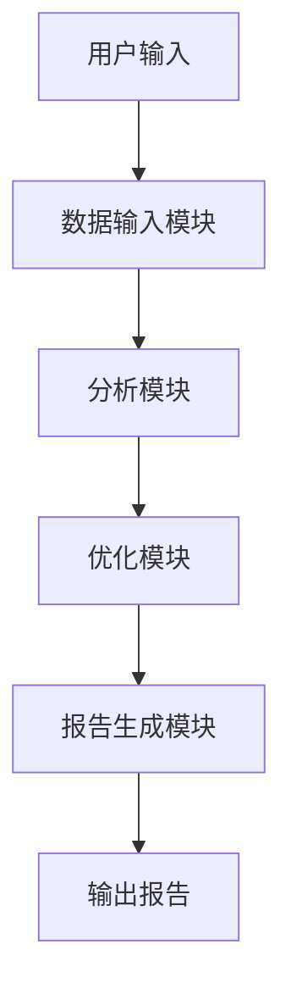
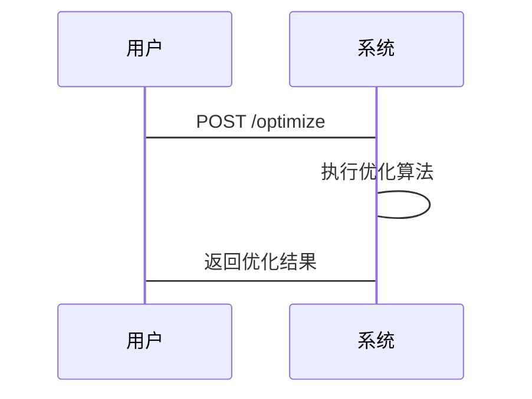

                 


# 投资组合管理

## 关键词：投资组合管理，资产配置，风险收益平衡，分散化，投资组合优化，数学模型

## 摘要：投资组合管理是现代金融学的核心领域之一，涉及如何在不同资产之间分配资金以实现风险与收益的最佳平衡。本文详细探讨投资组合管理的背景、核心概念、数学模型、系统架构及实际应用，通过理论与实践相结合的方式，帮助读者全面理解投资组合管理的原理和方法。

---

# 第一部分: 投资组合管理概述

## 第1章: 投资组合管理的背景与概念

### 1.1 投资组合管理的定义与目标

#### 1.1.1 投资组合的定义
投资组合是指将资金分配到不同资产（如股票、债券、房地产等）中的一种组合方式。通过合理配置资产，投资者可以在不同市场条件下实现收益的最大化或风险的最小化。

#### 1.1.2 投资组合管理的目标
投资组合管理的目标包括：
1. **最大化收益**：在给定风险水平下实现最大收益。
2. **最小化风险**：在给定收益水平下实现最小风险。
3. **风险与收益的平衡**：根据投资者的风险承受能力和收益目标，找到最优的投资组合。

#### 1.1.3 投资组合管理的重要性
投资组合管理的重要性体现在以下几个方面：
- **分散化**：通过将资金分配到不同资产或资产类别，降低单一资产的风险。
- **动态调整**：根据市场变化和个人目标的变化，定期调整投资组合。
- **专业化**：通过专业的知识和工具，帮助投资者做出更明智的投资决策。

### 1.2 投资组合管理的核心概念

#### 1.2.1 资产配置
资产配置是投资组合管理的核心步骤之一，涉及将资金分配到不同的资产类别（如股票、债券、现金等）中。资产配置的决策通常基于投资者的风险承受能力、收益目标和投资期限。

#### 1.2.2 风险与收益的平衡
风险与收益是投资组合管理中需要权衡的两个关键因素：
- **收益**：投资组合的预期收益。
- **风险**：投资组合的波动性或潜在损失。

#### 1.2.3 投资组合的分散化
分散化是通过将资金分配到多个不同的资产或资产类别来降低投资组合的整体风险。分散化的效果取决于资产之间的相关性。

### 1.3 投资组合管理的背景与现状

#### 1.3.1 投资组合管理的历史发展
投资组合管理的理论基础可以追溯到20世纪50年代的现代投资组合理论（MPT）。

#### 1.3.2 当前投资组合管理的挑战
当前投资组合管理的挑战包括市场波动、经济不确定性以及投资者需求的多样化。

#### 1.3.3 数字化与智能化在投资组合管理中的应用
随着技术的进步，投资组合管理 increasingly relies on quantitative models and algorithms to make informed decisions.

### 1.4 本章小结
本章介绍了投资组合管理的定义、目标和核心概念，强调了资产配置、风险与收益平衡以及分散化的重要性。同时，还讨论了投资组合管理的背景与发展。

---

## 第2章: 投资组合管理的核心概念

### 2.1 资产配置的原理与方法

#### 2.1.1 资产配置的分类
资产配置通常分为以下几类：
1. **战略性资产配置**：根据长期目标确定资产配置。
2. **战术性资产配置**：根据短期市场变化进行调整。

#### 2.1.2 资产配置的步骤
资产配置的步骤包括：
1. **确定投资目标**：明确收益目标和风险承受能力。
2. **选择资产类别**：根据目标选择股票、债券、现金等资产。
3. **分配比例**：确定每种资产的配置比例。

#### 2.1.3 资产配置的优化方法
资产配置的优化方法包括：
- **均值-方差优化**：在给定风险下实现最大收益。
- **风险平价**：根据资产的风险贡献进行配置。

### 2.2 风险与收益的权衡

#### 2.2.1 风险的定义与分类
风险是指投资组合未来收益的不确定性。风险可以分为市场风险、流动性风险、信用风险等。

#### 2.2.2 收益的定义与分类
收益是指投资组合在一定时间内的回报，包括资本收益和分红收益。

#### 2.2.3 风险与收益的关系
风险与收益之间通常呈正相关关系，即高风险资产通常具有较高的预期收益。

### 2.3 投资组合分散化的原则

#### 2.3.1 分散化的定义
分散化是指通过投资于不同资产或资产类别来降低投资组合的整体风险。

#### 2.3.2 分散化的效果
分散化的效果取决于资产之间的相关性。当资产之间的相关性较低时，分散化效果更好。

#### 2.3.3 分散化的方法
分散化的方法包括：
- **资产类别分散化**：投资于不同类别的资产（如股票、债券、房地产）。
- **地域分散化**：投资于不同国家或地区的资产。

### 2.4 核心概念的联系与对比

#### 2.4.1 资产配置与分散化的联系
资产配置是分散化的基础，而分散化是实现资产配置目标的重要手段。

#### 2.4.2 风险与收益的平衡
风险与收益的平衡是投资组合管理的核心目标，资产配置和分散化都是实现这一目标的重要工具。

#### 2.4.3 核心概念的对比表格
以下是一些核心概念的对比表格：

| 概念       | 资产配置 | 风险与收益 | 分散化 |
|------------|----------|------------|--------|
| 定义       | 资金分配到不同资产 | 风险与收益的平衡 | 降低整体风险 |
| 目标       | 实现收益与风险的平衡 | 实现收益与风险的平衡 | 降低风险 |
| 方法       | 确定资产类别和比例 | 权衡风险与收益 | 投资于不同资产 |

---

## 第3章: 投资组合优化的数学模型

### 3.1 现代投资组合理论（MPT）

#### 3.1.1 均值-方差模型
均值-方差模型是MPT的核心模型，用于在给定风险下找到收益最大的投资组合。

公式：
$$ \text{收益} = \sum_{i=1}^n w_i r_i $$
$$ \text{方差} = \sum_{i=1}^n \sum_{j=1}^n w_i w_j \sigma_{ij} $$

其中，\( w_i \) 是资产 \( i \) 的权重，\( r_i \) 是资产 \( i \) 的预期收益，\( \sigma_{ij} \) 是资产 \( i \) 和 \( j \) 的协方差。

#### 3.1.2 资本资产定价模型（CAPM）
CAPM用于确定单个资产的预期收益：
$$ E(r_i) = r_f + \beta_i (E(r_m) - r_f) $$
其中，\( r_f \) 是无风险利率，\( \beta_i \) 是资产 \( i \) 的贝塔系数，\( E(r_m) \) 是市场预期收益。

#### 3.1.3 投资组合优化的数学公式
投资组合优化的目标是在给定风险下最大化收益，或在给定收益下最小化风险。

### 3.2 黑-斯科尔斯模型

#### 3.2.1 期权定价的数学公式
黑-斯科尔斯模型用于期权定价，公式为：
$$ C = S_0 N(d_1) - K e^{-rT} N(d_2) $$
其中，\( S_0 \) 是标的资产价格，\( K \) 是行权价，\( r \) 是无风险利率，\( T \) 是到期时间，\( N(d) \) 是标准正态分布的累积分布函数。

#### 3.2.2 黑-斯科尔斯模型的假设
- 资产价格遵循几何布朗运动。
- 无交易成本和税收。
- 市场无套利机会。

### 3.3 其他投资组合优化模型

#### 3.3.1 风险中性定价模型
风险中性定价模型假设市场参与者是风险中性的，因此可以用无风险利率来定价资产。

#### 3.3.2 基于因子模型的投资组合优化
基于因子模型的投资组合优化考虑了资产之间的共同因子影响。

#### 3.3.3 非线性优化模型
非线性优化模型用于处理复杂的优化问题，如非线性约束和目标函数。

### 3.4 投资组合优化的算法实现

#### 3.4.1 线性规划算法
线性规划算法用于解决线性目标函数和线性约束的优化问题。

#### 3.4.2 非线性规划算法
非线性规划算法用于解决非线性目标函数或约束的优化问题。

#### 3.4.3 遗传算法在投资组合优化中的应用
遗传算法是一种模拟自然选择的优化算法，常用于解决复杂的组合优化问题。

---

## 第4章: 投资组合管理系统的架构设计

### 4.1 投资组合管理系统的功能设计

#### 4.1.1 系统功能模块划分
- 数据输入模块：接收市场数据和用户输入。
- 分析模块：计算资产回报和风险。
- 优化模块：生成最优投资组合。
- 报告生成模块：输出优化结果和分析报告。

#### 4.1.2 各模块的功能描述
- 数据输入模块：用户输入资产信息和市场数据。
- 分析模块：计算资产的期望收益和方差。
- 优化模块：使用数学模型生成最优投资组合。
- 报告生成模块：生成可视化报告。

#### 4.1.3 系统功能的流程图


### 4.2 系统架构设计

#### 4.2.1 分层架构设计
- 数据层：存储市场数据和用户输入。
- 业务逻辑层：处理投资组合优化的核心逻辑。
- 表示层：与用户交互，显示结果。

#### 4.2.2 微服务架构设计
- 数据服务：提供市场数据接口。
- 优化服务：提供投资组合优化服务。
- 报告服务：生成分析报告。

#### 4.2.3 系统架构的对比与选择
分层架构适合简单的系统，而微服务架构适合复杂的分布式系统。

### 4.3 系统接口设计

#### 4.3.1 前端接口设计
- GET /portfolio：获取投资组合信息。
- POST /optimize：提交优化请求。

#### 4.3.2 后端接口设计
- 数据接口：GET /data/stock：获取股票数据。
- 优化接口：POST /optimize：提交优化请求。

#### 4.3.3 接口的交互流程图


### 4.4 系统交互设计

#### 4.4.1 用户与系统的交互流程
- 用户提交优化请求。
- 系统计算最优投资组合。
- 系统返回结果。

#### 4.4.2 系统内部模块的交互流程
- 数据输入模块接收数据。
- 分析模块计算资产回报。
- 优化模块生成最优组合。

#### 4.4.3 交互

---

## 第5章: 项目实战

### 5.1 投资组合优化的案例分析

#### 5.1.1 环境安装
- Python 3.8+
- NumPy, Pandas, Scipy

#### 5.1.2 核心实现代码
```python
import numpy as np
from scipy.optimize import minimize

def portfoliooptimize(weights, returns, cov_matrix):
    # 定义目标函数：最小化方差
    def objective(w):
        return np.dot(w.T, np.dot(cov_matrix, w))

    # 定义约束条件
    constraints = [{'type': 'eq', 'fun': lambda w: np.sum(w) - 1}]

    # 使用scipy.optimize.minimize求解
    result = minimize(objective, weights, method='SLSQP', constraints=constraints)

    return result.x

# 示例数据
returns = np.array([0.1, 0.2, 0.15])
cov_matrix = np.array([[0.05, 0.02, 0.01],
                       [0.02, 0.08, 0.03],
                       [0.01, 0.03, 0.06]])

# 初始权重
initial_weights = np.array([1/3, 1/3, 1/3])

# 优化
optimal_weights = portfoliooptimize(initial_weights, returns, cov_matrix)

print("最优权重:", optimal_weights)
```

#### 5.1.3 代码解读与分析
上述代码实现了一个简单的投资组合优化算法，使用均值-方差模型求解最优权重。

#### 5.1.4 实际案例分析
假设我们有三只股票，预期回报分别为10%、20%和15%，协方差矩阵如上。通过优化算法，我们可以找到最优的资产配置。

---

## 第6章: 总结与展望

### 6.1 本章总结
本章详细介绍了投资组合管理的背景、核心概念、数学模型和系统架构，并通过实际案例展示了投资组合优化的实现过程。

### 6.2 未来展望
随着人工智能和大数据技术的发展，投资组合管理将更加智能化和个性化。未来的挑战包括如何处理复杂的市场环境和如何提高模型的可解释性。

---

## 作者：AI天才研究院/AI Genius Institute & 禅与计算机程序设计艺术 /Zen And The Art of Computer Programming

---

以上是《投资组合管理》的技术博客文章的详细内容，涵盖了从基础概念到实际应用的各个方面，通过理论与实践相结合的方式，帮助读者全面理解投资组合管理的原理和方法。

