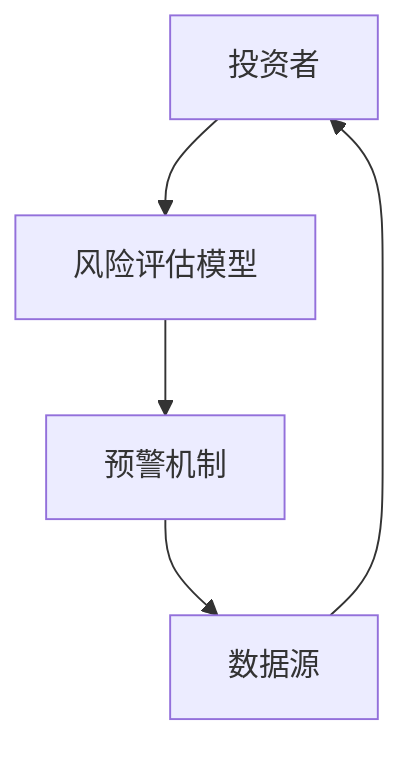
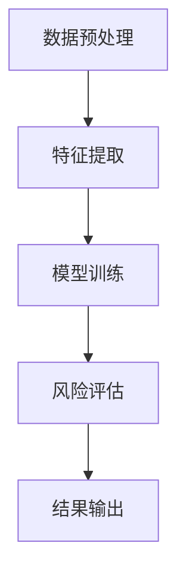
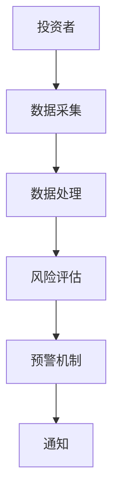

                 


# 投资风险提示系统

## 关键词：投资风险，提示系统，风险评估，预警机制，数据处理，机器学习

## 摘要：  
本文详细探讨了投资风险提示系统的构建与实现，从系统背景、核心概念、算法原理、系统架构到项目实战，全面解析了投资风险提示系统的设计与实现过程。通过分析风险评估模型、预警机制、数据处理流程等关键环节，结合实际案例和代码实现，为读者提供了一套完整的投资风险提示系统解决方案。

---

# 第1章: 投资风险提示系统背景介绍

## 1.1 投资风险提示系统的概念与背景

### 1.1.1 投资风险的基本概念

投资风险是指在投资过程中，由于各种不确定性因素的影响，可能导致投资收益低于预期甚至出现本金损失的可能性。投资风险广泛存在于股票、基金、债券等金融资产中，是投资者在进行投资决策时需要重点关注的问题。

### 1.1.2 投资风险提示系统的定义与目标

投资风险提示系统是一种用于评估和预警投资风险的智能化系统。其目标是通过分析历史数据、实时市场信息以及投资者行为数据，识别潜在的投资风险，并通过预警机制通知投资者或机构，从而帮助其做出更明智的投资决策。

### 1.1.3 投资风险提示系统的应用场景

投资风险提示系统可以应用于多种场景，包括个人投资决策支持、机构风险管理、金融产品评估等。例如，投资者可以通过该系统了解某只股票的投资风险等级，机构可以利用该系统进行风险监控和管理。

## 1.2 投资风险提示系统的核心要素

### 1.2.1 风险评估模型

风险评估模型是投资风险提示系统的核心，其作用是根据输入的数据计算出投资标的的风险等级。常见的风险评估模型包括基于历史数据分析的统计模型和基于机器学习的预测模型。

### 1.2.2 风险预警机制

风险预警机制是投资风险提示系统的重要组成部分，其通过设定阈值和触发条件，在风险达到一定程度时向用户发出预警信号。预警机制可以采用颜色、声音、邮件等多种形式进行通知。

### 1.2.3 数据来源与处理

数据来源是投资风险提示系统的重要支撑，主要包括市场数据、历史数据、投资者行为数据等。数据处理流程包括数据清洗、特征提取、数据建模等步骤。

## 1.3 投资风险提示系统的边界与外延

### 1.3.1 系统的功能边界

投资风险提示系统的功能边界包括数据采集、风险评估、预警通知等核心功能。其不包括投资决策的具体执行，也不涉及具体的交易操作。

### 1.3.2 系统的适用范围

投资风险提示系统适用于多种投资标的，包括股票、基金、债券等。不同投资标的的风险评估模型和数据处理流程可能会有所不同。

### 1.3.3 系统的扩展性与灵活性

投资风险提示系统具有较强的扩展性，可以根据具体需求添加新的风险评估模型或调整预警机制。同时，系统也可以通过引入新的数据源来提高风险评估的准确性。

## 1.4 投资风险提示系统的概念结构

### 1.4.1 系统的核心要素分析

投资风险提示系统的核心要素包括风险评估模型、数据源、预警机制等。这些要素相互作用，共同实现投资风险的评估和预警。

### 1.4.2 系统的逻辑架构

投资风险提示系统的逻辑架构包括数据层、计算层、展示层等。数据层负责数据的采集和存储；计算层负责风险评估和预警计算；展示层负责向用户展示结果。

### 1.4.3 系统的关键属性特征

系统的关键属性特征包括高准确性、实时性、可扩展性等。高准确性要求系统能够准确评估投资风险；实时性要求系统能够及时更新数据和计算结果；可扩展性要求系统能够适应新的数据源和风险评估模型。

## 1.5 本章小结

本章详细介绍了投资风险提示系统的背景、核心要素、边界与外延，以及系统的概念结构。这些内容为后续章节的深入分析奠定了基础。

---

# 第2章: 投资风险提示系统的核心概念与联系

## 2.1 风险评估模型的原理

### 2.1.1 风险评估的基本原理

风险评估的基本原理是通过分析历史数据和当前市场信息，预测投资标的未来风险。常用的预测方法包括统计分析和机器学习算法。

### 2.1.2 风险评估模型的分类

风险评估模型可以分为基于统计的模型和基于机器学习的模型。基于统计的模型包括CAPM模型、APT模型等；基于机器学习的模型包括支持向量机、随机森林等。

### 2.1.3 风险评估模型的优缺点

基于统计的模型具有简单易懂的优点，但可能无法捕捉复杂的数据关系；基于机器学习的模型具有较高的准确性，但实现复杂且需要大量数据支持。

## 2.2 风险预警机制的设计

### 2.2.1 预警指标的选取

预警指标的选择需要考虑投资标的特性和市场环境。常用的预警指标包括波动率、VaR值、信用评级等。

### 2.2.2 预警阈值的设置

预警阈值的设置需要结合历史数据和实际需求。例如，当波动率超过某个阈值时，触发预警信号。

### 2.2.3 预警触发条件的设计

预警触发条件可以根据不同的预警指标和阈值组合设计。例如，当多个指标同时触发时，系统发出预警信号。

## 2.3 数据来源与处理流程

### 2.3.1 数据的采集与清洗

数据采集需要从多种渠道获取相关数据，包括市场数据、历史数据、投资者行为数据等。数据清洗的目的是去除噪声数据和异常值。

### 2.3.2 数据的特征提取

特征提取是将原始数据转化为具有代表性的特征向量的过程。例如，将股票的历史收益率转化为波动率、均值、标准差等特征。

### 2.3.3 数据的存储与管理

数据的存储与管理需要考虑数据的规模和访问频率。常用的数据存储方式包括关系型数据库、NoSQL数据库等。

## 2.4 投资风险提示系统的ER实体关系图



---

# 第3章: 投资风险提示系统的算法原理

## 3.1 基于机器学习的风险评估算法

### 3.1.1 算法流程图



### 3.1.2 算法实现代码

```python
# 示例代码：基于线性回归的风险评估模型
import numpy as np
from sklearn.linear_model import LinearRegression

# 数据准备
X = np.array([[1], [2], [3], [4], [5]])
y = np.array([2, 4, 5, 4, 6])

# 模型训练
model = LinearRegression()
model.fit(X, y)

# 风险评估
预测值 = model.predict(X)
```

### 3.1.3 算法的数学模型

线性回归的数学模型可以表示为：
$$ y = \beta_0 + \beta_1 x + \epsilon $$
其中，$\beta_0$ 是截距，$\beta_1$ 是回归系数，$\epsilon$ 是误差项。

---

## 3.2 风险预警机制的实现

### 3.2.1 预警阈值的计算

VaR（Value at Risk）模型可以用于计算风险预警阈值。例如，95%置信水平下的VaR值可以作为预警阈值。

### 3.2.2 预警信号的触发

当实际风险指标超过预警阈值时，系统会触发预警信号。例如，当波动率超过设定阈值时，系统发出预警信号。

### 3.2.3 预警信号的传播

预警信号可以通过多种方式传递给投资者或机构，包括邮件、短信、应用程序通知等。

---

## 3.3 数据处理与特征提取

### 3.3.1 数据清洗

数据清洗的目的是去除噪声数据和异常值。例如，去除缺失值和异常值。

### 3.3.2 特征提取

特征提取是将原始数据转化为具有代表性的特征向量的过程。例如，将股票的历史收益率转化为波动率、均值、标准差等特征。

### 3.3.3 数据预处理

数据预处理包括标准化、归一化等步骤，以确保模型输入的数据具有相似的尺度。

---

# 第4章: 投资风险提示系统的系统架构设计

## 4.1 问题场景介绍

投资风险提示系统的应用场景包括个人投资决策支持、机构风险管理、金融产品评估等。

## 4.2 系统功能设计

### 4.2.1 领域模型图


### 4.2.2 系统架构图



### 4.2.3 系统接口设计

系统接口包括数据接口、模型接口、预警接口等。例如，数据接口用于与数据源进行交互，模型接口用于调用风险评估模型，预警接口用于发送预警信号。

### 4.2.4 系统交互流程

系统交互流程包括投资者发起请求、系统进行数据处理、风险评估、预警计算，最后向投资者发送预警信号。

---

## 4.3 项目实战

### 4.3.1 环境安装

安装必要的软件和库，例如Python、Pandas、Scikit-learn等。

### 4.3.2 核心代码实现

```python
import pandas as pd
from sklearn.linear_model import LinearRegression

# 数据加载
data = pd.read_csv('投资数据.csv')

# 特征提取
X = data[['历史收益率', '波动率']]
y = data['风险等级']

# 模型训练
model = LinearRegression()
model.fit(X, y)

# 预警计算
预测风险 = model.predict(X)
```

### 4.3.3 代码解读与分析

上述代码展示了如何使用线性回归模型进行风险评估。首先，加载数据并提取特征；然后，训练模型；最后，使用模型进行风险预测。

### 4.3.4 实际案例分析

以某只股票为例，分析其历史数据并使用模型进行风险评估，最后根据评估结果发出预警信号。

---

## 4.4 项目小结

本章通过实际案例分析，展示了投资风险提示系统的实现过程。从环境安装到核心代码实现，再到系统交互流程，读者可以逐步掌握系统的构建方法。

---

# 第5章: 投资风险提示系统的优化与扩展

## 5.1 系统优化

### 5.1.1 模型优化

通过调整模型参数、引入新的特征、尝试不同的算法等方法优化风险评估模型的准确性。

### 5.1.2 数据优化

优化数据采集和处理流程，提高数据质量和实时性。

### 5.1.3 系统性能优化

优化系统架构，提高系统的响应速度和处理能力。

## 5.2 系统扩展

### 5.2.1 新功能开发

例如，引入多因子模型、实时数据处理功能等。

### 5.2.2 新数据源引入

例如，引入更多的市场数据、投资者行为数据等。

### 5.2.3 系统集成

将投资风险提示系统与其他金融系统进行集成，例如与投资管理系统、风险管理系统等。

---

# 第6章: 投资风险提示系统的总结与展望

## 6.1 系统总结

投资风险提示系统是一种重要的金融工具，能够帮助投资者和机构更好地管理投资风险。通过本文的介绍，读者可以全面了解系统的构建过程和实现方法。

## 6.2 系统展望

未来，随着人工智能和大数据技术的不断发展，投资风险提示系统将变得更加智能化和精准化。同时，系统的应用场景也将更加广泛，为投资者和机构提供更全面的风险管理支持。

---

# 作者：AI天才研究院/AI Genius Institute & 禅与计算机程序设计艺术 /Zen And The Art of Computer Programming

