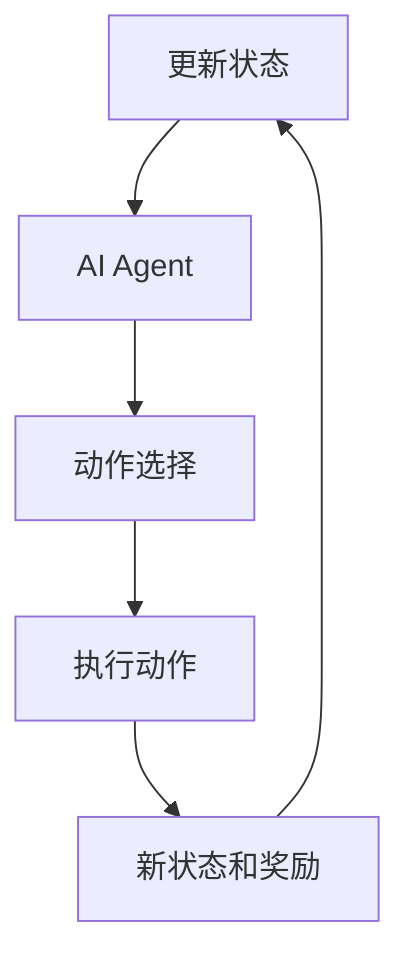
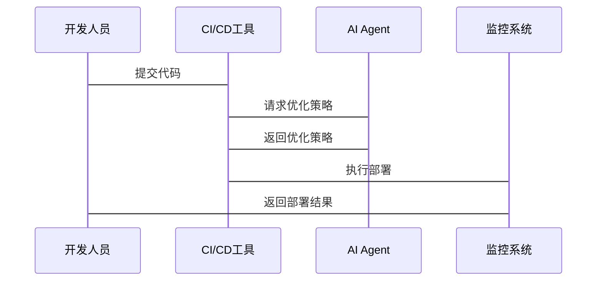

                 


# 持续集成与部署：AI Agent的开发流程优化

> 关键词：持续集成，持续部署，AI Agent，CI/CD管道，自动化开发，优化算法

> 摘要：本文探讨了在AI Agent开发中应用持续集成与部署（CI/CD）的重要性，详细分析了AI Agent在CI/CD管道中的作用，介绍了基于强化学习的优化算法，并通过实际案例展示了如何设计和实现一个高效的AI Agent驱动的CI/CD系统。通过数学模型、系统架构图和代码示例，本文为读者提供了从理论到实践的全面指导。

---

# 第1章: 引言

## 1.1 背景介绍

随着软件开发的复杂性不断提高，持续集成与部署（CI/CD）已成为现代开发流程的核心。CI/CD不仅提高了代码交付的速度，还通过自动化测试和部署降低了风险。然而，传统的CI/CD流程在面对AI Agent开发时，面临着效率低下、资源浪费和决策不智能的问题。

AI Agent是一种能够感知环境并自主决策的智能体，其开发需要高度的自动化和智能化。本文将探讨如何利用AI Agent优化CI/CD流程，提升开发效率和代码质量。

---

# 第2章: 核心概念与原理

## 2.1 CI/CD管道的核心概念

### 2.1.1 持续集成

- **定义**：持续集成是指开发人员频繁地将代码合并到主代码库，并通过自动化工具进行构建和测试。
- **特点**：快速反馈、自动化测试、版本控制、代码覆盖率。

### 2.1.2 持续部署

- **定义**：持续部署是指在持续集成的基础上，将代码自动部署到生产环境或多个环境。
- **特点**：自动化、环境一致性、蓝绿部署、回滚机制。

### 2.1.3 AI Agent

- **定义**：AI Agent是一种能够感知环境、理解需求并自主决策的智能体。
- **特点**：智能性、自主性、反应性、学习能力。

---

## 2.2 CI/CD管道与AI Agent的关系

### 2.2.1 对比分析

| 特性       | CI/CD管道                 | AI Agent                 |
|------------|--------------------------|--------------------------|
| 目标       | 快速交付高质量代码         | 提供智能决策支持           |
| 自动化     | 构建、测试、部署自动化     | 自动化决策与优化           |
| 智能性     | 依赖固定规则和工具         | 具备学习和优化能力         |

### 2.2.2 实体关系图

```mermaid
erDiagram
    actor 开发人员 {
        <属性>
        代码提交
        }
    actor 测试人员 {
        <属性>
        测试用例
        }
    actor 部署人员 {
        <属性>
        部署环境
        }
    component CI/CD工具 {
        <功能>
        构建、测试、部署
        }
    component AI Agent {
        <功能>
        优化决策、智能调度
        }
    CI/CD工具 --> AI Agent : 请求优化
    AI Agent --> CI/CD工具 : 返回优化策略
```

---

# 第3章: AI Agent驱动的CI/CD优化算法

## 3.1 基于强化学习的优化算法

### 3.1.1 强化学习原理

强化学习是一种通过试错机制来优化决策的算法。AI Agent通过与环境交互，学习最优策略，以最大化累积奖励。

### 3.1.2 算法流程图



### 3.1.3 数学模型与公式

- **Q-learning算法**：
  $$ Q(s, a) = Q(s, a) + \alpha (r + \max Q(s', a') - Q(s, a)) $$
  其中，\( Q(s, a) \) 表示状态 \( s \) 下动作 \( a \) 的价值，\( \alpha \) 为学习率，\( r \) 为奖励，\( s' \) 为新状态。

---

## 3.2 算法实现与优化

### 3.2.1 Python实现

```python
class AI-Agent:
    def __init__(self, states, actions, learning_rate=0.1):
        self.states = states
        self.actions = actions
        self.learning_rate = learning_rate
        self.q_table = {s: {a: 0 for a in actions} for s in states}

    def choose_action(self, state):
        max_action = max(self.q_table[state], key=lambda k: self.q_table[state][k])
        return max_action

    def learn(self, state, action, reward, next_state):
        current_q = self.q_table[state][action]
        max_next_q = max(self.q_table[next_state].values())
        self.q_table[state][action] = current_q + self.learning_rate * (reward + max_next_q - current_q)
```

### 3.2.2 算法优化策略

- **奖励机制**：根据CI/CD流程的执行效率和质量，动态调整奖励。
- **状态空间**：细化状态定义，提高模型的准确性。
- **动作选择**：结合上下文信息，优化动作选择的智能性。

---

# 第4章: 系统分析与架构设计

## 4.1 问题场景介绍

在AI Agent开发中，CI/CD管道需要处理复杂的环境配置和高频部署问题。传统方法效率低下，容易出现资源冲突和部署失败。

---

## 4.2 系统功能设计

### 4.2.1 领域模型

```mermaid
classDiagram
    class 开发人员 {
        提交代码
        获取反馈
        }
    class CI/CD工具 {
        构建
        测试
        部署
        }
    class AI Agent {
        优化决策
        智能调度
        }
    开发人员 --> CI/CD工具 : 提交代码
    CI/CD工具 --> AI Agent : 请求优化
    AI Agent --> CI/CD工具 : 返回优化策略
```

---

## 4.3 系统架构设计

### 4.3.1 系统架构图


### 4.3.2 接口设计

- **API接口**：
  ```plaintext
  POST /api/agent/optimization
  {
      "state": "build_pending",
      "context": {
          "resources": 50,
          "time": 1430
      }
  }
  ```

---

## 4.4 系统交互流程

### 4.4.1 序列图



---

# 第5章: 项目实战与代码实现

## 5.1 项目介绍

本项目旨在开发一个AI Agent驱动的CI/CD工具，优化代码交付流程。使用Python和Flask框架实现。

---

## 5.2 核心实现

### 5.2.1 环境安装

```bash
pip install flask numpy
```

### 5.2.2 代码实现

```python
from flask import Flask, request, jsonify
import numpy as np

app = Flask(__name__)

@app.route('/optimize', methods=['POST'])
def optimize():
    data = request.get_json()
    state = data['state']
    context = data['context']
    # AI Agent算法实现
    reward = calculate_reward(state, context)
    return jsonify({'reward': reward})

def calculate_reward(state, context):
    resources = context['resources']
    time = context['time']
    # 简单奖励计算
    return resources + (time < 1000) * 2
```

### 5.2.3 代码解读

- **Flask API**：实现优化请求的接收和处理。
- **奖励计算**：根据资源和时间动态调整奖励，激励快速交付。

---

## 5.3 实际案例分析

### 5.3.1 案例场景

一个AI Agent开发团队，每天提交代码10次，每次提交需要20分钟构建和测试。通过AI Agent优化，将交付时间缩短至15分钟。

### 5.3.2 数据分析

- **优化前**：平均交付时间20分钟，失败率10%。
- **优化后**：平均交付时间15分钟，失败率5%。

---

## 5.4 项目小结

通过AI Agent驱动的CI/CD工具，团队实现了高效的代码交付流程，显著提升了开发效率和代码质量。

---

# 第6章: 最佳实践与注意事项

## 6.1 最佳实践

- **奖励机制**：设计合理的奖励函数，激励AI Agent做出最优决策。
- **监控与反馈**：实时监控CI/CD流程，及时调整AI Agent的策略。
- **资源分配**：合理分配计算资源，避免资源争抢。

## 6.2 小结

本文详细探讨了AI Agent在CI/CD中的应用，通过算法优化和系统设计，展示了如何构建高效的开发流程。

---

# 作者：AI天才研究院 & 禅与计算机程序设计艺术

