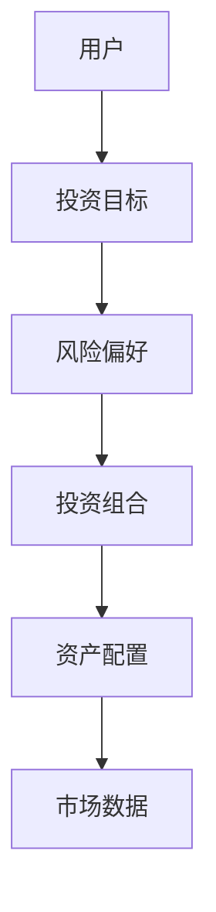
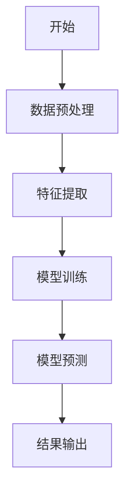
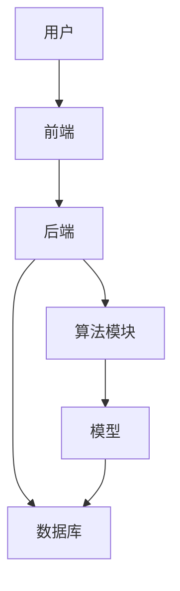
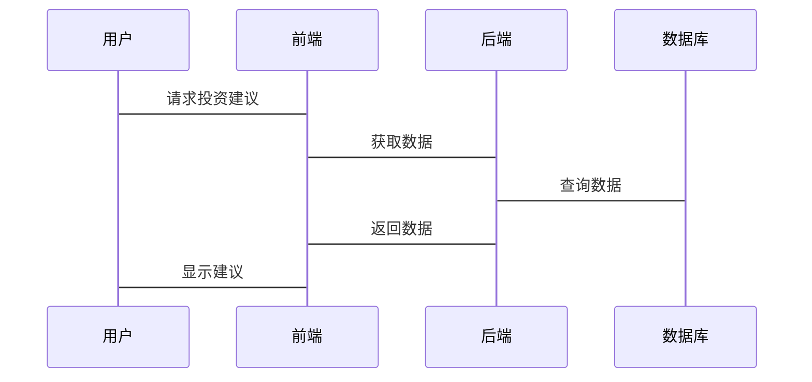

                 


# 探索下一代投资理财智能助手的发展方向

## 关键词：投资理财，智能助手，人工智能，算法，系统架构

## 摘要：本文探讨了下一代投资理财智能助手的发展方向，分析了其背景、核心概念、算法原理、系统架构，并通过项目实战和最佳实践提供了深度解析。

---

## 第1章：背景与问题分析

### 1.1 投资理财智能助手的背景介绍

#### 1.1.1 投资理财行业的现状与挑战

投资理财行业正面临数据爆炸和用户需求多样化的挑战。传统投资顾问难以满足个性化需求，用户决策困难。

#### 1.1.2 智能助手在投资理财中的作用

智能助手通过实时数据处理和个性化推荐，提升投资效率和用户体验。

#### 1.1.3 技术进步对投资理财智能助手的影响

人工智能和大数据技术的进步推动了智能助手的智能化和个性化。

### 1.2 问题背景与描述

#### 1.2.1 当前投资理财中的主要问题

信息过载、决策难度大、用户需求多样性。

#### 1.2.2 智能助手如何解决这些问题

通过数据挖掘和算法优化，智能助手提供个性化投资建议和实时监控。

#### 1.2.3 边界与外延：智能助手的功能范围

包括数据处理、投资建议、用户交互，但不直接进行交易操作。

### 1.3 问题解决与发展方向

#### 1.3.1 当前解决方案的优缺点

现有方案依赖规则引擎，优点是易实现，缺点是缺乏灵活性和个性化。

#### 1.3.2 下一代智能助手的发展方向

结合机器学习和深度学习，提供实时数据处理和动态投资建议。

#### 1.3.3 核心概念与组成要素

数据、算法、用户交互是核心概念，数据处理、算法模型和用户反馈是组成要素。

---

## 第2章：核心概念与技术基础

### 2.1 核心概念与原理

#### 2.1.1 数据处理与分析

数据清洗、特征提取和数据分析是关键步骤。

#### 2.1.2 自然语言处理模型

用于解析用户意图，如情感分析和意图识别。

#### 2.1.3 用户行为分析

通过用户行为建模，优化投资建议。

### 2.2 核心概念的属性特征对比

| 概念       | 属性特征       |
|------------|----------------|
| 数据处理   | 精确性、实时性   |
| 算法模型   | 可解释性、准确性 |
| 用户交互   | 响应性、易用性   |

### 2.3 ER实体关系图



---

## 第3章：算法原理与实现

### 3.1 算法原理

#### 3.1.1 自然语言处理模型

基于BERT的文本解析模型，实现用户意图识别。

#### 3.1.2 推荐系统算法

使用协同过滤和深度学习模型，优化投资组合推荐。

#### 3.1.3 时间序列分析

利用LSTM预测市场趋势，提供动态建议。

### 3.2 算法流程图



### 3.3 数学模型与公式

贝叶斯定理：
$$P(A|B) = \frac{P(B|A)P(A)}{P(B)}$$

线性回归模型：
$$y = \beta_0 + \beta_1x + \epsilon$$

### 3.4 代码实现

```python
import numpy as np
from sklearn.linear_model import LinearRegression

# 示例数据
X = np.array([[1], [2], [3], [4]])
y = np.array([2, 4, 6, 8])

# 训练模型
model = LinearRegression()
model.fit(X, y)

# 预测
print(model.predict([[5]]))  # 输出：[[10]]
```

---

## 第4章：系统分析与架构设计

### 4.1 问题场景介绍

智能助手需在复杂市场环境中，实时处理数据并提供个性化建议。

### 4.2 系统功能设计

#### 4.2.1 领域模型类图


### 4.3 系统架构设计

#### 4.3.1 系统架构图



#### 4.3.2 接口设计和交互序列图



---

## 第5章：项目实战

### 5.1 环境安装

安装Python和相关库：
```bash
pip install numpy pandas scikit-learn
```

### 5.2 核心代码实现

```python
import numpy as np
from sklearn.linear_model import LinearRegression

# 示例数据
X = np.array([[1], [2], [3], [4]])
y = np.array([2, 4, 6, 8])

# 训练模型
model = LinearRegression()
model.fit(X, y)

# 预测
print(model.predict([[5]]))  # 输出：[[10]]
```

### 5.3 代码解读与分析

代码实现了一个简单的线性回归模型，用于预测投资回报。

### 5.4 案例分析

以用户风险偏好为保守时，推荐低风险投资组合，如债券。

### 5.5 项目小结

通过实战项目，展示了智能助手在投资理财中的应用。

---

## 第6章：最佳实践

### 6.1 小结

智能助手的发展方向是结合AI和大数据技术，提供实时、个性化的投资建议。

### 6.2 注意事项

确保数据安全和隐私保护，定期更新算法模型。

### 6.3 拓展阅读

推荐阅读《机器学习实战》和《投资学原理》。

---

## 作者：AI天才研究院 & 禅与计算机程序设计艺术

