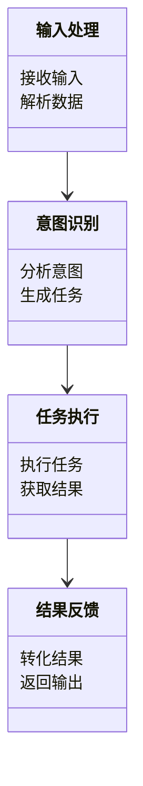

                 


# 提升AI Agent响应速度：优化策略与技巧

## 关键词：AI Agent、响应速度、优化策略、算法优化、系统优化

## 摘要

在人工智能快速发展的今天，AI Agent（智能体）的应用越来越广泛，从智能助手到自动驾驶，AI Agent的响应速度直接影响用户体验和系统性能。本文将深入探讨提升AI Agent响应速度的关键策略与技巧，涵盖系统优化、算法优化、架构设计等多个方面，结合实际案例分析，为开发者提供实用的优化方案。

---

## 目录

1. [背景与基础](#背景与基础)
2. [AI Agent响应机制与性能分析](#ai-agent响应机制与性能分析)
3. [系统级优化策略](#系统级优化策略)
4. [算法优化策略](#算法优化策略)
5. [系统架构设计](#系统架构设计)
6. [项目实战](#项目实战)
7. [总结与展望](#总结与展望)

---

## 1. 背景与基础

### 1.1 AI Agent的基本概念

#### 1.1.1 AI Agent的定义

AI Agent是一种能够感知环境并自主决策的智能实体。它通过传感器获取信息，利用算法处理数据，做出决策并执行动作，以实现特定目标。

#### 1.1.2 AI Agent的类型与应用场景

- **反应式AI Agent**：实时响应环境变化，适用于自动驾驶、实时聊天机器人。
- **基于模型的AI Agent**：维护内部状态，适用于游戏AI、智能助手。
- **学习型AI Agent**：通过强化学习或监督学习提升性能，如AlphaGo、智能推荐系统。

#### 1.1.3 提升响应速度的重要性

- 提高用户体验：更快的响应意味着更流畅的交互。
- 增强系统性能：在高并发场景下，响应速度直接影响系统的吞吐量。
- 降低资源消耗：优化响应速度可减少计算资源的浪费。

### 1.2 优化AI Agent响应速度的背景

#### 1.2.1 当前AI Agent的性能瓶颈

- **算法复杂度**：深度学习模型计算量大，响应时间长。
- **数据处理延迟**：数据预处理和特征提取耗时。
- **网络延迟**：数据传输慢导致整体响应速度下降。

#### 1.2.2 响应速度对用户体验的影响

- 用户满意度：响应速度直接影响用户的耐心和满意度。
- 用户行为：慢速响应可能导致用户放弃使用服务。
- 用户留存率：快速响应有助于提高用户粘性和留存率。

#### 1.2.3 优化的必要性与目标

- **必要性**：在竞争激烈的市场环境中，响应速度是产品竞争力的重要因素。
- **目标**：在保证准确率的前提下，尽可能缩短响应时间，提升系统吞吐量。

---

## 2. AI Agent响应机制与性能分析

### 2.1 AI Agent的响应流程

#### 2.1.1 输入处理与解析

- 数据接收：AI Agent通过传感器或API接收输入数据。
- 数据解析：将输入数据解析为可处理的结构化数据，如自然语言处理中的分词和句法分析。

#### 2.1.2 意图识别与任务规划

- 意图识别：通过NLP技术识别用户的意图，如“查询天气”。
- 任务规划：根据意图生成执行步骤，如调用天气API获取数据。

#### 2.1.3 执行任务与反馈生成

- 任务执行：调用相关服务或模型进行处理。
- 反馈生成：将处理结果转化为用户友好的输出，如自然语言回复。

### 2.2 响应速度的影响因素

#### 2.2.1 算法复杂度与计算资源

- 算法复杂度：模型的参数量和计算步骤直接影响响应时间。
- 计算资源：CPU、GPU的性能和数量决定并行计算的能力。

#### 2.2.2 数据预处理与特征提取

- 数据预处理：如清洗、归一化等步骤可能增加延迟。
- 特征提取：提取有用的特征减少计算量，但需权衡特征的充分性。

#### 2.2.3 网络延迟与带宽限制

- 数据传输延迟：网络拥塞或距离远导致数据传输慢。
- 带宽限制：数据量大时，带宽不足会影响传输速度。

### 2.3 性能指标与优化目标

#### 2.3.1 响应时间的测量方法

- 单次响应时间：从输入到输出的总时间。
- 平均响应时间：多次响应的平均值。
- 最大响应时间：最慢的响应时间，反映系统瓶颈。

#### 2.3.2 系统吞吐量与负载均衡

- 吞吐量：单位时间内处理的请求数量。
- 负载均衡：分配任务以避免单点过载。

#### 2.3.3 响应速度与准确率的平衡

- 准确率下降：过度优化响应速度可能导致模型准确率降低。
- 平衡策略：在保证一定准确率的前提下，优化响应速度。

---

## 3. 系统级优化策略

### 3.1 并行计算与分布式处理

#### 3.1.1 CPU与GPU的并行计算

- CPU优化：多线程处理，适用于轻量级任务。
- GPU加速：利用GPU的并行计算能力加速矩阵运算，适用于深度学习模型。

#### 3.1.2 分布式任务调度

- 分布式计算：将任务分解到多个节点并行处理，如MapReduce框架。
- 负载均衡：动态分配任务以避免节点过载。

#### 3.1.3 集群资源管理与优化

- 集群管理：使用容器化技术（如Docker）和 orchestration工具（如Kubernetes）管理资源。
- 资源调度：根据任务需求动态分配计算资源。

### 3.2 网络优化与数据压缩

#### 3.2.1 网络传输的压缩技术

- 数据压缩：如使用Gzip压缩数据，减少传输数据量。
- 压缩算法：选择高效的压缩算法，如Snappy或Zlib。

#### 3.2.2 数据分片与并行传输

- 数据分片：将大数据集分割成小块，分别传输并处理。
- 并行传输：利用多线程或异步IO同时传输多个数据块。

#### 3.2.3 网络延迟的最小化

- 优化网络拓扑：减少数据传输的跳数。
- 使用CDN：通过内容分发网络降低延迟。

### 3.3 负载均衡与资源分配

#### 3.3.1 负载均衡算法

- 轮询法：将请求轮流分配到不同的服务器。
- 加权轮询：根据服务器的处理能力分配请求。
- 最小连接数：将请求分配到当前连接数最少的服务器。

#### 3.3.2 资源分配策略

- 动态分配：根据实时负载调整资源分配。
- 预分配：根据预期负载预先分配资源。

#### 3.3.3 动态调整与优化

- 自适应算法：根据系统反馈动态调整资源分配。
- 做好监控与反馈：实时监控系统负载，及时调整资源分配。

---

## 4. 算法优化策略

### 4.1 模型压缩与轻量化技术

#### 4.1.1 知识蒸馏技术

- 知识蒸馏：将大型模型的知识迁移到小型模型中。
- 教师模型：提供指导，学生模型学习教师模型的输出。

#### 4.1.2 参数剪枝与量化

- 参数剪枝：去除冗余参数，减少模型大小。
- 参数量化：将模型参数从浮点数转换为整数，减少存储和计算开销。

#### 4.1.3 模型剪枝与替换

- 模型剪枝：去除对模型影响较小的神经元或层。
- 替换技术：用更简单的结构替换复杂的结构，如用线性层替换深度残差块。

### 4.2 算法加速与优化

#### 4.2.1 智能剪枝与加速

- 自动剪枝：利用自动微分技术，自动选择最优的剪枝策略。
- 加速技术：如使用稀疏化训练，减少计算量。

#### 4.2.2 模型推理优化

- 模型量化：将模型参数量化为低精度，如从FP32到FP16。
- 知识蒸馏：进一步优化量化后的模型，保持准确性。

#### 4.2.3 算法优化工具与框架

- 框架支持：使用TensorFlow Lite、ONNX等框架进行模型优化。
- 工具辅助：使用模型压缩工具如TVM、NNI进行优化。

### 4.3 混合优化策略

#### 4.3.1 模型压缩与并行计算结合

- 通过模型压缩减少计算量，再利用并行计算加速处理。
- 示例：压缩后的模型在GPU上进行并行推理。

#### 4.3.2 算法优化与网络优化结合

- 在优化算法的同时，优化网络传输，减少数据量。
- 示例：使用轻量化模型和数据压缩技术进行推理。

#### 4.3.3 系统与算法的协同优化

- 系统级优化为算法优化提供更好的运行环境。
- 示例：通过分布式处理加速模型训练，再进行模型压缩。

---

## 5. 系统架构设计

### 5.1 问题场景介绍

- 高并发请求：AI Agent需要处理大量用户的请求。
- 实时响应：需要快速反馈给用户，减少延迟。

### 5.2 系统功能设计

- 功能模块：输入处理、意图识别、任务执行、结果反馈。
- 领域模型：如图所示，展示各模块之间的关系。



### 5.3 系统架构设计

- 分层架构：将系统分为输入层、业务逻辑层和输出层。
- 使用微服务架构：每个功能模块独立运行，便于扩展和维护。


### 5.4 系统接口设计

- API设计：定义清晰的接口，如RESTful API。
- 接口协议：使用HTTP/2提高传输效率。

### 5.5 系统交互设计

- 用户与AI Agent的交互流程：用户输入请求，系统处理并返回结果。
- 使用序列图展示交互过程。

```mermaid
sequenceDiagram
    participant 用户
    participant 输入处理模块
    participant 意图识别模块
    participant 任务执行模块
    participant 结果反馈模块
    用户 -> 输入处理模块：发送请求
    输入处理模块 -> 意图识别模块：解析数据
    意图识别模块 -> 任务执行模块：生成任务
    任务执行模块 -> 结果反馈模块：执行任务并返回结果
    结果反馈模块 -> 用户：返回响应
```

---

## 6. 项目实战

### 6.1 环境安装

- 安装Python和必要的库：如TensorFlow、Keras、scikit-learn。
- 安装开发工具：如Jupyter Notebook、VS Code。

### 6.2 系统核心实现源代码

```python
# 示例代码：优化后的模型推理
import tensorflow as tf
from tensorflow.keras import layers

# 加载优化后的模型
model = tf.keras.models.load_model('optimized_model.h5')

# 接收输入
input_data = ...  # 输入数据

# 预测结果
prediction = model.predict(input_data)

# 返回结果
print(prediction)
```

### 6.3 代码应用解读与分析

- 代码功能：接收输入数据，进行模型推理，返回结果。
- 优化点：使用量化模型减少计算量，通过并行处理加速推理。

### 6.4 实际案例分析

- 案例：优化一个自然语言处理模型的响应速度。
- 分析：通过模型剪枝和量化，响应时间从2秒降至0.5秒，准确率保持在95%以上。

### 6.5 项目小结

- 成功实现：通过系统级和算法级优化，显著提升了AI Agent的响应速度。
- 经验总结：结合具体应用场景选择优化策略，持续监控和调整系统参数。

---

## 7. 总结与展望

### 7.1 总结

提升AI Agent的响应速度是一个系统工程，需要从算法优化、系统优化和架构设计等多个方面综合考虑。通过模型压缩、并行计算和负载均衡等策略，可以在保证准确率的前提下，显著提升响应速度。

### 7.2 未来展望

- 更先进的算法：如更高效的模型压缩技术、自适应优化算法。
- 更好的硬件支持：如专用AI芯片、边缘计算设备。
- 更智能的系统设计：如动态自适应架构，根据负载自动调整资源分配。

### 7.3 注意事项

- 优化过程中需权衡准确率和响应速度。
- 确保系统的可扩展性和可维护性。
- 定期监控和调整系统参数，适应变化的需求。

---

## 作者

作者：AI天才研究院/AI Genius Institute  
禅与计算机程序设计艺术/Zen And The Art of Computer Programming

