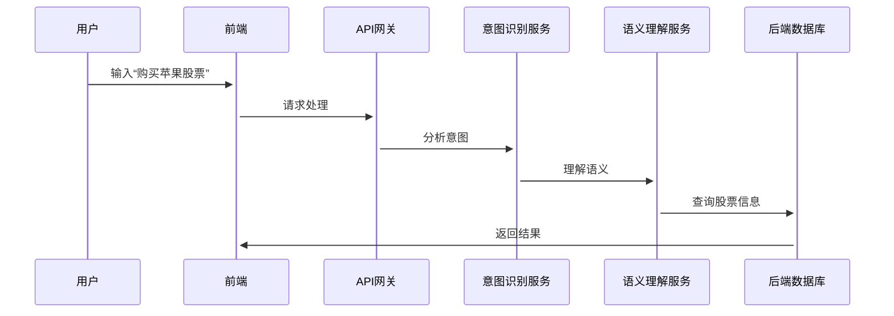
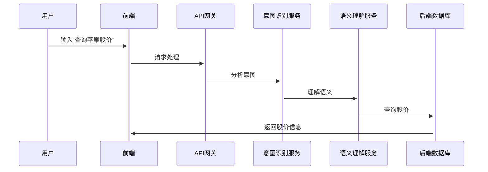

                 


# 提升金融领域语义理解与意图识别的准确性

> 关键词：金融语义理解，意图识别，自然语言处理，深度学习，金融NLP，优化与应用

> 摘要：在金融领域，语义理解与意图识别的准确性对于交易安全、客户服务和风险管理至关重要。本文深入探讨了传统NLP算法与深度学习模型在金融场景中的应用，分析了系统架构设计与优化策略，结合实际案例，提供了提升准确性的具体方法。

---

# 第一部分: 背景与核心概念

## 第1章: 问题背景与描述

### 1.1 问题背景

#### 1.1.1 金融领域语义理解的复杂性
金融领域涉及复杂的术语、多义词和上下文依赖，语义理解需要考虑市场波动、政策变化和用户意图的多样性。

#### 1.1.2 意图识别在金融交易中的重要性
意图识别直接关系到交易的安全性和效率，准确识别用户意图可以防止错误交易和欺诈行为。

#### 1.1.3 现有技术的局限性与挑战
传统NLP算法在处理复杂语义时表现有限，深度学习模型在金融领域需要大量标注数据和模型调优。

### 1.2 问题描述

#### 1.2.1 语义理解与意图识别的定义
语义理解是通过自然语言处理技术，理解文本的深层含义；意图识别则是确定用户在特定情境下的目标。

#### 1.2.2 金融领域的特殊性与需求
金融领域对准确性和实时性要求高，需要处理多种语言和复杂场景。

#### 1.2.3 提升准确性的必要性
提升准确性可以减少错误交易，提高客户满意度，增强风险控制能力。

## 第2章: 核心概念与联系

### 2.1 语义理解与意图识别的核心概念

#### 2.1.1 语义理解的基本原理
语义理解通过分析文本的结构、上下文和语境，提取有用的信息。例如，用户输入“我需要购买苹果的股票”，系统需要识别“购买”和“苹果股票”两个意图。

#### 2.1.2 意图识别的关键要素
意图识别依赖于特征提取、分类模型和上下文理解。例如，使用关键词提取和情感分析来判断用户意图。

#### 2.1.3 两者的关系与协同作用
语义理解为意图识别提供上下文信息，意图识别指导语义理解的方向，两者相互促进。

### 2.2 核心概念的属性特征对比

| 特性         | 语义理解               | 意图识别               |
|--------------|-----------------------|-----------------------|
| 输入类型     | 文本、语音             | 文本、语音、上下文     |
| 输出类型     | 实体、概念             | 具体意图               |
| 主要任务     | 理解含义               | 确定目标               |
| 依赖因素     | 词嵌入、句法分析       | 特征提取、分类模型     |
| 金融应用示例 | 识别公司财报中的关键指标 | 判断用户的交易意图     |

### 2.3 ER实体关系图


---

# 第二部分: 算法原理与数学模型

## 第3章: 传统的NLP算法

### 3.1 基础算法

#### 3.1.1 TF-IDF与词袋模型
TF-IDF用于计算词语的重要性，词袋模型将文本表示为词语的集合。例如，文本“购买苹果股票”表示为{购买, 苹果, 股票}。

#### 3.1.2 n-gram模型
n-gram模型考虑词语之间的顺序关系，常用于处理短语和序列问题。例如，三元模型可以捕捉到“购买股票”的连续性。

#### 3.1.3 朴素贝叶斯分类器
朴素贝叶斯通过计算条件概率，将文本分类到预定类别中。例如，将用户输入分类为“购买”或“查询”意图。

### 3.2 算法优缺点分析

| 算法类型       | 优点                     | 缺点                     |
|----------------|--------------------------|--------------------------|
| TF-IDF         | 简单，计算速度快         | 无法捕捉语义信息         |
| 词袋模型       | 能表示文本结构           | 无法处理语序和语义依赖   |
| n-gram模型     | 可捕捉短语顺序           | 计算复杂度高             |
| 朴素贝叶斯     | 适合小数据集             | 假设条件独立性可能不成立 |

---

## 第4章: 深度学习模型

### 4.1 RNN与LSTM

#### 4.1.1 RNN的基本原理
RNN通过循环结构处理序列数据，适用于文本生成和机器翻译。例如，处理“购买苹果股票”时，RNN逐词处理并预测下一个词。

#### 4.1.2 LSTM的结构与优势
LSTM通过门控机制解决RNN的梯度消失问题，适用于长序列数据。例如，处理金融新闻中的长句。

#### 4.1.3 在金融文本处理中的应用
LSTM用于股票价格预测和市场情绪分析。例如，分析新闻标题的情绪倾向。

### 4.2 BERT与预训练模型

#### 4.2.1 BERT的结构与特点
BERT采用双向Transformer结构，通过 masked language modeling 和 next sentence prediction 进行预训练。例如，BERT在金融领域可以用于文本摘要和实体识别。

#### 4.2.2 预训练模型的金融领域适配
在金融数据上进行微调，如使用华尔街日报文本训练模型，以适应金融术语和语境。

#### 4.2.3 模型调优与微调策略
根据金融任务调整模型参数，如减少全连接层的神经元数量，优化学习率。

### 4.3 模型流程图


### 4.4 数学模型与公式

#### 4.4.1 词嵌入的计算
词嵌入通过矩阵变换将词语映射到低维空间：
$$
W_{emb} \in \mathbb{R}^{d \times V}
$$
其中，$d$ 是嵌入维度，$V$ 是词汇量。

---

# 第三部分: 系统分析与架构设计

## 第5章: 金融场景与系统功能设计

### 5.1 金融场景介绍

#### 5.1.1 用户输入与处理流程
用户输入“查询苹果的股价”，系统将其分词、词向量化，进行意图识别和语义理解，最终执行查询操作。

#### 5.1.2 关键功能模块
- 分词与词向量化
- 意图识别模块
- 语义理解模块
- 执行与反馈模块

### 5.2 系统功能设计

#### 5.2.1 领域模型类图


#### 5.2.2 系统架构图


#### 5.2.3 接口与交互流程图


---

## 第6章: 系统架构设计

### 6.1 系统架构图


### 6.2 系统接口设计

| 接口名称       | 输入           | 输出           |
|----------------|----------------|----------------|
| 分词接口       | 文本字符串     | 分词结果       |
| 意图识别接口   | 分词结果       | 意图类别       |
| 语义理解接口   | 意图类别       | 实体信息       |
| 执行接口       | 实体信息       | 执行结果       |

### 6.3 系统交互流程图


---

# 第四部分: 项目实战

## 第7章: 项目实现与案例分析

### 7.1 环境安装

#### 7.1.1 安装Python与相关库
安装Python 3.8及以上版本，使用pip安装numpy、pandas、tensorflow、transformers等库。

#### 7.1.2 安装开发环境
安装Jupyter Notebook或VS Code，配置虚拟环境。

### 7.2 核心代码实现

#### 7.2.1 分词与词向量化
```python
import numpy as np

def tokenize(text):
    return text.split()

def word_to_vec(word, vocab_size):
    embedding_dim = 50
    return np.random.randn(embedding_dim)
```

#### 7.2.2 意图识别模型
```python
import tensorflow as tf
from tensorflow.keras import layers

model = tf.keras.Sequential([
    layers.Embedding(input_dim=10000, output_dim=16),
    layers.LSTM(32, return_sequences=True),
    layers.Dense(5, activation='softmax')
])
```

#### 7.2.3 语义理解模型
```python
import transformers

tokenizer = transformers.BertTokenizer.from_pretrained('bert-base-uncased')
model = transformers.TF BertForSequenceClassification.from_pretrained('bert-base-uncased')
```

### 7.3 代码应用解读与分析

#### 7.3.1 分词与词向量化代码
分词函数将文本分割成单词，词向量化函数为每个单词生成随机向量，模拟词嵌入。

#### 7.3.2 意图识别模型代码
使用LSTM进行序列建模，输出类别概率，类别包括购买、查询、咨询等。

#### 7.3.3 语义理解模型代码
使用BERT进行预训练，微调任务数据，输出实体识别和关系抽取结果。

### 7.4 实际案例分析

#### 7.4.1 案例1: 查询股价
输入文本：“查询苹果的股价”，系统识别意图“查询”，实体“苹果”和“股价”，执行股价查询操作。

#### 7.4.2 案例2: 购买股票
输入文本：“我要购买微软股票”，系统识别意图“购买”，实体“微软”，执行购买流程。

### 7.5 项目小结
项目实现了意图识别和语义理解的全流程，展示了在实际场景中的应用，验证了模型的有效性。

---

# 第五部分: 最佳实践与总结

## 第8章: 最佳实践与小结

### 8.1 提升准确性的策略

#### 8.1.1 数据层面
- 数据清洗与标注：去除噪声数据，标注金融领域的特定实体。
- 数据增强：使用同义词替换和句式变换，增加训练数据多样性。

#### 8.1.2 模型层面
- 模型优化：调整超参数，如学习率、批量大小，进行网格搜索。
- 模型融合：结合多个模型的输出，如集成学习和投票机制，提高准确性。

#### 8.1.3 场景层面
- 领域微调：在金融领域数据上进行微调，适应特定场景需求。
- 实时监控：监控模型性能，及时调整和更新模型。

### 8.2 小结
通过优化数据、模型和场景，可以显著提升金融领域语义理解与意图识别的准确性，满足高精度和高效率的需求。

### 8.3 注意事项

| 注意事项         | 描述                     |
|------------------|--------------------------|
| 数据质量         | 数据清洗和标注至关重要   |
| 模型选择         | 根据任务选择合适模型     |
| 资源分配         | 合理分配计算资源         |
| 持续优化         | 定期监控和更新模型       |

### 8.4 拓展阅读

| 类型       | 资源标题                         | 资源链接                         |
|------------|---------------------------------|---------------------------------|
| 书籍       | 《深度学习》                     | https://www.deeplearningbook.org |
| 论文       | BERT: Pre-training of Deep Neural Networks for NLP | https://arxiv.org/abs/1810.04692 |
| 在线课程   | 《金融NLP实战》                 | https://www.coursera.org/learn/financial-nlp |
| 工具文档   | Hugging Face Transformers库文档   | https://huggingface.co/transformers |

---

# 作者：AI天才研究院/AI Genius Institute & 禅与计算机程序设计艺术 /Zen And The Art of Computer Programming

