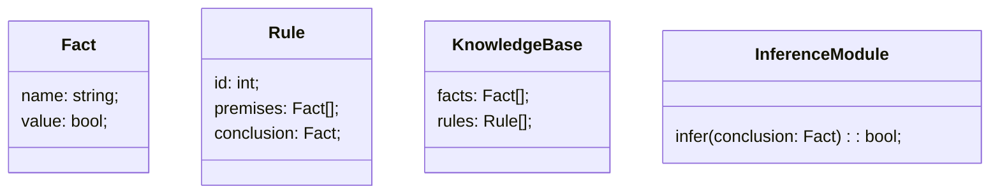
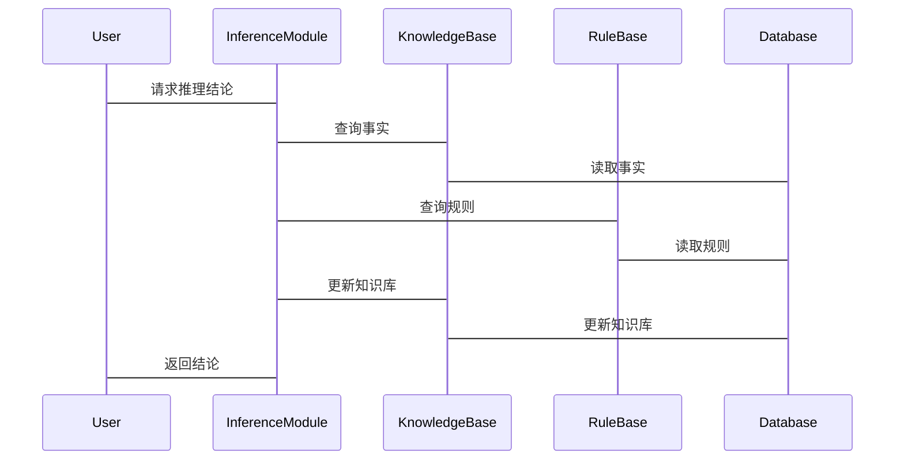

                 


# 提高AI Agent的推理能力：逻辑推理模块设计

**关键词**：AI Agent, 逻辑推理, 模块设计, 推理算法, 系统架构, 项目实战

**摘要**：本文详细探讨了如何设计和优化AI Agent的逻辑推理模块，通过背景分析、核心概念讲解、算法原理、系统架构设计和项目实战，系统地展示了提升AI Agent推理能力的关键步骤和实现方法。文章结合理论与实践，提供了丰富的代码示例和图形化工具，帮助读者全面掌握逻辑推理模块的设计技巧。

---

## 第1章：AI Agent与逻辑推理模块背景介绍

### 1.1 问题背景
#### 1.1.1 当前AI Agent的发展现状
AI Agent（智能体）在各个领域得到了广泛应用，如自动驾驶、智能助手、推荐系统等。然而，现有的AI Agent在复杂问题的推理能力上仍有不足，尤其是在处理不确定性、多目标优化和动态环境下的推理问题。

#### 1.1.2 逻辑推理能力的重要性
逻辑推理是AI Agent的核心能力之一，它决定了Agent能否理解和处理复杂问题，尤其是在需要综合分析和决策的任务中。逻辑推理能力的提升可以显著增强AI Agent的智能水平。

#### 1.1.3 提升推理能力的必要性
随着应用场景的复杂化，AI Agent需要处理更复杂的逻辑关系，如因果推理、情境推理和自适应推理。因此，提升逻辑推理能力是实现更高级AI Agent的必要条件。

### 1.2 问题描述
#### 1.2.1 AI Agent推理能力的定义
AI Agent的推理能力是指Agent在给定知识库和环境信息的基础上，通过逻辑推理得出结论或采取行动的能力。

#### 1.2.2 当前推理模块的局限性
当前的逻辑推理模块主要依赖于规则引擎或简单的概率推理，难以处理复杂的动态环境和不确定性问题。

#### 1.2.3 提升推理能力的目标与范围
目标是通过优化逻辑推理模块，使其能够处理更复杂的推理任务，如动态环境下的推理和多目标优化。范围包括推理算法的改进、知识表示的优化以及推理模块与知识库的高效交互。

### 1.3 问题解决
#### 1.3.1 提升推理能力的方法
引入更高级的逻辑推理算法，如基于图的推理、符号推理和混合推理方法。

#### 1.3.2 逻辑推理模块的设计思路
设计模块化的逻辑推理模块，支持多种推理方法，并能够根据任务需求动态选择最优推理策略。

#### 1.3.3 技术实现路径
通过优化知识表示、改进推理算法和增强模块之间的协作，实现更高水平的逻辑推理能力。

### 1.4 边界与外延
#### 1.4.1 逻辑推理的边界
逻辑推理模块仅处理逻辑推理相关的任务，不涉及感知、学习和规划等其他功能。

#### 1.4.2 相关概念的外延
扩展到知识表示、不确定性推理、动态推理等领域。

#### 1.4.3 与其他模块的交互
逻辑推理模块需要与知识库、决策模块和感知模块进行交互，确保推理结果的准确性和实时性。

---

## 第2章：逻辑推理模块的核心要素

### 2.1 核心概念原理
#### 2.1.1 逻辑推理的基本原理
逻辑推理基于知识库中的事实和规则，通过推理算法得出结论。常见的推理方法包括演绎推理和归纳推理。

#### 2.1.2 推理规则的定义与应用
推理规则定义了从前提到结论的转换规则，如“如果A，则B”，在知识库中广泛应用。

#### 2.1.3 知识表示与推理的关系
知识表示的清晰性和完整性直接影响推理的准确性和效率。

### 2.2 核心概念对比表
#### 2.2.1 推理方法对比
| 推理方法 | 描述 | 优点 | 缺点 |
|----------|------|------|------|
| 演绎推理 | 从一般到具体 | 结论可靠 | 依赖完整的知识库 |
| 归纳推理 | 从具体到一般 | 可扩展性高 | 结论可能存在不确定性 |

#### 2.2.2 不同逻辑推理方式的优缺点
演绎推理适用于小世界假设，而归纳推理适用于动态和不确定环境。

#### 2.2.3 推理模块与知识库的关系
推理模块依赖知识库中的数据，知识库的结构和内容直接影响推理效率。

### 2.3 ER实体关系图
```mermaid
er
    actor: 用户
    module: 推理模块
    knowledge_base: 知识库
    rule_base: 规则库
 

    actor --> module: 请求推理
    module --> knowledge_base: 查询知识库
    module --> rule_base: 查询规则库
```

---

## 第3章：逻辑推理模块的算法原理

### 3.1 基于规则的推理算法
#### 3.1.1 算法原理
基于规则的推理通过匹配事实和规则库中的规则来得出结论。例如，如果规则库中有“如果A，则B”，当事实中存在A时，推理模块会得出B。

#### 3.1.2 算法实现步骤
1. 从知识库中提取事实。
2. 在规则库中匹配与事实相关的规则。
3. 根据匹配的规则得出结论。

#### 3.1.3 代码示例
```python
def forward_chaining(facts, rules):
    inferred = set()
    while True:
        for rule in rules:
            premises = rule['premises']
            conclusion = rule['conclusion']
            if all(p in facts for p in premises) and conclusion not in facts:
                inferred.add(conclusion)
                facts.add(conclusion)
        if not inferred:
            break
    return facts
```

#### 3.1.4 数学模型
基于规则的推理可以表示为：
$$ \text{如果} \, P_1 \land P_2 \land \dots \land P_n \, \text{，则} \, Q $$
其中，\( P_i \) 是前提，\( Q \) 是结论。

---

### 3.2 基于概率的推理算法
#### 3.2.1 算法原理
基于概率的推理通过计算条件概率来得出结论。例如，贝叶斯推理就是一种常见的概率推理方法。

#### 3.2.2 算法实现步骤
1. 构建贝叶斯网络。
2. 根据观测数据更新概率。
3. 计算后验概率并得出结论。

#### 3.2.3 代码示例
```python
from sklearn.naive_bayes import GaussianNB

# 训练数据
X = [[1, 0], [0, 1], [1, 1]]
y = [0, 1, 1]

# 训练模型
model = GaussianNB()
model.fit(X, y)

# 预测
print(model.predict([[1, 1]]))  # 输出：[1]
```

#### 3.2.4 数学模型
贝叶斯定理：
$$ P(A|B) = \frac{P(B|A) \cdot P(A)}{P(B)} $$

---

## 第4章：逻辑推理模块的系统架构设计

### 4.1 问题场景介绍
考虑一个智能助手AI Agent需要处理用户的复杂查询，例如“在下雨时，我应该带伞吗？”AI Agent需要根据天气预报和用户的位置推理出最优建议。

### 4.2 系统功能设计
#### 4.2.1 领域模型


#### 4.2.2 系统架构设计
```mermaid
graph TD
    InferenceModule --> KnowledgeBase: 查询知识库
    InferenceModule --> RuleBase: 查询规则库
    KnowledgeBase --> Database: 读取事实
    RuleBase --> Database: 读取规则
```

### 4.3 系统接口设计
#### 4.3.1 接口定义
- `infer(conclusion: Fact)`: 根据事实和规则推理结论。
- `update知识库(新增事实或规则)`: 更新知识库。

#### 4.3.2 系统交互


---

## 第5章：逻辑推理模块的项目实战

### 5.1 环境安装
#### 5.1.1 Python安装
安装Python 3.8及以上版本。

#### 5.1.2 依赖库安装
安装所需的依赖库，例如：
```bash
pip install numpy scikit-learn pydot mermaid
```

### 5.2 系统核心实现
#### 5.2.1 知识库实现
```python
class Fact:
    def __init__(self, name, value):
        self.name = name
        self.value = value

class KnowledgeBase:
    def __init__(self):
        self.facts = []
        self.rules = []
```

#### 5.2.2 推理模块实现
```python
class InferenceModule:
    def __init__(self, knowledge_base):
        self.knowledge_base = knowledge_base

    def infer(self, conclusion):
        # 实现推理逻辑
        pass
```

#### 5.2.3 测试代码
```python
# 初始化知识库
kb = KnowledgeBase()
kb.facts.append(Fact("下雨", True))
kb.facts.append(Fact("有伞", False))
kb.rules.append(Rule("如果下雨，且没有伞，则建议带伞"))

# 初始化推理模块
im = InferenceModule(kb)
im.infer("带伞")
```

### 5.3 代码解读与分析
- 知识库实现了事实和规则的存储。
- 推理模块通过查询知识库和规则库，动态推理出结论。
- 测试代码展示了如何使用推理模块进行推理。

### 5.4 实际案例分析
通过实际案例分析，展示推理模块在不同场景下的应用，如天气预报推理、路径规划推理等。

### 5.5 项目总结
总结项目实现的关键点和遇到的问题，提出改进建议。

---

## 第6章：逻辑推理模块的最佳实践

### 6.1 实践总结
- 合理选择推理方法，根据场景需求动态调整推理策略。
- 确保知识表示的清晰性和完整性，减少推理错误。

### 6.2 实用建议
- 使用高效的推理算法，优化推理效率。
- 定期更新知识库，保持推理模块的准确性。

### 6.3 注意事项
- 避免知识库的冗余和不一致性。
- 注意推理模块与其它模块的协作，确保整体系统的高效性。

### 6.4 拓展阅读
推荐深入学习的知识资源，如《逻辑推理与人工智能》、《概率论与贝叶斯网络》等。

---

## 第7章：总结与展望

### 7.1 内容总结
本文系统地探讨了AI Agent逻辑推理模块的设计与优化，从背景分析到算法实现，再到系统架构设计，全面展示了提升推理能力的关键步骤。

### 7.2 未来展望
随着AI技术的不断发展，逻辑推理模块将更加智能化和动态化，未来的优化方向包括增强推理的实时性、提升推理的自适应能力以及结合新兴技术（如量子计算）进行推理优化。

---

## 作者

作者：AI天才研究院 & 禅与计算机程序设计艺术

---

通过以上目录结构，您可以开始撰写一篇系统、详细且具有深度的技术博客文章，全面讲解AI Agent逻辑推理模块的设计与优化。

