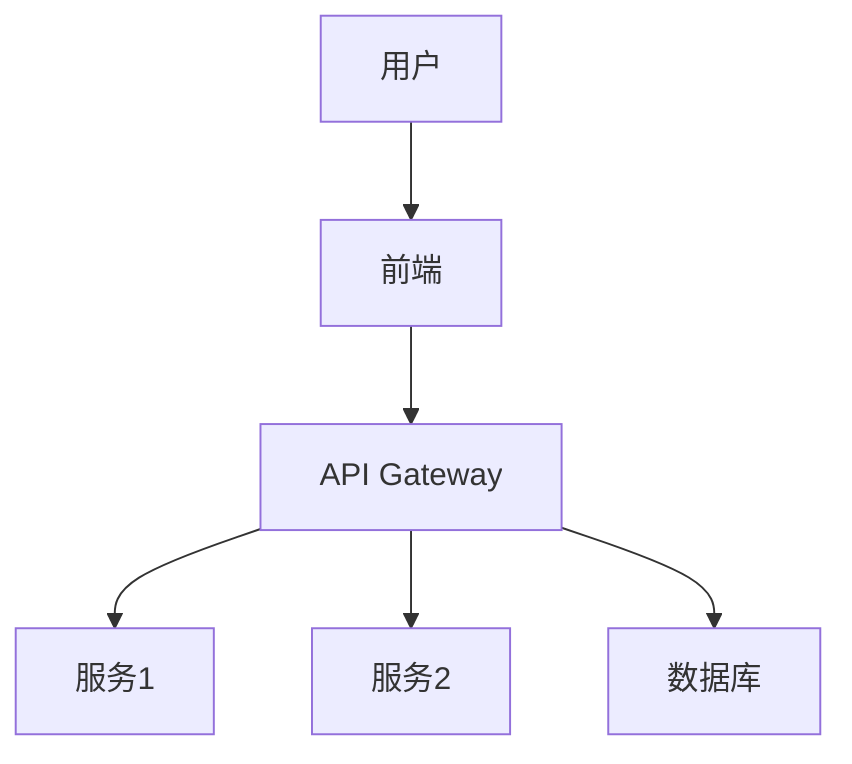
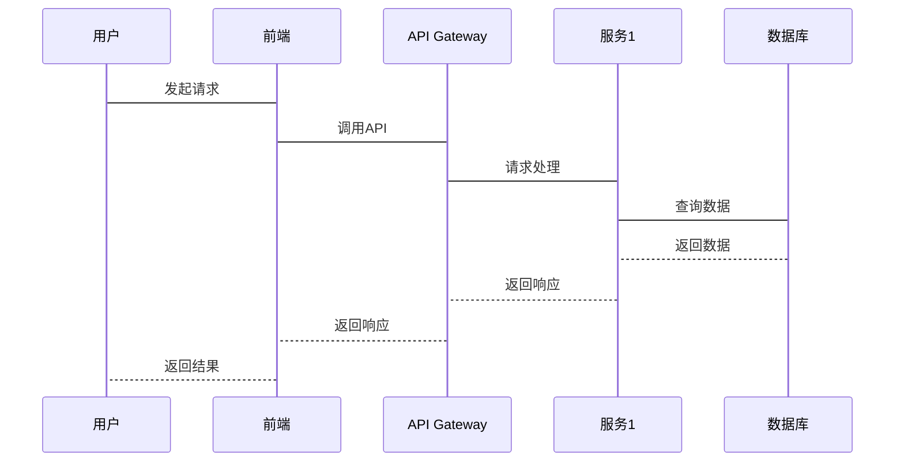

                 


# 搭建AI Agent开发环境：必要工具与框架

## 关键词：AI Agent, 开发环境, 工具与框架, 自然语言处理, 任务规划, 对话系统, 系统架构

## 摘要：本文将详细讲解搭建AI Agent开发环境所需的必要工具与框架，涵盖编程语言、机器学习框架、自然语言处理工具、系统架构设计等核心内容。通过理论与实践结合，帮助读者从零开始构建一个功能完善的AI Agent系统。

---

# 第1章: AI Agent开发环境概述

## 1.1 AI Agent的基本概念

### 1.1.1 什么是AI Agent
AI Agent（人工智能代理）是指能够感知环境、自主决策并执行任务的智能实体。它能够通过传感器获取信息，利用计算模型进行分析，并通过执行器与环境交互。

### 1.1.2 AI Agent的核心特征
- **自主性**：能够自主决策，无需外部干预。
- **反应性**：能够实时感知环境变化并做出反应。
- **目标导向性**：以特定目标为导向，执行任务。
- **学习能力**：能够通过经验优化自身行为。

### 1.1.3 AI Agent的应用场景
- 智能助手（如Siri、Alexa）
- 自动驾驶系统
- 智能客服
- 游戏AI
- 智能推荐系统

---

## 1.2 AI Agent开发环境的必要性

### 1.2.1 开发环境的重要性
AI Agent的开发涉及多个领域，包括自然语言处理、机器学习、任务规划等，因此需要一个集成的开发环境来管理这些模块。

### 1.2.2 常见的AI Agent开发工具与框架
- **编程语言**：Python、Java、C++
- **机器学习框架**：TensorFlow、PyTorch
- **NLP工具**：spaCy、Hugging Face
- **任务规划工具**：Fast Downward、PDDL

### 1.2.3 开发环境的选择与配置
选择开发环境时需要考虑性能、易用性和扩展性。通常推荐使用Python和相关开源框架的组合。

---

## 1.3 本章小结
本章介绍了AI Agent的基本概念、核心特征以及应用场景，并讨论了开发环境的重要性及常用工具与框架。接下来的章节将详细讲解开发环境的搭建和核心功能的实现。

---

# 第2章: 核心工具与框架

## 2.1 Python编程语言

### 2.1.1 Python在AI开发中的优势
- 简洁易学
- 丰富的库支持
- 跨平台能力

### 2.1.2 Python的核心库与模块
- **标准库**：collections、itertools
- **科学计算库**：NumPy、Pandas
- **可视化库**：Matplotlib

### 2.1.3 Python开发工具推荐
- **PyCharm**：推荐的IDE
- **Jupyter Notebook**：适合快速原型开发

---

## 2.2 机器学习框架

### 2.2.1 TensorFlow
- **简介**：由Google开发，广泛应用于深度学习。
- **核心功能**：构建神经网络，支持分布式训练。
- **代码示例**：
  ```python
  import tensorflow as tf
  x = tf.constant([1.0, 2.0])
  y = tf.constant([3.0, 4.0])
  result = tf.add(x, y)
  print(result.numpy())  # 输出：[5.0, 6.0]
  ```

### 2.2.2 PyTorch
- **简介**：由Facebook开发，适合动态计算。
- **核心功能**：支持自动求导，适合快速原型开发。
- **代码示例**：
  ```python
  import torch
  x = torch.tensor([1.0, 2.0], requires_grad=True)
  y = torch.tensor([3.0, 4.0], requires_grad=True)
  result = x + y
  result.backward()
  ```

### 2.2.3 其他常用框架
- **Keras**：与TensorFlow结合使用
- **MXNet**：支持多语言开发

---

## 2.3 自然语言处理工具

### 2.3.1 Hugging Face
- **简介**：提供预训练模型和工具包。
- **核心功能**：文本分类、实体识别。
- **代码示例**：
  ```python
  from transformers import pipeline
  nlp = pipeline("text-classification", model="bert-base-uncased")
  result = nlp("This is a test sentence.")
  print(result)
  ```

### 2.3.2 spaCy
- **简介**：专注于NLP任务，支持多种语言。
- **核心功能**：分词、句法分析。
- **代码示例**：
  ```python
  import spacy
  nlp = spacy.load("en_core_web_sm")
  doc = nlp("Hello, world!")
  for token in doc:
      print(token.text, token.pos_)
  ```

---

## 2.4 数据库与存储解决方案

### 2.4.1 关系型数据库
- **MySQL**：适合结构化数据存储。
- **PostgreSQL**：支持复杂查询。

### 2.4.2 NoSQL数据库
- **MongoDB**：适合非结构化数据存储。
- **Redis**：支持高速缓存和数据结构存储。

### 2.4.3 数据存储的最佳实践
- 数据规范化
- 索引优化
- 分库分表

---

## 2.5 本章小结
本章介绍了AI Agent开发中常用的核心工具与框架，包括Python编程语言、机器学习框架、NLP工具和数据库。这些工具为后续的开发环境搭建和功能实现奠定了基础。

---

# 第3章: 开发环境搭建

## 3.1 操作系统选择

### 3.1.1 Linux、Windows和macOS的优缺点
- **Linux**：适合开发者，支持多任务处理。
- **Windows**：适合图形化开发工具。
- **macOS**：适合mac用户的无缝开发体验。

---

## 3.2 安装必要的工具与库

### 3.2.1 Python安装与版本管理
- **Python 3.9+**：推荐版本。
- **虚拟环境**：使用`venv`或`virtualenv`管理依赖。

### 3.2.2 安装开发框架与库
- **TensorFlow**：`pip install tensorflow`
- **PyTorch**：`pip install torch`
- **Hugging Face**：`pip install transformers`

### 3.2.3 虚拟环境的配置与使用
- 创建虚拟环境：
  ```bash
  python -m venv myenv
  ```
- 激活虚拟环境：
  ```bash
  source myenv/bin/activate  # 在macOS/Linux
  myenv\Scripts\activate  # 在Windows
  ```

---

## 3.3 开发工具链配置

### 3.3.1 IDE的选择与配置
- **PyCharm**：推荐的IDE，支持智能补全和调试。
- **VS Code**：轻量级，支持插件扩展。

### 3.3.2 版本控制工具的使用
- **Git**：推荐使用，用于代码版本管理。
- **GitHub**：托管代码仓库的平台。

### 3.3.3 代码格式化与质量检查工具
- **Black**：代码格式化工具。
- **Flake8**：代码质量检查工具。

---

## 3.4 本章小结
本章详细讲解了开发环境的搭建过程，包括操作系统选择、工具安装和配置。通过这些步骤，读者可以构建一个完整的AI Agent开发环境。

---

# 第4章: AI Agent的核心功能实现

## 4.1 自然语言处理功能实现

### 4.1.1 NLP基础
- **词法分析**：将文本分割为词汇。
- **句法分析**：分析句子的语法结构。
- **实体识别**：识别文本中的命名实体。

### 4.1.2 模型训练与优化
- **数据预处理**：清洗、归一化。
- **模型训练**：使用预训练模型进行微调。
- **模型评估**：通过准确率、召回率等指标评估模型性能。

### 4.1.3 代码示例
```python
from transformers import BertTokenizer, TFBertModel
tokenizer = BertTokenizer.from_pretrained('bert-base-uncased')
model = TFBertModel.from_pretrained('bert-base-uncased')

text = "Hello world!"
tokenized = tokenizer(text, return_tensors='tf')
outputs = model(tokenized.input_ids)
print(outputs)
```

---

## 4.2 任务规划与推理

### 4.2.1 任务规划算法
- **图搜索算法**：A*、Dijkstra。
- **启发式规划**：使用PDDL进行规划。

### 4.2.2 推理引擎
- **逻辑推理**：基于知识库进行推理。
- **概率推理**：使用贝叶斯网络进行概率推理。

### 4.2.3 代码示例
```python
from pyhop import Hop
import heapq

def heuristic(a, b):
    return 0

def a_star(graph, start, goal):
    open_list = []
    heapq.heappush(open_list, (0, start))
    came_from = {}
    g_score = {node: float('infinity') for node in graph.nodes}
    g_score[start] = 0

    while open_list:
        current = heapq.heappop(open_list)
        if current[1] == goal:
            return reconstruct_path(came_from, start, goal)
        for neighbor in graph.neighbors(current[1]):
            tentative_g_score = g_score[current[1]] + graph.weight(current[1], neighbor)
            if tentative_g_score < g_score[neighbor]:
                came_from[neighbor] = current[1]
                g_score[neighbor] = tentative_g_score
                heapq.heappush(open_list, (tentative_g_score + heuristic(neighbor, goal), neighbor))
    return None
```

---

## 4.3 对话系统实现

### 4.3.1 对话系统架构
- **意图识别**：识别用户的意图。
- **槽位填充**：提取关键信息。
- **生成回复**：根据上下文生成回复。

### 4.3.2 实现步骤
1. **数据准备**：收集对话数据。
2. **模型训练**：训练意图识别和槽位填充模型。
3. **对话管理**：实现对话流管理。

### 4.3.3 代码示例
```python
from transformers import pipeline

nlp = pipeline("text-classification", model="bert-base-uncased")

def generate_response(user_input):
    intent = nlp(user_input)[0]['label']
    response = f"I received your request with intent {intent}."
    return response

print(generate_response("Can you help me with my homework?"))
```

---

## 4.4 本章小结
本章详细讲解了AI Agent的核心功能实现，包括自然语言处理、任务规划和对话系统。这些功能的实现为AI Agent的开发奠定了基础。

---

# 第5章: 系统架构设计

## 5.1 系统功能设计

### 5.1.1 领域模型
- **类图**：展示系统中各个类的交互关系。
- **用例图**：展示用户与系统之间的交互流程。

### 5.1.2 系统架构
- **分层架构**：将系统分为数据层、业务逻辑层和表现层。
- **微服务架构**：将功能模块化为独立的服务。

### 5.1.3 系统接口设计
- **RESTful API**：定义标准的接口规范。
- **消息队列**：使用Kafka处理异步任务。

---

## 5.2 系统架构设计

### 5.2.1 系统架构图


### 5.2.2 系统交互流程


---

## 5.3 本章小结
本章通过系统架构设计，展示了AI Agent的整体结构和各模块之间的交互关系。这为后续的开发提供了清晰的指导。

---

# 第6章: 项目实战

## 6.1 智能助手开发

### 6.1.1 需求分析
- **功能需求**：提供天气查询、日历提醒、任务管理。
- **非功能需求**：高可用性、可扩展性。

### 6.1.2 环境准备
- 安装Python和相关库。
- 配置开发工具。

### 6.1.3 核心实现
1. **天气查询模块**：
   ```python
   import requests
   def get_weather(city):
       response = requests.get(f"https://api.openweathermap.org/data/2.5/weather?q={city}&units=metric&appid=your_api_key")
       return response.json()
   ```
2. **日历提醒模块**：
   ```python
   import datetime
   def schedule_task(func, start_time):
       while True:
           if datetime.datetime.now() >= start_time:
               func()
               break
           time.sleep(1)
   ```

### 6.1.4 测试与优化
- **单元测试**：使用pytest进行测试。
- **性能优化**：通过缓存减少API调用次数。

---

## 6.2 本章小结
本章通过一个智能助手开发项目，展示了AI Agent开发的实际应用。从需求分析到核心实现，读者可以跟随步骤完成一个完整的项目。

---

# 第7章: 优化与部署

## 7.1 模型优化

### 7.1.1 模型压缩
- **剪枝**：删除冗余参数。
- **量化**：降低模型参数的精度。

### 7.1.2 模型加速
- **并行计算**：利用多核CPU或GPU加速。
- **算法优化**：优化模型结构，减少计算量。

---

## 7.2 性能调优

### 7.2.1 系统调优
- **内存优化**：减少不必要的内存占用。
- **磁盘优化**：使用SSD提升读写速度。

### 7.2.2 网络调优
- **负载均衡**：分担网络压力。
- **CDN加速**：加速静态资源加载。

---

## 7.3 部署方案

### 7.3.1 本地部署
- **虚拟机**：适合小规模部署。
- **容器化部署**：使用Docker进行容器化。

### 7.3.2 云部署
- **AWS**：提供弹性计算资源。
- **阿里云**：提供完整的云计算服务。

---

## 7.4 本章小结
本章介绍了AI Agent的优化与部署方法，包括模型优化、性能调优和部署方案。这些方法能够帮助读者提升系统的性能和可扩展性。

---

# 第8章: 总结与展望

## 8.1 本文总结
本文详细讲解了AI Agent开发环境的搭建过程，涵盖了工具选择、环境配置、功能实现和系统架构设计等关键内容。

## 8.2 未来展望
随着AI技术的不断发展，AI Agent将变得更加智能和强大。未来的研究方向包括更高效的算法、更强大的模型和更灵活的部署方式。

---

# 作者

**作者：AI天才研究院/AI Genius Institute**  
**联系方式：contact@aicourse.org**

---

以上是《搭建AI Agent开发环境：必要工具与框架》的完整目录和部分内容。通过本文，读者可以系统地学习AI Agent开发环境的搭建和核心功能的实现，为后续的AI Agent开发打下坚实的基础。

