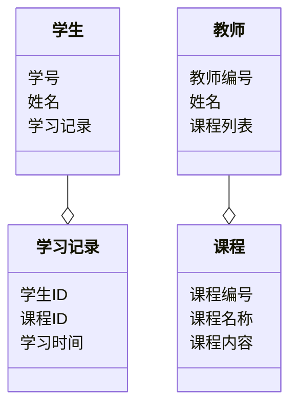
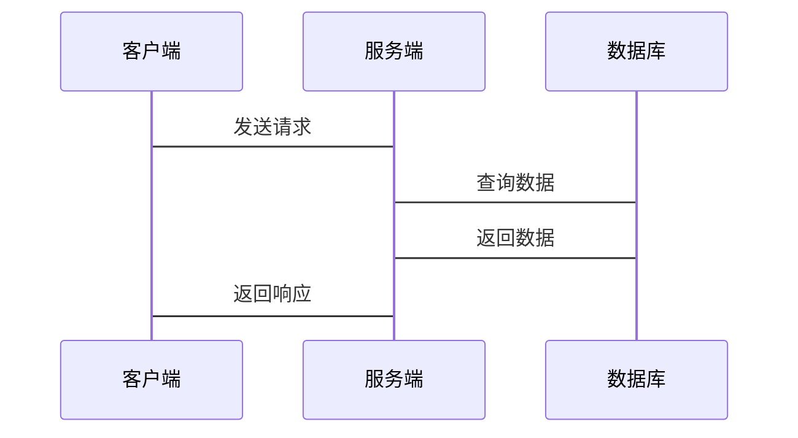

                 


# 教育科技（EdTech）的发展前景与投资价值

> **关键词**：教育科技、人工智能、大数据、投资价值、系统架构、项目实战

> **摘要**：教育科技（EdTech）作为教育与科技深度融合的产物，正在全球范围内掀起一场教育革命。随着人工智能、大数据、区块链等技术的不断进步，EdTech的应用场景和商业模式也在不断扩展和创新。本文将从EdTech的核心概念、算法原理、系统架构、项目实战以及投资价值等多个维度，深入分析教育科技的发展前景与投资价值，为读者提供全面的视角和见解。

---

## 第1章: 教育科技（EdTech）概述

### 1.1 教育科技的基本概念

#### 1.1.1 教育科技的定义
教育科技（EdTech）是指通过技术手段（如人工智能、大数据、物联网等）与教育相结合，以提高教学效率、优化学习体验、降低教育成本为目标的新兴领域。

#### 1.1.2 教育科技的核心要素
教育科技的核心要素包括：
1. **技术支撑**：人工智能、大数据、区块链等。
2. **教育场景**：在线教育、智能教学、教育管理等。
3. **用户群体**：学生、教师、教育机构、家长等。

#### 1.1.3 教育科技的演进历程
教育科技的发展经历了多个阶段：
1. **1.0阶段**：传统教育信息化（2000年之前），以计算机辅助教学为主。
2. **2.0阶段**：在线教育的崛起（2000-2015年），以MOOC（大规模开放式在线课程）为代表。
3. **3.0阶段**：人工智能驱动的个性化教育（2015年至今），以智能推荐、自适应学习为特点。

### 1.2 教育科技的现状与发展趋势

#### 1.2.1 全球教育科技的发展现状
- **市场规模**：根据Statista数据，2023年全球教育科技市场规模已超过1000亿美元。
- **主要应用**：在线课程、智能辅导系统、教育管理平台等。
- **技术驱动**：AI、大数据、5G等技术的快速发展推动了EdTech的普及。

#### 1.2.2 中国教育科技的发展特点
- **政策支持**：中国政府近年来大力推动“互联网+教育”，鼓励教育信息化发展。
- **市场潜力**：中国拥有全球最大的K-12教育市场，EdTech企业竞争激烈。
- **技术应用**：AI、区块链等技术在教育领域的应用领先全球。

#### 1.2.3 教育科技未来的发展趋势
1. **AI驱动的个性化学习**：通过AI算法分析学生的学习行为，提供个性化教学方案。
2. **虚拟现实（VR）与增强现实（AR）**：沉浸式学习体验将成为主流。
3. **教育区块链**：解决学历造假、证书管理等问题，提升教育信任度。

---

## 第2章: 教育科技的核心概念与联系

### 2.1 教育科技的核心概念

#### 2.1.1 教育科技的定义与属性
教育科技的定义可以归纳为：通过技术手段优化教育资源配置、提升教学效率和学习效果的教育模式。

#### 2.1.2 教育科技与传统教育的区别
| 属性                | 传统教育                | EdTech                   |
|---------------------|-------------------------|--------------------------|
| 教学方式            | 线下课堂                | 线上与线下结合           |
| 教学效率            | 低效                    | 高效                     |
| 个性化支持          | 有限                    | 强大                     |
| 资源共享            | 区域性                  | 全球性                   |

#### 2.1.3 教育科技的生态系统
教育科技的生态系统包括以下几个方面：
1. **技术层**：AI、大数据、区块链等技术支持。
2. **服务层**：在线课程、智能辅导、教育管理平台等。
3. **用户层**：学生、教师、家长等用户群体。

### 2.2 教育科技的核心技术支撑

#### 2.2.1 AI技术在教育中的应用
人工智能在教育中的应用主要体现在：
1. **智能推荐**：通过分析学生的学习数据，推荐个性化学习内容。
2. **自适应学习**：根据学生的学习进度动态调整教学内容。

#### 2.2.2 大数据技术在教育中的应用
大数据在教育中的应用包括：
1. **学习行为分析**：通过分析学生的学习数据，找出学习瓶颈。
2. **教育决策支持**：帮助教育机构优化资源分配。

#### 2.2.3 区块链技术在教育中的应用
区块链在教育中的应用包括：
1. **学历认证**：通过区块链技术确保学历的真实性。
2. **证书管理**：实现证书的透明化和不可篡改性。

---

## 第3章: 教育科技的核心算法与数学模型

### 3.1 数据分析与机器学习算法

#### 3.1.1 数据采集与预处理
数据采集是教育科技的第一步，主要包括以下步骤：
1. **数据来源**：学生的学习行为数据、考试成绩数据等。
2. **数据清洗**：去除噪声数据，确保数据的准确性。
3. **数据特征提取**：提取关键特征，为后续分析做准备。

#### 3.1.2 机器学习算法在教育中的应用
常用的机器学习算法包括：
1. **监督学习**：用于分类和回归问题，例如预测学生的学习成绩。
2. **无监督学习**：用于聚类问题，例如发现学生的学习行为模式。

#### 3.1.3 常见算法的数学模型
以线性回归为例，其数学模型为：
$$ y = \beta_0 + \beta_1x + \epsilon $$
其中，$y$ 是目标变量，$x$ 是自变量，$\beta_0$ 和 $\beta_1$ 是回归系数，$\epsilon$ 是误差项。

---

## 第4章: 教育科技的系统分析与架构设计

### 4.1 问题场景介绍

#### 4.1.1 教育科技的典型应用场景
1. **在线教育平台**：例如网校、直播课程等。
2. **智能学习系统**：例如自适应学习平台。

#### 4.1.2 系统目标与需求分析
- **目标**：提供个性化学习体验，优化教学效率。
- **需求**：支持多平台访问、实时数据分析、个性化推荐等。

#### 4.1.3 系统边界与外部实体
系统边界包括：
- **用户**：学生、教师、家长。
- **课程内容**：视频课程、习题库等。
- **外部系统**：第三方支付平台、认证系统等。

### 4.2 系统功能设计

#### 4.2.1 领域模型设计
领域模型的设计需要考虑以下几点：
1. **核心实体**：学生、教师、课程、学习记录。
2. **核心关系**：学生与课程的关系，教师与课程的关系。

#### 4.2.2 系统功能模块划分
系统功能模块包括：
1. **用户管理模块**：注册、登录、个人信息管理。
2. **课程管理模块**：课程发布、课程分类、课程详情。
3. **学习管理模块**：学习计划、学习进度、学习记录。
4. **数据分析模块**：学习行为分析、学习效果评估。

#### 4.2.3 功能模块之间的关系
功能模块之间的关系可以用Mermaid类图表示：



### 4.3 系统架构设计

#### 4.3.1 系统架构图
系统架构可以用Mermaid架构图表示：

```mermaid
archi
    服务端 -> 数据库: 提供API接口
    客户端 -> 服务端: 发送请求
    数据库 <- 服务端: 存储数据
```

#### 4.3.2 系统组件之间的交互
系统组件之间的交互可以用Mermaid序列图表示：



#### 4.3.3 系统的可扩展性设计
系统设计需要考虑以下可扩展性：
1. **模块化设计**：各个功能模块独立，便于后续扩展。
2. **接口设计**：提供RESTful API，方便与其他系统集成。

---

## 第5章: 教育科技的项目实战

### 5.1 环境安装

#### 5.1.1 开发工具安装
- **Python**：安装Python 3.8及以上版本。
- **框架选择**：推荐使用Django或Flask框架。
- **数据库**：推荐使用MySQL或MongoDB。

#### 5.1.2 开发环境配置
- **虚拟环境**：使用venv或conda创建虚拟环境。
- **依赖管理**：使用pip安装所需库，例如Django、Flask、pandas等。

### 5.2 系统核心实现源代码

#### 5.2.1 个性化推荐算法实现
以下是基于协同过滤的推荐算法示例代码：

```python
def collaborative_filtering(user_id, user_features):
    # 计算用户之间的相似度
    similarities = {}
    for user in user_features:
        if user != user_id:
            similarity = calculate_similarity(user_id, user, user_features)
            similarities[user] = similarity
    # 获取最相似的用户
    similar_users = sorted(similarities.items(), key=lambda x: x[1], reverse=True)
    # 返回推荐结果
    recommendations = []
    for user in similar_users[:5]:
        recommendations.extend(user_features[user]['recommended_courses'])
    return recommendations
```

#### 5.2.2 系统功能实现
以下是用户管理模块的实现代码：

```python
from django.contrib.auth.models import User
from django.contrib.auth import authenticate, login, logout

def user_login(request):
    if request.method == 'POST':
        username = request.POST['username']
        password = request.POST['password']
        user = authenticate(request, username=username, password=password)
        if user is not None:
            login(request, user)
            return redirect('index')
        else:
            return render(request, 'login.html', {'error': '用户名或密码错误'})
    else:
        return render(request, 'login.html')
```

### 5.3 实际案例分析

#### 5.3.1 案例分析
以某在线教育平台为例，分析其系统架构和功能实现：
1. **系统架构**：采用前后端分离架构，前端使用React，后端使用Django。
2. **功能实现**：课程管理、用户管理、学习记录管理等。

#### 5.3.2 代码应用解读与分析
通过分析实际项目代码，总结系统设计的优缺点，并提出改进建议。

### 5.4 项目小结

#### 5.4.1 项目总结
总结项目的开发过程、遇到的问题及解决方案。

#### 5.4.2 项目经验
分享项目开发中的经验与教训，为后续项目提供参考。

---

## 第6章: 教育科技的最佳实践与投资价值

### 6.1 最佳实践 tips

#### 6.1.1 系统设计建议
1. **模块化设计**：确保系统易于扩展。
2. **安全性设计**：保护用户数据和隐私。
3. **用户体验优化**：提升用户满意度。

#### 6.1.2 技术选型建议
1. **前端**：推荐使用React或Vue.js。
2. **后端**：推荐使用Django或Spring Boot。
3. **数据库**：推荐使用MySQL或MongoDB。

### 6.2 小结

#### 6.2.1 文章总结
总结全文内容，重申教育科技的重要性和发展前景。

#### 6.2.2 未来展望
展望教育科技的未来发展方向，分析其在社会和经济中的潜在影响。

### 6.3 投资价值分析

#### 6.3.1 投资机会
1. **在线教育**：尤其是K-12教育领域。
2. **AI教育**：AI驱动的个性化学习平台。
3. **教育管理**：教育信息化管理平台。

#### 6.3.2 投资风险
1. **市场竞争**：行业竞争激烈，企业生存压力大。
2. **政策风险**：教育政策的变化可能影响行业发展。

#### 6.3.3 投资建议
1. **关注技术创新**：投资基于前沿技术的企业。
2. **关注市场潜力**：选择有较大市场空间的企业。
3. **关注团队能力**：投资团队经验丰富的企业。

---

## 作者信息

**作者：AI天才研究院/AI Genius Institute & 禅与计算机程序设计艺术 /Zen And The Art of Computer Programming**

---

以上是《教育科技（EdTech）的发展前景与投资价值》的文章大纲，具体内容需要根据实际需求进一步扩展和详细撰写。

