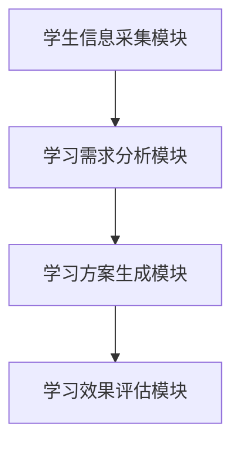
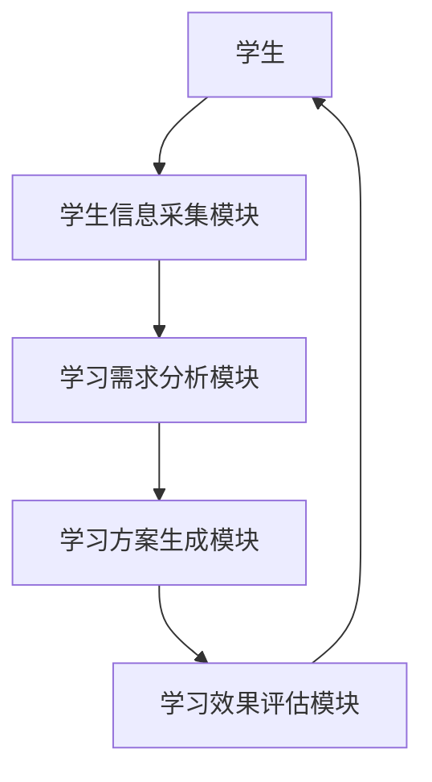

                 


# 教育领域AI Agent的个性化学习方案

> 关键词：AI Agent，个性化学习，教育技术，推荐系统，自然语言处理

> 摘要：随着人工智能技术的飞速发展，教育领域的个性化学习需求日益增长。AI Agent（人工智能代理）作为实现个性化学习的重要工具，能够通过分析学生的学习数据，推荐适合的学习资源和路径，从而提升学习效率。本文将深入探讨AI Agent在教育中的应用，从核心算法到系统设计，再到实际案例，全面解析个性化学习方案的实现。

---

# 第1章: AI Agent与个性化学习概述

## 1.1 AI Agent的基本概念

### 1.1.1 人工智能代理（AI Agent）的定义

人工智能代理（AI Agent）是指能够感知环境并采取行动以实现目标的智能实体。它可以是一个软件程序，也可以是一个物理设备，通过传感器和执行器与环境交互。AI Agent的核心目标是通过智能化的决策和行动，为用户提供高效、个性化的服务。

AI Agent的基本特征包括：

1. **自主性**：能够在没有外部干预的情况下自主运行。
2. **反应性**：能够感知环境并实时调整行为。
3. **目标导向**：所有行动都围绕实现特定目标展开。
4. **学习能力**：通过数据和经验不断优化自身的决策能力。

### 1.1.2 AI Agent在教育中的应用潜力

教育领域的AI Agent可以通过分析学生的学习行为、偏好和能力，提供个性化的学习建议和资源推荐。例如，AI Agent可以根据学生的学习进度和兴趣爱好，推荐适合的学习材料和练习题，帮助学生更高效地掌握知识。

---

## 1.2 个性化学习的定义与特征

### 1.2.1 个性化学习的内涵

个性化学习是指根据每个学生的兴趣、能力和学习目标，量身定制的学习方案。与传统的“一刀切”教学方式不同，个性化学习强调学生的个体差异，注重因材施教。

### 1.2.2 个性化学习与传统教育的区别

| 特性         | 个性化学习               | 传统教育               |
|--------------|--------------------------|------------------------|
| 教学目标     | 因材施教，个性化发展       | 统一教学目标，标准化评估 |
| 教学方式     | 非线性学习路径，灵活调整   | 线性教学计划，固定进度   |
| 学习资源     | 针对性推荐，动态调整       | 统一教材，固定资源       |
| 学习评估     | 多维度评估，动态反馈       | 统一考试，定期评估       |

### 1.2.3 个性化学习的目标与挑战

个性化学习的目标是通过智能化的手段，为每个学生提供最适合的学习方案，最大化学习效率和效果。然而，实现个性化学习也面临诸多挑战，例如数据隐私、算法复杂性和个性化推荐的准确性等。

---

# 第2章: 教育领域AI Agent的核心概念

## 2.1 教育领域AI Agent的定义与特点

### 2.1.1 教育AI Agent的功能模块

教育AI Agent通常包含以下几个核心功能模块：

1. **学生信息采集模块**：收集学生的学习数据，包括学习记录、成绩、兴趣爱好等。
2. **学习需求分析模块**：分析学生的现有能力和学习目标，确定需要改进的领域。
3. **学习方案生成模块**：基于分析结果，生成个性化的学习计划和资源推荐。
4. **学习效果评估模块**：跟踪学习进度，评估方案的有效性，并进行动态调整。

### 2.1.2 教育AI Agent的核心算法

教育AI Agent的核心算法包括推荐算法和自然语言处理算法。这些算法能够帮助系统更好地理解学生的需求，并提供精准的推荐。

---

## 2.2 个性化学习方案的关键要素

### 2.2.1 学生特征分析

学生特征分析是个性化学习方案的基础。通过分析学生的兴趣、学习风格、知识水平等特征，可以为每个学生量身定制学习计划。

### 2.2.2 学习目标设定

学习目标的设定需要结合学生的实际情况和学习需求。例如，对于一个数学基础较弱的学生，目标可以是掌握基础的代数运算。

### 2.2.3 学习路径规划

学习路径规划是个性化学习方案的核心。通过分析学生的学习数据，系统可以推荐最优的学习路径，帮助学生逐步实现学习目标。

---

# 第3章: 教育领域AI Agent的核心算法

## 3.1 推荐算法

### 3.1.1 基于协同过滤的推荐算法

协同过滤是一种常用的推荐算法，通过分析用户的相似性，推荐相似用户的偏好。例如，如果学生A和学生B的学习风格相似，系统可以将学生A喜欢的学习资源推荐给学生B。

协同过滤的基本公式如下：

$$ sim(i, j) = \frac{\sum_{k=1}^{n} (r_{i,k} - \bar{r}_i)(r_{j,k} - \bar{r}_j)}{\sqrt{\sum_{k=1}^{n} (r_{i,k} - \bar{r}_i)^2} \cdot \sqrt{\sum_{k=1}^{n} (r_{j,k} - \bar{r}_j)^2}} $$

其中，$sim(i, j)$ 表示用户i和用户j之间的相似性，$r_{i,k}$ 表示用户i对项目k的评分，$\bar{r}_i$ 表示用户i的平均评分。

---

## 3.2 自然语言处理算法

### 3.2.1 基于词袋模型的文本分析

词袋模型是一种简单的文本表示方法，通过统计文本中每个词的出现频率，来表示文本的内容。例如，对于一段文本“我喜欢编程”，词袋模型可以表示为：{'我': 1, '喜欢': 1, '编程': 1}。

### 3.2.2 基于词嵌入的文本表示

词嵌入是一种更高级的文本表示方法，通过将词映射到高维向量空间，捕捉词义信息。例如，使用Word2Vec算法，可以将“编程”映射到一个特定的向量。

### 3.2.3 基于Transformer的文本生成

Transformer是一种强大的文本生成模型，广泛应用于机器翻译和文本生成任务。通过自注意力机制，Transformer可以捕捉文本中的长距离依赖关系。

---

# 第4章: 教育领域AI Agent的系统架构设计

## 4.1 系统功能模块划分

### 4.1.1 学生信息采集模块

学生信息采集模块负责收集学生的学习数据，包括学习记录、成绩、兴趣爱好等。这些数据将用于后续的分析和推荐。

### 4.1.2 学习需求分析模块

学习需求分析模块通过对学生数据的分析，确定学生的知识水平、学习目标和学习风格。例如，系统可以通过分析学生的考试成绩，确定学生的薄弱科目。

### 4.1.3 学习方案生成模块

学习方案生成模块基于学习需求分析的结果，生成个性化的学习计划和资源推荐。例如，系统可以根据学生的兴趣爱好，推荐相关的学习资料。

### 4.1.4 学习效果评估模块

学习效果评估模块负责跟踪学生的学习进度，并评估学习方案的有效性。例如，系统可以通过定期测试，评估学生是否掌握了目标知识。

---

## 4.2 系统架构图

以下是系统的总体架构图：



---

## 4.3 系统接口设计

### 4.3.1 学生信息接口

学生信息接口用于获取学生的基本信息，例如学号、姓名、班级等。

### 4.3.2 学习需求分析接口

学习需求分析接口用于获取学生的学习数据，例如考试成绩、学习记录等。

### 4.3.3 学习方案生成接口

学习方案生成接口用于生成个性化学习方案，返回推荐的学习资源和学习计划。

### 4.3.4 学习效果评估接口

学习效果评估接口用于评估学习方案的有效性，返回评估结果。

---

# 第5章: 教育领域AI Agent的项目实战

## 5.1 环境搭建与工具安装

### 5.1.1 开发环境配置

建议使用Python作为开发语言，安装以下工具：

- **Python**: 3.8+
- **TensorFlow**: 2.0+
- **Keras**: 2.2.5+
- **NLTK**: 3.6+

### 5.1.2 必要工具安装

```bash
pip install numpy
pip install scikit-learn
pip install transformers
```

---

## 5.2 核心算法实现

### 5.2.1 推荐算法的Python实现

以下是一个基于协同过滤的推荐算法实现：

```python
def calculate_similarity(user1, user2):
    # 计算用户1和用户2的相似性
    common_ratings = [r for r in zip(user1.ratings, user2.ratings) if r[0] > 0 and r[1] > 0]
    if not common_ratings:
        return 0.0
    numerator = sum((r1 - user1.avg) * (r2 - user2.avg) for r1, r2 in common_ratings)
    denominator = (sum((r - user1.avg)**2 for r in user1.ratings if r > 0) ** 0.5) * (sum((r - user2.avg)**2 for r in user2.ratings if r > 0) ** 0.5)
    return numerator / denominator if denominator != 0 else 0.0
```

---

## 5.2.2 自然语言处理算法的Python实现

以下是一个基于词嵌入的文本表示实现：

```python
from transformers import AutoTokenizer, AutoModel

tokenizer = AutoTokenizer.from_pretrained('bert-base-uncased')
model = AutoModel.from_pretrained('bert-base-uncased')

def get_word_embeddings(text):
    inputs = tokenizer(text, return_tensors='np')
    embeddings = model(**inputs)
    return embeddings.last_hidden_state.numpy().mean(axis=1)
```

---

## 5.2.3 系统交互流程

以下是系统交互的流程图：



---

# 第6章: 总结与展望

## 6.1 总结

本文详细介绍了教育领域AI Agent的个性化学习方案，从核心概念到系统设计，再到实际案例，全面解析了个性化学习方案的实现。通过推荐算法和自然语言处理算法，AI Agent能够为学生提供精准的学习资源和学习路径，帮助学生更高效地掌握知识。

## 6.2 未来展望

随着人工智能技术的不断进步，教育领域AI Agent的个性化学习方案将更加智能化和个性化。未来的挑战在于如何进一步提升算法的准确性和系统的可扩展性，同时保护学生的数据隐私。

---

# 作者：AI天才研究院/AI Genius Institute & 禅与计算机程序设计艺术 /Zen And The Art of Computer Programming

