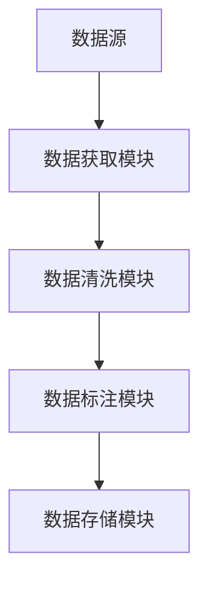
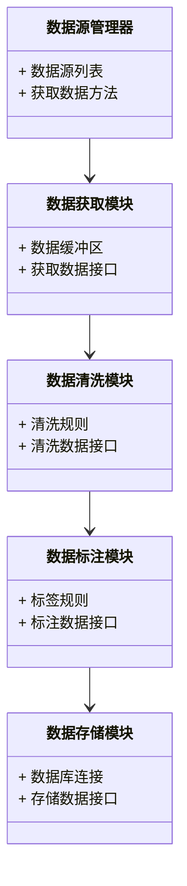
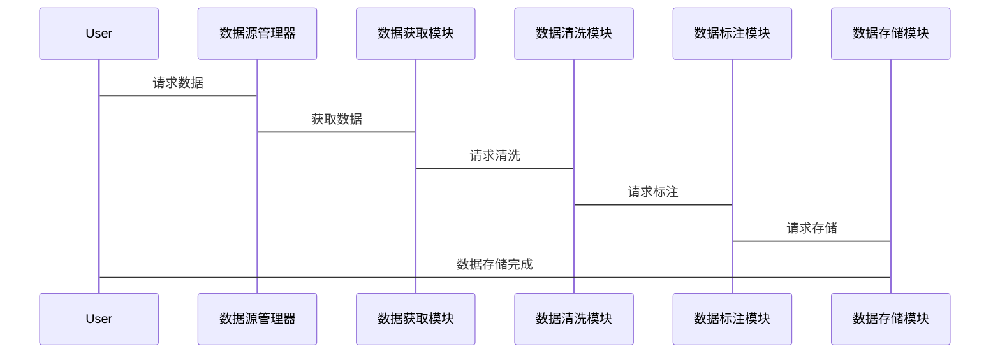

                 


# 数据收集策略：为AI Agent打造高质量数据集

## 关键词：数据收集策略、AI Agent、高质量数据集、数据清洗、数据标注、数据收集算法

## 摘要：  
本文将详细探讨如何为AI Agent设计有效的数据收集策略，以打造高质量的数据集。通过分析数据收集的核心概念、算法原理、系统架构以及实际案例，我们将一步步揭示如何选择合适的数据源、优化数据收集流程，并确保数据的高质量，从而为AI Agent提供坚实的数据基础。

---

# 第一部分: 数据收集策略背景与核心概念

## 第1章: 数据收集策略的背景与重要性

### 1.1 数据收集的定义与背景

#### 1.1.1 数据收集的基本概念  
数据收集是指通过各种渠道获取数据的过程，这些数据可以是结构化的（如表格数据）或非结构化的（如文本、图像）。数据收集是AI Agent的核心能力之一，因为它需要依赖数据来做出决策和执行任务。

#### 1.1.2 数据收集在AI Agent中的作用  
AI Agent需要通过数据收集来感知环境、理解用户需求并做出响应。高质量的数据是AI Agent实现智能决策的关键。

#### 1.1.3 数据质量对AI模型性能的影响  
数据质量直接影响AI模型的性能。低质量的数据会导致模型的预测能力下降，甚至出现错误。

### 1.2 AI Agent与数据收集的关系

#### 1.2.1 AI Agent的基本概念  
AI Agent是一种智能体，能够通过感知环境、执行任务和学习来实现特定目标。

#### 1.2.2 数据在AI Agent决策中的核心作用  
AI Agent需要通过数据收集来获取环境信息，并基于这些信息做出决策。

#### 1.2.3 数据收集对AI Agent能力的提升  
通过高质量的数据收集，AI Agent能够更好地理解环境、提高决策的准确性，并实现更复杂的任务。

### 1.3 数据收集的挑战与机遇

#### 1.3.1 数据收集的主要挑战  
- 数据源的多样性：如何选择合适的数据源？  
- 数据质量：如何确保数据的准确性？  
- 数据隐私：如何在数据收集过程中保护隐私？

#### 1.3.2 数据收集的潜在机遇  
- 提高AI Agent的智能水平  
- 通过数据优化模型性能  
- 支持更复杂的AI应用场景

#### 1.3.3 数据收集的未来发展趋势  
随着技术的进步，数据收集将更加智能化、自动化，并注重数据隐私保护。

---

## 第2章: 数据收集的核心概念与策略

### 2.1 数据收集的策略分类

#### 2.1.1 主动学习策略  
主动学习是一种数据收集策略，AI Agent会主动选择最具信息量的数据点进行收集。

#### 2.1.2 强化学习策略  
强化学习策略通过奖励机制，引导AI Agent选择最优的数据收集路径。

#### 2.1.3 监督学习策略  
监督学习策略基于已标注的数据进行学习，并指导数据收集的过程。

### 2.2 数据收集的工具与平台

#### 2.2.1 数据收集工具的选择  
选择数据收集工具时，需考虑工具的功能、易用性和适用性。

#### 2.2.2 数据收集平台的优缺点对比  
- 免费平台：如Google BigQuery、AWS S3  
- 付费平台：如Snowflake、Oracle

#### 2.2.3 数据收集工具的安装与配置  
以Python为例，安装常用的数据收集工具，如BeautifulSoup、Scrapy。

### 2.3 数据收集的流程与方法

#### 2.3.1 数据需求分析  
明确数据收集的目标和需求，制定数据收集计划。

#### 2.3.2 数据源的选择  
根据需求选择合适的数据源，如API接口、数据库或网页爬取。

#### 2.3.3 数据收集的具体实施步骤  
1. 数据清洗：去除重复、错误或无关数据。  
2. 数据标注：对数据进行分类或标签化。  
3. 数据存储：将数据存储到数据库或数据仓库中。

---

## 第3章: 数据收集的算法原理与实现

### 3.1 数据收集的算法原理

#### 3.1.1 主动学习算法原理  
主动学习算法通过选择最具代表性的数据点，逐步优化数据集。

#### 3.1.2 强化学习算法原理  
强化学习算法通过奖励机制，引导数据收集过程中的决策。

#### 3.1.3 监督学习算法原理  
监督学习算法基于已标注数据，指导数据收集的过程。

### 3.2 数据收集的算法实现

#### 3.2.1 主动学习算法的Python实现  

```python
import numpy as np

def active_learning(X, y, model, selection_criteria):
    unlabeled_indices = np.where(y == -1)[0]
    selected_idx = selection_criteria(model, X[unlabeled_indices])
    return selected_idx
```

#### 3.2.2 强化学习算法的Python实现  

```python
import gym

env = gym.make('CartPole-v0')
policy = lambda obs: np.random.randint(2)
for _ in range(1000):
    obs = env.reset()
    done = False
    while not done:
        action = policy(obs)
        obs, reward, done, info = env.step(action)
```

#### 3.2.3 监督学习算法的Python实现  

```python
from sklearn.datasets import load_iris
from sklearn.model_selection import train_test_split

X, y = load_iris(return_X_y=True)
X_train, X_test, y_train, y_test = train_test_split(X, y, test_size=0.2)
```

### 3.3 数据收集的数学模型与公式

#### 3.3.1 主动学习的数学模型  

$$ \text{选择概率} = \frac{\text{数据点的重要性}}{\sum \text{所有数据点的重要性}} $$

#### 3.3.2 强化学习的数学模型  

$$ Q(s, a) = (1-\alpha) Q(s, a) + \alpha (r + \gamma Q(s', a')) $$

#### 3.3.3 监督学习的数学模型  

$$ \text{损失函数} = \sum (y - \hat{y})^2 $$

---

## 第4章: 数据收集的系统分析与架构设计

### 4.1 系统分析

#### 4.1.1 数据收集的系统目标  
设计一个高效、智能的数据收集系统，支持多种数据源和数据格式。

#### 4.1.2 数据收集的系统功能需求  
- 数据源管理：支持多种数据源接口。  
- 数据清洗：自动去除低质量数据。  
- 数据标注：支持自动或手动标注。  

#### 4.1.3 数据收集的系统性能需求  
- 数据处理速度：快速处理大规模数据。  
- 系统稳定性：保证数据收集过程的稳定性。

### 4.2 系统架构设计

#### 4.2.1 数据收集系统的总体架构  



#### 4.2.2 数据收集的详细架构  



#### 4.2.3 系统接口设计  
- 数据源接口：提供数据获取的API。  
- 数据清洗接口：提供数据清洗的规则。  
- 数据存储接口：提供数据存储的API。

#### 4.2.4 系统交互设计  



---

## 第5章: 数据收集的项目实战

### 5.1 项目背景与目标

#### 5.1.1 项目背景  
本项目旨在通过设计一个数据收集系统，帮助AI Agent高效地收集高质量数据。

#### 5.1.2 项目目标  
- 实现数据收集的自动化。  
- 确保数据的高质量。  
- 提供灵活的数据标注功能。

### 5.2 环境安装与配置

#### 5.2.1 系统环境  
- Python 3.8+  
- 数据库：MySQL或PostgreSQL  
- 网络环境：支持数据源访问。

#### 5.2.2 工具安装  
```bash
pip install requests beautifulsoup4 scikit-learn
```

### 5.3 核心实现与代码解读

#### 5.3.1 数据获取模块  

```python
import requests
from bs4 import BeautifulSoup

def fetch_data(url):
    response = requests.get(url)
    soup = BeautifulSoup(response.text, 'html.parser')
    data = []
    for item in soup.find_all('div', class_='data-item'):
        data.append({
            'title': item.find('h2').text,
            'content': item.find('p').text
        })
    return data
```

#### 5.3.2 数据清洗模块  

```python
def clean_data(raw_data):
    cleaned_data = []
    for item in raw_data:
        if len(item['content']) > 10:
            cleaned_data.append({
                'title': item['title'],
                'content': item['content'].strip()
            })
    return cleaned_data
```

#### 5.3.3 数据标注模块  

```python
def annotate_data(cleaned_data, model):
    annotated_data = []
    for item in cleaned_data:
        label = model.predict([item['content']])[0]
        annotated_data.append({
            'title': item['title'],
            'content': item['content'],
            'label': label
        })
    return annotated_data
```

### 5.4 数据收集与评估

#### 5.4.1 数据收集流程  
1. 从指定URL获取数据。  
2. 清洗数据，去除低质量数据。  
3. 使用模型对数据进行标注。  
4. 将标注后的数据存储到数据库中。

#### 5.4.2 数据质量评估  
- 准确率：标注数据的准确性。  
- 完整性：数据的覆盖率。  
- 一致性：数据格式的统一性。

#### 5.4.3 项目小结  
通过本项目，我们成功实现了一个高效的数据收集系统，能够为AI Agent提供高质量的数据支持。

---

## 第6章: 数据收集的最佳实践与注意事项

### 6.1 最佳实践

#### 6.1.1 数据收集策略的选择  
根据具体需求选择合适的数据收集策略。

#### 6.1.2 数据隐私保护  
在数据收集过程中，严格遵守数据隐私保护法规。

#### 6.1.3 数据清洗与标注  
确保数据清洗和标注的准确性，避免低质量数据对模型的影响。

### 6.2 小结

通过本文的详细讲解，我们了解了如何为AI Agent设计高效的数据收集策略，并掌握了数据收集的核心概念、算法实现和系统架构设计。

### 6.3 注意事项

- 数据隐私：严格遵守相关法律法规。  
- 数据安全：确保数据存储和传输的安全性。  
- 数据质量：通过清洗和标注确保数据的高质量。

### 6.4 拓展阅读

- 《数据挖掘导论》  
- 《机器学习实战》  
- 《AI Agent原理与应用》

---

## 作者信息

作者：AI天才研究院/AI Genius Institute & 禅与计算机程序设计艺术 /Zen And The Art of Computer Programming

---

通过本文的详细讲解，我们系统地探讨了如何为AI Agent设计高效的数据收集策略，并掌握了数据收集的核心概念、算法实现和系统架构设计。希望本文能够为读者在数据收集领域提供有价值的参考和启发。

