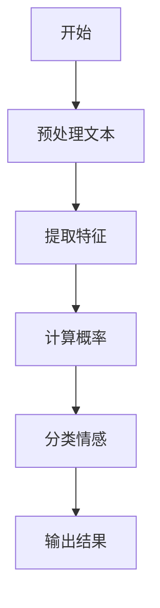
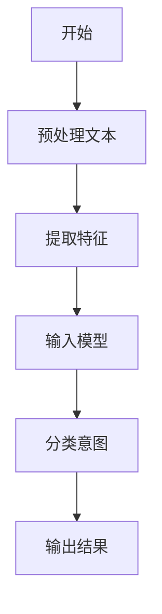
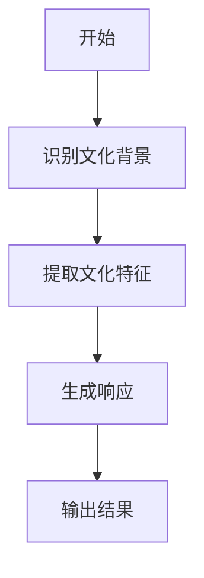
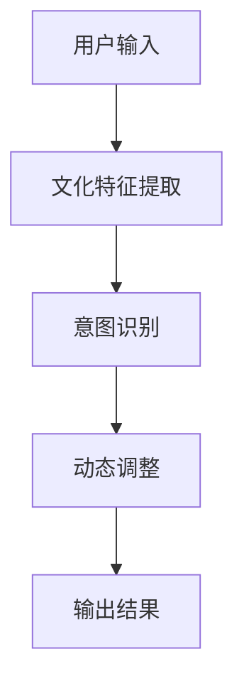
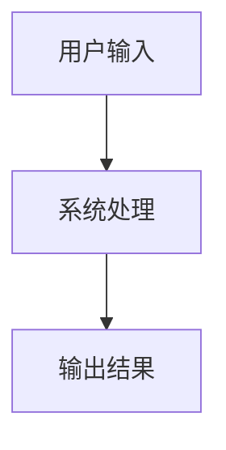

                 

# 文化适应：让AI Agent理解不同文化背景

## 关键词：文化适应，AI Agent，跨文化对话，文化敏感性，文化差异，意图识别，情感分析

## 摘要：  
随着人工智能技术的快速发展，AI Agent在各个领域的应用日益广泛。然而，AI Agent在不同文化背景下的表现仍面临诸多挑战。本文将从文化适应的核心概念出发，探讨AI Agent如何理解和适应不同文化背景，详细分析文化适应的算法原理、系统架构，并通过实际案例展示文化适应在AI Agent中的应用。本文还提供了丰富的代码示例和系统设计图，帮助读者全面理解文化适应的关键技术与实现方法。

---

# 第一部分: 文化适应的基本概念

## 第1章: 文化适应的定义与重要性

### 1.1 什么是文化适应
#### 1.1.1 文化适应的定义
文化适应是指AI Agent能够理解和适应不同文化背景下的用户需求、语言习惯、行为模式和价值观的能力。它通过分析文化特征，动态调整AI的行为和输出，以更好地满足用户期望。

#### 1.1.2 文化适应的核心要素
文化适应的核心要素包括文化背景识别、文化特征提取、文化差异分析和动态调整机制。例如，AI Agent需要识别用户的语言、情感倾向和文化价值观，以便在跨文化对话中准确理解用户的意图。

#### 1.1.3 文化适应与跨文化交流的关系
跨文化交流涉及不同文化背景下的人们之间的互动，文化适应是AI Agent实现有效跨文化交流的关键。通过文化适应，AI Agent能够更好地理解用户的需求，避免误解和冲突。

### 1.2 为什么AI Agent需要文化适应
#### 1.2.1 AI Agent在不同文化背景下的挑战
不同文化背景下，用户的语言表达、情感倾向和行为习惯存在显著差异。例如，某些文化更倾向于直接表达情感，而其他文化则更注重含蓄和间接的表达方式。这些差异可能导致AI Agent在理解和响应时出现错误。

#### 1.2.2 文化差异对AI行为的影响
文化差异会影响用户对AI Agent输出的接受度和满意度。例如，在某些文化中，用户更倾向于遵循权威的建议，而在其他文化中，用户可能更注重个性化和自主决策。AI Agent需要根据文化背景调整其推荐策略。

#### 1.2.3 提高文化适应能力的意义
提高文化适应能力可以增强AI Agent的用户体验和信任度。文化适应不仅能够提高AI的准确性，还能减少文化冲突，促进跨文化合作。

### 1.3 文化适应的边界与外延
#### 1.3.1 文化适应的适用范围
文化适应适用于需要跨文化交互的场景，如客服、教育、医疗和娱乐等领域。例如，在医疗领域，AI Agent需要根据患者的语言习惯和文化背景提供个性化的健康建议。

#### 1.3.2 文化适应与其他概念的区分
文化适应与文化敏感性、文化多样性密切相关，但有所不同。文化敏感性是指AI Agent能够感知和尊重不同文化的特点，而文化适应则更进一步，通过动态调整实现与目标文化的匹配。

#### 1.3.3 文化适应的未来发展趋势
未来，文化适应将更加智能化和个性化。AI Agent将能够实时分析用户的文化特征，并动态调整其行为模式，以满足用户的个性化需求。

### 1.4 本章小结
本章从文化适应的定义和重要性出发，分析了文化适应的核心要素、应用场景和未来发展趋势。文化适应是实现跨文化对话和提高用户体验的关键，AI Agent需要具备文化适应能力才能更好地服务于不同文化背景的用户。

---

## 第2章: 文化适应的核心概念原理

### 2.1 文化适应的核心要素
#### 2.1.1 文化背景的识别
文化背景识别是文化适应的基础。AI Agent需要通过用户的语言、行为和上下文信息来确定用户的文化背景。例如，通过分析用户的语言习惯和表达方式，识别其所属的文化群体。

#### 2.1.2 文化特征的提取
文化特征提取是指从用户数据中提取与文化相关的特征，如语言风格、情感倾向和价值观。例如，某些文化更倾向于使用积极的语言，而其他文化则更倾向于中性或负面的语言表达。

#### 2.1.3 文化适应的动态调整机制
动态调整机制是文化适应的核心。AI Agent需要根据用户的实时反馈和文化特征，动态调整其输出内容和行为模式。例如，在与用户交流时，AI Agent可以根据用户的语言风格和情感倾向，实时调整其回答的语气和内容。

### 2.2 文化适应与跨文化对话
#### 2.2.1 跨文化对话的基本原理
跨文化对话涉及不同文化背景下的人们之间的交流。AI Agent需要理解用户的语言和文化背景，才能准确回应用户的需求。例如，在跨文化对话中，AI Agent需要避免使用可能引起误解的语言表达。

#### 2.2.2 文化差异对对话的影响
文化差异会影响对话的内容和形式。例如，在某些文化中，用户更倾向于直接表达需求，而在其他文化中，用户可能更倾向于间接表达。AI Agent需要根据文化差异调整其对话策略。

#### 2.2.3 如何通过AI实现跨文化对话
实现跨文化对话的关键在于文化适应。AI Agent需要具备文化敏感性和动态调整能力，以满足不同文化背景下用户的需求。例如，AI Agent可以根据用户的文化背景调整其回答的语气和内容。

### 2.3 文化适应的核心算法
#### 2.3.1 基于文化特征的意图识别
意图识别是文化适应的重要组成部分。AI Agent需要通过分析用户的语言和行为，识别其意图。例如，通过分析用户的语言风格和情感倾向，AI Agent可以更准确地理解用户的意图。

#### 2.3.2 跨文化对话生成模型
对话生成模型需要考虑文化差异。例如，AI Agent可以根据用户的文化背景，生成符合其语言习惯和文化价值观的回答。例如，在生成对话时，AI Agent需要避免使用可能引起文化冲突的语言表达。

#### 2.3.3 文化适应的评估指标
评估文化适应能力需要考虑多个指标，如准确率、用户满意度和文化敏感性。例如，可以通过用户测试和反馈，评估AI Agent在不同文化背景下的表现。

### 2.4 本章小结
本章从文化适应的核心要素出发，探讨了文化适应与跨文化对话的关系，分析了文化适应的核心算法和评估指标。文化适应是实现跨文化对话的关键，AI Agent需要具备文化适应能力才能更好地满足用户需求。

---

## 第3章: 文化适应算法的数学模型

### 3.1 情感分析的数学模型
#### 3.1.1 情感分析的基本原理
情感分析是文化适应的重要组成部分。通过分析用户的语言和情感倾向，AI Agent可以更好地理解用户的需求。例如，情感分析可以帮助AI Agent识别用户的积极、消极或中性情感。

#### 3.1.2 基于概率的模型
基于概率的模型是情感分析的重要方法。例如，Naive Bayes模型通过计算条件概率，分类用户的文本情感。公式如下：
$$P(y|x) = \frac{P(x|y)P(y)}{P(x)}$$
其中，$y$是情感类别，$x$是文本特征。

#### 3.1.3 情感分析的流程图
以下是情感分析的流程图：

通过流程图，可以清晰地理解情感分析的过程。

### 3.2 意图识别的数学模型
#### 3.2.1 意图识别的基本原理
意图识别是文化适应的重要组成部分。通过分析用户的语言和行为，AI Agent可以识别用户的意图。例如，通过分析用户的查询内容，AI Agent可以识别用户的需求。

#### 3.2.2 基于深度学习的模型
深度学习模型是意图识别的重要方法。例如，使用卷积神经网络（CNN）或循环神经网络（RNN）进行意图分类。公式如下：
$$y = \text{softmax}(Wx + b)$$
其中，$W$是权重矩阵，$x$是输入向量，$b$是偏置项。

#### 3.2.3 意图识别的流程图
以下是意图识别的流程图：

通过流程图，可以清晰地理解意图识别的过程。

### 3.3 文化适应的数学模型
#### 3.3.1 文化适应的数学模型
文化适应的数学模型需要考虑文化特征和用户需求。例如，通过分析用户的语言和文化背景，AI Agent可以生成符合其文化习惯的响应。公式如下：
$$y = f(x, c)$$
其中，$x$是用户输入，$c$是文化特征。

#### 3.3.2 文化适应模型的流程图
以下是文化适应模型的流程图：

通过流程图，可以清晰地理解文化适应模型的过程。

### 3.4 本章小结
本章从情感分析和意图识别的数学模型出发，探讨了文化适应的数学模型。通过流程图和公式，可以清晰地理解文化适应的实现过程。文化适应需要结合情感分析和意图识别技术，才能更好地满足用户需求。

---

## 第4章: 系统架构与设计

### 4.1 系统架构设计
#### 4.1.1 系统功能模块
文化适应系统主要包括文化特征提取模块、意图识别模块和动态调整模块。例如，文化特征提取模块负责分析用户的语言和行为，意图识别模块负责识别用户的意图，动态调整模块负责根据文化特征调整AI的输出。

#### 4.1.2 系统架构图
以下是文化适应系统的架构图：

通过架构图，可以清晰地理解系统的各个模块及其关系。

### 4.2 数据预处理与特征提取
#### 4.2.1 数据预处理
数据预处理是文化适应的重要步骤。需要对用户数据进行清洗、分词和标注。例如，通过分词技术将用户的文本分割成词语，并标注其情感倾向和文化特征。

#### 4.2.2 文化特征提取
文化特征提取是文化适应的核心。需要通过分析用户的语言和行为，提取文化特征。例如，通过统计语言学方法分析用户的语言习惯，提取文化特征。

### 4.3 模型训练与优化
#### 4.3.1 模型训练
模型训练是文化适应的关键。需要使用训练数据训练模型，使其能够准确识别文化特征和用户意图。例如，使用深度学习模型进行训练，优化模型参数。

#### 4.3.2 模型优化
模型优化是提高文化适应能力的重要步骤。需要通过调整模型参数和优化算法，提高模型的准确率和响应速度。例如，使用正则化技术防止过拟合。

### 4.4 系统交互设计
#### 4.4.1 系统交互流程
系统交互流程是文化适应的重要组成部分。需要设计清晰的交互流程，确保用户能够轻松与AI Agent互动。例如，设计用户友好的界面，提供多语言支持。

#### 4.4.2 交互设计图
以下是系统交互的流程图：

通过流程图，可以清晰地理解系统的交互流程。

### 4.5 本章小结
本章从系统架构设计出发，探讨了数据预处理、模型训练和系统交互设计。文化适应需要结合系统的各个模块，才能实现动态调整和个性化服务。通过系统架构设计，可以更好地实现文化适应的目标。

---

## 第5章: 项目实战

### 5.1 环境搭建
#### 5.1.1 开发环境
文化适应项目的开发需要安装必要的工具和库。例如，安装Python、TensorFlow和自然语言处理库。

#### 5.1.2 数据准备
数据准备是文化适应项目的基石。需要收集和标注多文化背景的用户数据，用于训练和测试模型。

### 5.2 核心实现
#### 5.2.1 文化特征提取
文化特征提取是文化适应的核心。需要通过编写代码，实现对用户数据的分析和特征提取。例如，使用自然语言处理库进行文本分词和情感分析。

#### 5.2.2 意图识别
意图识别是文化适应的重要组成部分。需要编写代码，实现对用户意图的识别。例如，使用深度学习模型进行意图分类。

### 5.3 测试与优化
#### 5.3.1 测试环境
测试环境是文化适应项目的重要组成部分。需要设计测试用例，验证系统的功能和性能。

#### 5.3.2 测试结果
通过测试结果，可以评估文化适应系统的性能。例如，测试系统的准确率、响应时间和用户体验。

### 5.4 项目小结
本章通过实际案例，展示了文化适应项目的开发过程。从环境搭建到核心实现，再到测试与优化，全面展示了文化适应的实现步骤。通过实际案例，可以更好地理解文化适应的核心技术。

### 5.5 拓展阅读
#### 5.5.1 文化适应的前沿技术
文化适应的前沿技术包括多模态学习、自适应学习和文化知识图谱。这些技术将进一步提升AI Agent的文化适应能力。

#### 5.5.2 文化适应的未来发展趋势
未来，文化适应将更加智能化和个性化。AI Agent将能够实时分析用户的文化特征，并动态调整其行为模式，以满足用户的个性化需求。

### 5.6 本章小结
本章通过项目实战，展示了文化适应的实现过程。从环境搭建到测试与优化，全面展示了文化适应的核心技术。通过实际案例，可以更好地理解文化适应的实现步骤和未来发展趋势。

---

## 第6章: 总结与展望

### 6.1 本章总结
本章从文化适应的基本概念出发，探讨了文化适应的核心算法和系统架构。通过实际案例，展示了文化适应的实现过程。文化适应是实现跨文化对话的关键，AI Agent需要具备文化适应能力才能更好地满足用户需求。

### 6.2 未来展望
未来，文化适应将更加智能化和个性化。AI Agent将能够实时分析用户的文化特征，并动态调整其行为模式，以满足用户的个性化需求。同时，文化适应将与其他技术如多模态学习和自适应学习相结合，进一步提升AI Agent的文化适应能力。

### 6.3 本章小结
本章总结了文化适应的核心内容，展望了未来的发展趋势。文化适应是实现跨文化对话的关键，AI Agent需要具备文化适应能力才能更好地满足用户需求。未来，文化适应将更加智能化和个性化，为AI Agent的发展注入新的活力。

---

## 作者：AI天才研究院/AI Genius Institute & 禅与计算机程序设计艺术 /Zen And The Art of Computer Programming

---

**感谢您的耐心阅读！希望这篇文章能够为您提供关于文化适应的深入理解，并为AI Agent的设计和实现提供有价值的参考。**

