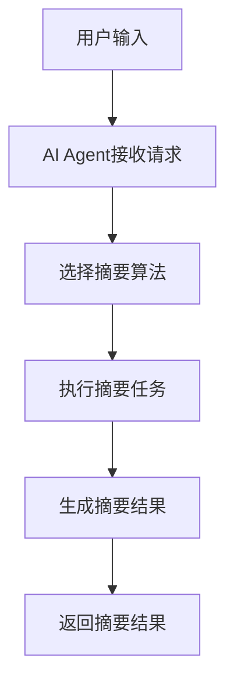
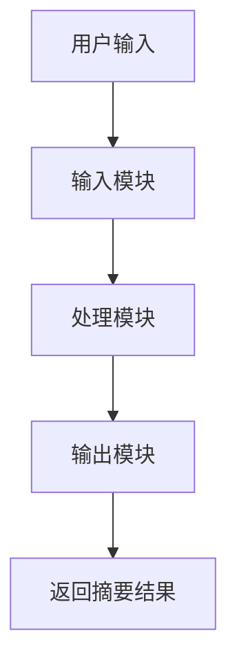
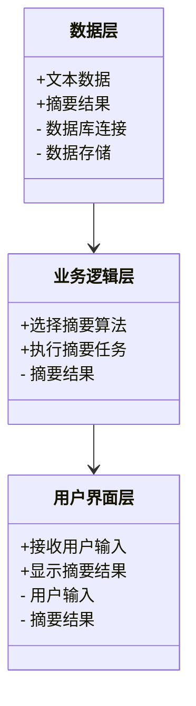
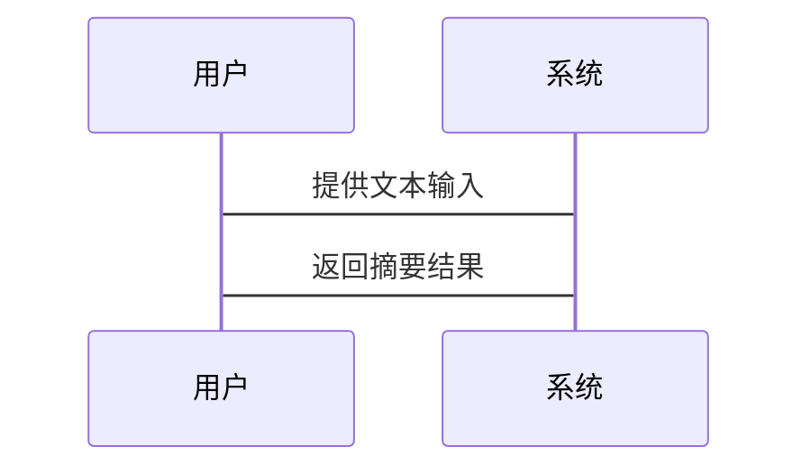

                 


# 文本摘要：让AI Agent提炼关键信息

## 关键词：文本摘要，AI Agent，自然语言处理，机器学习，文本挖掘

## 摘要：  
文本摘要是指从大量文本数据中提炼出核心信息的过程，是自然语言处理（NLP）领域的重要技术。随着人工智能（AI）技术的快速发展，AI Agent（智能代理）在文本摘要中的应用越来越广泛。本文将从文本摘要的基本概念出发，深入探讨AI Agent在文本摘要中的核心作用，分析主流文本摘要算法的原理与实现，并结合实际案例，详细讲解如何通过AI Agent构建高效的文本摘要系统。本文旨在帮助读者全面理解文本摘要的技术原理与应用实践。

---

# 第一部分：文本摘要与AI Agent的基础概述

## 第1章：文本摘要与AI Agent概述

### 1.1 文本摘要的基本概念

#### 1.1.1 文本摘要的定义与作用  
文本摘要（Text Summarization）是指从一段或多段文本中提取关键信息，生成一个简短、准确的摘要。其作用包括信息压缩、信息提取和信息检索优化。文本摘要能够帮助用户快速理解文本内容，节省阅读时间。

#### 1.1.2 AI Agent在文本摘要中的角色  
AI Agent是一种智能代理系统，能够通过感知环境、执行任务和学习优化来完成特定目标。在文本摘要中，AI Agent可以作为决策者、执行者和优化器，负责选择最优的摘要算法、执行摘要任务并优化摘要效果。

#### 1.1.3 文本摘要的常见应用场景  
文本摘要技术广泛应用于新闻标题生成、文献综述撰写、邮件自动摘要、社交媒体内容分析等领域。AI Agent在这些场景中能够显著提高信息处理的效率和准确性。

### 1.2 AI Agent的核心技术

#### 1.2.1 自然语言处理（NLP）基础  
自然语言处理是AI Agent实现文本摘要的核心技术之一。NLP技术包括文本分词、句法分析、语义理解等，这些技术为AI Agent提供了对文本内容的理解能力。

#### 1.2.2 机器学习与深度学习简介  
机器学习（ML）和深度学习（DL）是AI Agent的两大核心技术。机器学习通过训练模型从数据中学习规律，深度学习则通过多层神经网络提取文本的高层次特征。

#### 1.2.3 强化学习在AI Agent中的应用  
强化学习是一种通过奖励机制优化决策的机器学习方法。在文本摘要中，强化学习可以用于优化摘要的生成过程，提高摘要的质量和相关性。

### 1.3 文本摘要的挑战与解决方案

#### 1.3.1 文本摘要的主要挑战  
文本摘要面临的主要挑战包括：  
1. **信息丢失**：如何在摘要中保留原文的核心信息。  
2. **多样性**：如何生成多样化的摘要结果。  
3. **评估困难**：如何准确评估摘要的质量。  

#### 1.3.2 AI Agent如何应对这些挑战  
AI Agent通过多模态学习、上下文理解以及强化学习等技术，能够有效应对文本摘要的挑战。例如，AI Agent可以通过上下文理解生成更准确的摘要，并通过强化学习优化摘要的多样性。

#### 1.3.3 当前主流的文本摘要技术  
当前主流的文本摘要技术包括基于抽取式的文本摘要和基于生成式的文本摘要。抽取式摘要通过选择原文中的关键句子或词语生成摘要，生成式摘要则通过生成新的文本内容来表达原文的核心信息。

---

## 第2章：文本摘要的核心概念与联系

### 2.1 文本摘要的核心概念

#### 2.1.1 文本特征提取  
文本特征提取是指从文本中提取关键特征，如关键词、关键句子等。特征提取是文本摘要的基础，决定了摘要的质量。

#### 2.1.2 文本摘要的关键指标  
文本摘要的关键指标包括：  
1. **准确率**：摘要内容与原文内容的匹配程度。  
2. **简洁性**：摘要长度是否符合要求。  
3. **相关性**：摘要内容是否与用户需求相关。  

#### 2.1.3 文本摘要的评估方法  
文本摘要的评估方法包括：  
1. **基于规则的评估**：通过特定规则判断摘要质量。  
2. **基于统计的评估**：通过统计方法计算摘要的相似性。  
3. **基于人工评估**：通过人工阅读评估摘要的质量。  

### 2.2 核心概念的联系与对比

#### 2.2.1 文本摘要与文本分类的对比  
文本摘要与文本分类的区别在于，文本分类是对文本进行分类，而文本摘要是对文本内容进行压缩和提取。

#### 2.2.2 文本摘要与文本生成的联系  
文本生成是指通过模型生成新的文本内容，而文本摘要则是对已有文本的压缩。两者在NLP技术上有许多相似之处，但应用场景和目标不同。

#### 2.2.3 AI Agent在文本摘要中的作用  
AI Agent通过整合多种NLP技术，能够显著提升文本摘要的效果。例如，AI Agent可以通过上下文理解生成更准确的摘要，并通过强化学习优化摘要的质量。

---

# 第二部分：文本摘要的算法原理

## 第3章：主流文本摘要算法原理

### 3.1 基于抽取式的文本摘要算法

#### 3.1.1 基于关键词提取的算法  
基于关键词提取的算法通过统计文本中关键词的频率，选择最相关的关键词生成摘要。例如，TF-IDF算法常用于关键词提取。

#### 3.1.2 基于句子重要性评分的算法  
基于句子重要性评分的算法通过计算每个句子的重要性评分，选择最重要的句子生成摘要。例如，TextRank算法是一种常用的句子重要性评分算法。

#### 3.1.3 基于图结构的文本摘要算法  
基于图结构的文本摘要算法通过构建文本的图结构，选择最相关的节点生成摘要。例如，图遍历算法可以用于图结构的摘要生成。

### 3.2 基于生成式的文本摘要算法

#### 3.2.1 基于序列到序列（seq2seq）模型的生成算法  
序列到序列模型是一种常用的生成式摘要算法，通过编码器-解码器结构生成摘要。例如，Transformer模型是一种高效的序列到序列模型。

#### 3.2.2 基于Transformer的生成算法  
基于Transformer的生成算法通过多头注意力机制捕捉文本中的长距离依赖关系，生成更准确的摘要。例如，BERT模型是一种常用的Transformer模型。

#### 3.2.3 基于预训练语言模型的生成算法  
基于预训练语言模型的生成算法利用大规模预训练模型生成摘要。例如，GPT模型可以通过微调生成高质量的文本摘要。

### 3.3 AI Agent驱动的文本摘要算法

#### 3.3.1 AI Agent作为决策者  
AI Agent可以通过上下文理解选择最优的摘要算法，生成高质量的摘要。

#### 3.3.2 AI Agent作为执行者  
AI Agent可以通过调用不同的NLP模型，执行摘要任务并生成最终的摘要结果。

#### 3.3.3 AI Agent作为优化器  
AI Agent可以通过强化学习优化摘要的生成过程，提升摘要的质量和相关性。

---

## 第4章：AI Agent驱动的文本摘要算法

### 4.1 AI Agent在文本摘要中的角色

#### 4.1.1 AI Agent作为决策者  
AI Agent可以通过分析用户需求和文本内容，选择最优的摘要算法。

#### 4.1.2 AI Agent作为执行者  
AI Agent可以通过调用不同的NLP模型，执行摘要任务并生成最终的摘要结果。

#### 4.1.3 AI Agent作为优化器  
AI Agent可以通过强化学习优化摘要的生成过程，提升摘要的质量和相关性。

### 4.2 基于AI Agent的文本摘要算法实现

#### 4.2.1 算法流程图（mermaid）  


#### 4.2.2 算法实现的Python代码  
```python
import numpy as np
from transformers import BartTokenizer, BartForConditionalGeneration

tokenizer = BartTokenizer.from_pretrained('facebook/bart-large')
model = BartForConditionalGeneration.from_pretrained('facebook/bart-large')

def summarize(text):
    inputs = tokenizer([text], max_length=1024, truncation=True)
    outputs = model.generate(inputs.input_ids)
    summary = tokenizer.decode(outputs[0], skip_special_tokens=True)
    return summary

text = "..."  # 输入文本
result = summarize(text)
print(result)
```

#### 4.2.3 算法的数学模型与公式  
文本摘要的生成过程可以表示为：  
$$ \text{摘要} = f_{\theta}(\text{原文}) $$  
其中，$f_{\theta}$表示摘要生成模型，$\theta$表示模型参数。

---

# 第三部分：文本摘要系统的系统架构与设计

## 第5章：文本摘要系统的架构设计

### 5.1 系统功能需求分析

#### 5.1.1 用户需求分析  
用户需求包括：  
1. 提供多语言支持。  
2. 支持多种文本摘要算法。  
3. 提供可视化摘要结果。  

#### 5.1.2 系统功能模块划分  
系统功能模块包括：  
1. 输入模块：接收用户输入。  
2. 处理模块：执行文本摘要任务。  
3. 输出模块：生成并返回摘要结果。  

#### 5.1.3 系统功能流程图（mermaid）  


### 5.2 系统架构设计

#### 5.2.1 系统架构设计  
系统架构采用分层架构，包括数据层、业务逻辑层和用户界面层。数据层负责存储和管理文本数据，业务逻辑层负责执行文本摘要任务，用户界面层负责与用户交互。

#### 5.2.2 系统架构图（mermaid）  


### 5.3 系统接口设计

#### 5.3.1 系统接口设计  
系统接口包括：  
1. 用户输入接口。  
2. 摘要算法选择接口。  
3. 摘要结果返回接口。  

#### 5.3.2 系统接口序列图（mermaid）  


---

## 第6章：文本摘要系统的实现与优化

### 6.1 系统实现

#### 6.1.1 环境配置  
需要安装Python、TensorFlow、Transformers等库。

#### 6.1.2 核心代码实现  
```python
import torch
from transformers import BartTokenizer, BartForConditionalGeneration

tokenizer = BartTokenizer.from_pretrained('facebook/bart-large')
model = BartForConditionalGeneration.from_pretrained('facebook/bart-large')

def summarize(text):
    inputs = tokenizer([text], max_length=1024, truncation=True)
    outputs = model.generate(inputs.input_ids)
    summary = tokenizer.decode(outputs[0], skip_special_tokens=True)
    return summary

text = "..."  # 输入文本
result = summarize(text)
print(result)
```

#### 6.1.3 系统功能实现  
系统功能包括：  
1. 接收用户输入。  
2. 执行文本摘要任务。  
3. 返回摘要结果。  

### 6.2 系统优化

#### 6.2.1 性能优化  
通过并行计算和优化模型参数，提升系统运行效率。

#### 6.2.2 算法优化  
通过改进摘要算法，提升摘要质量和准确性。

#### 6.2.3 可视化优化  
通过优化用户界面，提升用户体验。

---

## 第7章：总结与展望

### 7.1 总结  
本文详细介绍了文本摘要的基本概念、AI Agent的核心作用、主流算法原理和系统架构设计。通过实际案例分析，展示了如何利用AI Agent构建高效的文本摘要系统。

### 7.2 最佳实践 tips  
1. 在选择摘要算法时，需根据具体需求和数据特点进行选择。  
2. 在系统设计时，需注重模块化和可扩展性。  
3. 在实际应用中，需结合具体场景优化摘要效果。  

### 7.3 注意事项  
1. 文本摘要可能存在信息丢失，需注意摘要的准确性和完整性。  
2. AI Agent的决策能力依赖于训练数据的质量和模型的优化。  
3. 在实际应用中，需注意数据隐私和模型安全。  

### 7.4 拓展阅读  
1. 《自然语言处理入门》  
2. 《深度学习与神经网络》  
3. 《强化学习实战》  

---

# 作者：AI天才研究院/AI Genius Institute & 禅与计算机程序设计艺术 /Zen And The Art of Computer Programming

---

希望这篇文章能够为读者提供关于文本摘要与AI Agent的全面理解，帮助读者掌握文本摘要的核心技术与实际应用。

