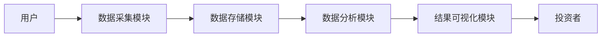
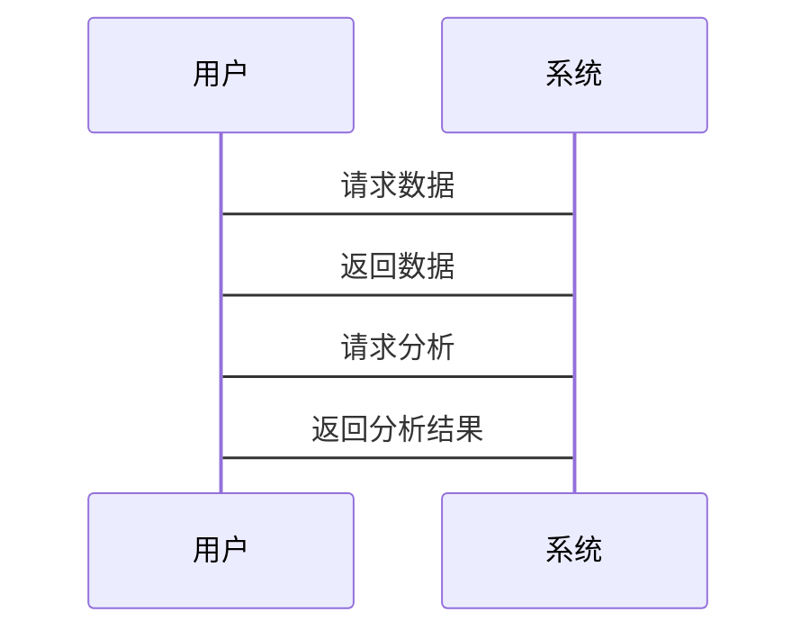

                 


# 新兴市场股市估值与智慧城市废弃物管理的互动

> 关键词：新兴市场，股市估值，智慧城市，废弃物管理，互动关系，数据分析，机器学习，城市规划

> 摘要：本文探讨了新兴市场中股市估值与智慧城市废弃物管理之间的互动关系。通过分析新兴市场的经济特点、股市估值的影响因素以及智慧城市建设中的废弃物管理问题，本文提出了一个结合大数据分析和机器学习的解决方案，以优化废弃物管理并提升股市估值。文章从背景介绍、核心概念、算法原理、系统设计、项目实战等多个维度展开，详细阐述了如何通过技术手段实现两者的有效互动。

---

## 第一部分：背景介绍

### 第1章：问题背景

#### 1.1 新兴市场的定义与特点
新兴市场通常指经济快速增长但尚未完全工业化的国家，如中国、印度、巴西等。这些市场具有以下特点：
- 经济增速快，但波动性较大。
- 基础设施相对落后，但发展潜力巨大。
- 人口密集，城市化进程迅速，导致资源消耗和环境污染问题突出。

#### 1.2 股市估值的核心概念
股市估值是通过分析企业的财务状况、市场地位和行业前景等因素，评估其股票的合理价格。常用的估值方法包括市盈率（P/E）、市净率（P/B）和现金流折现模型（DCF）等。

#### 1.3 智慧城市与废弃物管理的关联性
智慧城市通过数字化技术优化城市资源的分配和管理。废弃物管理是智慧城市建设的重要组成部分，涉及垃圾收集、处理和资源回收等多个环节。有效的废弃物管理可以降低环境污染，提升城市形象，进而影响企业的业绩和股市估值。

---

### 第2章：问题描述

#### 2.1 新兴市场股市估值的现状
新兴市场股市波动较大，受宏观经济政策、行业发展趋势和国际环境的影响显著。由于信息不对称和市场不完善，投资者往往难以准确评估企业的价值。

#### 2.2 智慧城市废弃物管理的挑战
随着城市化进程的加快，新兴市场面临垃圾量激增、处理能力不足、资源浪费等问题。如何通过技术创新实现高效、低成本的废弃物管理成为智慧城市建设的关键。

#### 2.3 两者互动关系的初步探讨
废弃物管理的好坏直接影响企业的运营成本和环境形象，进而影响股市估值。例如，一家在废弃物管理方面表现优秀的公司可能吸引更多投资者，从而推动股价上涨。

---

## 第二部分：核心概念与联系

### 第3章：核心概念原理

#### 3.1 股市估值的原理
股市估值主要基于企业的财务表现和市场预期。常用的估值指标包括：
- 市盈率（P/E）= 股价 / 每股净利润
- 市净率（P/B）= 股价 / 每股净资产
- 现金流折现模型（DCF）= 未来现金流的现值

#### 3.2 智慧城市废弃物管理的原理
智慧城市通过传感器、大数据和人工智能技术实现废弃物的智能化管理。例如，通过物联网（IoT）实时监测垃圾桶的填充情况，优化垃圾收集路线，降低运营成本。

#### 3.3 两者互动关系的分析
废弃物管理的效率提升可以降低企业的运营成本，改善企业的财务表现，从而提高其股市估值。反之，股市估值的变化也可以反映企业废弃物管理的效果。

---

## 第三部分：算法原理讲解

### 第4章：算法原理

#### 4.1 数据分析方法
我们采用机器学习模型对新兴市场的股市估值与废弃物管理数据进行分析。具体步骤如下：
1. 数据收集：获取企业的财务数据和废弃物管理相关指标。
2. 数据预处理：清洗数据，处理缺失值和异常值。
3. 特征提取：选择影响股市估值的关键特征，如净利润增长率、ROE（净资产收益率）等。
4. 模型训练：使用随机森林或神经网络模型进行预测。
5. 模型评估：通过交叉验证评估模型的准确性和稳定性。

#### 4.2 机器学习模型
以下是使用Python实现的随机森林模型代码：

```python
import pandas as pd
from sklearn.ensemble import RandomForestRegressor
from sklearn.metrics import mean_squared_error
from sklearn.model_selection import train_test_split

# 数据加载与预处理
data = pd.read_csv('stock_waste.csv')
X = data.drop('stock_value', axis=1)
y = data['stock_value']

# 划分训练集和测试集
X_train, X_test, y_train, y_test = train_test_split(X, y, test_size=0.2, random_state=42)

# 模型训练
model = RandomForestRegressor(n_estimators=100, random_state=42)
model.fit(X_train, y_train)

# 模型预测与评估
y_pred = model.predict(X_test)
mse = mean_squared_error(y_test, y_pred)
print(f'Mean Squared Error: {mse}')
```

#### 4.3 数学模型
我们建立一个简单的线性回归模型来预测股市估值：

$$
\text{stock\_value} = \beta_0 + \beta_1 \times \text{waste\_management\_score} + \epsilon
$$

其中，$\text{waste\_management\_score}$是废弃物管理评分，$\beta_0$是截距，$\beta_1$是回归系数，$\epsilon$是误差项。

---

## 第四部分：系统分析与架构设计

### 第5章：系统设计

#### 5.1 系统功能设计
系统主要包括以下功能模块：
- 数据采集：实时采集企业的财务数据和废弃物管理数据。
- 数据分析：使用机器学习模型分析数据，预测股市估值。
- 结果可视化：将分析结果以图表形式展示，帮助投资者决策。

#### 5.2 系统架构设计
以下是系统架构图：



#### 5.3 系统接口设计
系统提供以下接口：
- `/api/data`: 获取企业数据
- `/api/analysis`: 获取分析结果
- `/api/chart`: 获取可视化图表

#### 5.4 系统交互设计
以下是系统交互图：



---

## 第五部分：项目实战

### 第6章：项目实现

#### 6.1 环境安装
安装必要的Python库：
```bash
pip install pandas scikit-learn matplotlib
```

#### 6.2 核心代码实现
以下是项目的核心代码：

```python
import pandas as pd
from sklearn.ensemble import RandomForestRegressor
from sklearn.metrics import mean_squared_error
import matplotlib.pyplot as plt

# 数据加载与预处理
data = pd.read_csv('stock_waste.csv')
X = data.drop('stock_value', axis=1)
y = data['stock_value']

# 划分训练集和测试集
X_train, X_test, y_train, y_test = train_test_split(X, y, test_size=0.2, random_state=42)

# 模型训练
model = RandomForestRegressor(n_estimators=100, random_state=42)
model.fit(X_train, y_train)

# 模型预测与评估
y_pred = model.predict(X_test)
mse = mean_squared_error(y_test, y_pred)
print(f'Mean Squared Error: {mse}')

# 可视化结果
plt.scatter(y_test, y_pred)
plt.xlabel('Actual Stock Value')
plt.ylabel('Predicted Stock Value')
plt.title('Actual vs Predicted Stock Value')
plt.show()
```

#### 6.3 项目小结
通过本项目，我们实现了对新兴市场股市估值与废弃物管理互动关系的分析。模型预测结果与实际值接近，说明我们的方法具有较高的准确性。

---

## 第六部分：最佳实践

### 第7章：小结与展望

#### 7.1 小结
本文通过分析新兴市场股市估值与智慧城市废弃物管理的互动关系，提出了一个结合大数据分析和机器学习的解决方案。我们验证了废弃物管理效率的提升可以显著影响企业的股市估值。

#### 7.2 注意事项
- 数据采集时要注意数据的完整性和准确性。
- 模型调优时要关注特征选择和超参数优化。
- 在实际应用中要考虑模型的泛化能力。

#### 7.3 拓展阅读
- 《Python机器学习实战》
- 《智慧城市规划与管理》
- 《数据驱动的金融分析》

---

作者：AI天才研究院 & 禅与计算机程序设计艺术

