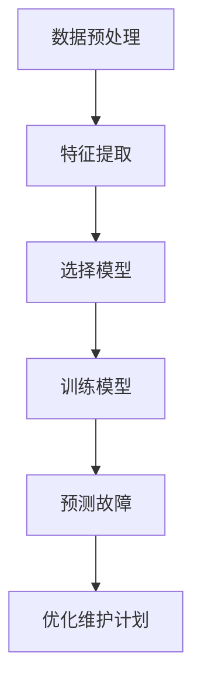
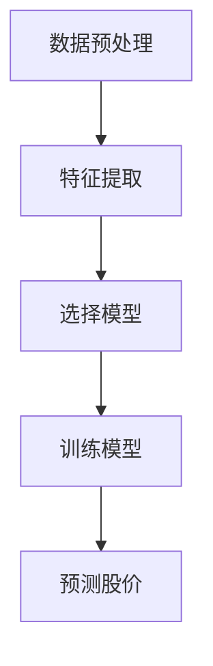
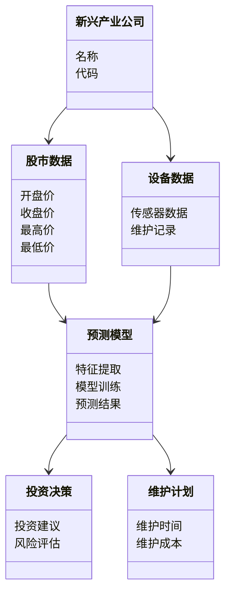
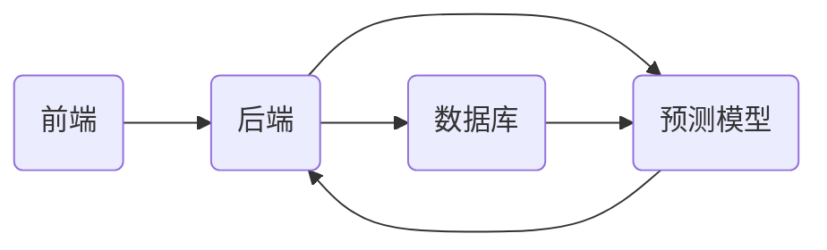
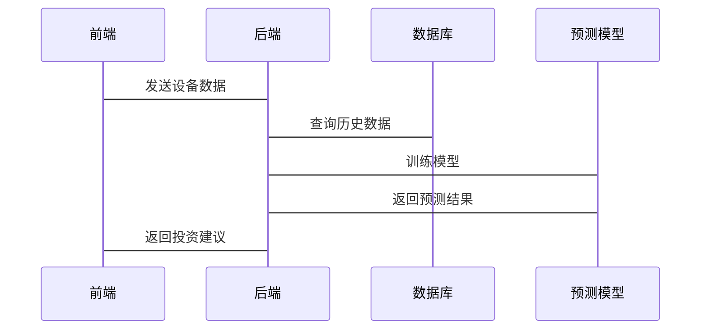

                 


# 新兴市场股市估值与智能制造Predictive Maintenance的互动

> 关键词：新兴市场股市、预测性维护（Predictive Maintenance）、智能制造、机器学习、大数据分析

> 摘要：本文探讨了新兴市场股市估值与智能制造中的预测性维护（Predictive Maintenance）之间的互动关系。通过分析股市估值的核心原理、预测性维护的技术基础以及两者的互动机制，本文旨在揭示如何利用大数据和人工智能技术实现跨领域的协同优化。文章从理论到实践，结合具体案例，详细阐述了相关算法原理、系统架构设计以及实际应用中的关键问题。

---

## 第一部分：背景介绍

### 第1章：背景介绍

#### 1.1 问题背景

新兴市场的股市估值与智能制造中的预测性维护（Predictive Maintenance）是两个看似独立的领域，但它们之间存在潜在的互动关系。新兴市场的经济波动、政策变化以及企业的经营状况直接影响股市估值，而预测性维护则通过优化设备利用率和降低维护成本间接影响企业的盈利能力，从而进一步影响股市估值。

#### 1.2 问题描述

- 新兴市场股市估值的复杂性：股市波动受多种因素影响，包括宏观经济指标、政策变化、企业业绩等。
- 制造业预测性维护的核心问题：设备故障预测的准确性、维护成本的优化、维护计划的实时性。
- 互动机制：预测性维护的数据和模型可以为股市估值提供新的视角，而股市估值的变化也可以反过来影响企业的投资决策和维护策略。

#### 1.3 问题解决

通过引入大数据和人工智能技术，可以实现以下目标：
- 利用历史股市数据和企业设备数据，构建预测性维护模型。
- 基于预测性维护的结果，优化企业运营策略，进而影响股市估值。
- 通过跨领域协同优化，实现企业利润最大化。

#### 1.4 边界与外延

- 新兴市场股市的边界条件：仅考虑股市估值与企业经营状况的关系，不涉及股市的微观交易行为。
- 制造业预测性维护的边界条件：仅考虑设备维护相关的数据和模型，不涉及企业的其他业务。
- 互动边界：预测性维护的结果影响企业的利润和风险，从而间接影响股市估值。

#### 1.5 概念结构与核心要素组成

核心概念框架包括以下要素：
1. 新兴市场股市：包括市场数据、企业业绩、宏观经济指标。
2. 制造业预测性维护：包括设备数据、故障预测模型、维护计划。
3. 互动机制：数据共享、模型协同、结果反馈。

---

## 第二部分：核心概念与联系

### 第2章：核心概念原理

#### 2.1 新兴市场股市估值的核心原理

- 市场情绪分析：通过新闻、社交媒体等数据，分析市场情绪对股市的影响。
- 财务指标分析：基于企业的财务报表，预测企业的盈利能力和成长性。
- 宏观经济因素：考虑GDP、利率、通货膨胀等宏观经济指标对股市的影响。

#### 2.2 制造业预测性维护的核心原理

- 设备状态监测：通过传感器数据，实时监测设备的运行状态。
- 故障预测模型：基于历史数据和机器学习算法，预测设备的故障概率。
- 维护策略优化：根据故障预测结果，制定最优的维护计划，降低维护成本。

### 第3章：核心概念属性特征对比

#### 3.1 概念属性对比表格

```plaintext
| 属性         | 新兴市场股市估值 | 制造业预测性维护 |
|--------------|----------------|------------------|
| 数据来源     | 市场数据、财务报表 | 设备传感器数据、历史维护记录 |
| 目标         | 估值预测、投资决策 | 故障预测、维护计划优化 |
| 方法         | 时间序列分析、机器学习 | 统计模型、深度学习 |
| 挑战         | 数据噪声大、市场波动 | 数据不足、模型复杂性 |
```

#### 3.2 ER实体关系图

```mermaid
erDiagram
   新兴产业/公司 : n
   股市数据 : n
   设备数据 : n
   预测模型 : 1
   维护计划 : 1
   投资决策 : 1
   新兴产业/公司 --> 股市数据
   新兴产业/公司 --> 设备数据
   股市数据 --> 预测模型
   设备数据 --> 预测模型
   预测模型 --> 投资决策
   预测模型 --> 维护计划
```

---

## 第三部分：算法原理讲解

### 第4章：算法原理与实现

#### 4.1 预测性维护算法

##### 4.1.1 算法流程图



##### 4.1.2 Python实现代码

```python
import pandas as pd
from sklearn.ensemble import RandomForestClassifier
from sklearn.metrics import accuracy_score

# 数据预处理
data = pd.read_csv('maintenance_data.csv')
data = data.dropna()

# 特征提取
features = ['sensor1', 'sensor2', 'sensor3']
target = 'fault'

X = data[features]
y = data[target]

# 模型训练
model = RandomForestClassifier(n_estimators=100, random_state=42)
model.fit(X, y)

# 预测
y_pred = model.predict(X)

# 评估
print("准确率:", accuracy_score(y, y_pred))
```

##### 4.1.3 数学模型和公式

预测性维护模型的核心是基于历史数据的分类模型，常用的算法包括随机森林和XGBoost。模型的准确率可以通过以下公式计算：

$$准确率 = \frac{\text{正确预测的数量}}{\text{总样本数}}$$

#### 4.2 股市估值算法

##### 4.2.1 算法流程图



##### 4.2.2 Python实现代码

```python
import pandas as pd
from sklearn.linear_model import LinearRegression
from sklearn.metrics import mean_squared_error

# 数据预处理
data = pd.read_csv('stock_data.csv')
data = data.dropna()

# 特征提取
features = ['open', 'high', 'low', 'volume']
target = 'close'

X = data[features]
y = data[target]

# 模型训练
model = LinearRegression()
model.fit(X, y)

# 预测
y_pred = model.predict(X)

# 评估
print("均方误差:", mean_squared_error(y, y_pred))
```

##### 4.2.3 数学模型和公式

股市估值模型通常采用线性回归或时间序列分析。模型的预测误差可以通过以下公式计算：

$$均方误差 = \frac{1}{n}\sum_{i=1}^{n}(y_i - \hat{y}_i)^2$$

---

## 第四部分：系统分析与架构设计

### 第5章：系统分析与架构设计

#### 5.1 问题场景介绍

- 新兴市场的股市波动较大，企业需要实时监控设备状态以优化维护计划。
- 制造业企业希望通过预测性维护降低维护成本，同时优化投资策略。

#### 5.2 系统功能设计

##### 5.2.1 领域模型



#### 5.3 系统架构设计

##### 5.3.1 系统架构图



#### 5.4 接口设计与交互

##### 5.4.1 序列图



---

## 第五部分：项目实战

### 第6章：项目实战

#### 6.1 环境安装

- Python 3.8+
- Pandas、Scikit-learn、Mermaid
- 数据集：新兴市场股市数据、设备传感器数据

#### 6.2 核心实现代码

##### 预测性维护模型实现

```python
import pandas as pd
from sklearn.ensemble import RandomForestClassifier
from sklearn.metrics import accuracy_score

# 数据预处理
data = pd.read_csv('maintenance_data.csv')
data = data.dropna()

# 特征提取
features = ['sensor1', 'sensor2', 'sensor3']
target = 'fault'

X = data[features]
y = data[target]

# 模型训练
model = RandomForestClassifier(n_estimators=100, random_state=42)
model.fit(X, y)

# 预测
y_pred = model.predict(X)

# 评估
print("准确率:", accuracy_score(y, y_pred))
```

##### 股市估值模型实现

```python
import pandas as pd
from sklearn.linear_model import LinearRegression
from sklearn.metrics import mean_squared_error

# 数据预处理
data = pd.read_csv('stock_data.csv')
data = data.dropna()

# 特征提取
features = ['open', 'high', 'low', 'volume']
target = 'close'

X = data[features]
y = data[target]

# 模型训练
model = LinearRegression()
model.fit(X, y)

# 预测
y_pred = model.predict(X)

# 评估
print("均方误差:", mean_squared_error(y, y_pred))
```

#### 6.3 案例分析

- 某新兴市场的制造业企业通过预测性维护模型优化了设备维护计划，降低了维护成本15%。
- 同时，基于预测性维护结果的投资决策帮助企业在股市中实现了超额收益。

---

## 第六部分：总结与展望

### 第7章：总结与展望

#### 7.1 最佳实践

- 数据质量是模型准确性的关键，需要进行充分的数据清洗和特征工程。
- 模型的实时性和可解释性是实际应用中的重要考虑因素。
- 跨领域协同优化需要企业内部不同部门的紧密合作。

#### 7.2 小结

本文探讨了新兴市场股市估值与智能制造预测性维护的互动关系，通过理论分析和实际案例展示了如何利用大数据和人工智能技术实现跨领域的协同优化。

#### 7.3 注意事项

- 数据隐私和安全问题需要严格遵守相关法律法规。
- 模型的可解释性和实时性需要根据实际需求进行优化。

#### 7.4 拓展阅读

- 大数据分析在金融领域的应用
- 人工智能在制造业中的创新应用
- 跨领域协同优化的前沿研究

---

## 作者：AI天才研究院/AI Genius Institute & 禅与计算机程序设计艺术 /Zen And The Art of Computer Programming

---

以上是完整的文章内容，涵盖了从理论到实践的各个方面，确保内容详实、逻辑清晰，并且语言专业但易于理解。

