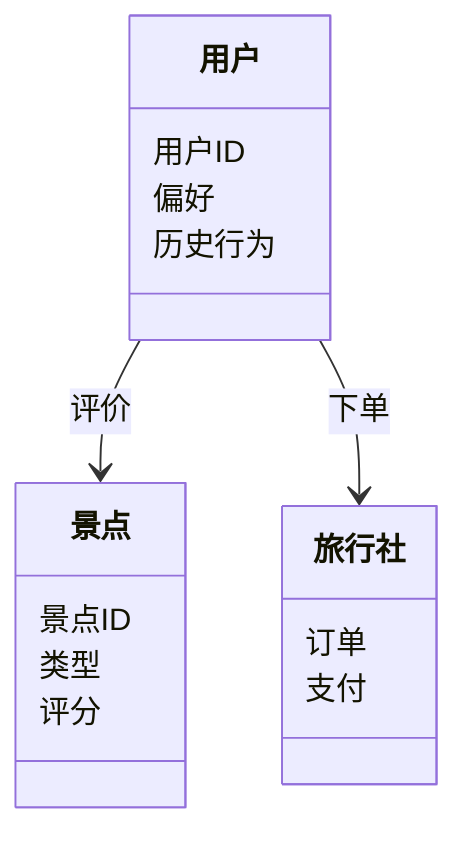
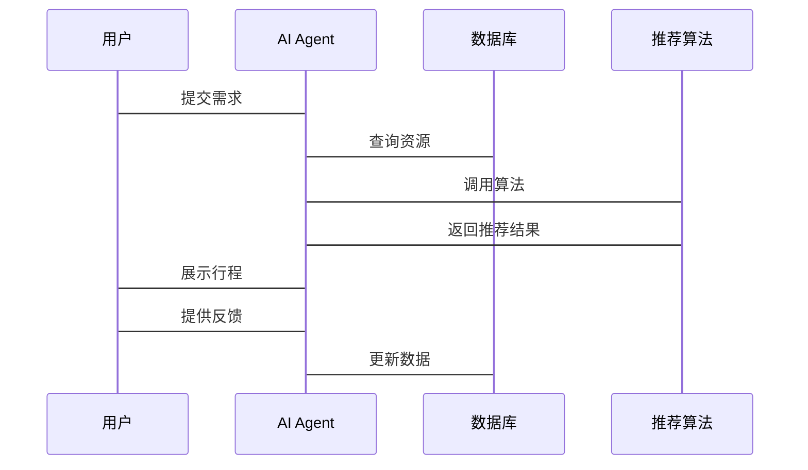

                 


# 旅游业AI Agent：个性化行程规划

---

## 关键词：
AI Agent、个性化行程规划、旅游业、推荐算法、深度学习

---

## 摘要：
本文探讨了AI Agent在旅游业中的应用，特别是个性化行程规划的技术实现。通过分析AI Agent的核心概念、算法原理和系统架构，结合实际案例，详细阐述了如何利用协同过滤、深度学习等技术为用户量身定制旅行计划，提升用户体验和资源优化。

---

# 第1章：旅游业发展现状与个性化需求

## 1.1 旅游业的现状与发展趋势

### 1.1.1 传统旅游业的痛点与挑战
- **信息过载**：用户难以从海量旅游信息中筛选出适合自己的行程。
- **个性化不足**：传统旅行社提供标准化服务，难以满足个性化需求。
- **效率低下**：用户需要花费大量时间规划行程，体验较差。

### 1.1.2 个性化旅游需求的兴起
- 用户 increasingly demand personalized travel experiences.
- 个性化行程规划成为提升用户体验的关键。

### 1.1.3 数字化技术在旅游业中的应用
- 互联网技术的发展使在线旅游平台普及。
- AI和大数据技术的应用推动了智能化服务。

## 1.2 AI Agent的基本概念与特点

### 1.2.1 AI Agent的定义与核心功能
- AI Agent是一种智能体，能够感知环境、推理和决策，执行任务。
- 在旅游业中，AI Agent用于分析用户需求和旅游资源，生成个性化行程。

### 1.2.2 AI Agent在旅游业中的优势
- **智能化推荐**：通过分析用户数据，提供精准的行程建议。
- **动态调整**：实时更新行程，应对突发情况。
- **优化决策**：基于数据优化行程安排，提升资源利用率。

## 1.3 个性化行程规划的意义与价值

### 1.3.1 用户体验的提升
- 提供更符合用户偏好的行程，提升满意度。
- 节省用户时间，提升效率。

### 1.3.2 旅游资源的优化配置
- 通过数据分析，合理分配资源，避免浪费。
- 提高景点和交通的利用率。

### 1.3.3 旅游业智能化发展的趋势
- AI技术推动旅游业向智能化转型。
- 个性化服务成为行业竞争的关键。

## 1.4 本章小结
本章介绍了旅游业的现状与发展趋势，分析了AI Agent的基本概念和特点，强调了个性化行程规划的重要性和价值。

---

# 第2章：AI Agent的核心概念与技术原理

## 2.1 AI Agent的感知模块

### 2.1.1 数据采集与处理
- **数据来源**：用户输入、历史行为、社交媒体数据。
- **数据处理**：清洗、分析，提取用户偏好和需求。

### 2.1.2 用户需求分析
- 通过用户数据，识别兴趣点和偏好。
- 分析用户行为模式，预测需求。

### 2.1.3 旅游资源分析
- 整合景点、酒店、交通等数据，建立知识库。
- 分析资源的可用性和热度。

## 2.2 AI Agent的推理与决策模块

### 2.2.1 知识图谱构建
- 将旅游资源和用户需求结构化，构建知识图谱。
- 使用图数据库存储，便于推理和关联分析。

### 2.2.2 推荐算法原理
- **协同过滤**：基于用户相似性推荐。
- **基于内容的推荐**：分析资源内容特征。
- **混合推荐**：结合多种推荐策略。

### 2.2.3 决策优化策略
- 优化行程的成本、时间和体验。
- 使用强化学习优化决策过程。

## 2.3 AI Agent的执行与反馈模块

### 2.3.1 行程规划的生成
- 根据推理结果，生成初始行程。
- 调整行程以满足用户需求。

### 2.3.2 用户反馈的处理
- 收集用户反馈，评估行程满意度。
- 根据反馈优化推荐算法。

### 2.3.3 系统优化与迭代
- 更新知识库，提升推荐准确性。
- 持续优化算法，提升系统性能。

## 2.4 AI Agent的核心算法与技术

### 2.4.1 基于协同过滤的推荐算法
- **基本原理**：通过用户相似性进行推荐。
- **实现步骤**：
  1. 数据预处理：处理缺失值和异常值。
  2. 计算相似度：使用余弦相似度或Jaccard系数。
  3. 生成推荐：基于相似用户的偏好。

### 2.4.2 基于深度学习的自然语言处理
- **基本原理**：使用神经网络理解文本。
- **技术细节**：
  - 使用词嵌入（如Word2Vec）。
  - 构建序列模型（如RNN、LSTM）进行文本处理。

### 2.4.3 基于强化学习的决策优化
- **基本原理**：通过奖励机制优化决策。
- **技术细节**：
  - 定义状态、动作和奖励。
  - 使用策略梯度方法优化策略。

## 2.5 本章小结
本章详细讲解了AI Agent的核心模块和技术，包括感知、推理、决策和执行模块，并介绍了协同过滤、深度学习等算法在其中的应用。

---

# 第3章：个性化行程规划的算法原理

## 3.1 基于协同过滤的推荐算法

### 3.1.1 协同过滤的基本原理
- 基于用户相似性推荐相似用户的偏好。
- 适用于用户数据充足的情况。

### 3.1.2 基于用户的协同过滤
- 计算用户之间的相似度。
- 推荐相似用户的高评分资源。

### 3.1.3 基于物品的协同过滤
- 计算物品之间的相似度。
- 推荐用户已评分物品的相似资源。

## 3.2 基于深度学习的推荐算法

### 3.2.1 基于神经网络的推荐系统
- 使用神经网络处理非结构化数据。
- 示例：使用CNN处理图像数据。

### 3.2.2 基于序列模型的推荐系统
- 使用RNN或LSTM处理用户行为序列。
- 示例：预测用户下一步可能访问的景点。

## 3.3 算法实现

### 3.3.1 协同过滤算法实现
```python
import numpy as np

# 示例数据：用户-景点评分矩阵
user_item = np.array([[4, 3, 2], [3, 5, 4], [2, 4, 5]])

# 计算余弦相似度
def cosine_similarity(matrix):
    # 计算标准化矩阵
    normalized = matrix / np.linalg.norm(matrix, axis=1, keepdims=True)
    # 计算相似度
    similarity = np.dot(normalized, normalized.T)
    return similarity

similarity = cosine_similarity(user_item)
print(similarity)
```

### 3.3.2 基于深度学习的推荐系统实现
```python
from tensorflow.keras import layers, Model

# 示例：构建一个简单的神经网络模型
def build_model(input_dim):
    inputs = layers.Input(shape=(input_dim,))
    x = layers.Dense(64, activation='relu')(inputs)
    x = layers.Dense(32, activation='relu')(x)
    outputs = layers.Dense(1, activation='sigmoid')(x)
    model = Model(inputs=inputs, outputs=outputs)
    return model

model = build_model(100)
model.compile(optimizer='adam', loss='binary_crossentropy')
```

## 3.4 本章小结
本章通过协同过滤和深度学习算法，详细讲解了个性化行程规划的实现过程，并提供了算法的Python代码示例。

---

# 第4章：系统分析与架构设计

## 4.1 系统功能设计

### 4.1.1 领域模型


### 4.1.2 系统架构设计
```mermaid
client --> AI Agent: 用户需求
AI Agent --> 数据库: 查询资源
AI Agent --> 推荐算法: 生成推荐
AI Agent --> 用户: 输出行程
```

## 4.2 系统接口设计

### 4.2.1 用户接口
- **输入接口**：收集用户需求。
- **输出接口**：展示推荐行程。

### 4.2.2 系统接口
- **数据接口**：与数据库交互。
- **API接口**：与其他系统（如支付网关）对接。

## 4.3 系统交互流程

### 4.3.1 交互流程


## 4.4 本章小结
本章分析了系统功能、架构和交互流程，展示了如何通过模块化设计实现个性化行程规划系统。

---

# 第5章：项目实战——个性化行程规划系统开发

## 5.1 项目环境安装

### 5.1.1 安装Python
```bash
python --version
pip install numpy pandas scikit-learn tensorflow
```

### 5.1.2 安装数据库
```bash
pip install pymysql SQLAlchemy
```

## 5.2 核心代码实现

### 5.2.1 数据预处理
```python
import pandas as pd

# 加载数据
data = pd.read_csv('travel_data.csv')

# 数据清洗
data.dropna(inplace=True)
data = pd.get_dummies(data)
```

### 5.2.2 协同过滤实现
```python
from sklearn.metrics.pairwise import cosine_similarity

# 计算相似度
similarity = cosine_similarity(data)
```

### 5.2.3 神经网络实现
```python
from tensorflow.keras import layers, Model

# 构建模型
def build_model(input_dim):
    inputs = layers.Input(shape=(input_dim,))
    x = layers.Dense(64, activation='relu')(inputs)
    x = layers.Dense(32, activation='relu')(x)
    outputs = layers.Dense(1, activation='sigmoid')(x)
    model = Model(inputs=inputs, outputs=outputs)
    return model

model = build_model(100)
model.compile(optimizer='adam', loss='binary_crossentropy')
```

## 5.3 项目小结
本章通过实际案例展示了个性化行程规划系统的开发过程，从环境安装到核心代码实现，为读者提供了实践指导。

---

# 第6章：总结与展望

## 6.1 本章总结
本文系统地探讨了AI Agent在旅游业中的应用，重点分析了个性化行程规划的技术实现，包括算法原理、系统架构和项目实战。

## 6.2 未来展望
随着技术的进步，AI Agent在旅游业中的应用将更加广泛。未来，深度学习和强化学习将推动推荐算法的优化，实时反馈机制将提升用户体验。

---

# 作者：AI天才研究院/AI Genius Institute & 禅与计算机程序设计艺术 /Zen And The Art of Computer Programming

---

**感谢阅读！**

