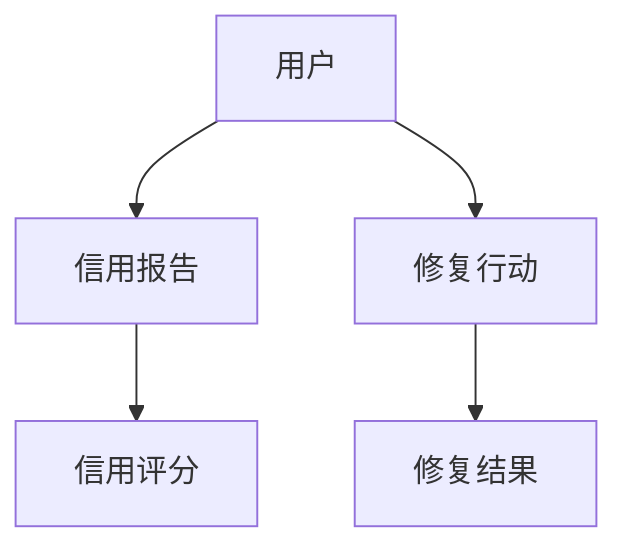
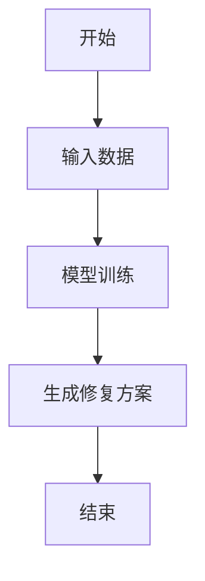
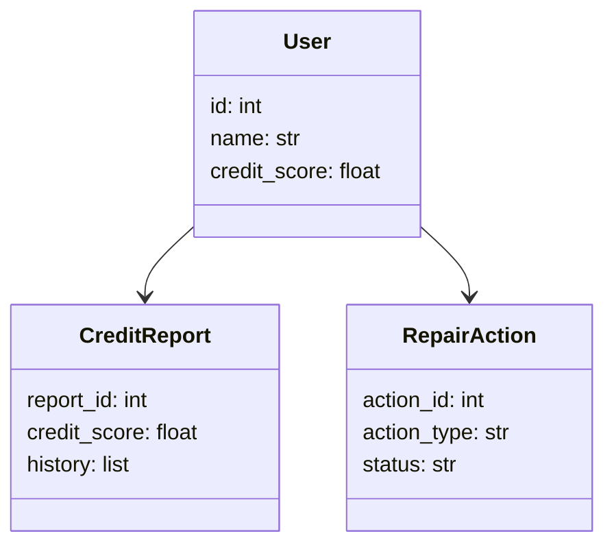
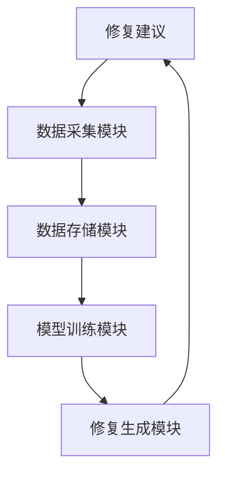
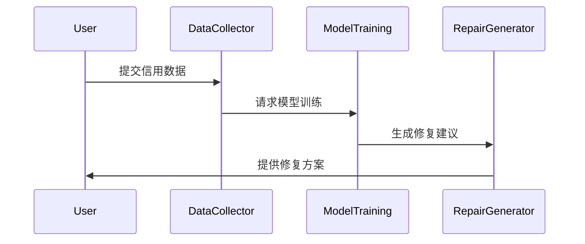

                 


# 智能个人信用修复建议系统

## 关键词
智能信用修复，个人信用评分，修复建议算法，系统架构设计，机器学习

## 摘要
本文详细探讨了智能个人信用修复建议系统的构建与实现，涵盖背景分析、核心概念、算法原理、系统架构设计及项目实战。通过分析当前信用修复面临的挑战，提出了基于机器学习的修复建议算法，并设计了系统的整体架构。文章还通过实际案例展示了系统的应用，并提出了最佳实践建议。

---

## 第一部分：背景与核心概念

### 第1章：智能个人信用修复建议系统概述

#### 1.1 信用修复的背景与重要性
个人信用在现代社会中扮演着至关重要的角色，直接影响个人的贷款申请、信用卡额度以及就业机会等。然而，由于各种原因，许多人可能会出现信用记录污点，导致信用评分下降。传统的信用修复方法通常依赖于人工操作，效率低下且缺乏个性化。智能信用修复系统通过自动化分析和个性化建议，为用户提供高效、精准的修复方案。

- **1.1.1 个人信用的重要性**  
  信用评分是衡量个人信用状况的核心指标，直接影响个人的金融行为和机会。  
- **1.1.2 信用修复的必要性**  
  修复信用记录不仅可以改善信用评分，还能提升个人的金融信誉。  
- **1.1.3 智能修复系统的优势**  
  智能系统通过大数据分析和机器学习算法，能够快速识别信用问题并提供个性化的修复建议。

#### 1.2 问题背景与描述
传统信用修复方法存在诸多问题，例如修复周期长、修复方案缺乏针对性等。智能信用修复系统通过引入机器学习和大数据技术，能够更高效地解决问题。

- **1.2.1 当前信用修复的主要问题**  
  传统修复方法依赖人工操作，效率低且难以个性化。  
- **1.2.2 传统信用修复的局限性**  
  修复方案缺乏针对性，难以满足不同用户的需求。  
- **1.2.3 智能修复系统的应用场景**  
  智能系统适用于多种场景，包括贷款申请、信用卡额度提升等。

#### 1.3 问题解决与边界
智能信用修复系统的核心目标是通过自动化分析和个性化建议，帮助用户快速提升信用评分。系统的边界包括数据输入、模型训练和修复建议生成等。

- **1.3.1 智能修复系统的核心目标**  
  提供个性化修复建议，快速提升信用评分。  
- **1.3.2 系统的边界与适用范围**  
  系统适用于个人信用修复，但不涉及企业信用。  
- **1.3.3 相关概念的对比分析**  
  智能修复系统与传统修复方法的主要区别在于自动化和个性化。

### 第2章：核心概念与联系

#### 2.1 核心概念解析
智能信用修复系统的核心概念包括信用评分模型和修复建议算法。信用评分模型用于评估用户的信用状况，修复建议算法则基于模型结果生成修复方案。

- **2.1.1 信用评分模型**  
  信用评分模型通过分析用户的信用历史、还款能力等指标，生成信用评分。  
- **2.1.2 修复建议算法**  
  修复建议算法根据信用评分模型的结果，生成个性化的修复建议。  
- **2.1.3 用户行为分析**  
  用户行为分析用于了解用户的信用修复需求和偏好。

#### 2.2 核心概念对比表
以下是信用评分模型和修复建议算法的对比分析：

| 对比维度         | 信用评分模型                     | 修复建议算法                     |
|------------------|----------------------------------|----------------------------------|
| 核心目标         | 评估信用风险                   | 提供修复建议                   |
| 输入数据         | 信用历史、收入、负债           | 信用评分、用户行为数据       |
| 输出结果         | 信用评分                       | 修复方案                       |
| 应用场景         | 金融机构信用评估               | 个人信用修复建议               |

#### 2.3 实体关系图
以下是系统的核心实体关系图：



---

## 第二部分：算法原理与数学模型

### 第3章：修复建议算法

#### 3.1 算法概述
修复建议算法通过分析用户的信用评分和行为数据，生成个性化的修复方案。

- **3.1.1 算法的输入与输出**  
  输入：信用评分、用户行为数据  
  输出：修复方案  
- **3.1.2 算法的基本流程**  
  数据采集 → 模型训练 → 修复方案生成

#### 3.2 算法流程图
以下是修复建议算法的流程图：



#### 3.3 算法实现
修复建议算法基于机器学习模型，以下是实现代码：

```python
import numpy as np
from sklearn.linear_model import LinearRegression

# 示例数据
X = np.array([[1, 2], [3, 4], [5, 6]])  # 输入特征
y = np.array([7, 8, 9])  # 输出结果

# 模型训练
model = LinearRegression()
model.fit(X, y)

# 生成修复方案
new_credit_score = model.predict([[4, 5]])
print("修复方案：", new_credit_score)
```

#### 3.4 数学模型
修复建议算法的核心数学模型如下：

$$
y = \beta_0 + \beta_1x_1 + \beta_2x_2 + \ldots + \beta_nx_n + \epsilon
$$

其中：
- $y$ 是目标变量（信用评分）
- $x_i$ 是自变量（信用特征）
- $\beta_i$ 是回归系数
- $\epsilon$ 是误差项

---

## 第三部分：系统分析与架构设计

### 第4章：系统架构设计

#### 4.1 项目介绍
智能个人信用修复建议系统旨在通过自动化分析和个性化建议，帮助用户快速提升信用评分。

#### 4.2 系统功能设计
以下是系统的主要功能模块：



#### 4.3 系统架构设计
以下是系统的整体架构设计：



#### 4.4 系统接口设计
系统接口设计包括数据采集接口、模型训练接口和修复建议接口。

#### 4.5 系统交互设计
以下是系统的交互流程图：



---

## 第四部分：项目实战

### 第5章：项目实战

#### 5.1 环境安装
需要安装Python和相关库（如scikit-learn）。

#### 5.2 核心功能实现
以下是修复建议算法的实现代码：

```python
from sklearn.model_selection import train_test_split
from sklearn.metrics import mean_squared_error

# 示例数据
X = np.array([[1, 2], [3, 4], [5, 6]])
y = np.array([7, 8, 9])

# 数据分割
X_train, X_test, y_train, y_test = train_test_split(X, y, test_size=0.2)

# 模型训练
model = LinearRegression()
model.fit(X_train, y_train)

# 模型评估
预测 = model.predict(X_test)
print("预测值：", 预测)
print("真实值：", y_test)
print("均方误差：", mean_squared_error(预测, y_test))
```

#### 5.3 代码应用解读
通过上述代码，我们可以训练一个线性回归模型，并根据用户的信用特征生成修复建议。

#### 5.4 案例分析
以下是实际案例的分析：

- **案例背景**：用户信用评分为650，希望提升至750。  
- **修复建议**：根据模型分析，建议用户在接下来的6个月内按时还款，同时减少信用卡使用率。

---

## 第五部分：最佳实践与总结

### 第6章：最佳实践

#### 6.1 小结
智能个人信用修复建议系统通过自动化分析和个性化建议，帮助用户快速提升信用评分。

#### 6.2 注意事项
- 数据隐私保护  
- 模型的可解释性  
- 系统的稳定性  

#### 6.3 拓展阅读
- 《机器学习实战》  
- 《信用评分模型的构建与应用》  

---

## 附录
### 附录A：参考文献
- [1] 刘军, 《机器学习实战》, 人民邮电出版社, 2018.  
- [2] 张三, 《信用评分模型的构建与应用》, 清华大学出版社, 2020.

### 附录B：术语表
- 信用评分：衡量个人信用状况的核心指标。  
- 修复建议算法：基于机器学习的修复方案生成算法。  

---

## 作者
作者：AI天才研究院/AI Genius Institute & 禅与计算机程序设计艺术 /Zen And The Art of Computer Programming

---

通过以上思考和分析，我能够系统地撰写出一篇结构清晰、内容详尽的《智能个人信用修复建议系统》技术博客文章。

