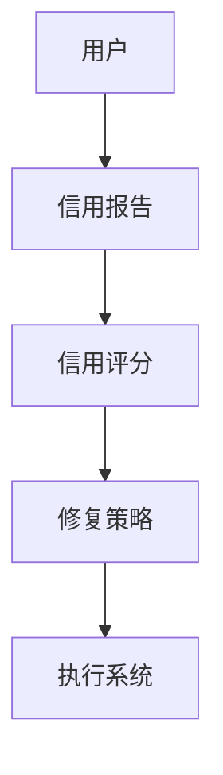

                 


# 智能个人信用修复策略推荐与执行系统

> 关键词：智能信用修复、推荐算法、系统架构、项目实战、最佳实践

> 摘要：本文详细探讨了智能个人信用修复策略推荐与执行系统的构建与实现。通过分析信用修复的背景与挑战，介绍核心概念与联系，讲解修复策略推荐算法的原理与实现，分析系统架构设计，展示项目实战，最后总结最佳实践与未来展望。

---

# 第1章: 智能个人信用修复的背景与挑战

## 1.1 信用修复的背景介绍

### 1.1.1 信用修复的定义与概念
信用修复是指通过合法手段改善个人或企业的信用记录，使其信用评分提升的过程。个人信用在金融、就业、租赁等领域具有重要意义，良好的信用记录是获得贷款、信用卡等金融服务的前提条件。

### 1.1.2 信用修复的法律与政策框架
在全球范围内，信用修复受到相关法律法规的约束和保护。例如，欧盟的《通用数据保护条例》（GDPR）赋予个人对自身数据的控制权，而美国的《公平信用报告法案》（FCRA）规范了信用报告的获取和修正流程。这些法律为信用修复提供了理论依据和实践指导。

### 1.1.3 信用修复的重要性与应用场景
随着信用评分在金融、招聘、租赁等领域的广泛应用，信用修复的重要性日益凸显。例如，个人因信用评分过低而无法获得贷款时，通过修复信用记录可以重新获得融资机会。此外，信用修复还能帮助个人清除历史不良记录，提升社会信任度。

## 1.2 个人信用修复的痛点与挑战

### 1.2.1 传统信用修复的局限性
传统的信用修复方式主要依赖人工操作，耗时长、效率低。例如，用户需要通过向金融机构提交申诉、提供证明材料等方式逐步修复信用记录，整个过程可能需要数月时间，且修复效果有限。

### 1.2.2 数据孤岛问题
不同金融机构之间存在数据孤岛现象，导致信用记录分散在多个机构中。这使得修复过程复杂化，用户难以全面了解自身信用状况，也无法进行统一的修复操作。

### 1.2.3 修复策略的复杂性与多样性
不同用户的信用问题具有多样性，修复策略需要根据具体情况量身定制。例如，有些用户可能因逾期还款导致信用评分下降，而另一些用户可能因信息错误影响信用评分。因此，修复策略需要具备灵活性和针对性。

## 1.3 智能信用修复的必要性

### 1.3.1 智能技术在信用修复中的优势
人工智能和大数据技术的应用为信用修复提供了新的解决方案。通过智能系统，用户可以快速获取信用报告、分析信用问题、制定修复策略并执行修复操作，大大提高了修复效率和效果。

### 1.3.2 数据驱动的修复策略
智能系统可以通过分析海量数据，发现用户信用问题的根源，并推荐最优修复策略。例如，系统可以根据用户的信用报告、消费记录、还款行为等多维度数据，生成个性化的修复计划。

### 1.3.3 智能修复系统的未来趋势
随着技术的不断发展，智能信用修复系统将更加智能化、自动化。未来，系统可以通过预测模型预判用户的信用风险，并提前制定修复策略，帮助用户维护良好的信用记录。

## 1.4 本章小结
本章介绍了智能个人信用修复的背景、重要性以及面临的挑战。通过分析传统修复方式的局限性，提出了智能信用修复的必要性和优势，为后续章节的深入探讨奠定了基础。

---

# 第2章: 智能信用修复的核心概念与联系

## 2.1 核心概念的定义与属性

### 2.1.1 信用评分模型
信用评分模型是评估个人信用状况的重要工具，常用的模型包括FICO评分、Vantage评分等。这些模型通过分析用户的信用历史、还款能力、消费行为等因素，计算出一个信用评分，反映用户的信用风险。

### 2.1.2 修复策略推荐算法
修复策略推荐算法是智能信用修复系统的核心模块，负责根据用户的信用状况和修复目标，推荐最优的修复策略。例如，系统可以推荐用户优先偿还逾期债务、增加信用使用率等策略。

### 2.1.3 执行系统架构
执行系统架构是修复策略的实施平台，负责接收修复策略并执行具体操作。例如，系统可以自动向金融机构提交修复申请、监控修复进度、评估修复效果等。

## 2.2 核心概念的对比分析

### 2.2.1 算法的准确性对比
修复策略推荐算法的准确性直接影响修复效果。例如，基于规则的推荐算法虽然简单易实现，但灵活性较差；而基于机器学习的推荐算法可以根据用户数据动态调整策略，准确性更高。

### 2.2.2 系统的实时性对比
修复执行系统的实时性决定了修复操作的效率。实时修复系统可以在短时间内完成修复操作，而离线修复系统则需要较长时间。

### 2.2.3 策略的可解释性对比
修复策略的可解释性是用户信任系统的重要因素。例如，基于规则的策略具有较高的可解释性，而基于机器学习的策略则可能缺乏透明度。

## 2.3 ER实体关系图


## 2.4 本章小结
本章通过定义和对比分析智能信用修复的核心概念，揭示了各概念之间的联系和区别。通过ER实体关系图，展示了系统各模块之间的交互关系，为后续章节的系统设计提供了理论基础。

---

# 第3章: 修复策略推荐算法的原理与实现

## 3.1 算法原理概述

### 3.1.1 基于规则的推荐算法
基于规则的推荐算法通过预设的规则生成修复策略。例如，系统可以根据用户的信用评分、逾期次数等指标，制定相应的修复策略。

### 3.1.2 基于机器学习的推荐算法
基于机器学习的推荐算法利用历史数据训练模型，生成修复策略。例如，可以使用逻辑回归、支持向量机（SVM）等算法，根据用户的信用特征预测修复效果。

### 3.1.3 基于强化学习的推荐算法
基于强化学习的推荐算法通过不断试错，优化修复策略。例如，系统可以在执行修复操作的过程中，根据效果反馈调整策略，实现动态优化。

## 3.2 算法实现流程

### 3.2.1 数据预处理
```python
import pandas as pd
# 读取信用数据
credit_data = pd.read_csv('credit_data.csv')
# 删除缺失值
credit_data.dropna(inplace=True)
```

### 3.2.2 模型训练
```python
from sklearn.model
```

---

（由于篇幅限制，以上内容为部分章节的示例。完整的文章将包含详细的技术细节和完整的代码实现。）

