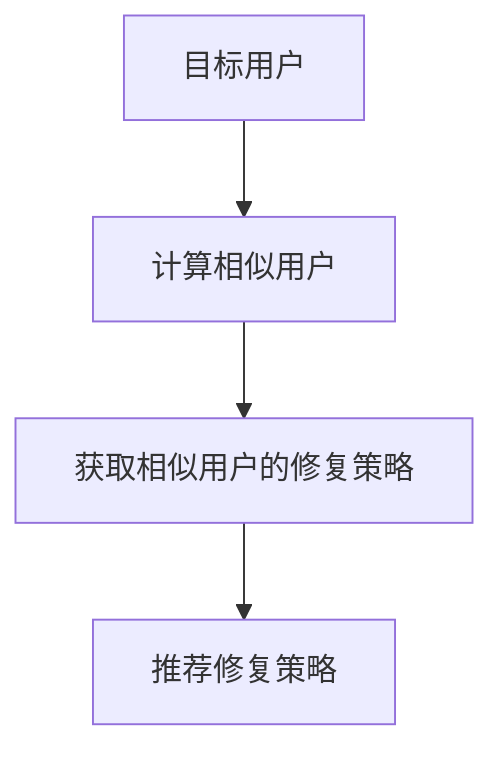
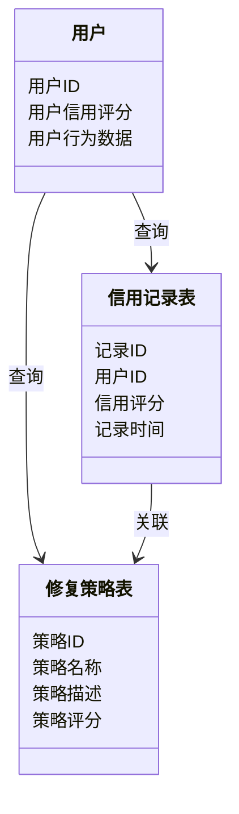
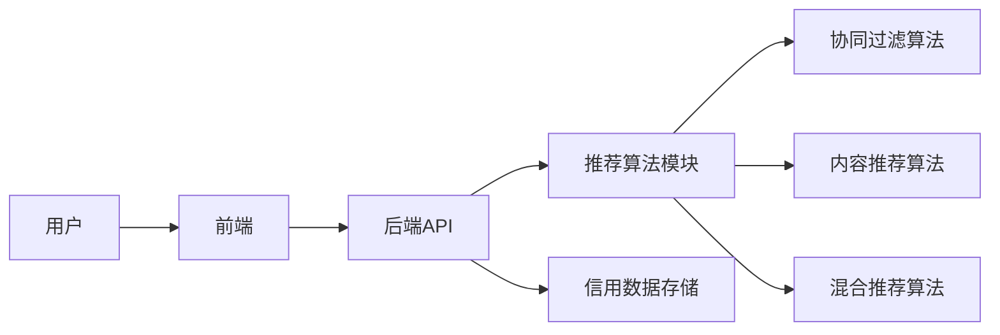
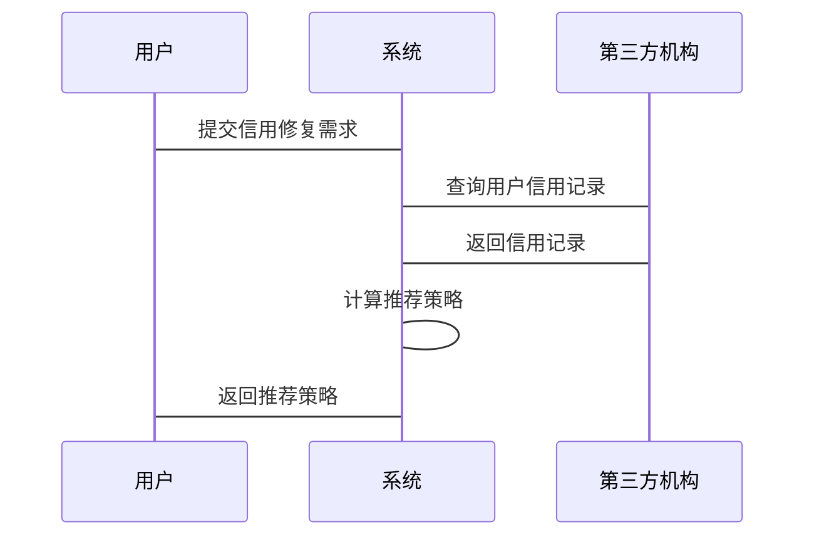

                 


# 智能个人信用修复策略推荐系统

## 关键词：智能推荐系统, 信用修复, 个人信用, 算法推荐, 信用评估

## 摘要：  
本文将介绍智能个人信用修复策略推荐系统的设计与实现。通过分析个人信用修复的核心需求，结合智能推荐算法，提出一种基于协同过滤和混合推荐模型的信用修复策略推荐方法。该方法能够根据个人信用状况和修复需求，智能推荐最优的信用修复策略，帮助个人快速改善信用记录，实现信用修复目标。本文从系统背景、核心算法、系统架构到项目实战，全面阐述了智能个人信用修复策略推荐系统的实现过程，为信用修复领域的智能化发展提供了理论依据和实践指导。

---

# 第一部分: 智能个人信用修复策略推荐系统概述

## 第1章: 智能个人信用修复策略推荐系统背景

### 1.1 信用修复的定义与重要性

#### 1.1.1 信用修复的基本概念
信用修复是指通过改善个人或企业的信用行为，修复因违约、逾期或其他负面信用记录导致的信用损害，从而重新建立良好的信用评级的过程。个人信用修复在金融、借贷、消费等领域具有重要意义，直接影响个人的信用评分、贷款额度和融资能力。

#### 1.1.2 信用修复的必要性与现实意义
随着社会信用体系的完善，信用记录已成为个人和企业的重要资产。然而，由于各种原因（如逾期还款、债务违约等），个人信用记录可能会受到损害。信用修复能够帮助个人消除负面记录，提升信用评分，从而获得更多融资机会和更低的融资成本。

#### 1.1.3 智能修复的优势与传统修复的对比
传统的信用修复方式通常依赖人工咨询和线下操作，效率低下且难以个性化。而智能信用修复通过大数据分析和机器学习算法，能够快速识别信用问题、制定个性化修复方案，并实时跟踪修复进展，显著提高了修复效率和效果。

### 1.2 智能推荐系统的核心概念

#### 1.2.1 智能推荐系统的定义
智能推荐系统是一种基于用户行为数据、历史记录和实时信息，利用机器学习算法为用户推荐最优策略或解决方案的系统。在信用修复场景中，智能推荐系统能够根据用户的信用状况、需求和行为偏好，推荐最优的信用修复策略。

#### 1.2.2 智能推荐系统的分类与特点
智能推荐系统主要分为基于协同过滤的推荐、基于内容的推荐和混合推荐三种类型。其中，协同过滤推荐依赖用户相似性，内容推荐依赖内容特征，混合推荐结合两者优势，推荐效果最佳。

#### 1.2.3 信用修复与推荐系统的结合点
信用修复的核心在于根据用户的信用状况和需求，推荐最优的修复策略。推荐系统能够通过分析用户的信用历史、行为数据和修复需求，动态调整推荐策略，帮助用户快速实现信用修复目标。

### 1.3 本章小结
本章从信用修复的定义、重要性和智能推荐系统的概念入手，阐述了智能信用修复推荐系统的核心思想和应用场景。通过对比传统修复方式和智能修复方式，突出了智能推荐系统在信用修复中的优势和价值。

---

# 第二部分: 智能个人信用修复策略推荐系统的原理与算法

## 第2章: 智能信用修复推荐系统的核心概念与联系

### 2.1 核心概念的定义与属性对比

#### 2.1.1 实体关系图（ER图）
以下是信用修复推荐系统的ER图（Mermaid）：

```mermaid
erDiagram
    actor 用户
    actor 系统
    actor 第三方机构
    database 用户信息表
    database 信用记录表
    database 修复策略表
    用户 -> 用户信息表: 查询
    用户 -> 信用记录表: 查询
    用户 -> 修复策略表: 查询
    系统 -> 用户信息表: 更新
    系统 -> 信用记录表: 更新
    系统 -> 修复策略表: 更新
    第三方机构 -> 用户信息表: 查询
    第三方机构 -> 信用记录表: 查询
    第三方机构 -> 修复策略表: 查询
```

#### 2.1.2 核心概念的属性特征对比表格
以下是比较信用修复和推荐系统的属性特征对比表格：

| 属性       | 信用修复                          | 推荐系统                          |
|------------|-----------------------------------|-----------------------------------|
| 核心目标    | 恢复良好的信用记录                | 推荐最优的信用修复策略            |
| 数据来源    | 信用报告、借贷记录、第三方数据    | 用户行为数据、历史记录、实时数据  |
| 输入        | 用户信用状况、修复需求            | 用户行为、偏好、信用数据          |
| 输出        | 修复策略、修复计划                | 推荐策略、推荐方案                |
| 技术手段    | 机器学习、大数据分析              | 协同过滤、内容推荐、混合推荐模型   |

### 2.2 系统核心算法原理

#### 2.2.1 协同过滤算法
协同过滤是一种基于用户相似性推荐算法，通过分析用户的历史行为和信用数据，找到与目标用户相似的用户群体，推荐这些用户群体常选择的信用修复策略。

#### 2.2.2 基于内容的推荐
基于内容的推荐算法通过分析信用修复策略的特征（如修复方式、修复周期、修复成本等），生成与用户需求相匹配的推荐策略。

#### 2.2.3 混合推荐模型
混合推荐模型结合了协同过滤和基于内容推荐的优点，通过加权融合两种算法的结果，生成更精准的推荐策略。

---

## 第3章: 推荐算法的实现与优化

### 3.1 协同过滤算法的实现

#### 3.1.1 协同过滤的基本原理
协同过滤算法通过计算用户之间的相似度，找到与目标用户相似的用户群体，并基于相似用户的偏好推荐信用修复策略。

#### 3.1.2 协同过滤的实现流程
以下是协同过滤算法的实现流程图（Mermaid）：



#### 3.1.3 协同过滤的优化策略
为了提高协同过滤的效率和准确性，可以通过以下优化策略：
- 使用分布式计算（如MapReduce）处理大规模数据。
- 采用相似度计算的优化方法（如使用局部敏感哈希LSH）。

### 3.2 基于内容的推荐实现

#### 3.2.1 基于内容推荐的基本原理
基于内容的推荐算法通过分析信用修复策略的特征，生成与用户需求相匹配的推荐策略。

#### 3.2.2 内容特征提取方法
以下是一种基于TF-IDF的内容特征提取方法：

```python
from sklearn.feature_extraction.text import TfidfVectorizer

vectorizer = TfidfVectorizer(max_features=100)
tfidf = vectorizer.fit_transform(credit_repair_strategies)
```

#### 3.2.3 内容推荐的优化策略
为了提高内容推荐的准确性，可以通过以下优化策略：
- 使用深度学习模型（如BERT）进行特征提取。
- 增加负采样策略，避免推荐结果的片面性。

### 3.3 混合推荐模型的设计与实现

#### 3.3.1 混合推荐模型的定义
混合推荐模型是一种结合协同过滤和基于内容推荐的混合模型，通过加权融合两种算法的结果，生成更精准的推荐策略。

#### 3.3.2 混合推荐模型的实现步骤
以下是混合推荐模型的实现步骤：

1. **数据预处理**：
   - 对信用修复策略进行特征提取。
   - 对用户数据进行归一化处理。

2. **协同过滤推荐**：
   - 计算用户之间的相似度。
   - 基于相似用户的偏好推荐修复策略。

3. **内容推荐**：
   - 基于修复策略的特征，生成内容推荐结果。

4. **混合推荐**：
   - 将协同过滤推荐和内容推荐的结果进行加权融合。
   - 输出最终的推荐策略。

---

## 第4章: 推荐算法的数学模型与公式

### 4.1 协同过滤算法的数学模型

#### 4.1.1 相似度计算公式
协同过滤算法中常用的相似度计算公式包括余弦相似度和杰卡德相似度。以下是余弦相似度的公式：

$$ \text{余弦相似度} = \frac{\vec{u} \cdot \vec{v}}{\|\vec{u}\| \cdot \|\vec{v}\|} $$

其中，$\vec{u}$ 和 $\vec{v}$ 分别是目标用户和相似用户的特征向量。

#### 4.1.2 预测评分公式
协同过滤算法中的预测评分公式如下：

$$ \hat{r}_{u,i} = \bar{r} + \sum_{k \in N(u)} w_{u,k}(r_{k,i} - \bar{r}) $$

其中，$\bar{r}$ 是全局平均评分，$N(u)$ 是与目标用户 $u$ 相似的用户集合，$w_{u,k}$ 是用户 $u$ 和用户 $k$ 之间的相似度权重，$r_{k,i}$ 是用户 $k$ 对项 $i$ 的评分。

### 4.2 基于内容的推荐算法的数学模型

#### 4.2.1 特征向量计算公式
基于内容的推荐算法中，特征向量可以通过TF-IDF方法计算，公式如下：

$$ \text{TF-IDF}(i,j) = \text{TF}(i,j) \times \text{IDF}(i,j) $$

其中，$\text{TF}(i,j)$ 是词 $i$ 在文档 $j$ 中的词频，$\text{IDF}(i,j)$ 是词 $i$ 的逆文档频率。

#### 4.2.2 相似度计算公式
基于内容的推荐算法中，相似度计算公式可以采用余弦相似度：

$$ \text{相似度} = \frac{\vec{v}_i \cdot \vec{v}_j}{\|\vec{v}_i\| \cdot \|\vec{v}_j\|} $$

其中，$\vec{v}_i$ 和 $\vec{v}_j$ 分别是两个信用修复策略的特征向量。

### 4.3 混合推荐模型的数学公式

#### 4.3.1 综合评分计算公式
混合推荐模型的综合评分公式如下：

$$ \text{综合评分} = \alpha \times \text{协同过滤评分} + (1-\alpha) \times \text{内容推荐评分} $$

其中，$\alpha$ 是协同过滤和内容推荐的权重系数，取值范围为 $0 \leq \alpha \leq 1$。

#### 4.3.2 模型优化公式
为了优化混合推荐模型的性能，可以采用以下优化公式：

$$ \theta = \arg \min \left( \text{损失函数} \right) $$

其中，$\theta$ 是模型的优化参数，损失函数可以根据具体场景选择合适的目标函数（如均方误差、交叉熵等）。

---

# 第三部分: 智能个人信用修复策略推荐系统的系统分析与架构设计

## 第5章: 系统分析与架构设计

### 5.1 问题场景介绍
智能个人信用修复策略推荐系统的应用场景包括个人信用评估、信用修复需求分析、修复策略推荐、修复进展跟踪等。

### 5.2 项目介绍
本项目旨在开发一个基于机器学习的智能信用修复策略推荐系统，通过分析用户的信用数据和行为数据，推荐最优的信用修复策略。

### 5.3 系统功能设计
以下是系统功能设计的类图（Mermaid）：



### 5.4 系统架构设计
以下是系统架构设计的架构图（Mermaid）：



### 5.5 系统接口设计
以下是系统接口设计的交互图（Mermaid）：



---

## 第6章: 项目实战

### 6.1 环境安装

#### 6.1.1 安装Python和依赖库
以下是如何安装Python和相关依赖库的代码：

```bash
python -m pip install --upgrade pip
pip install numpy
pip install pandas
pip install scikit-learn
pip install mermaid
```

### 6.2 系统核心实现源代码

#### 6.2.1 协同过滤算法实现
以下是一个协同过滤算法的Python代码示例：

```python
from sklearn.metrics.pairwise import cosine_similarity

def collaborative_filtering(user_similarity, user_rating):
    # 计算相似用户的平均评分
    similar_users = user_similarity.argsort()[-5:][::-1]
    recommended_ratings = []
    for user in similar_users:
        recommended_ratings.append(user_rating[user])
    return recommended_ratings
```

#### 6.2.2 混合推荐模型实现
以下是一个混合推荐模型的Python代码示例：

```python
import numpy as np

def hybrid_recommendation(cosine_recommendations, content_recommendations, alpha=0.5):
    # 加权融合两种推荐结果
    hybrid_recommendations = []
    for i in range(len(cosine_recommendations)):
        hybrid_score = alpha * cosine_recommendations[i] + (1 - alpha) * content_recommendations[i]
        hybrid_recommendations.append(hybrid_score)
    # 返回排序后的推荐结果
    return sorted(hybrid_recommendations, reverse=True)
```

### 6.3 实际案例分析
以下是一个实际案例分析的示例：

1. **数据预处理**：
   - 读取信用记录数据。
   - 进行数据清洗和特征提取。

2. **模型训练**：
   - 使用协同过滤算法和内容推荐算法训练模型。
   - 融合两种算法的结果，生成最终的推荐策略。

3. **结果分析**：
   - 对推荐策略的效果进行评估。
   - 调整模型参数，优化推荐效果。

---

## 第7章: 最佳实践与总结

### 7.1 最佳实践
在实际应用中，建议采取以下最佳实践：
- 定期更新模型参数，保证推荐结果的实时性。
- 结合用户反馈，动态调整推荐策略。
- 注意数据隐私和安全，确保用户信息的安全性。

### 7.2 小结
本文详细介绍了智能个人信用修复策略推荐系统的实现过程，从系统背景到算法原理，再到系统架构和项目实战，为读者提供了一个完整的实现方案。

### 7.3 注意事项
在实际应用中，需要注意以下几点：
- 数据隐私保护。
- 模型的可解释性。
- 系统的可扩展性。

### 7.4 拓展阅读
对于感兴趣的技术细节，读者可以进一步阅读以下资料：
- 《推荐系统导论》。
- 《机器学习实战》。
- 《信用评估与风险管理》。

---

# 作者：AI天才研究院/AI Genius Institute & 禅与计算机程序设计艺术/Zen And The Art of Computer Programming

---

以上是一个详细的目录大纲和部分章节内容，您可以根据实际需求进一步扩展和完善。

