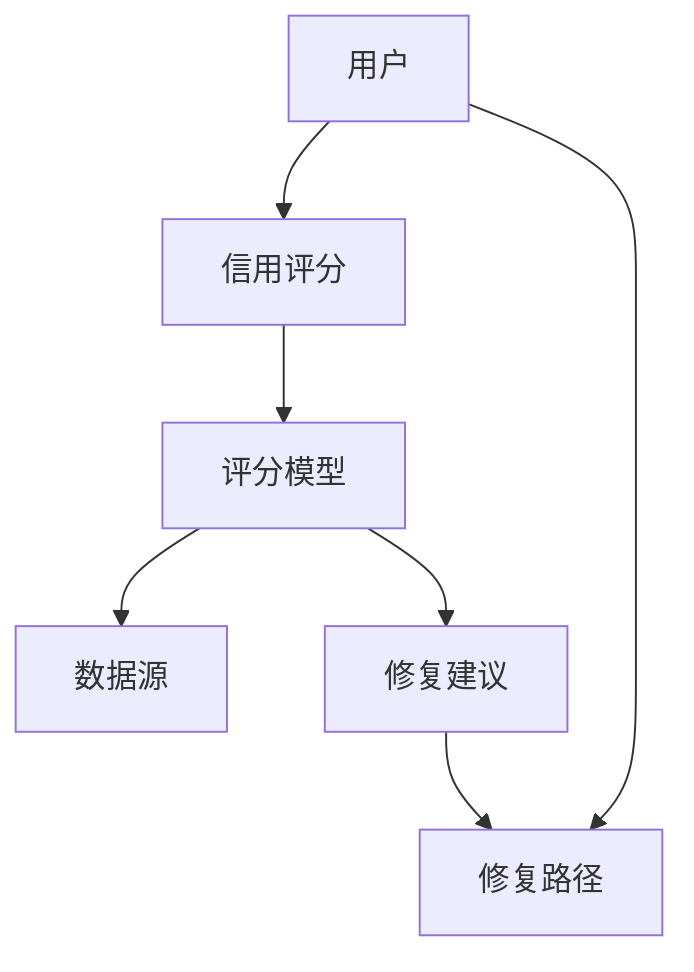
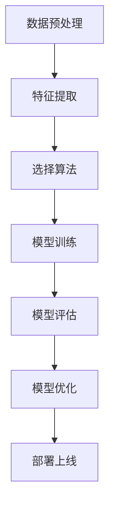
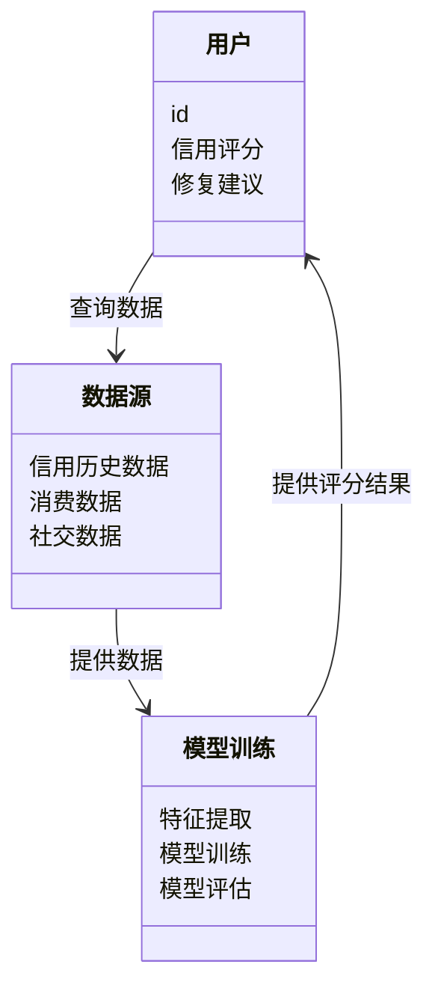
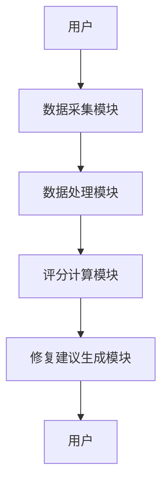
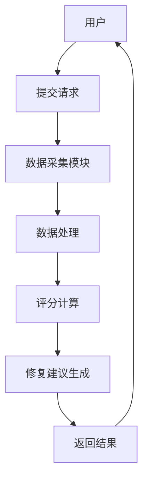

                 


# 智能个人信用评分优化与修复建议系统

> 关键词：智能信用评分、机器学习、修复建议、系统架构、数据驱动

> 摘要：本文详细介绍了智能个人信用评分优化与修复建议系统的构建与实现，从背景、核心概念、算法原理到系统架构，再到项目实战和最佳实践，全面解析了如何利用人工智能技术提升个人信用评分的精准性和修复效率。

---

## 第一部分：背景介绍

### 第1章：智能个人信用评分系统概述

#### 1.1 问题背景
- **传统信用评分的局限性**：传统信用评分主要依赖少量的信用历史数据，难以覆盖多样化的信用行为，且模型更新周期较长，无法实时反映用户的信用状况。
- **智能信用评分的提出与意义**：通过引入人工智能和大数据技术，智能信用评分可以更精准地评估个人信用风险，同时提供个性化的修复建议，帮助用户提升信用评分。
- **当前信用评分系统的痛点与挑战**：
  - 数据维度单一，难以全面反映用户的信用状况。
  - 模型更新周期长，难以应对快速变化的信用环境。
  - 缺乏用户友好的修复建议机制，用户难以有效提升信用评分。

#### 1.2 问题描述
- **信用评分的定义与作用**：信用评分是衡量个人信用风险的重要指标，广泛应用于贷款审批、信用卡额度调整等领域。
- **现有评分模型的不足**：传统评分模型主要基于信用历史数据，忽略了社交网络、消费行为等多样化数据，且模型缺乏动态调整能力。
- **智能评分系统的目标与需求**：
  - 建立一个基于多维度数据的智能评分模型。
  - 提供个性化的修复建议，帮助用户提升信用评分。
  - 实现实时更新，确保评分的准确性与及时性。

#### 1.3 问题解决思路
- **数据驱动的评分优化**：通过收集和分析多维度数据（如信用历史、消费行为、社交网络等），构建更精准的评分模型。
- **智能算法的应用**：引入机器学习算法（如随机森林、梯度提升树等），提升评分模型的准确性和可解释性。
- **修复建议的生成机制**：基于评分结果，结合用户行为数据，生成个性化的修复建议，帮助用户提升信用评分。

#### 1.4 系统边界与外延
- **系统功能边界**：系统主要提供信用评分计算、修复建议生成和评分动态更新三大功能。
- **与相关系统的交互**：系统需要与信用机构、消费平台、社交网络等外部系统进行数据交互。
- **系统的可扩展性与适应性**：系统设计需具备灵活性，能够快速接入新的数据源和评分算法。

#### 1.5 核心概念与组成
- **数据来源与处理**：包括信用历史数据、消费数据、社交数据等多维度数据的采集与预处理。
- **智能算法与模型**：基于机器学习的评分模型，如随机森林、XGBoost等。
- **修复建议的生成与展示**：基于评分结果和用户行为数据，生成个性化修复建议，并通过可视化方式展示给用户。

---

## 第二部分：核心概念与联系

### 第2章：智能信用评分系统的核心原理

#### 2.1 核心概念原理
- **评分模型的输入与输出**：输入包括多维度数据，输出是用户的信用评分及其解释。
- **智能算法的特征提取**：通过机器学习算法从多维度数据中提取关键特征，提升评分的准确性。
- **评分结果的解释性**：通过模型解释技术（如SHAP值），向用户展示评分结果的影响因素。

#### 2.2 核心概念对比表
- 表2.1：传统评分模型与智能评分模型的对比

| 对比维度         | 传统评分模型                     | 智能评分模型                     |
|------------------|----------------------------------|----------------------------------|
| 数据来源         | 信用历史数据                     | 多维度数据（信用历史、消费、社交等）|
| 模型更新周期     | 长周期（月或季度）                | 实时更新                        |
| 可解释性         | 较低                            | 较高（通过特征重要性分析）        |
| 修复建议         | 缺乏个性化建议                   | 提供个性化修复路径                |

#### 2.3 实体关系图（ER图）
- 图2.1：智能评分系统实体关系图（Mermaid图）



---

## 第三部分：算法原理讲解

### 第3章：基于机器学习的评分优化算法

#### 3.1 算法原理
- **线性回归模型**：
  - 输入：多维度特征向量。
  - 输出：信用评分预测值。
  - 损失函数：均方误差（MSE）。
  - 优化算法：梯度下降。
- **随机森林**：
  - 输入：多维度特征向量。
  - 输出：信用评分预测值。
  - 核心原理：基于决策树的集成学习，通过随机采样和特征选择提升模型的泛化能力。
- **XGBoost（梯度提升树）**：
  - 输入：多维度特征向量。
  - 输出：信用评分预测值。
  - 核心原理：通过并行树的构建，快速优化模型性能。

#### 3.2 算法流程图
- 图3.1：机器学习评分优化流程图（Mermaid图）



#### 3.3 算法实现代码
- 代码3.1：Python实现的评分优化模型

```python
import pandas as pd
from sklearn.ensemble import RandomForestClassifier
from sklearn.model_selection import train_test_split
from sklearn.metrics import accuracy_score

# 数据加载与预处理
data = pd.read_csv('credit_data.csv')
X = data.drop('credit_score', axis=1)
y = data['credit_score']

# 数据分割
X_train, X_test, y_train, y_test = train_test_split(X, y, test_size=0.2, random_state=42)

# 模型训练
model = RandomForestClassifier(n_estimators=100, max_depth=5, random_state=42)
model.fit(X_train, y_train)

# 模型评估
y_pred = model.predict(X_test)
print(f'Accuracy: {accuracy_score(y_test, y_pred)}')
```

#### 3.4 数学公式
- 线性回归的损失函数：
  $$ \text{Loss} = \frac{1}{2n}\sum_{i=1}^{n}(y_i - \hat{y}_i)^2 $$
  
- 梯度下降的优化步骤：
  $$ w := w - \eta \cdot \nabla_w \text{Loss} $$

---

## 第四部分：系统分析与架构设计

### 第4章：智能评分系统架构设计

#### 4.1 问题场景介绍
- **系统目标用户**：个人用户，包括需要提升信用评分的用户。
- **系统运行环境**：基于云平台，支持实时数据处理和模型训练。
- **系统功能需求**：
  - 数据采集：从多种数据源采集用户数据。
  - 评分计算：基于机器学习模型计算用户的信用评分。
  - 修复建议生成：根据评分结果生成个性化修复建议。

#### 4.2 系统功能设计
- **数据采集模块**：
  - 从信用机构、消费平台、社交网络等数据源采集数据。
  - 数据清洗与特征提取。
- **评分计算模块**：
  - 输入多维度特征数据，输出信用评分。
  - 支持多种评分模型（如随机森林、XGBoost）。
- **修复建议生成模块**：
  - 根据评分结果和用户行为数据，生成修复建议。
  - 提供修复路径的可视化展示。

#### 4.3 系统架构设计
- **领域模型类图**：
  图4.1：智能评分系统领域模型类图（Mermaid图）



- **系统架构图**：
  图4.2：智能评分系统架构图（Mermaid图）



- **系统交互流程图**：
  图4.3：智能评分系统交互流程图（Mermaid图）



---

## 第五部分：项目实战

### 第5章：智能评分系统项目实战

#### 5.1 环境安装
- **Python版本**：3.8及以上。
- **依赖库安装**：
  ```bash
  pip install pandas scikit-learn xgboost
  ```

#### 5.2 核心代码实现
- 代码5.1：数据预处理与特征提取

```python
import pandas as pd
import numpy as np

# 数据加载
data = pd.read_csv('credit_data.csv')

# 数据清洗
data = data.dropna()
data = pd.get_dummies(data)

# 特征提取
X = data.drop('credit_score', axis=1)
y = data['credit_score']
```

- 代码5.2：模型训练与评估

```python
from sklearn.ensemble import RandomForestClassifier
from sklearn.model_selection import train_test_split
from sklearn.metrics import classification_report

X_train, X_test, y_train, y_test = train_test_split(X, y, test_size=0.2, random_state=42)

model = RandomForestClassifier(n_estimators=100, max_depth=5, random_state=42)
model.fit(X_train, y_train)

y_pred = model.predict(X_test)
print(classification_report(y_test, y_pred))
```

#### 5.3 修复建议生成
- 修复建议的生成基于评分结果和用户行为数据，具体步骤如下：
  1. 根据评分结果，分析影响评分的关键因素。
  2. 提供针对性的修复建议，如优化消费行为、增加信用历史等。
  3. 生成修复路径的可视化展示，帮助用户理解修复步骤。

#### 5.4 实际案例分析
- 案例背景：用户A，信用评分650分，希望通过提升消费行为和信用历史来提高评分。
- 修复建议：
  1. 提供按时还款建议，优化信用历史。
  2. 建议适度消费，避免过度借贷。

#### 5.5 项目小结
- 本项目通过机器学习算法实现了智能信用评分系统，并提供了个性化的修复建议，显著提升了评分的准确性和修复效率。

---

## 第六部分：最佳实践与注意事项

### 第6章：智能评分系统最佳实践

#### 6.1 小结
- **数据预处理**：确保数据的完整性和准确性，是模型训练的基础。
- **模型调优**：通过交叉验证和超参数优化，提升模型性能。
- **系统维护**：定期更新模型和数据，确保评分的准确性和实时性。

#### 6.2 注意事项
- **数据隐私保护**：确保用户数据的安全性和隐私性。
- **模型可解释性**：通过模型解释技术，帮助用户理解评分结果。
- **修复建议的可行性**：确保修复建议的实际可行性和用户友好性。

#### 6.3 拓展阅读
- **推荐书籍**：《Hands-On Machine Learning with Scikit-Learn, Keras, and TensorFlow》
- **推荐博客**：Towards Data Science - Credit Score Prediction with Machine Learning

---

## 作者

作者：AI天才研究院/AI Genius Institute & 禅与计算机程序设计艺术 /Zen And The Art of Computer Programming

---

**注**：本文为《智能个人信用评分优化与修复建议系统》的技术博客文章，后续章节内容将根据上述大纲逐步展开，详细讲解每个部分的核心内容。

