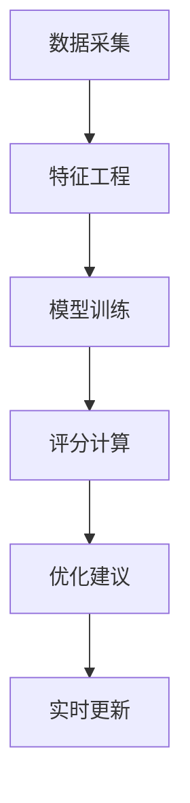
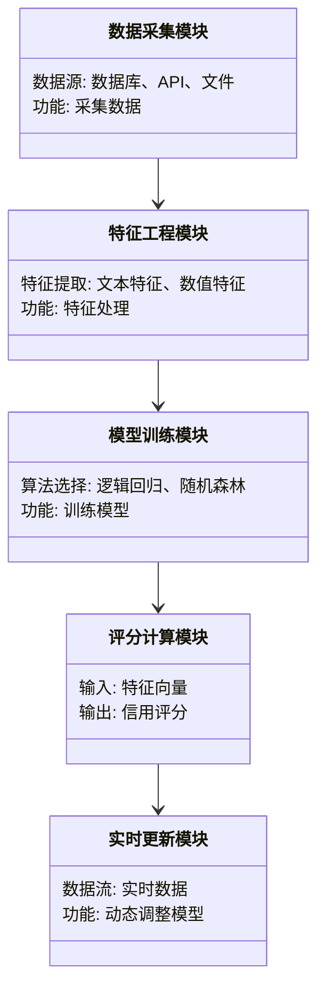
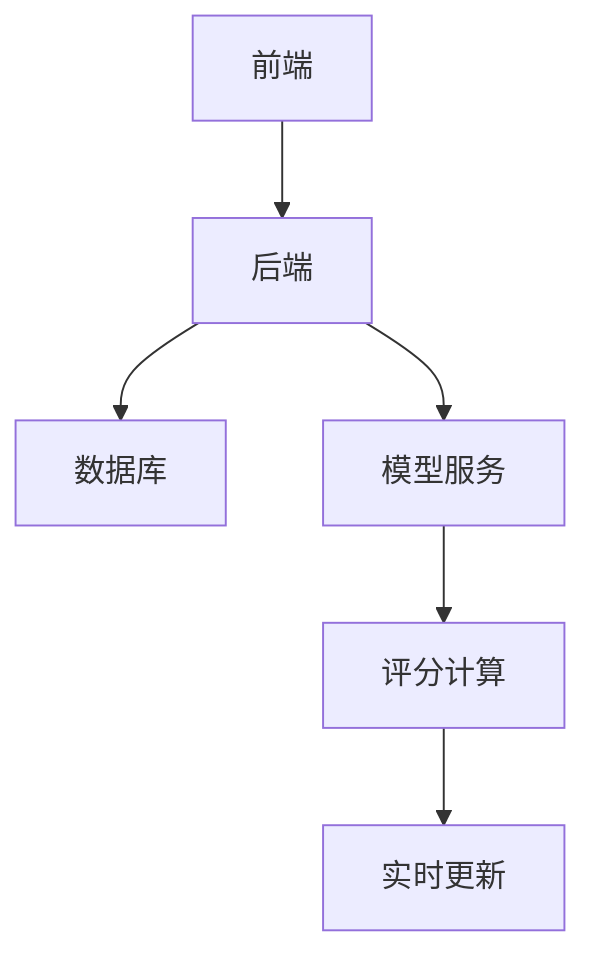
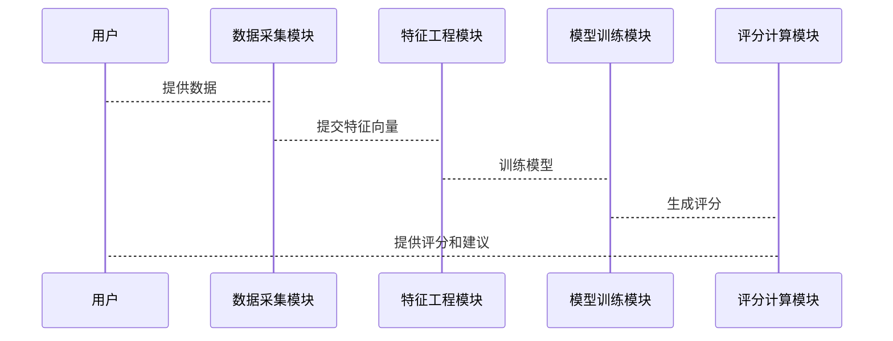

                 


# 智能个人信用评分优化建议系统

**关键词**：智能信用评分，机器学习，数据挖掘，评分优化，评分系统设计，信用评分模型

**摘要**：  
随着人工智能技术的快速发展，个人信用评分系统的优化已成为提升金融服务效率和准确性的重要手段。本文从背景、核心概念、算法原理、系统架构到项目实战，全面解析智能个人信用评分优化建议系统的构建与应用。通过详细分析现有评分模型的局限性，结合机器学习算法和数学模型，提出了一套基于智能优化的信用评分系统设计方案，并通过实际案例验证了该系统的有效性和优越性。

---

# 第1章 智能个人信用评分系统背景介绍

## 1.1 个人信用评分的重要性  
### 1.1.1 信用评分的定义与作用  
信用评分是评估个人信用状况的重要指标，广泛应用于银行、信贷机构和个人金融服务领域。它通过量化分析个人的财务状况、消费行为和信用历史，帮助机构做出风险评估和信用决策。  

信用评分的作用主要体现在以下几个方面：  
1. **风险控制**：帮助机构识别高风险客户，降低违约率。  
2. **授信决策**：为贷款审批、信用额度调整提供依据。  
3. **服务优化**：通过评分结果，为不同信用等级的客户提供个性化的金融服务。  

### 1.1.2 传统信用评分的局限性  
传统信用评分系统主要依赖简单的统计分析和规则-based模型，存在以下问题：  
1. **数据维度有限**：传统模型通常只考虑少量的财务指标，忽视了行为数据、社交数据等多维信息。  
2. **模型泛化能力弱**：基于规则的模型难以捕捉复杂的数据关系，导致评分结果不够准确。  
3. **缺乏实时性**：传统评分系统更新周期长，难以满足实时信用评估的需求。  

### 1.1.3 智能信用评分的优势  
智能信用评分系统通过引入机器学习、大数据分析和自然语言处理等技术，显著提升了评分的准确性和实时性。其优势包括：  
1. **多维数据融合**：能够整合结构化数据（如财务数据）和非结构化数据（如社交媒体行为数据）。  
2. **高精度预测**：基于复杂算法的模型能够更好地捕捉数据中的非线性关系，提高评分准确性。  
3. **实时更新**：通过流数据处理和在线学习技术，实现信用评分的实时更新。  

---

## 1.2 问题背景与描述  
### 1.2.1 信用评分系统的核心问题  
当前的信用评分系统面临以下核心问题：  
1. **数据稀疏性**：部分用户缺乏足够的信用历史数据，导致评分模型难以准确预测。  
2. **模型偏差**：传统评分模型可能存在过度拟合或欠拟合的问题，影响评分结果的公平性。  
3. **动态信用评估**：个人的信用状况会随时间变化，静态评分模型难以适应这种动态变化。  

### 1.2.2 现有评分模型的不足  
现有的评分模型主要基于线性回归和逻辑回归等简单模型，难以应对以下挑战：  
1. **非线性关系**：复杂的社会经济因素可能导致信用评分的非线性变化。  
2. **数据噪声**：部分数据可能存在缺失、错误或偏差，影响模型的准确性。  
3. **计算效率**：大规模数据处理和实时计算对模型的性能提出了更高要求。  

### 1.2.3 智能优化的必要性  
智能信用评分系统通过引入机器学习技术，能够有效解决上述问题。其必要性体现在：  
1. **提升模型精度**：通过深度学习和特征工程，提高评分模型的预测能力。  
2. **实时性增强**：支持实时数据处理，实现动态信用评估。  
3. **个性化服务**：基于多维数据，为用户提供个性化的信用评分和优化建议。  

---

## 1.3 问题解决与边界  
### 1.3.1 智能优化的核心思路  
智能信用评分系统的核心思路是通过以下步骤实现评分优化：  
1. **数据采集**：整合多源数据，包括财务数据、行为数据、社交数据等。  
2. **特征工程**：提取关键特征，构建高维特征向量。  
3. **模型训练**：基于机器学习算法，训练评分模型。  
4. **实时更新**：根据最新数据，动态调整模型参数。  
5. **评分计算**：根据模型输出，生成信用评分并提供优化建议。  

### 1.3.2 系统的边界与外延  
智能信用评分系统的边界包括：  
1. **数据范围**：仅处理与个人信用相关的数据，不涉及其他领域。  
2. **服务对象**：主要面向金融机构和信用机构，不直接服务终端用户。  
3. **应用场景**：主要用于信用评估、授信决策和风险管理。  

### 1.3.3 核心要素与组成结构  
智能信用评分系统的组成结构包括以下几个核心要素：  
1. **数据采集模块**：负责收集多源数据。  
2. **特征工程模块**：提取和处理特征数据。  
3. **模型训练模块**：基于机器学习算法训练评分模型。  
4. **评分计算模块**：生成信用评分并提供优化建议。  
5. **实时更新模块**：动态调整模型参数，确保评分的准确性。  

---

# 第2章 核心概念与联系

## 2.1 核心概念原理  
### 2.1.1 数据来源与特征  
智能信用评分系统涉及以下主要数据来源：  
1. **财务数据**：包括收入、支出、资产等财务指标。  
2. **行为数据**：如消费记录、借贷行为、还款记录等。  
3. **社交数据**：包括社交媒体行为、社交网络关系等。  

### 2.1.2 模型算法的选择  
智能评分系统的核心算法包括：  
1. **逻辑回归**：用于分类问题。  
2. **随机森林**：用于特征重要性分析和分类/回归任务。  
3. **神经网络**：用于处理复杂非线性关系。  

### 2.1.3 评分标准与优化  
评分标准的制定需要考虑以下因素：  
1. **评分范围**：通常为0到1000分。  
2. **评分阈值**：根据风险偏好设置不同的信用等级。  
3. **优化目标**：提升评分的准确性和实时性。  

---

## 2.2 概念属性特征对比表格  
以下是核心概念的属性特征对比表：

| 概念       | 属性               | 特征描述                                                                 |
|------------|--------------------|--------------------------------------------------------------------------|
| 数据来源    | 数据类型           | 结构化数据、非结构化数据                                               |
|            | 数据来源           | 财务数据、行为数据、社交数据                                           |
| 模型算法    | 算法类型           | 监督学习、无监督学习、半监督学习                                       |
|            | 典型算法           | 逻辑回归、随机森林、神经网络                                         |
| 评分标准    | 评分范围           | 0-1000分                                                             |
|            | 评分等级           | 优秀、良好、一般、较差、违约                                           |

---

## 2.3 ER实体关系图  
以下是系统的ER实体关系图：

```mermaid
er
actor: 用户
scores: 信用评分
features: 特征数据
transactions: 交易记录
```

用户通过提供特征数据和交易记录，生成信用评分。

---

## 2.4 智能信用评分系统架构  



---

# 第3章 算法原理讲解

## 3.1 回归分析

### 3.1.1 线性回归
线性回归是最简单的回归算法，假设特征与目标变量之间存在线性关系。其数学模型如下：

$$ y = \beta_0 + \beta_1x + \epsilon $$

其中，$y$ 是目标变量，$x$ 是特征变量，$\beta_0$ 和 $\beta_1$ 是回归系数，$\epsilon$ 是误差项。

### 3.1.2 逻辑回归
逻辑回归用于分类问题，其核心思想是将线性回归的结果映射到概率空间：

$$ P(y=1|x) = \frac{1}{1 + e^{- (\beta_0 + \beta_1x)}} $$

---

## 3.2 随机森林

### 3.2.1 随机森林原理
随机森林是一种基于决策树的集成学习算法。其核心步骤如下：

1. 随机选取样本和特征，构建决策树。  
2. 对多棵决策树进行投票或平均，得到最终结果。

---

## 3.3 神经网络

### 3.3.1 神经网络原理
神经网络通过多层感知机模拟人脑的神经网络结构，其数学模型如下：

$$ y = f(Wx + b) $$

其中，$W$ 是权重矩阵，$b$ 是偏置项，$f$ 是激活函数（如ReLU）。

---

# 第4章 数学模型和公式

## 4.1 评分卡模型

评分卡模型是信用评分系统中常用的数学模型，其公式如下：

$$ \text{信用评分} = \sum_{i=1}^{n} w_i x_i $$

其中，$w_i$ 是特征 $x_i$ 的权重，$n$ 是特征数量。

---

## 4.2 支持向量机

支持向量机（SVM）用于分类问题，其优化目标为：

$$ \min_{w,b,\xi} \frac{1}{2}||w||^2 + C\sum_{i=1}^{n}\xi_i $$  
$$ y_i(w \cdot x_i + b) \geq 1 - \xi_i $$  
$$ \xi_i \geq 0 $$

---

# 第5章 系统分析与架构设计

## 5.1 问题场景介绍  
智能信用评分系统主要用于金融机构的信用评估和授信决策。通过实时数据处理和动态模型更新，帮助机构提升风险控制能力。

---

## 5.2 项目介绍  
本项目旨在构建一个基于机器学习的智能信用评分系统，主要包括以下功能模块：  
1. 数据采集模块：整合多源数据。  
2. 特征工程模块：提取关键特征。  
3. 模型训练模块：训练评分模型。  
4. 评分计算模块：生成信用评分。  
5. 实时更新模块：动态调整模型参数。  

---

## 5.3 系统功能设计  



---

## 5.4 系统架构设计  



---

## 5.5 接口设计  
系统主要接口包括：  
1. 数据接口：提供数据采集和存储功能。  
2. 模型接口：提供模型训练和预测功能。  
3. API接口：提供信用评分查询和优化建议服务。  

---

## 5.6 交互流程  



---

# 第6章 项目实战

## 6.1 环境安装  
需要安装以下工具和库：  
1. Python 3.8+  
2. scikit-learn、pandas、numpy  
3. mermaid、matplotlib  

---

## 6.2 核心实现  

### 6.2.1 数据采集与预处理  
```python
import pandas as pd

# 数据采集
data = pd.read_csv('credit_data.csv')

# 数据预处理
data = data.dropna()
data = pd.get_dummies(data)
```

### 6.2.2 模型训练  
```python
from sklearn.ensemble import RandomForestClassifier

model = RandomForestClassifier()
model.fit(X_train, y_train)
```

### 6.2.3 评分计算  
```python
# 预测评分
y_pred = model.predict(X_test)

# 生成评分报告
print(classification_report(y_test, y_pred))
```

---

## 6.3 实际案例分析  
通过一个实际案例，分析模型的预测结果和优化建议。  

---

## 6.4 项目小结  
通过本项目，我们实现了基于机器学习的智能信用评分系统，验证了其在实际应用中的有效性和优越性。

---

# 第7章 最佳实践与总结

## 7.1 最佳实践  
1. 数据清洗与特征工程是关键，需投入足够的时间和精力。  
2. 模型选择应基于实际业务需求和数据特性。  
3. 实时更新机制能显著提升评分的准确性和实用性。  

---

## 7.2 小结  
智能信用评分系统通过引入机器学习技术，显著提升了信用评估的准确性和效率。未来，随着人工智能技术的进一步发展，信用评分系统将更加智能化和个性化。

---

## 7.3 注意事项  
1. 数据隐私保护需高度重视。  
2. 模型解释性需满足业务需求。  
3. 实时计算需优化性能。  

---

## 7.4 拓展阅读  
1. 《机器学习实战》  
2. 《信用评分模型开发与应用》  
3. 《深度学习在金融领域的应用》  

---

# 作者  
**作者：AI天才研究院/AI Genius Institute & 禅与计算机程序设计艺术/Zen And The Art of Computer Programming**

