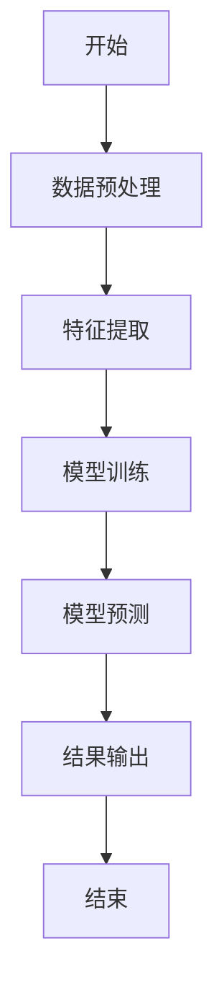
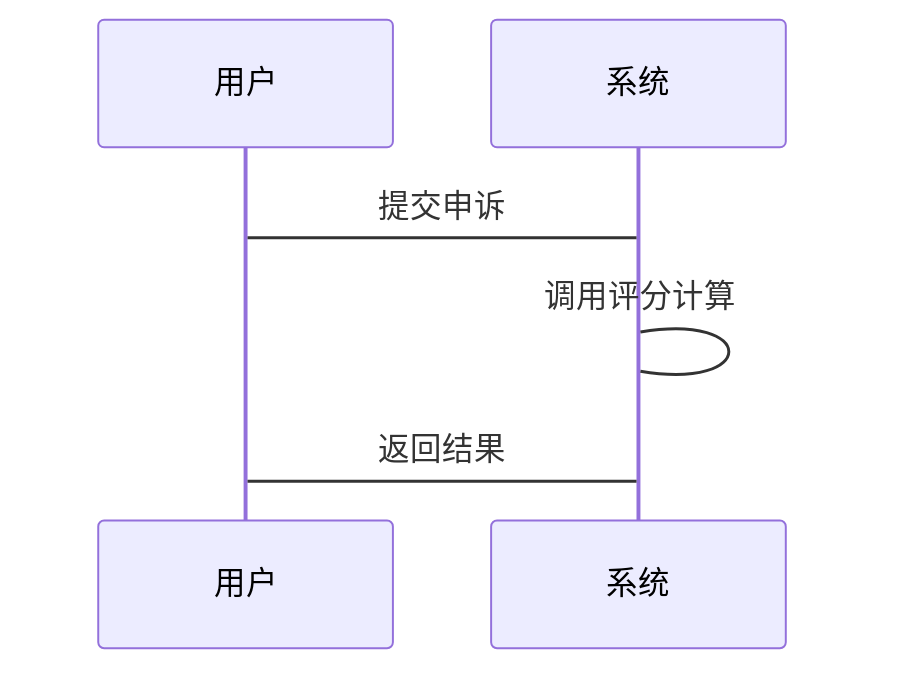

                 


# 智能个人信用评分申诉处理系统

> 关键词：智能信用评分，个人信用评估，申诉处理系统，机器学习，数据驱动

> 摘要：本文深入探讨了智能个人信用评分申诉处理系统的构建与优化，从系统背景、核心概念、算法原理到系统架构、项目实战等多方面进行详细分析，结合实际案例和代码实现，为读者提供一套完整的解决方案。

---

# 第1章: 智能个人信用评分申诉处理系统概述

## 1.1 信用评分的背景与现状

### 1.1.1 信用评分的定义与作用

信用评分是金融机构评估个人信用状况的重要指标，用于判断个人的还款能力和信用风险。传统信用评分主要基于历史借款记录、收入水平、资产状况等数据。

### 1.1.2 当前信用评分系统的主要问题

- 数据孤岛：不同金融机构之间的数据难以共享，导致评分结果不一致。
- 人工干预：申诉处理流程复杂，依赖人工审核，效率低下。
- 信息不对称：用户无法了解评分的具体依据，导致申诉困难。

### 1.1.3 智能化信用评分系统的必要性

随着人工智能技术的发展，智能化信用评分系统能够通过大数据分析和机器学习算法，快速、准确地处理申诉，提升用户体验和效率。

---

## 1.2 个人信用评分申诉的痛点分析

### 1.2.1 传统信用评分申诉的流程与挑战

传统申诉流程通常包括提交申请、人工审核、结果反馈等步骤，耗时长、效率低。

### 1.2.2 申诉处理中的信息不对称问题

用户无法了解评分的具体依据，导致申诉困难，容易引发信任危机。

### 1.2.3 用户体验与效率的提升需求

用户希望申诉处理能够快速、透明，减少等待时间，提升满意度。

---

## 1.3 智能化信用评分申诉处理系统的概念

### 1.3.1 智能化系统的定义

智能化信用评分申诉处理系统通过机器学习、自然语言处理等技术，实现申诉的自动化处理和快速响应。

### 1.3.2 系统的核心目标与功能

- 提供在线申诉入口
- 自动化审核与反馈
- 提供评分解释与改进建议

### 1.3.3 系统的边界与外延

系统边界包括用户端、评分模型、申诉处理模块，外延则涉及数据源、第三方服务等。

---

## 1.4 系统的核心要素与组成

### 1.4.1 数据来源与处理

数据来源包括用户提交的信息、历史借贷记录、第三方征信数据等。

### 1.4.2 智能算法与模型

基于机器学习的评分模型，结合自然语言处理技术，实现自动化申诉处理。

### 1.4.3 用户交互与反馈机制

用户可以通过在线界面提交申诉，系统实时反馈处理结果。

---

## 1.5 本章小结

本章介绍了智能个人信用评分申诉处理系统的背景、痛点和核心概念，为后续章节的深入分析奠定了基础。

---

# 第2章: 智能个人信用评分申诉处理系统的核心概念

## 2.1 系统核心概念的原理分析

### 2.1.1 数据驱动的信用评分

通过大数据分析，提取关键特征，构建评分模型。

### 2.1.2 智能算法的特征提取

利用机器学习算法，从海量数据中提取对评分影响较大的特征。

### 2.1.3 申诉处理的自动化流程

通过自然语言处理技术，自动化分析用户申诉内容，快速生成处理结果。

---

## 2.2 核心概念的属性特征对比

### 2.2.1 不同评分模型的对比分析

| 模型类型 | 优点 | 缺点 |
|----------|------|------|
| 线性回归 | 简单易懂 | 非线性关系处理能力差 |
| 支持向量机 | 高维数据表现好 | 参数敏感性高 |
| 随机森林 | 抗过拟合 | 解释性差 |

### 2.2.2 传统与智能化处理方式的对比

| 特性 | 传统方式 | 智能化方式 |
|------|----------|-----------|
| 处理效率 | 低 | 高 |
| 人工干预 | 高 | 低 |
| 准确性 | 中等 | 高 |

### 2.2.3 系统功能模块的特征分析

系统功能模块包括用户身份验证、申诉提交、评分模型调用、结果反馈等。

---

## 2.3 系统的ER实体关系图

```mermaid
er
  actor: 用户
  actor: 评分系统
  actor: 申诉处理系统
  actor: 数据源
  relation: 用户提交申诉
  relation: 系统处理申诉
  relation: 数据源提供信息
```

---

## 2.4 本章小结

本章通过对比分析和ER图，详细阐述了智能个人信用评分申诉处理系统的核心概念和模块组成。

---

# 第3章: 智能个人信用评分申诉处理系统的算法原理

## 3.1 算法原理概述

### 3.1.1 机器学习在信用评分中的应用

机器学习算法用于特征提取和评分模型的构建。

### 3.1.2 自然语言处理在申诉处理中的作用

自然语言处理技术用于分析用户申诉内容，提取关键信息。

### 3.1.3 深度学习模型的构建与优化

通过深度学习模型，进一步提升评分的准确性和申诉处理的效率。

---

## 3.2 算法流程图



---

## 3.3 算法实现的Python代码

```python
import pandas as pd
from sklearn.model import LogisticRegression

# 数据加载
data = pd.read_csv('credit_data.csv')

# 特征选择
features = ['income', 'loan_amount', 'repayment_history']
target = 'credit_score'

# 模型训练
model = LogisticRegression()
model.fit(data[features], data[target])

# 预测结果
predicted_scores = model.predict(data[features])
```

---

## 3.4 算法的数学模型与公式

### 3.4.1 逻辑回归模型

$$ P(y=1) = \frac{e^{\beta_0 + \beta_1 x}}{1 + e^{\beta_0 + \beta_1 x}} $$

### 3.4.2 深度学习模型

$$ \text{损失函数} = -\frac{1}{N} \sum_{i=1}^{N} [y_i \ln(h(x_i)) + (1-y_i)\ln(1-h(x_i))] $$

其中，$$ h(x) = \frac{1}{1+e^{-\beta^T x}} $$

---

## 3.5 本章小结

本章通过算法流程图和代码示例，详细讲解了智能个人信用评分申诉处理系统的算法原理和实现过程。

---

# 第4章: 智能个人信用评分申诉处理系统的系统架构

## 4.1 系统架构设计

### 4.1.1 系统功能设计

系统功能模块包括用户管理、评分计算、申诉处理、结果反馈等。

### 4.1.2 系统架构图


---

## 4.2 系统接口设计

### 4.2.1 接口定义

- 用户提交申诉接口
- 评分计算接口
- 结果反馈接口

### 4.2.2 接口交互流程

用户提交申诉 -> 系统调用评分计算接口 -> 返回处理结果 -> 用户收到反馈。

---

## 4.3 系统交互序列图



---

## 4.4 本章小结

本章详细描述了智能个人信用评分申诉处理系统的系统架构设计和接口交互流程。

---

# 第5章: 智能个人信用评分申诉处理系统的项目实战

## 5.1 项目环境与工具安装

### 5.1.1 环境要求

- Python 3.8+
- Jupyter Notebook
- 数据库支持（MySQL）

### 5.1.2 工具安装

```bash
pip install pandas numpy scikit-learn
```

---

## 5.2 系统核心实现源代码

```python
# 示例代码：申诉处理模块
class Credit申诉处理:
    def __init__(self, 数据源):
        self.数据源 = 数据源
    
    def 提交申诉(self, 用户ID):
        # 调用评分模型
        score = self.评分模型预测(用户ID)
        # 生成反馈结果
        return f"您的信用评分为：{score}"
```

---

## 5.3 实际案例分析与代码解读

### 5.3.1 案例背景

用户提交申诉，系统需要重新评估其信用评分。

### 5.3.2 代码实现

```python
# 示例代码：处理用户申诉
user_id = 12345
processor = Credit申诉处理(数据源)
result = processor.提交申诉(user_id)
print(result)
```

---

## 5.4 项目小结

本章通过实际案例和代码实现，展示了智能个人信用评分申诉处理系统的具体应用和实现过程。

---

# 第6章: 总结与展望

## 6.1 本章小结

智能个人信用评分申诉处理系统通过大数据分析和人工智能技术，实现了申诉处理的自动化和高效化。

## 6.2 注意事项

- 数据隐私保护
- 算法的可解释性
- 系统的稳定性与安全性

## 6.3 拓展阅读

- 《机器学习实战》
- 《深入浅出：信用评分模型》
- 《人工智能与金融》

---

# 作者

作者：AI天才研究院/AI Genius Institute & 禅与计算机程序设计艺术 /Zen And The Art of Computer Programming

