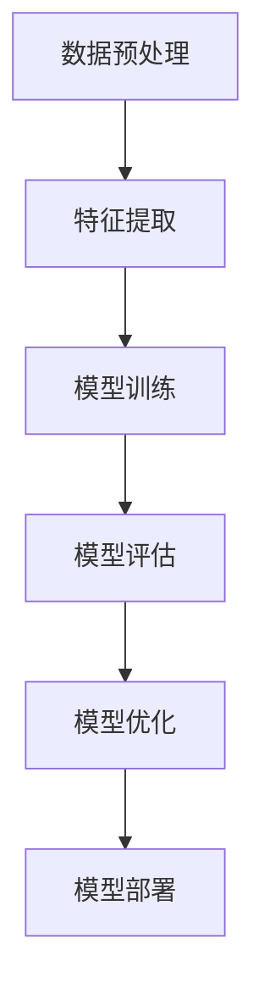
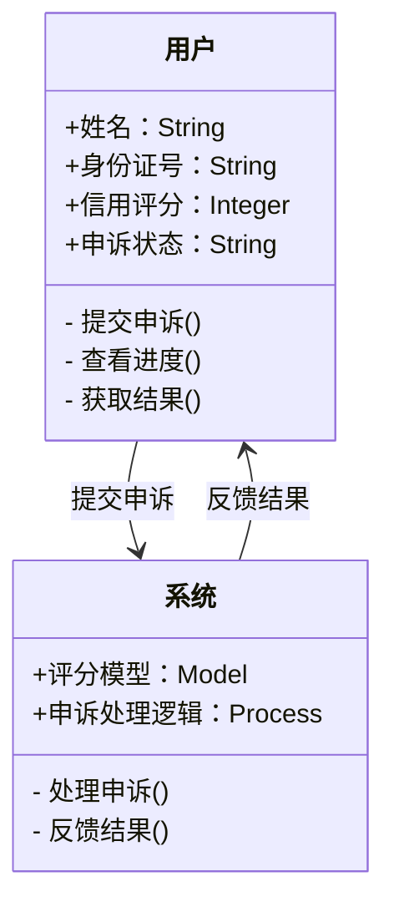
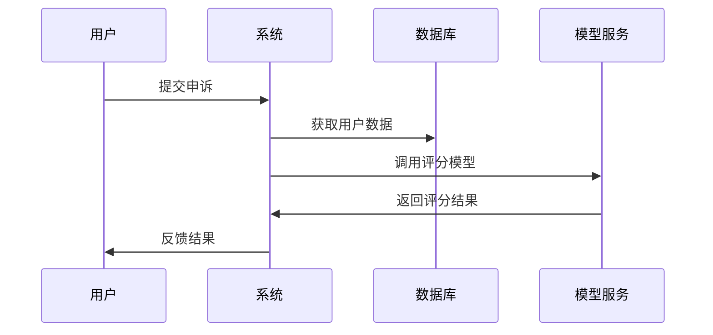

                 


# 智能个人信用评分申诉系统

> 关键词：智能信用评分，人工智能，申诉系统，机器学习，数据隐私

> 摘要：本文介绍了一种基于人工智能的智能个人信用评分申诉系统，详细讲解了系统的设计背景、核心概念、算法原理、系统架构、项目实现和最佳实践。通过分析和设计过程，展示了如何利用机器学习技术提高信用评分申诉的效率和准确性。

---

## 第一部分：智能个人信用评分申诉系统概述

### 第1章：背景介绍

#### 1.1 问题背景
- **传统信用评分的局限性**  
  - 传统信用评分主要依赖人工审核，效率低且容易出错。  
  - 申诉处理流程繁琐，用户等待时间长。  
  - 数据分析不够精准，可能导致不公正的评分结果。

- **问题描述**  
  - 信用评分申诉过程复杂，用户难以提供足够的证据支持。  
  - 缺乏自动化工具，导致申诉处理效率低下。  
  - 数据隐私保护不足，存在安全隐患。

- **问题解决方法**  
  - 引入人工智能技术，自动化处理申诉流程。  
  - 利用机器学习模型提高评分准确性。  
  - 优化用户交互界面，提升用户体验。

- **系统的边界与外延**  
  - 系统仅处理个人信用评分申诉，不涉及企业信用评估。  
  - 系统可扩展至信用评分的其他应用场景，如贷款审批。  
  - 系统需与其他系统（如征信机构）进行数据交互。

- **概念结构与核心要素**  
  - 核心要素包括：用户数据、评分模型、申诉流程、数据隐私。  
  - 要素之间的关系：用户数据输入模型，模型输出评分，申诉流程处理异常情况，数据隐私确保安全。

---

## 第二部分：核心概念与联系

### 第2章：核心概念与联系

#### 2.1 智能个人信用评分模型
- **模型的定义与特点**  
  - 利用机器学习算法对用户数据进行分析，生成信用评分。  
  - 特点：高效、精准、自动化。

- **模型的输入与输出**  
  - 输入：用户提供的各类数据，如收入、信用历史、消费记录。  
  - 输出：信用评分及评分解释。

- **模型的训练与优化**  
  - 使用历史数据训练模型，调整参数以提高准确性。  
  - 通过交叉验证优化模型性能。

#### 2.2 申诉处理流程
- **申诉流程的定义**  
  - 用户对评分结果不满，提交申诉，系统自动处理。  
  - 关键节点：申诉提交、数据复查、评分调整。

- **流程的优化与改进**  
  - 自动化复查机制，减少人工干预。  
  - 提供用户友好的申诉界面，降低用户使用门槛。

#### 2.3 数据隐私保护
- **数据隐私的重要性**  
  - 保护用户数据不被滥用或泄露。  
  - 遵守相关法律法规，如GDPR。

- **数据保护的实现方法**  
  - 数据加密存储，传输时使用SSL协议。  
  - 访问权限控制，确保只有授权人员可以访问敏感数据。

- **数据隐私与系统安全的关系**  
  - 数据隐私是系统安全的重要组成部分。  
  - 系统设计需考虑数据泄露风险，制定应对策略。

---

## 第三部分：算法原理讲解

### 第3章：算法原理

#### 3.1 智能评分模型的算法选择
- **机器学习算法的选择依据**  
  - 算法的可解释性：评分结果需可解释，便于用户理解。  
  - 处理速度：系统需高效处理大量数据。  
  - 模型性能：准确率和召回率需达到较高水平。

- **常见算法及其优缺点**  
  - **逻辑回归**：适合二分类问题，但对非线性关系处理能力有限。  
  - **随机森林**：适合多分类问题，具有高准确率和强健性。  
  - **神经网络**：处理复杂数据能力强，但训练时间较长。

#### 3.2 算法流程图


#### 3.3 算法实现
- **数据预处理**  
  - 清洗数据，处理缺失值和异常值。  
  - 标准化数据，确保不同特征具有可比性。

- **特征提取**  
  - 选择对信用评分影响较大的特征，如收入、信用历史、消费记录。  
  - 使用主成分分析（PCA）降低特征维度。

- **模型训练**  
  - 使用训练数据训练模型，调整超参数以优化性能。  
  - 采用交叉验证评估模型泛化能力。

- **模型评估**  
  - 使用测试数据评估模型性能，计算准确率、召回率、F1分数。  
  - 分析混淆矩阵，找出模型的误分类情况。

- **模型优化**  
  - 调整模型参数，如学习率、树的深度等。  
  - 引入集成学习方法，如堆叠模型，提高预测准确性。

---

## 第四部分：系统分析与架构设计

### 第4章：系统分析与架构设计

#### 4.1 问题场景介绍
- **用户场景**  
  - 用户提交信用评分申诉，系统自动处理并反馈结果。  
  - 系统需支持高并发请求，确保用户体验流畅。

- **系统功能设计**  
  - 用户界面：提交申诉、查看进度、获取结果。  
  - 后台处理：数据处理、模型调用、结果反馈。

#### 4.2 领域模型（Mermaid 类图）


#### 4.3 系统架构设计（Mermaid 架构图）


#### 4.4 系统接口设计
- **前端接口**  
  - 提交申诉：`POST /submit/appeal`  
  - 查看进度：`GET /check/status`  
  - 获取结果：`GET /retrieve/result`

- **后端接口**  
  - 数据处理：`POST /process/data`  
  - 模型调用：`POST /invoke/model`  
  - 反馈结果：`POST /send/response`

#### 4.5 系统交互流程图（Mermaid 序列图）


---

## 第五部分：项目实战

### 第5章：项目实战

#### 5.1 环境安装
- **安装 Python 和相关库**  
  ```bash
  pip install numpy scikit-learn pandas flask
  ```

- **安装开发工具**  
  - 安装Jupyter Notebook用于数据分析和建模。  
  - 安装PostgreSQL用于数据库管理。

#### 5.2 系统核心实现
- **数据预处理代码**  
  ```python
  import pandas as pd

  data = pd.read_csv('credit_data.csv')
  data.dropna(inplace=True)
  ```

- **特征提取与模型训练代码**  
  ```python
  from sklearn.ensemble import RandomForestClassifier
  from sklearn.model_selection import train_test_split

  X = data.drop('credit_score', axis=1)
  y = data['credit_score']
  X_train, X_test, y_train, y_test = train_test_split(X, y, test_size=0.2)
  model = RandomForestClassifier().fit(X_train, y_train)
  ```

- **模型评估代码**  
  ```python
  from sklearn.metrics import accuracy_score

  y_pred = model.predict(X_test)
  print("Accuracy:", accuracy_score(y_test, y_pred))
  ```

#### 5.3 实际案例分析
- **案例背景**  
  用户A因信用评分错误导致贷款申请被拒，提交申诉后系统自动调整评分。

- **数据分析**  
  - 检查用户A的数据是否异常，如是否存在误记录。  
  - 使用模型重新评估，发现评分错误，调整为正确评分。

- **系统反馈**  
  - 用户A收到反馈，评分已调整，贷款申请重新审核。

#### 5.4 项目小结
- **项目实现的关键点**  
  - 数据预处理和特征工程对模型性能至关重要。  
  - 模型选择需考虑准确性和可解释性。  
  - 系统架构设计需确保高可用性和安全性。

---

## 第六部分：最佳实践

### 第6章：最佳实践

#### 6.1 小结
- 本系统通过引入人工智能技术，显著提高了信用评分申诉的效率和准确性。  
- 系统设计注重数据隐私保护，确保用户信息安全。

#### 6.2 注意事项
- 数据隐私保护需贯穿系统设计和运行的全过程。  
- 系统上线前需进行全面测试，确保稳定性和可靠性。  
- 模型需定期更新，以适应数据分布的变化。

#### 6.3 拓展阅读
- 《机器学习实战》  
- 《数据隐私保护技术》  
- 《系统架构设计的艺术》

---

## 作者：AI天才研究院 & 禅与计算机程序设计艺术

---

以上是《智能个人信用评分申诉系统》的详细目录大纲，涵盖背景介绍、核心概念、算法原理、系统架构、项目实战和最佳实践。每个章节都深入分析了相关内容，并提供了详细的代码示例和图形展示，确保读者能够全面理解并掌握智能个人信用评分申诉系统的开发与应用。

