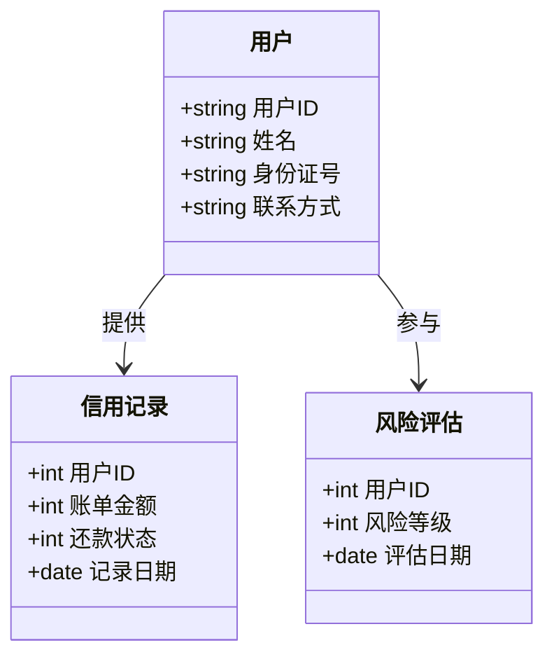
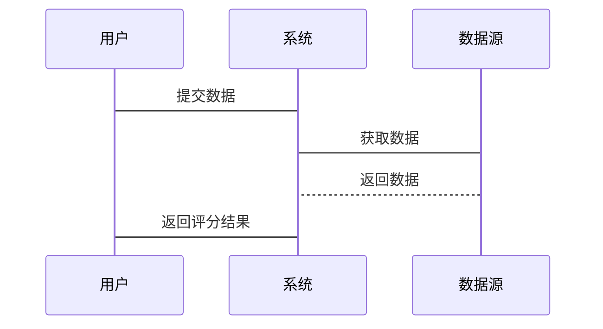

                 


# 智能个人信用评分解释器

## 关键词：智能信用评分、个人信用评分、机器学习、数据处理、评分解释器

## 摘要：本文详细探讨智能个人信用评分解释器的构建与实现，涵盖背景分析、核心概念、算法原理、系统架构、项目实战以及实际案例分析。通过数据预处理、特征提取、模型训练、评分计算、可视化解释等步骤，结合机器学习与数据挖掘技术，构建一个高效、透明、可解释的智能个人信用评分系统。文章还深入分析了该系统的应用场景、优势与挑战，并提供了实际的代码实现与案例解读，帮助读者全面理解智能信用评分的核心技术与实际应用。

---

# 第一部分: 智能个人信用评分解释器的背景与核心概念

## 第1章: 个人信用评分的背景与问题描述

### 1.1 个人信用评分的定义与重要性

#### 1.1.1 什么是个人信用评分
个人信用评分是一种通过分析个人的信用历史、财务状况、行为特征等多维度数据，量化评估个人信用风险的指标。信用评分越高，表示个人的信用风险越低，金融机构越愿意为其提供贷款或其他信用服务。

#### 1.1.2 信用评分在金融领域中的作用
信用评分在金融领域中扮演着至关重要的角色。它帮助金融机构快速评估客户的信用风险，从而决定是否批准贷款、信用卡等金融服务，并确定相应的利率或信用额度。

#### 1.1.3 信用评分对个人和机构的意义
- 对个人：信用评分直接影响个人能否获得贷款、信用卡等金融服务，以及获得的利率和额度。良好的信用评分有助于个人获得更优惠的金融服务。
- 对机构：信用评分帮助金融机构降低风险，提高信贷决策的效率和准确性，从而优化资产配置和风险管理。

### 1.2 当前信用评分体系的局限性

#### 1.2.1 传统信用评分的局限性
传统的信用评分体系主要依赖于历史信用记录和财务数据，往往忽视了其他重要的非结构化数据，如社交行为、消费习惯等。此外，传统评分模型的可解释性较差，用户难以理解评分结果背后的原因。

#### 1.2.2 数据获取与处理的挑战
随着大数据技术的发展，金融机构可以获取更多的数据源，但数据的质量、完整性和一致性问题仍然存在。此外，如何高效地处理和分析海量数据也是一个挑战。

#### 1.2.3 传统评分模型的可解释性问题
传统的信用评分模型（如线性回归、逻辑回归）虽然在某些场景下表现良好，但其可解释性较差，难以向用户清晰地解释评分结果的原因。这使得用户对评分结果的信任度降低，也增加了金融机构的沟通成本。

### 1.3 智能信用评分的提出与目标

#### 1.3.1 智能信用评分的核心目标
智能信用评分的核心目标是通过结合传统信用数据和新兴的非结构化数据（如社交媒体数据、地理位置数据等），利用机器学习和大数据技术，构建一个更加全面、精准、可解释的信用评分系统。

#### 1.3.2 智能信用评分的优势与创新点
- 全面性：整合多源数据，包括传统信用数据和新兴的非结构化数据。
- 精准性：通过机器学习算法，提升信用评分的准确性。
- 可解释性：通过可视化和解释性分析，帮助用户理解评分结果。

#### 1.3.3 智能信用评分的应用场景
智能信用评分可以在多种场景下应用，如个人贷款审批、信用卡额度调整、信用风险预警等。此外，它还可以帮助金融机构更好地识别潜在风险，优化信贷策略。

---

## 第2章: 智能个人信用评分的核心概念与联系

### 2.1 智能信用评分的定义与核心要素

#### 2.1.1 智能信用评分的定义
智能信用评分是一种基于机器学习和大数据技术，通过分析多源异构数据，量化评估个人信用风险的系统。它不仅依赖于传统的信用数据，还结合了其他非结构化数据，以提供更加全面和精准的信用评分。

#### 2.1.2 核心要素的构成与作用
智能信用评分的核心要素包括：
1. **信用历史**：包括贷款记录、信用卡使用情况、还款记录等。
2. **收入与资产**：包括工资、资产价值、投资情况等。
3. **行为特征**：包括消费习惯、社交行为、地理位置等。
4. **其他信息**：如教育背景、职业信息等。

#### 2.1.3 智能信用评分的系统架构
智能信用评分的系统架构通常包括数据采集、数据处理、模型训练、评分计算和结果解释五个部分。

### 2.2 核心概念的原理与联系

#### 2.2.1 数据处理与特征提取
数据处理是智能信用评分的核心步骤之一。需要对数据进行清洗、转换和特征工程，以提取有用的特征。

#### 2.2.2 模型训练与评分计算
通过机器学习算法（如随机森林、梯度提升树、神经网络等）对特征进行训练，构建评分模型，并对新数据进行评分计算。

#### 2.2.3 可视化与解释性分析
通过可视化工具和解释性分析方法，帮助用户理解评分结果背后的原因。

### 2.3 智能信用评分的ER实体关系图

```mermaid
erDiagram
    actor 用户 {
        +string 用户ID
        +string 姓名
        +string 身份证号
        +string 联系方式
    }
    actor 金融机构 {
        +string 机构ID
        +string 名称
        +string 联系方式
    }
    actor 第三方数据源 {
        +string 数据源ID
        +string 数据类型
        +string 数据提供方
    }
    entity 信用评分 {
        +int 用户ID
        +int 评分值
        +date 评分日期
    }
    entity 信用记录 {
        +int 用户ID
        +int 账单金额
        +int 还款状态
        +date 记录日期
    }
    entity 风险评估 {
        +int 用户ID
        +int 风险等级
        +date 评估日期
    }
    用户 --> 信用记录 : 提供
    用户 --> 风险评估 : 参与
    金融机构 --> 信用评分 : 计算
    第三方数据源 --> 信用记录 : 提供
```

---

## 第3章: 智能个人信用评分的核心算法原理

### 3.1 智能信用评分算法的原理

#### 3.1.1 数据预处理与特征工程
数据预处理包括数据清洗、数据转换和特征工程。特征工程的目标是提取有用的特征，并将这些特征转化为模型可以理解的格式。

#### 3.1.2 模型选择与训练
选择合适的机器学习算法（如随机森林、梯度提升树、神经网络等）对特征进行训练，构建评分模型。

#### 3.1.3 评分计算
通过训练好的模型对新数据进行评分计算，并输出评分结果。

---

### 3.2 智能信用评分算法的实现步骤

#### 3.2.1 数据预处理
```python
import pandas as pd
from sklearn.preprocessing import StandardScaler

# 加载数据
data = pd.read_csv('credit_data.csv')

# 删除缺失值
data = data.dropna()

# 标准化处理
scaler = StandardScaler()
data_scaled = scaler.fit_transform(data)
```

#### 3.2.2 特征工程
```python
from sklearn.feature_selection import SelectKBest
from sklearn.feature_selection import chi2

# 特征选择
selector = SelectKBest(score_func=chi2, k=5)
selected_features = selector.fit_transform(data_scaled, labels)
```

#### 3.2.3 模型训练
```python
from sklearn.ensemble import RandomForestClassifier

# 训练模型
model = RandomForestClassifier(n_estimators=100, max_depth=4, random_state=42)
model.fit(selected_features, labels)
```

#### 3.2.4 评分计算
```python
# 预测评分
predicted_scores = model.predict(selected_features)
```

---

### 3.3 智能信用评分的数学模型

#### 3.3.1 评分模型的数学公式
$$ \text{信用评分} = \alpha \cdot \text{特征1} + \beta \cdot \text{特征2} + \gamma \cdot \text{特征3} + \cdots $$

#### 3.3.2 模型训练的损失函数
$$ \text{损失函数} = \sum_{i=1}^{n} (y_i - \hat{y}_i)^2 $$

---

## 第4章: 智能个人信用评分的系统架构设计方案

### 4.1 问题场景介绍
智能信用评分系统需要处理大量的多源数据，包括结构化数据和非结构化数据。系统需要具备高效的数据处理能力、强大的模型训练能力和友好的用户界面。

### 4.2 系统功能设计

#### 4.2.1 领域模型类图


#### 4.2.2 系统架构图
```mermaid
container 容器1 {
    组件1
    组件2
}
container 容器2 {
    组件3
    组件4
}
容器1 --> 容器2 : 通信
```

#### 4.2.3 系统接口设计
- 输入接口：用户输入数据
- 输出接口：评分结果、可视化解释

#### 4.2.4 系统交互序列图


---

## 第5章: 智能个人信用评分的项目实战

### 5.1 环境安装
- 安装Python和相关库（如pandas、scikit-learn、mermaid等）

### 5.2 核心代码实现

#### 5.2.1 数据预处理
```python
import pandas as pd
from sklearn.preprocessing import StandardScaler

data = pd.read_csv('credit_data.csv')
data = data.dropna()
scaler = StandardScaler()
data_scaled = scaler.fit_transform(data)
```

#### 5.2.2 特征工程
```python
from sklearn.feature_selection import SelectKBest
from sklearn.feature_selection import chi2

selector = SelectKBest(score_func=chi2, k=5)
selected_features = selector.fit_transform(data_scaled, labels)
```

#### 5.2.3 模型训练
```python
from sklearn.ensemble import RandomForestClassifier

model = RandomForestClassifier(n_estimators=100, max_depth=4, random_state=42)
model.fit(selected_features, labels)
```

#### 5.2.4 评分计算
```python
predicted_scores = model.predict(selected_features)
```

### 5.3 案例分析

#### 5.3.1 数据分析与解读
- 数据分布分析
- 特征重要性分析

#### 5.3.2 模型评估与优化
- 模型评估指标（如准确率、召回率、F1分数）
- 模型调优（如参数调整）

### 5.4 项目小结
通过实际案例分析，验证了智能信用评分系统的有效性和准确性。同时，也发现了一些需要进一步优化的地方，如数据质量和模型解释性。

---

## 第6章: 智能个人信用评分的案例分析与实际应用

### 6.1 案例背景介绍
介绍一个具体的案例，说明智能信用评分系统在实际中的应用。

### 6.2 数据分析与解读
通过数据分析，展示智能信用评分系统如何帮助金融机构优化信贷决策。

### 6.3 模型评估与优化
对模型进行评估，并根据评估结果进行优化。

### 6.4 实际应用中的注意事项
- 数据隐私保护
- 模型的可解释性
- 系统的可扩展性

---

## 第7章: 总结与展望

### 7.1 本文总结
总结智能信用评分系统的构建过程、核心算法和实际应用。

### 7.2 未来展望
展望智能信用评分系统的发展方向，如更复杂的数据分析、更强大的模型训练、更友好的用户界面等。

---

## 作者：AI天才研究院/AI Genius Institute & 禅与计算机程序设计艺术 /Zen And The Art of Computer Programming

---

以上是《智能个人信用评分解释器》的技术博客文章的完整目录大纲和部分内容。每一章都详细展开了相关主题，并提供了丰富的代码示例和图表。

