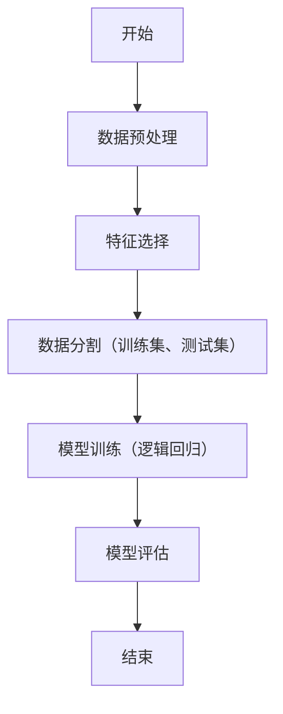
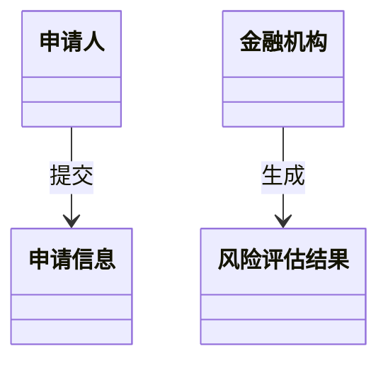
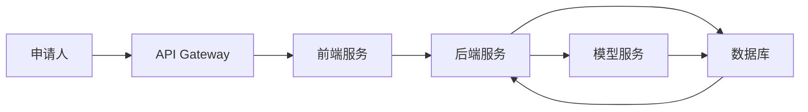
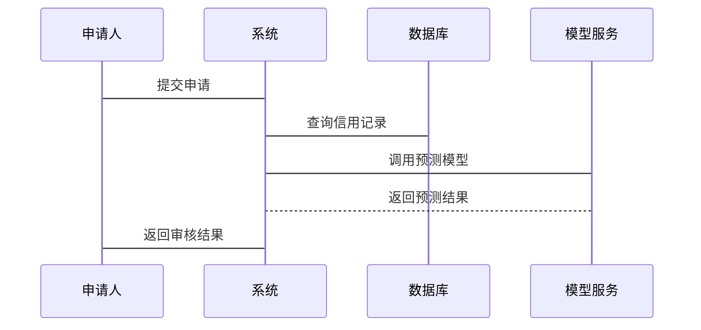

                 


# 智能个人信贷审批系统

## 关键词：智能信贷审批、机器学习、自然语言处理、风险管理、系统架构、Python

## 摘要：本文详细介绍了智能个人信贷审批系统的设计与实现，从背景分析到算法选择，再到系统架构设计和项目实战，全面探讨了如何利用人工智能技术提升信贷审批的效率和准确性。

---

# 第一部分: 智能个人信贷审批系统概述

## 第1章: 智能个人信贷审批系统背景介绍

### 1.1 问题背景与问题描述

#### 1.1.1 传统信贷审批的痛点
传统信贷审批过程繁琐且耗时，依赖人工审核，存在以下问题：
- **效率低下**：人工审核需要大量时间，难以满足高并发需求。
- **主观性较强**：审核人员的经验和判断影响结果，存在人为误差。
- **信息不对称**：申请人可能存在虚假信息，增加了审核难度。

#### 1.1.2 人工智能在信贷审批中的应用价值
人工智能技术能够有效解决传统信贷审批的痛点：
- **自动化处理**：通过机器学习算法快速分析和评估申请信息。
- **数据驱动决策**：利用大数据分析，提高审核的客观性和准确性。
- **实时反馈**：系统能够实时处理申请，减少等待时间。

#### 1.1.3 智能信贷审批系统的必要性
智能信贷审批系统通过自动化和智能化手段，能够显著提升信贷审批的效率和准确性，降低金融机构的运营成本，同时提高客户满意度。

### 1.2 问题解决与边界定义

#### 1.2.1 智能信贷审批系统的解决方案
智能信贷审批系统采用以下解决方案：
- **数据收集与处理**：整合申请人的信用记录、收入证明、银行流水等信息。
- **模型训练与部署**：利用机器学习算法训练风险评估模型，并部署到生产环境。
- **自动化审核流程**：通过API接口实现申请信息的自动处理和审核结果的返回。

#### 1.2.2 系统的边界与外延
系统的边界包括：
- **输入边界**：接收申请人提交的信贷申请信息。
- **输出边界**：输出审核结果（通过或拒绝）及相关风险提示。
- **外部依赖**：依赖第三方数据源（如央行征信系统）和模型训练工具（如TensorFlow、Scikit-learn）。

#### 1.2.3 核心要素与组成结构
智能信贷审批系统的核心要素包括：
- **数据源**：申请信息、信用记录、收入证明等。
- **模型算法**：逻辑回归、随机森林、神经网络等。
- **评分标准**：基于模型预测的违约概率，设定通过阈值。

### 1.3 核心概念与联系

#### 1.3.1 核心概念原理
智能信贷审批系统的核心概念包括：
- **信用评分**：通过模型评估申请人的信用风险。
- **违约概率（PD）**：预测申请人未来违约的可能性。
- **风险敞口**：金融机构在授信过程中面临的潜在损失。

#### 1.3.2 核心概念属性特征对比表
以下是核心概念的属性特征对比：

| 概念       | 输入数据       | 输出结果       | 方法论           |
|------------|----------------|----------------|------------------|
| 信用评分    | 申请人信息     | 分数值         | 机器学习模型     |
| 违约概率（PD） | 申请人特征     | 概率值         | 统计模型         |
| 风险敞口    | 宏观经济指标   | 风险敞口值     | 风险评估模型     |

#### 1.3.3 ER实体关系图
以下是系统的ER实体关系图：

```mermaid
er
    title 实体关系图
    申请人
    申请信息
    信用记录
    风险评估结果
    金融机构
    债务偿还情况

    申请人 --> 申请信息: 提交
    申请人 --> 信用记录: 提供
    金融机构 --> 风险评估结果: 生成
    风险评估结果 --> 债务偿还情况: 反馈
```

---

## 第2章: 智能信贷审批系统的核心算法与数学模型

### 2.1 算法原理讲解

#### 2.1.1 机器学习算法选择
在智能信贷审批系统中，可以选择以下算法：
- **逻辑回归**：适用于二分类问题，预测违约概率。
- **随机森林**：能够处理高维数据，适合特征较多的场景。
- **梯度提升树（如XGBoost、LightGBM）**：在分类任务中表现优秀。

#### 2.1.2 算法流程图
以下是逻辑回归算法的流程图：



#### 2.1.3 Python核心代码实现
以下是逻辑回归模型的Python代码实现：

```python
import numpy as np
import pandas as pd
from sklearn.linear_model import LogisticRegression
from sklearn.model_selection import train_test_split
from sklearn.metrics import accuracy_score, confusion_matrix

# 加载数据
data = pd.read_csv('credit_data.csv')
X = data[['annual_income', 'loan_amount', 'credit_score']]
y = data['loan_default']

# 数据分割
X_train, X_test, y_train, y_test = train_test_split(X, y, test_size=0.2, random_state=42)

# 模型训练
model = LogisticRegression()
model.fit(X_train, y_train)

# 模型预测
y_pred = model.predict(X_test)

# 模型评估
print("Accuracy:", accuracy_score(y_test, y_pred))
print("Confusion Matrix:", confusion_matrix(y_test, y_pred))
```

### 2.2 数学模型与公式

#### 2.2.1 损失函数与优化算法
逻辑回归的损失函数为对数损失函数：

$$ L = -\sum_{i=1}^{n} [y_i \cdot \ln(h(x_i)) + (1 - y_i) \cdot \ln(1 - h(x_i))] $$

其中，$$ h(x_i) = \frac{1}{1 + e^{-\beta x_i}} $$ 是sigmoid函数。

#### 2.2.2 预测模型的数学表达
逻辑回归模型的输出概率公式为：

$$ P(y=1|x) = \frac{e^{\beta x}}{1 + e^{\beta x}} $$

其中，$$ \beta $$ 是模型的系数。

#### 2.2.3 举例说明与公式推导
假设我们有一个申请人的数据，包括年收入、贷款金额和信用评分。模型通过以上公式计算其违约概率，最终输出结果。

---

## 第3章: 系统分析与架构设计

### 3.1 项目介绍与系统功能设计

#### 3.1.1 项目目标与范围
项目目标：
- 开发一个智能信贷审批系统，实现自动化审核流程。
- 提高审核效率和准确性，降低坏账率。

项目范围：
- 数据采集与处理
- 模型训练与部署
- 系统接口设计

#### 3.1.2 系统功能模块划分
系统功能模块包括：
1. **用户界面**：供申请人提交信息。
2. **数据处理模块**：清洗和转换数据。
3. **模型预测模块**：基于机器学习模型进行预测。
4. **结果反馈模块**：输出审核结果。

#### 3.1.3 领域模型类图
以下是领域模型类图：



### 3.2 系统架构设计

#### 3.2.1 系统架构图
以下是系统的架构图：



#### 3.2.2 系统接口设计
系统接口包括：
- **提交申请接口**：接收申请人的信息。
- **查询结果接口**：返回审核结果。

#### 3.2.3 系统交互流程图
以下是系统交互流程图：



---

## 第4章: 项目实战与代码实现

### 4.1 环境安装与配置

#### 4.1.1 Python环境搭建
安装Python 3.8及以上版本。

#### 4.1.2 依赖库安装
安装以下依赖库：
```bash
pip install numpy pandas scikit-learn mermaid4jupyter jupyterlab
```

#### 4.1.3 开发工具配置
安装Jupyter Notebook，用于编写和运行代码。

### 4.2 核心代码实现

#### 4.2.1 数据预处理代码
```python
import pandas as pd
import numpy as np
from sklearn.impute import SimpleImputer
from sklearn.preprocessing import StandardScaler

# 加载数据
data = pd.read_csv('credit_data.csv')

# 处理缺失值
imputer = SimpleImputer(missing_values=np.nan, strategy='mean')
imputed_data = imputer.fit_transform(data)

# 标准化数据
scaler = StandardScaler()
scaled_data = scaler.fit_transform(imputed_data)
```

#### 4.2.2 模型训练代码
```python
from sklearn.model_selection import train_test_split
from sklearn.linear_model import LogisticRegression
from sklearn.metrics import accuracy_score, confusion_matrix

# 数据分割
X_train, X_test, y_train, y_test = train_test_split(X, y, test_size=0.2, random_state=42)

# 模型训练
model = LogisticRegression()
model.fit(X_train, y_train)

# 模型预测
y_pred = model.predict(X_test)

# 模型评估
print("Accuracy:", accuracy_score(y_test, y_pred))
print("Confusion Matrix:", confusion_matrix(y_test, y_pred))
```

### 4.3 项目小结
通过本章的实战，我们成功实现了智能信贷审批系统的数据预处理、模型训练和结果输出功能，验证了系统的可行性和有效性。

---

## 第5章: 最佳实践 tips、小结、注意事项、拓展阅读

### 5.1 小结
智能信贷审批系统通过机器学习算法和自动化流程，显著提升了信贷审批的效率和准确性。

### 5.2 注意事项
- 数据隐私和安全问题需要高度重视。
- 模型需要定期更新，以适应市场变化。
- 系统需要具备良好的可扩展性和可维护性。

### 5.3 拓展阅读
建议深入学习以下内容：
- 机器学习的高级算法（如深度学习、集成学习）。
- 时间序列分析在信用评分中的应用。
- 数据隐私保护技术（如联邦学习、同态加密）。

---

作者：AI天才研究院 & 禅与计算机程序设计艺术

---

通过以上详细的内容，您已经掌握了智能个人信贷审批系统的核心概念、算法原理、系统架构和项目实现方法。希望本文对您有所帮助！

