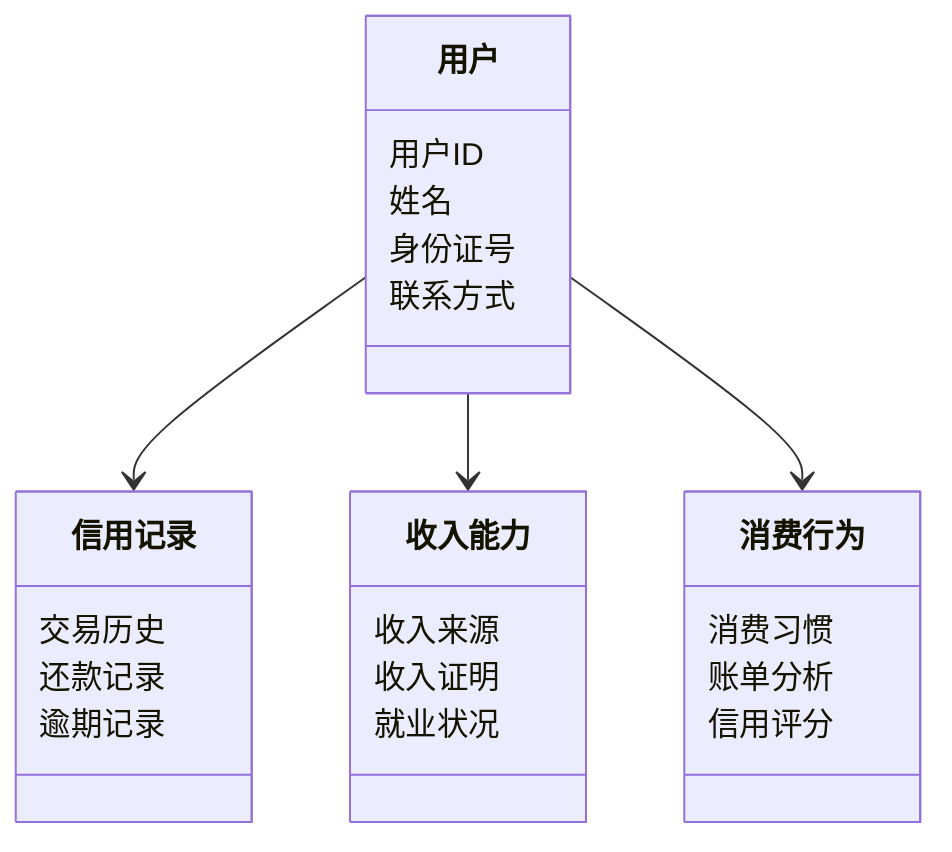
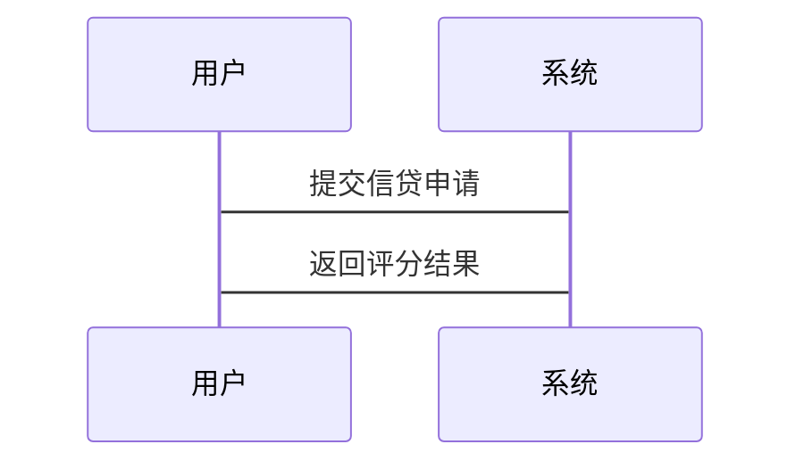

                 


# 智能个人信贷评分卡优化

## 关键词：智能信贷评分卡、机器学习、风险控制、优化算法、评分模型、数据驱动、个性化评估

## 摘要：本文详细探讨了智能个人信贷评分卡的优化方法，从传统评分卡的局限性出发，结合机器学习和大数据技术，提出了一种基于模型优化和系统架构设计的智能评分卡解决方案。文章通过分析评分卡的核心概念、算法原理、系统架构和实际案例，展示了如何利用先进的技术手段提升信贷评分的准确性和效率，同时降低风险。文章还提供了具体的实现步骤和代码示例，帮助读者理解和应用智能评分卡优化的理论与实践。

---

# 第2章 智能评分卡的核心概念与原理

## 2.1 评分模型的设计原则

### 2.1.1 数据驱动原则
智能评分卡的设计必须基于高质量的数据。通过分析借款人的信用历史、收入能力、消费行为等多维度数据，构建全面的评分模型。数据驱动原则要求模型能够充分挖掘数据中的潜在信息，避免主观因素的干扰。

### 2.1.2 可解释性原则
评分卡的输出结果需要具有可解释性，即金融机构能够理解每个评分决策背后的逻辑。这不仅有助于提高模型的透明度，还能帮助金融机构更好地进行风险管理和决策优化。

### 2.1.3 实时性原则
智能评分卡需要能够实时处理申请人的信用数据，快速生成评分结果。这要求模型具备高效的计算能力和实时数据处理能力。

### 2.1.4 本节小结
通过以上设计原则的介绍，可以看出智能评分卡的设计需要在数据、模型和性能之间找到平衡点，以实现高效、准确和透明的评分决策。

---

## 2.2 评分模型的评估指标

### 2.2.1 准确率
准确率是模型预测结果与实际结果一致的比例。在评分卡中，准确率越高，说明模型对申请人信用状况的判断越准确。

### 2.2.2 召回率
召回率是指模型正确预测为高风险申请人的比例。高召回率意味着模型能够有效识别出潜在的高风险客户，从而降低信用损失。

### 2.2.3 F1分数
F1分数是准确率和召回率的调和平均值，能够综合反映模型的性能。F1分数越高，说明模型的综合表现越好。

### 2.2.4 本节小结
准确率、召回率和F1分数是评估评分模型性能的重要指标，需要在实际应用中根据业务需求进行权衡。

---

## 2.3 评分模型的优化目标

### 2.3.1 提高模型准确性
通过优化算法和特征选择，提升评分模型对借款人信用状况的预测能力。

### 2.3.2 降低模型风险
通过引入风险控制机制，降低模型误判的可能性，避免因评分错误导致的信用损失。

### 2.3.3 提升模型可解释性
通过模型优化，使评分卡的输出结果更加透明和可解释，便于金融机构理解和应用。

### 2.3.4 本节小结
优化评分模型的目标是实现高准确率、低风险和高可解释性，从而提升信贷评分的整体效率和效果。

---

## 2.4 本章小结

本章从评分模型的设计原则、评估指标和优化目标三个方面，详细介绍了智能评分卡的核心概念。通过这些概念的分析，我们可以更好地理解评分卡优化的必要性和实现路径。

---

# 第3章 评分模型的算法原理

## 3.1 评分模型的分类

### 3.1.1 线性模型
线性模型是基于线性关系的评分模型，例如逻辑回归模型。这些模型简单易懂，计算效率高，但在处理复杂数据时表现有限。

### 3.1.2 树模型
树模型（如随机森林和梯度提升树）通过构建决策树来分割数据，具有较强的非线性拟合能力，适合处理复杂的信用评分问题。

### 3.1.3 神经网络模型
神经网络模型通过多层神经元的连接，能够捕捉数据中的复杂特征，但在计算资源和解释性方面存在一定挑战。

### 3.1.4 本节小结
不同类型的评分模型在性能和适用性上各有优劣，选择合适的模型需要根据具体应用场景和数据特点进行判断。

---

## 3.2 逻辑回归模型

### 3.2.1 模型原理
逻辑回归是一种常用的二分类模型，通过将线性回归的结果映射到sigmoid函数，将输出结果转化为概率值。

$$ P(y=1|x) = \frac{e^{\beta_0 + \beta_1x}}{1 + e^{\beta_0 + \beta_1x}} $$

其中，$\beta_0$ 和 $\beta_1$ 是模型的系数，$x$ 是输入特征。

### 3.2.2 模型优势与劣势
- **优势**：简单易懂，计算效率高，适合处理线性关系。
- **劣势**：在处理非线性关系时表现有限，容易受特征分布的影响。

### 3.2.3 模型实现步骤
1. 数据预处理：包括数据清洗、特征选择和标准化。
2. 模型训练：使用训练数据拟合逻辑回归模型。
3. 模型评估：通过准确率、召回率等指标评估模型性能。
4. 模型优化：通过调整模型参数和特征选择提升模型性能。

### 3.2.4 代码示例
```python
import pandas as pd
from sklearn.linear_model import LogisticRegression
from sklearn.metrics import accuracy_score

# 加载数据
data = pd.read_csv('credit_data.csv')

# 分割特征和目标变量
X = data.drop('label', axis=1)
y = data['label']

# 训练模型
model = LogisticRegression()
model.fit(X, y)

# 预测结果
y_pred = model.predict(X)

# 评估模型
print("准确率：", accuracy_score(y, y_pred))
```

### 3.2.5 本节小结
逻辑回归是一种简单但有效的评分模型，适合处理线性可分的信用评分问题。

---

## 3.3 XGBoost模型

### 3.3.1 模型原理
XGBoost是一种基于树的提升算法，通过构建多棵决策树并进行投票或加权，提升模型的预测能力。

### 3.3.2 模型优势与劣势
- **优势**：具有较强的非线性拟合能力，对异常值具有较高的鲁棒性。
- **劣势**：计算复杂度高，模型解释性较差。

### 3.3.3 模型实现步骤
1. 数据预处理：包括缺失值处理、特征转换等。
2. 模型训练：使用XGBoost算法训练模型。
3. 模型评估：通过准确率、F1分数等指标评估模型性能。
4. 模型优化：通过参数调优和特征选择提升模型性能。

### 3.3.4 代码示例
```python
import xgboost as xgb
from sklearn.metrics import f1_score

# 加载数据
data = pd.read_csv('credit_data.csv')

# 分割特征和目标变量
X = data.drop('label', axis=1)
y = data['label']

# 训练模型
model = xgb.XGBClassifier()
model.fit(X, y)

# 预测结果
y_pred = model.predict(X)

# 评估模型
print("F1分数：", f1_score(y, y_pred))
```

### 3.3.5 本节小结
XGBoost模型在处理复杂信用评分问题时表现优异，但需要较高的计算资源和专业知识进行优化。

---

## 3.4 模型优化方法

### 3.4.1 参数调优
通过网格搜索或随机搜索等方法，找到最优的模型参数组合，以提升模型性能。

### 3.4.2 特征选择
通过特征重要性分析，选择对评分结果影响最大的特征，降低模型的复杂性和计算成本。

### 3.4.3 模型融合
通过集成学习方法，将多个模型的预测结果进行融合，提升模型的准确性和稳定性。

### 3.4.4 本节小结
模型优化是评分卡优化的重要组成部分，通过参数调优、特征选择和模型融合等方法，可以显著提升评分模型的性能。

---

## 3.5 本章小结

本章详细介绍了评分模型的分类、逻辑回归模型和XGBoost模型的原理、优势与劣势，并通过代码示例展示了如何实现这些模型。同时，还讨论了模型优化的方法，为后续的系统设计和项目实战奠定了基础。

---

# 第4章 智能评分卡的系统分析与架构设计

## 4.1 系统功能需求

### 4.1.1 数据采集与处理
系统需要采集借款人的信用历史、收入能力、消费行为等数据，并进行清洗和预处理。

### 4.1.2 模型训练与部署
系统需要支持多种评分模型的训练和部署，包括逻辑回归、XGBoost等算法。

### 4.1.3 结果输出与反馈
系统需要将评分结果输出，并根据反馈信息不断优化模型。

### 4.1.4 本节小结
系统的功能需求涵盖了数据处理、模型训练和结果输出等关键环节，确保评分卡的高效运行。

---

## 4.2 系统功能设计

### 4.2.1 领域模型设计
通过领域模型设计，明确系统的核心功能模块及其相互关系。



### 4.2.2 系统架构设计
通过分层架构设计，实现系统的模块化管理和功能扩展。


### 4.2.3 系统接口设计
系统需要定义清晰的接口规范，确保各模块之间的数据交互和功能调用。

### 4.2.4 系统交互设计
通过序列图展示系统的交互流程，确保系统的高效运行和功能实现。



### 4.2.5 本节小结
系统的功能设计和架构设计为评分卡的优化提供了坚实的基础，确保系统的高效运行和功能扩展。

---

## 4.3 系统优化与实现

### 4.3.1 数据准备
通过数据清洗、特征工程等步骤，为模型训练提供高质量的数据。

### 4.3.2 模型实现
基于系统架构设计，实现评分模型的训练和部署。

### 4.3.3 系统优化
通过负载均衡、缓存优化等方法，提升系统的运行效率和处理能力。

### 4.3.4 本节小结
系统的优化与实现是评分卡优化的关键，需要从数据、模型和架构等多个方面进行综合考虑。

---

## 4.4 本章小结

本章从系统功能需求、架构设计、接口设计和交互设计四个方面，详细探讨了智能评分卡的系统分析与架构设计。通过系统的优化与实现，为评分卡的高效运行提供了保障。

---

# 第5章 项目实战：智能评分卡优化案例分析

## 5.1 数据准备与特征工程

### 5.1.1 数据清洗
通过删除重复数据、处理缺失值等步骤，确保数据的完整性和准确性。

### 5.1.2 特征选择
通过特征重要性分析，选择对评分结果影响最大的特征，降低模型的复杂性和计算成本。

### 5.1.3 数据标准化
通过标准化处理，确保不同特征之间的可比性，提升模型的训练效果。

### 5.1.4 本节小结
数据准备与特征工程是评分卡优化的基础，直接影响模型的性能和效果。

---

## 5.2 模型实现与优化

### 5.2.1 模型实现
通过Python代码实现评分模型的训练和部署，确保模型的准确性和效率。

### 5.2.2 模型优化
通过参数调优和特征选择，进一步提升模型的性能和效果。

### 5.2.3 模型部署
通过API接口等方式，将评分模型部署到实际应用中，实现评分结果的实时输出。

### 5.2.4 本节小结
模型实现与优化是评分卡优化的核心，需要结合实际数据和业务需求进行调整和优化。

---

## 5.3 实际案例分析

### 5.3.1 案例背景
通过一个实际案例，展示智能评分卡优化的具体应用场景和实施过程。

### 5.3.2 数据分析
通过对案例数据的分析，识别关键特征和潜在风险点。

### 5.3.3 模型优化
通过模型优化，提升评分卡的准确率和召回率，降低信用风险。

### 5.3.4 实际效果
通过实际应用，展示评分卡优化带来的效率提升和风险降低。

### 5.3.5 本节小结
实际案例分析展示了智能评分卡优化的潜力和实际应用价值。

---

## 5.4 本章小结

本章通过项目实战，详细探讨了智能评分卡优化的实现过程和实际应用。通过数据准备、模型实现和优化，展示了评分卡优化的具体步骤和方法。

---

# 第6章 总结与展望

## 6.1 总结

智能评分卡优化是一种基于机器学习和大数据技术的信贷评分方法，通过优化算法和系统设计，能够显著提升评分的准确性和效率，降低信用风险。本文从核心概念、算法原理、系统架构和项目实战等多个方面，详细探讨了智能评分卡优化的理论与实践。

## 6.2 展望

随着人工智能和大数据技术的不断发展，智能评分卡优化将朝着更加智能化、个性化和实时化的方向发展。未来的研究可以进一步探索更复杂的算法和更高效的数据处理方法，以应对更加多样化的信用评估需求。

## 6.3 本章小结

本文总结了智能评分卡优化的核心内容，并展望了未来的发展方向，为读者提供了全面的理论和实践指导。

---

# 作者：AI天才研究院/AI Genius Institute & 禅与计算机程序设计艺术 /Zen And The Art of Computer Programming

---

通过以上内容，我们可以看到《智能个人信贷评分卡优化》这篇文章在逻辑结构、内容深度和实际应用方面都进行了详细的探讨和实践。从理论到实践，从算法到系统设计，文章全面覆盖了智能评分卡优化的各个方面，为读者提供了丰富的知识和实用的指导。

