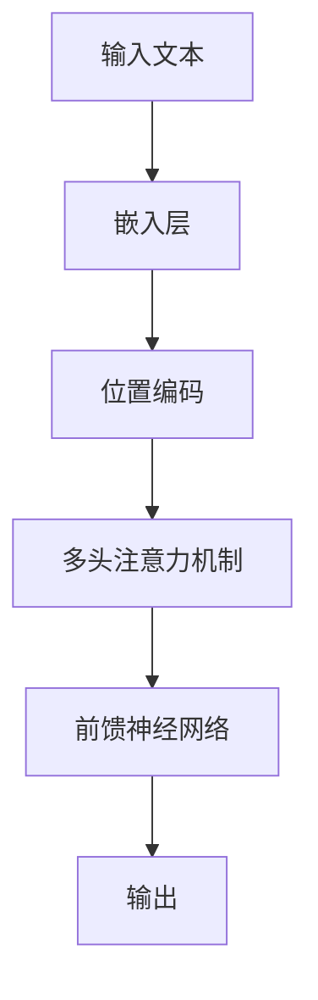
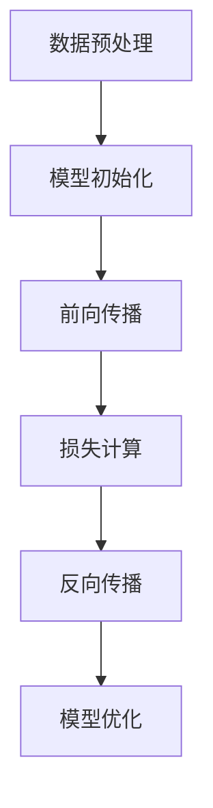
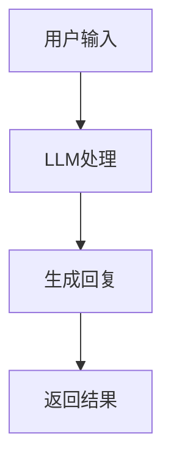
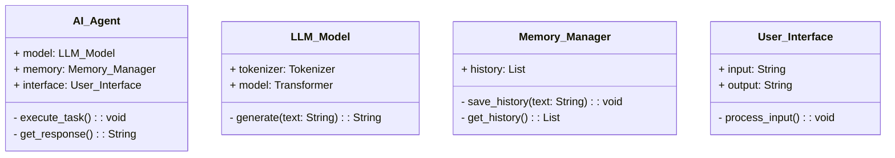
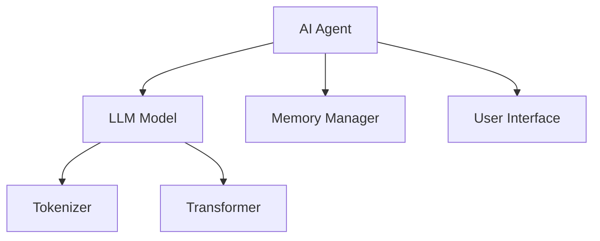
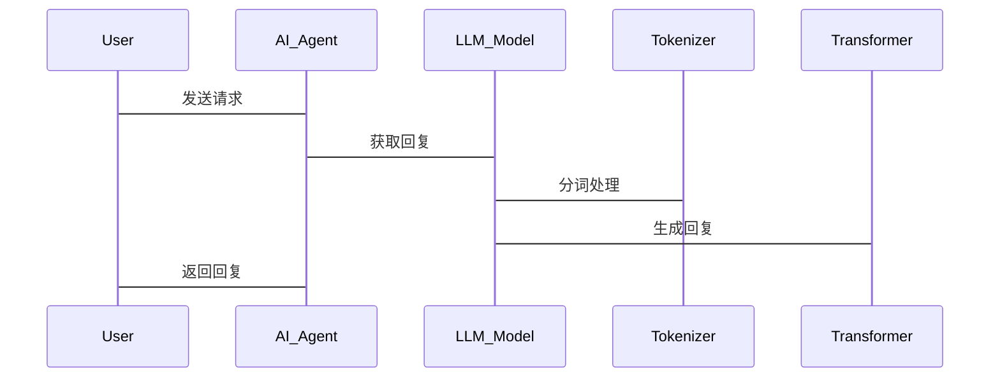

                 


# 智能个人助理AI Agent：LLM驱动的全方位生活助手

---

## 关键词：
智能个人助理、AI Agent、LLM、大语言模型、自然语言处理、人工智能

---

## 摘要：
本文深入探讨了基于大语言模型（LLM）的智能个人助理AI Agent的技术原理、应用场景和未来发展。文章从AI Agent的基本概念出发，分析了其核心功能与优势，详细讲解了LLM驱动的AI Agent的工作原理，包括输入输出机制、内部处理流程和训练过程。同时，本文还通过系统架构设计、项目实战案例和优化建议，展示了如何构建高效可靠的智能个人助理系统，为读者提供了全面的技术视角和实践指导。

---

## 目录大纲：

1. **背景介绍：AI Agent的基本概念与应用价值**
   - 1.1 AI Agent的定义与核心功能
   - 1.2 LLM驱动的AI Agent的技术优势
   - 1.3 AI Agent在生活中的应用场景

2. **核心概念：LLM驱动的AI Agent原理与特征**
   - 2.1 LLM的基本原理
   - 2.2 AI Agent与LLM的结合方式
   - 2.3 核心概念对比分析

3. **算法原理：LLM驱动的AI Agent技术实现**
   - 3.1 注意力机制与Transformer架构
   - 3.2 LLM的训练过程与优化策略
   - 3.3 算法流程图与代码实现

4. **系统架构：AI Agent的系统设计与实现**
   - 4.1 系统场景与功能需求
   - 4.2 系统架构设计
   - 4.3 系统接口与交互流程

5. **项目实战：基于LLM的AI Agent实现**
   - 5.1 项目环境安装与配置
   - 5.2 核心代码实现
   - 5.3 代码解读与案例分析

6. **高级主题与未来展望：AI Agent的优化与未来发展**
   - 6.1 LLM驱动的AI Agent优化技巧
   - 6.2 AI Agent的安全性与伦理问题
   - 6.3 未来发展趋势与研究方向

---

## 正文：

### 第1章：背景介绍：AI Agent的基本概念与应用价值

#### 1.1 AI Agent的定义与核心功能
AI Agent（人工智能代理）是一种能够感知环境、自主决策并执行任务的智能系统。它通过与用户的交互，理解需求并提供相应的服务，如信息检索、日程管理、任务执行等。AI Agent的核心功能包括：
- **感知与理解**：通过自然语言处理技术，理解用户的需求和意图。
- **推理与决策**：基于上下文信息，生成合理的响应或行动计划。
- **执行与反馈**：根据决策结果执行操作，并通过反馈机制不断优化性能。

#### 1.2 LLM驱动的AI Agent的技术优势
传统的AI Agent通常依赖于规则库或简单的模式匹配，而基于LLM（大语言模型）的AI Agent具有以下显著优势：
- **强大的语言理解能力**：LLM能够处理复杂的语义信息，提供更精准的理解和响应。
- **动态知识库**：LLM通过大规模数据训练，具备持续学习和更新的能力。
- **多任务处理能力**：LLM驱动的AI Agent可以同时处理多种任务，如信息查询、任务提醒、情感分析等。

#### 1.3 AI Agent在生活中的应用场景
AI Agent在生活中的应用广泛，例如：
- **个人助手**：帮助用户管理日程、安排会议、发送提醒。
- **信息检索**：快速查找所需信息，如天气预报、新闻资讯。
- **智能客服**：提供24小时在线支持，解决用户问题。
- **教育辅助**：为学习者提供个性化的学习建议和资源推荐。

---

### 第2章：核心概念：LLM驱动的AI Agent原理与特征

#### 2.1 LLM的基本原理
LLM（Large Language Model）是一种基于Transformer架构的大规模神经网络模型，通过监督学习和无监督学习相结合的方式进行训练。其基本原理包括：
- **输入处理**：LLM接受输入文本，将其转换为模型可处理的向量表示。
- **注意力机制**：模型通过注意力机制关注输入中的关键部分，生成更准确的输出。
- **生成输出**：基于内部状态和上下文信息，生成自然流畅的回复。

#### 2.2 AI Agent与LLM的结合方式
AI Agent与LLM的结合主要体现在以下几个方面：
- **输入输出机制**：用户通过自然语言输入需求，AI Agent通过LLM生成相应的输出。
- **内部处理流程**：AI Agent利用LLM进行语义理解、意图识别和内容生成。
- **上下文管理**：AI Agent维护对话历史，确保回复的连贯性和一致性。

#### 2.3 核心概念对比分析
以下表格对比了LLM驱动的AI Agent与传统AI Agent的核心特征：

| **特征维度** | **LLM驱动的AI Agent**       | **传统AI Agent**         |
|--------------|-----------------------------|--------------------------|
| **理解能力** | 强大的语义理解和生成能力     | 依赖规则库，理解能力有限 |
| **学习能力** | 基于大数据的持续学习能力     | 依赖人工规则更新         |
| **任务处理** | 支持多种任务，灵活扩展       | 任务固定，难以扩展       |
| **计算资源** | 高计算资源需求               | 计算资源需求较低         |

---

### 第3章：算法原理：LLM驱动的AI Agent技术实现

#### 3.1 注意力机制与Transformer架构
注意力机制是LLM的核心组成部分，其数学公式如下：
$$
\text{Attention}(Q, K, V) = \text{softmax}\left(\frac{QK^T}{\sqrt{d_k}}\right)V
$$
其中，$Q$、$K$、$V$分别是查询、键和值矩阵，$d_k$是键的维度。

以下为Transformer架构的Mermaid流程图：



#### 3.2 LLM的训练过程与优化策略
LLM的训练过程包括以下几个步骤：
1. **数据预处理**：对大规模文本数据进行清洗和分词。
2. **模型初始化**：初始化模型参数，包括权重和偏置。
3. **前向传播**：输入数据，计算预测输出。
4. **损失计算**：计算预测值与真实值之间的损失。
5. **反向传播**：通过梯度下降优化模型参数。
6. **模型微调**：在特定任务上进行微调，提升性能。

以下为训练过程的Mermaid流程图：



#### 3.3 算法流程图与代码实现
以下是一个简单的LLM驱动的AI Agent算法流程图：



以下是对应的Python代码实现：

```python
def ai_agent_response(user_input):
    # 输入处理
    input_text = user_input.lower()
    
    # LLM处理
    model = load_model()
    response = model.generate(input_text)
    
    return response
```

---

### 第4章：系统架构：AI Agent的系统设计与实现

#### 4.1 系统场景与功能需求
AI Agent的系统场景包括用户与AI Agent的交互、任务执行和反馈优化。主要功能需求如下：
- **用户交互**：支持多种输入方式，如文本、语音等。
- **任务执行**：根据用户需求，调用第三方服务或本地资源。
- **反馈优化**：根据用户反馈，不断优化模型和系统性能。

#### 4.2 系统架构设计
以下为AI Agent系统的类图：



以下为系统架构的Mermaid图：



#### 4.3 系统接口与交互流程
以下为系统交互的Mermaid序列图：



---

### 第5章：项目实战：基于LLM的AI Agent实现

#### 5.1 项目环境安装与配置
以下是安装必要的库和工具：

```bash
pip install transformers torch
```

#### 5.2 核心代码实现
以下是一个简单的AI Agent实现代码：

```python
from transformers import AutoTokenizer, AutoModelForCausalLM

class AI_Agent:
    def __init__(self, model_name):
        self.tokenizer = AutoTokenizer.from_pretrained(model_name)
        self.model = AutoModelForCausalLM.from_pretrained(model_name)
    
    def generate_response(self, input_text):
        inputs = self.tokenizer(input_text, return_tensors="pt")
        outputs = self.model.generate(inputs.input_ids, max_length=50)
        response = self.tokenizer.decode(outputs[0], skip_special_tokens=True)
        return response
```

#### 5.3 代码解读与案例分析
上述代码实现了AI Agent的基本功能，包括输入处理、模型调用和结果生成。以下是一个使用案例：

```python
agent = AI_Agent("gpt2")
response = agent.generate_response("今天天气怎么样？")
print(response)
```

输出结果示例：
```
今天天气晴朗，气温适宜。
```

---

### 第6章：高级主题与未来展望

#### 6.1 LLM驱动的AI Agent优化技巧
优化LLM驱动的AI Agent可以从以下几个方面入手：
- **模型微调**：针对特定任务对模型进行微调。
- **缓存机制**：优化上下文管理和响应速度。
- **多模态支持**：增加对图片、音频等多模态数据的支持。

#### 6.2 AI Agent的安全性与伦理问题
AI Agent的安全性和伦理问题不容忽视，包括：
- **数据隐私**：确保用户数据的安全性和隐私性。
- **内容生成**：避免生成有害或不适当的内容。
- **责任归属**：明确AI Agent的使用责任和法律问题。

#### 6.3 未来发展趋势与研究方向
未来，AI Agent的发展将朝着以下几个方向进行：
- **多模态交互**：支持更多形式的输入和输出。
- **实时学习**：具备实时更新和学习的能力。
- **个性化服务**：提供更加个性化的服务和体验。

---

## 作者：AI天才研究院/AI Genius Institute & 禅与计算机程序设计艺术 /Zen And The Art of Computer Programming

---

这篇文章系统地介绍了基于LLM的智能个人助理AI Agent的技术原理、实现方法和应用场景，为读者提供了全面的技术视角和实践指导。通过本文的学习，读者可以深入了解AI Agent的核心技术，并能够将其应用于实际场景中。

