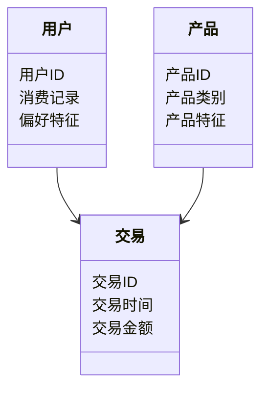
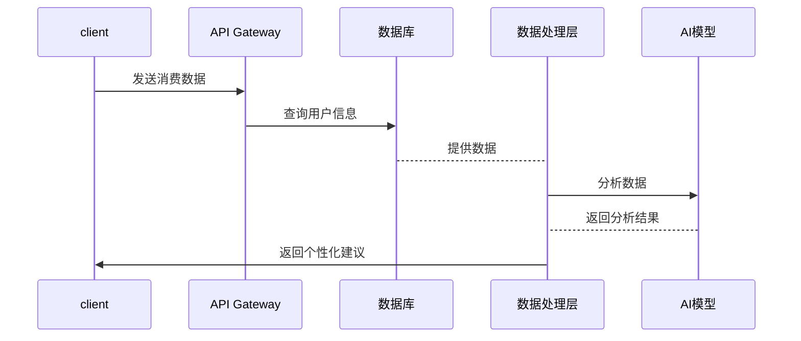

                 


# 智能个人消费模式分析与建议系统

> 关键词：智能消费模式，数据分析，机器学习，个性化建议，消费行为预测

> 摘要：本文探讨智能个人消费模式分析与建议系统的核心概念、算法原理、系统架构及项目实战。通过背景分析、问题定义、算法实现和系统设计，提供深度解析和实践指导。

---

## 第1章: 智能个人消费模式分析的背景与问题背景

### 1.1 智能个人消费模式的背景

#### 1.1.1 从传统消费模式到智能消费模式的演进

传统消费模式依赖人工记录和分析，效率低下且难以捕捉个体差异。智能消费模式借助大数据和人工智能，实时分析消费数据，提供个性化建议，显著提升用户体验。

#### 1.1.2 智能消费模式的核心特征

- 数据驱动：利用海量数据进行分析，识别消费规律。
- 个性化：根据个体行为定制建议。
- 实时性：快速响应消费行为变化。

#### 1.1.3 智能消费模式的典型应用场景

- 电商推荐系统
- 金融消费风险评估
- 零售业库存优化

### 1.2 个人消费模式分析的必要性

#### 1.2.1 消费者行为分析的重要性

- 提高用户满意度
- 优化企业运营策略
- 降低资源浪费

#### 1.2.2 数据驱动的消费模式分析的优势

- 精准营销
- 降低决策风险
- 提升效率

#### 1.2.3 个性化消费建议的价值

- 提供针对性建议
- 帮助用户优化消费决策
- 增强用户粘性

## 第2章: 问题背景与问题描述

### 2.1 个人消费模式分析的核心问题

#### 2.1.1 消费数据的采集与处理

- 数据清洗与预处理
- 数据格式标准化
- 数据隐私保护

#### 2.1.2 消费行为的特征提取

- 用户行为模式识别
- 消费偏好提取
- 行为序列分析

#### 2.1.3 消费模式的识别与分类

- 消费习惯聚类
- 消费行为预测
- 异常消费检测

### 2.2 问题解决的目标

#### 2.2.1 构建智能消费模式分析模型

- 数据分析模型设计
- 算法选择与优化
- 模型评估与验证

#### 2.2.2 提供个性化消费建议

- 建议生成策略
- 用户界面设计
- 建议效果评估

#### 2.2.3 实现消费行为预测与优化

- 预测模型开发
- 实时反馈机制
- 消费优化策略

## 第3章: 核心概念与联系

### 3.1 核心概念的定义与属性

#### 3.1.1 消费模式的定义与特征

- 消费模式：用户在特定时间内的消费行为总和。
- 特征：频率、金额、偏好、时间分布。

#### 3.1.2 智能分析系统的定义与功能

- 智能分析系统：利用AI技术分析消费数据，提供决策支持。
- 功能：数据处理、分析、预测、建议生成。

#### 3.1.3 个性化建议的定义与实现方式

- 个性化建议：基于用户行为定制的消费指导。
- 实现：推荐算法、规则引擎、动态调整。

### 3.2 核心概念之间的关系

#### 3.2.1 消费模式与智能分析系统的关联

- 消费模式是分析系统的输入，系统输出分析结果和建议。

#### 3.2.2 智能分析系统与个性化建议的依赖关系

- 系统分析结果为个性化建议提供依据。

#### 3.2.3 系统边界与外延的界定

- 输入：消费数据
- 输出：分析报告和个性化建议
- 外延：消费行为预测和优化策略

### 3.3 核心概念的ER实体关系图

```mermaid
er
    entity 用户 {
        id 用户ID
        属性 消费记录
        属性 偏好特征
    }
    entity 产品 {
        id 产品ID
        属性 产品类别
        属性 产品特征
    }
    entity 交易 {
        id 交易ID
        关联 用户.用户ID
        关联 产品.产品ID
        属性 交易时间
        属性 交易金额
    }
```

---

## 第4章: 算法原理讲解

### 4.1 协同过滤算法

#### 4.1.1 基于用户的协同过滤

- 方法：寻找与目标用户行为相似的用户群体，推荐他们喜欢的产品。

#### 4.1.2 基于物品的协同过滤

- 方法：分析用户购买的产品特征，推荐相似产品。

#### 4.1.3 混合协同过滤

- 方法：结合用户和物品的特征，提升推荐准确率。

#### 4.1.4 协同过滤的数学模型

$$相似度计算公式：sim(i,j) = \frac{\sum_{k} (r_{i,k} - \bar{r_i})(r_{j,k} - \bar{r_j})}{\sqrt{\sum_{k} (r_{i,k} - \bar{r_i})^2} \cdot \sqrt{\sum_{k} (r_{j,k} - \bar{r_j})^2}}}$$

### 4.2 聚类分析

#### 4.2.1 K-means聚类

- 方法：将用户分为若干簇，基于簇内行为相似性推荐。

#### 4.2.2 层次聚类

- 方法：构建树状结构，逐步合并相似簇。

#### 4.2.3 聚类在消费模式分析中的应用

- 识别消费习惯相似的用户群体。

### 4.3 神经网络模型

#### 4.3.1 简单神经网络

- 结构：输入层、隐藏层、输出层。

#### 4.3.2 深度学习模型

- 技术：卷积神经网络（CNN）、循环神经网络（RNN）。

#### 4.3.3 神经网络在消费预测中的应用

- 时间序列预测：使用LSTM捕捉消费趋势。

---

## 第5章: 系统分析与架构设计

### 5.1 问题场景介绍

- 用户通过系统输入消费数据，系统分析后给出建议。

### 5.2 项目介绍

- 目标：构建实时分析与建议系统。
- 技术栈：Python、TensorFlow、Flask。

### 5.3 系统功能设计

#### 5.3.1 领域模型（Mermaid类图）



#### 5.3.2 系统架构设计（Mermaid架构图）


### 5.4 系统接口设计

- 输入接口：API接收消费数据。
- 输出接口：返回分析结果和建议。

### 5.5 系统交互流程（Mermaid序列图）



---

## 第6章: 项目实战

### 6.1 环境安装

- 安装Python、NumPy、Pandas、Scikit-learn、Flask、TensorFlow。

### 6.2 核心代码实现

#### 6.2.1 数据预处理

```python
import pandas as pd
from sklearn.preprocessing import StandardScaler

# 加载数据
data = pd.read_csv('消费记录.csv')

# 数据清洗
data.dropna()
data['消费时间'] = pd.to_datetime(data['消费时间'])

# 标准化处理
scaler = StandardScaler()
data_scaled = scaler.fit_transform(data[['消费金额', '消费频率']])
```

#### 6.2.2 协同过滤实现

```python
from sklearn.metrics.pairwise import cosine_similarity

# 用户-物品矩阵
user_item_matrix = data.pivot('用户ID', '产品ID', '消费金额')

# 计算相似度
similarity_matrix = cosine_similarity(user_item_matrix)
```

#### 6.2.3 模型训练与预测

```python
from sklearn.cluster import KMeans

# 聚类分析
model = KMeans(n_clusters=5)
model.fit(data_scaled)
```

### 6.3 实际案例分析

- 数据分析：识别高消费用户。
- 案例解读：优化库存管理和营销策略。

---

## 第7章: 最佳实践与总结

### 7.1 系统设计建议

- 数据安全：确保用户隐私。
- 算法选择：根据场景选优。
- 系统优化：提升性能。

### 7.2 小结

智能消费模式分析系统结合了数据分析和AI技术，能够有效优化消费决策，提升用户体验。

### 7.3 注意事项

- 数据隐私保护
- 算法可解释性
- 系统可扩展性

### 7.4 拓展阅读

- 推荐系统研究
- 时间序列预测
- 数据隐私保护技术

---

# 结语

通过本文的详细解析，读者可以深入了解智能个人消费模式分析与建议系统的构建过程和应用价值，为实际项目提供有力指导。

---

作者：AI天才研究院/AI Genius Institute & 禅与计算机程序设计艺术 /Zen And The Art of Computer Programming

