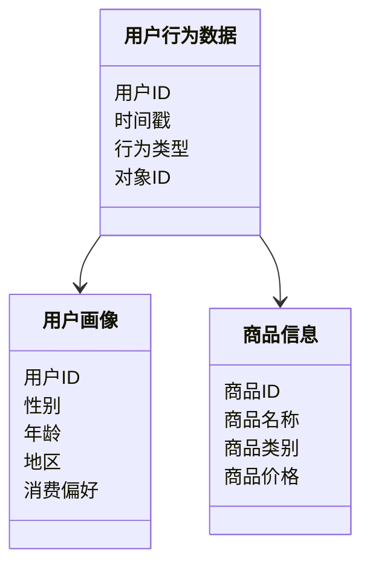
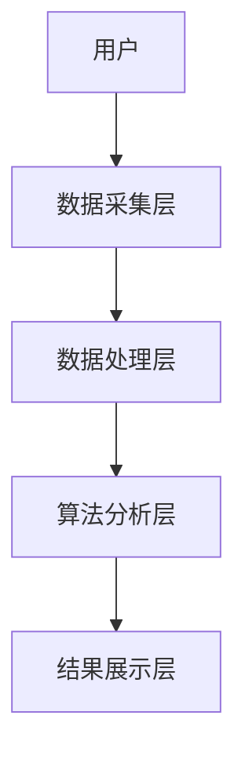
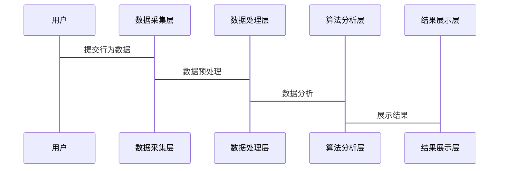

                 


# 智能个人消费行为分析系统

> 关键词：智能消费行为分析，大数据分析，机器学习，推荐算法，系统架构

> 摘要：智能个人消费行为分析系统是一种利用大数据和人工智能技术，通过对用户消费数据的采集、处理和分析，实现对个人消费行为的智能化分析和预测的系统。本文将从系统背景、核心概念、算法原理、系统架构、项目实战等方面，详细探讨智能个人消费行为分析系统的实现与应用。

---

## 第一章: 智能个人消费行为分析系统概述

### 1.1 系统背景与目标

#### 1.1.1 智能个人消费行为分析的背景
随着互联网和移动支付的普及，消费者的消费行为变得越来越复杂和多样化。传统的基于经验的消费分析方式已经难以满足现代商业的需求。智能个人消费行为分析系统通过大数据和人工智能技术，能够实时捕捉和分析用户的消费行为，为企业提供精准的市场洞察和决策支持。

#### 1.1.2 系统的目标与意义
智能个人消费行为分析系统的目标是通过对用户消费数据的深度挖掘，发现用户的消费习惯、偏好和潜在需求，从而帮助企业实现精准营销和个性化服务。其意义在于提高企业的市场响应速度，降低营销成本，提升客户满意度。

#### 1.1.3 系统的核心功能与价值
- **数据采集与处理**：实时采集用户的消费数据，包括交易记录、浏览行为、搜索记录等。
- **行为分析与预测**：利用机器学习算法，分析用户的消费行为，预测未来的消费趋势。
- **个性化推荐**：基于分析结果，为用户提供个性化的商品推荐。
- **风险控制**：识别异常消费行为，防范欺诈和信用风险。

### 1.2 系统的技术基础

#### 1.2.1 人工智能与大数据技术
人工智能（AI）和大数据技术是智能个人消费行为分析系统的两大核心技术。AI技术包括机器学习、深度学习等，用于数据分析和模式识别；大数据技术用于处理海量数据，确保系统的高效运行。

#### 1.2.2 机器学习与深度学习
- **机器学习**：通过训练数据，系统能够自动学习用户的消费模式，实现分类、聚类和回归分析。
- **深度学习**：利用神经网络模型，系统能够从非结构化数据中提取特征，例如自然语言处理（NLP）技术用于分析用户的评论和反馈。

#### 1.2.3 数据挖掘与自然语言处理
- **数据挖掘**：从海量数据中提取有价值的信息，例如关联规则挖掘、序列模式挖掘等。
- **自然语言处理（NLP）**：用于分析用户的文本数据，例如评论、反馈等，提取情感倾向和关键词。

### 1.3 系统架构与数据采集

#### 1.3.1 系统整体架构
智能个人消费行为分析系统的整体架构包括数据采集层、数据处理层、算法分析层和用户交互层。数据采集层负责收集用户的消费数据；数据处理层对数据进行清洗和预处理；算法分析层利用机器学习算法进行分析；用户交互层提供用户友好的界面，展示分析结果。

#### 1.3.2 数据采集方式与流程
- **数据源**：包括线上和线下的消费数据，例如电商平台、移动支付、社交媒体等。
- **数据采集工具**：使用爬虫技术、API接口、数据库查询等方式获取数据。
- **数据存储**：将数据存储在数据库中，例如关系型数据库（MySQL）或分布式数据库（Hadoop）。

#### 1.3.3 数据预处理与存储
- **数据清洗**：去除重复数据、处理缺失值、消除噪声数据。
- **数据转换**：将数据转换为适合算法分析的格式，例如归一化、标准化等。
- **数据存储**：将处理后的数据存储在合适的位置，例如HDFS（分布式文件系统）或云存储。

### 1.4 本章小结
本章介绍了智能个人消费行为分析系统的背景、目标和技术基础，详细描述了系统的整体架构和数据采集流程。通过数据采集和预处理，系统能够为后续的分析和推荐提供高质量的数据支持。

---

## 第二章: 智能个人消费行为分析的核心概念

### 2.1 智能个人消费行为分析的定义

#### 2.1.1 行为分析的基本概念
消费行为分析是指通过对用户在消费过程中的行为数据进行分析，了解用户的消费习惯、偏好和决策过程。智能个人消费行为分析则是利用人工智能技术，实现对消费行为的自动化分析和预测。

#### 2.1.2 智能分析的核心特征
- **自动化**：系统能够自动采集和分析数据，无需人工干预。
- **实时性**：系统能够实时处理数据，快速反馈分析结果。
- **个性化**：系统能够根据用户的行为特征，提供个性化的分析和推荐。

#### 2.1.3 系统的核心要素与组成
- **数据源**：消费数据、用户行为数据、产品信息等。
- **算法模型**：机器学习算法、推荐算法、分类算法等。
- **用户交互界面**：可视化界面、推荐结果展示等。

### 2.2 行为数据特征分析

#### 2.2.1 数据特征的分类与属性
行为数据特征可以分为定量特征和定性特征。定量特征包括购买频率、客单价等；定性特征包括购买类别、品牌偏好等。

#### 2.2.2 数据特征的提取方法
- **统计方法**：通过统计学方法，提取数据的均值、方差等特征。
- **聚类分析**：通过聚类算法，识别出具有相似特征的用户群体。

#### 2.2.3 数据特征的可视化
- **散点图**：用于展示数据的分布情况。
- **柱状图**：用于展示各类别数据的分布情况。
- **热力图**：用于展示数据的密集程度。

### 2.3 行为分析模型与算法

#### 2.3.1 常见的行为分析模型
- **协同过滤模型**：基于用户相似性推荐商品。
- **基于内容的推荐模型**：基于商品的属性推荐商品。
- **混合推荐模型**：结合协同过滤和基于内容的推荐方法。

#### 2.3.2 算法的优缺点对比
| 算法类型       | 优点                           | 缺点                           |
|----------------|--------------------------------|--------------------------------|
| 协同过滤       | 推荐结果精准                   | 需要大量数据支持，计算复杂    |
| 基于内容的推荐   | 推荐结果多样化                 | 需要高质量的商品描述数据       |
| 混合推荐         | 结合两者优点，推荐效果较好       | 实现复杂，计算资源消耗较大     |

#### 2.3.3 模型选择与优化策略
- **模型选择**：根据数据特征和业务需求选择合适的算法。
- **模型优化**：通过调整参数、增加特征等方式提升模型性能。

### 2.4 系统功能模块与核心算法

#### 2.4.1 系统功能模块划分
- **数据采集模块**：负责数据的采集和预处理。
- **算法分析模块**：负责行为特征提取和模型训练。
- **推荐系统模块**：负责生成个性化推荐结果。
- **结果展示模块**：负责将分析结果以可视化形式展示给用户。

#### 2.4.2 核心算法的实现流程
1. 数据采集与预处理。
2. 行为特征提取。
3. 模型训练与优化。
4. 个性化推荐生成。
5. 结果展示与反馈。

#### 2.4.3 算法的性能评估
- **准确率**：推荐结果与实际购买行为的匹配程度。
- **召回率**：推荐结果中包含实际购买行为的比例。
- **F1分数**：综合准确率和召回率的指标。

### 2.5 本章小结
本章详细介绍了智能个人消费行为分析的核心概念，包括系统的定义、行为数据特征分析、算法模型及其优化策略。通过对这些内容的学习，读者可以更好地理解系统的实现原理和应用价值。

---

## 第三章: 智能个人消费行为分析的算法原理

### 3.1 推荐算法

#### 3.1.1 协同过滤算法
协同过滤是一种基于用户相似性推荐商品的算法。其核心思想是“用户会购买与他们相似的其他用户喜欢的商品”。

##### 协同过滤的实现步骤
1. **用户相似性计算**：通过计算用户之间的相似性，例如余弦相似度。
2. **商品推荐生成**：根据用户的相似性，推荐相似用户喜欢的商品。

##### 协同过滤的数学模型
$$ 相似度 = \frac{\sum_{i=1}^{n} (r_{u_i} - \bar{r_u})(r_{v_i} - \bar{r_v})}{\sqrt{\sum_{i=1}^{n} (r_{u_i} - \bar{r_u})^2} \sqrt{\sum_{i=1}^{n} (r_{v_i} - \bar{r_v})^2}} $$

##### 协同过滤的优缺点
- **优点**：推荐结果精准。
- **缺点**：计算复杂度高，冷启动问题。

#### 3.1.2 基于内容的推荐算法
基于内容的推荐算法是通过分析商品的属性特征，推荐与当前商品相似的商品。

##### 基于内容推荐的实现步骤
1. **商品特征提取**：通过文本挖掘、图像处理等技术提取商品的特征。
2. **商品相似度计算**：基于特征向量计算商品之间的相似度。
3. **推荐结果生成**：根据相似度排序，推荐最相似的商品。

##### 基于内容推荐的数学模型
$$ 相似度 = \frac{\sum_{i=1}^{n} w_i \cdot f_i}{\sqrt{\sum_{i=1}^{n} w_i^2} \sqrt{\sum_{i=1}^{n} f_i^2}} $$

##### 基于内容推荐的优缺点
- **优点**：推荐结果多样化。
- **缺点**：依赖于高质量的商品描述数据。

#### 3.1.3 混合推荐算法
混合推荐算法是将协同过滤和基于内容的推荐算法结合起来，利用两者的优势，提高推荐结果的准确性和多样性。

##### 混合推荐的实现步骤
1. **协同过滤推荐**：基于用户相似性生成推荐列表。
2. **基于内容推荐**：基于商品相似性生成推荐列表。
3. **混合推荐结果**：将两个推荐列表进行合并和排序。

##### 混合推荐的优缺点
- **优点**：推荐结果精准且多样化。
- **缺点**：实现复杂，计算资源消耗较大。

### 3.2 分类算法

#### 3.2.1 K-近邻
K-近邻算法是一种常用的分类算法，适用于用户消费行为的分类分析。

##### K-近邻的实现步骤
1. **数据预处理**：对数据进行标准化和归一化处理。
2. **距离计算**：计算待分类样本与训练样本之间的距离。
3. **分类决策**：根据距离最近的K个样本的类别，确定待分类样本的类别。

##### K-近邻的数学模型
$$ 距离 = \sqrt{\sum_{i=1}^{n} (x_i - y_i)^2} $$

##### K-近邻的优缺点
- **优点**：简单易实现，适合小数据集。
- **缺点**：计算复杂度高，适用于小数据集。

### 3.3 决策树

#### 3.3.1 决策树的分类原理
决策树是一种基于树状结构的分类算法，通过特征选择和分裂策略，将数据分成不同的类别。

##### 决策树的实现步骤
1. **特征选择**：选择能够最好地分割数据的特征。
2. **树的构建**：根据特征选择结果，构建决策树。
3. **分类决策**：根据决策树的结构，对新数据进行分类。

##### 决策树的数学模型
$$ Gini指数 = \sum_{i=1}^{n} p_i(1-p_i) $$

##### 决策树的优缺点
- **优点**：易于理解和实现。
- **缺点**：容易过拟合，分类效果不稳定。

### 3.4 支持向量机

#### 3.4.1 支持向量机的分类原理
支持向量机是一种基于统计学习理论的分类算法，适用于高维数据的分类。

##### 支持向量机的实现步骤
1. **数据映射**：将低维数据映射到高维空间。
2. **最优超平面**：找到能够最好地区分数据的超平面。
3. **分类决策**：根据超平面的分类结果，对新数据进行分类。

##### 支持向量机的数学模型
$$ \text{目标函数} = \min_{w, b, \xi} \frac{1}{2}||w||^2 + C\sum_{i=1}^{n} \xi_i $$
$$ \text{约束条件} = y_i(w \cdot x_i + b) - \xi_i \geq 0, \xi_i \geq 0 $$

##### 支持向量机的优缺点
- **优点**：适用于高维数据，分类效果好。
- **缺点**：计算复杂，实现难度较大。

### 3.5 随机森林

#### 3.5.1 随机森林的分类原理
随机森林是一种基于决策树的集成分类算法，通过组合多个决策树的结果，提高分类的准确性和稳定性。

##### 随机森林的实现步骤
1. **样本采样**：随机抽取部分样本进行训练。
2. **特征采样**：随机抽取部分特征进行训练。
3. **树的构建**：根据样本和特征，构建多个决策树。
4. **分类决策**：根据多个决策树的投票结果，确定最终的分类。

##### 随机森林的优缺点
- **优点**：分类效果好，稳定性高。
- **缺点**：计算资源消耗较大。

### 3.6 本章小结
本章详细介绍了智能个人消费行为分析中常用的推荐算法和分类算法，包括协同过滤、基于内容的推荐、混合推荐、K-近邻、决策树、支持向量机和随机森林。通过对这些算法的原理和实现步骤的分析，读者可以更好地理解系统的实现方法。

---

## 第四章: 智能个人消费行为分析系统的分析与架构设计

### 4.1 系统分析

#### 4.1.1 问题场景介绍
智能个人消费行为分析系统的应用场景包括电商、金融、零售等领域。例如，在电商领域，系统可以通过分析用户的浏览、点击、购买行为，实现精准营销和个性化推荐。

#### 4.1.2 项目介绍
本项目旨在通过构建智能个人消费行为分析系统，帮助企业实现对用户消费行为的深度分析和预测。系统将采用大数据和人工智能技术，实现高效的数据处理和智能分析。

#### 4.1.3 系统功能设计
系统功能设计包括数据采集、数据处理、算法分析、结果展示等模块。每个模块的功能和交互流程需要详细设计。

##### 领域模型类图


#### 4.1.4 系统架构设计
系统架构设计包括数据采集层、数据处理层、算法分析层和用户交互层。每个层次的功能和交互关系需要详细描述。

##### 系统架构图


#### 4.1.5 系统接口设计
系统接口设计包括API接口的定义和交互流程。例如，用户行为数据接口、商品信息接口等。

##### 系统交互流程图


### 4.2 系统实现

#### 4.2.1 环境搭建
系统实现需要搭建合适的开发环境，包括编程语言、开发工具、数据库和机器学习框架等。

##### 开发环境配置
- **编程语言**：Python
- **开发工具**：PyCharm
- **数据库**：MySQL
- **机器学习框架**：Scikit-learn、TensorFlow

#### 4.2.2 核心代码实现
系统实现的核心代码包括数据采集、数据处理、算法分析和结果展示等部分。以下是一个简单的推荐算法实现示例：

##### 推荐算法实现
```python
from sklearn.neighbors import NearestNeighbors

# 数据预处理
X = ...  # 特征矩阵
y = ...  # 标签向量

# 模型训练
model = NearestNeighbors(n_neighbors=5, algorithm='ball_tree').fit(X)

# 查询推荐
distances, indices = model.kneighbors(X)
```

#### 4.2.3 数据预处理与特征提取
数据预处理包括数据清洗、归一化、特征提取等步骤。例如，使用PCA进行特征降维：

##### 特征降维实现
```python
from sklearn.decomposition import PCA

pca = PCA(n_components=2)
X_pca = pca.fit_transform(X)
```

#### 4.2.4 模型训练与结果分析
模型训练包括选择合适的算法、调整参数、评估性能等。例如，使用交叉验证评估模型性能：

##### 模型评估实现
```python
from sklearn.model_selection import cross_val_score

scores = cross_val_score(model, X, y, cv=5)
print("平均准确率:", scores.mean())
```

### 4.3 项目实战

#### 4.3.1 数据集准备
数据集准备包括收集用户行为数据、商品信息数据等。例如，使用公开数据集Kaggle上的电商数据集。

#### 4.3.2 数据处理与分析
数据处理包括清洗、转换、特征提取等步骤。例如，处理缺失值、去除异常值、提取时间特征等。

##### 数据预处理代码
```python
import pandas as pd

data = pd.read_csv('data.csv')
data.dropna(inplace=True)
data['时间戳'] = pd.to_datetime(data['时间戳'])
data['时间戳'].dt.year
```

#### 4.3.3 模型训练与优化
模型训练包括选择合适的算法、调整参数、评估性能等。例如，使用网格搜索优化模型参数：

##### 参数优化代码
```python
from sklearn.model_selection import GridSearchCV

param_grid = {'n_neighbors': [5, 10, 15]}
grid_search = GridSearchCV(model, param_grid, cv=5)
grid_search.fit(X, y)
best_model = grid_search.best_estimator_
```

#### 4.3.4 结果分析与可视化
结果分析包括模型性能评估、推荐结果展示等。例如，使用Matplotlib绘制混淆矩阵、ROC曲线等。

##### 结果可视化代码
```python
import matplotlib.pyplot as plt
from sklearn.metrics import confusion_matrix

conf_matrix = confusion_matrix(y_true, y_pred)
plt.figure(figsize=(10, 6))
sns.heatmap(conf_matrix, annot=True, fmt='d')
plt.xlabel('预测标签')
plt.ylabel('真实标签')
plt.show()
```

### 4.4 系统优化与注意事项

#### 4.4.1 性能优化
性能优化包括数据处理优化、算法优化、系统架构优化等。例如，使用分布式计算框架（如Spark）处理大规模数据。

#### 4.4.2 模型调优
模型调优包括参数调整、特征选择、模型集成等。例如，使用网格搜索、随机搜索优化模型参数。

#### 4.4.3 注意事项
- **数据隐私**：确保用户数据的隐私和安全。
- **模型解释性**：确保模型的可解释性，方便业务人员理解和使用。
- **系统可扩展性**：确保系统能够扩展到更大的数据规模和用户数量。

### 4.5 本章小结
本章详细介绍了智能个人消费行为分析系统的分析与架构设计，包括系统分析、功能设计、系统架构、接口设计、项目实现和系统优化等内容。通过实际案例的分析和代码实现，读者可以更好地理解系统的实现过程。

---

## 第五章: 智能个人消费行为分析系统的总结与展望

### 5.1 系统总结
智能个人消费行为分析系统通过大数据和人工智能技术，实现了对用户消费行为的深度分析和预测。系统具有高效性、精准性和个性化推荐的特点，能够帮助企业实现精准营销和个性化服务。

### 5.2 系统的应用价值
智能个人消费行为分析系统的应用价值体现在以下几个方面：
1. **精准营销**：通过分析用户行为，实现精准的营销策略。
2. **个性化推荐**：为用户提供个性化的商品推荐，提高用户满意度。
3. **风险控制**：识别异常消费行为，防范欺诈和信用风险。

### 5.3 未来发展方向
智能个人消费行为分析系统的未来发展方向包括：
1. **模型优化**：通过深度学习、强化学习等技术，进一步提高模型的准确性和实时性。
2. **多模态数据融合**：结合文本、图像、视频等多种数据源，实现更全面的用户行为分析。
3. **实时分析**：通过流数据处理技术，实现对用户行为的实时分析和响应。
4. **个性化服务**：结合用户画像和行为分析，提供更加个性化的服务体验。

### 5.4 本章小结
本章对智能个人消费行为分析系统进行了总结，并展望了未来的发展方向。通过对系统的总结和未来规划，读者可以更好地理解系统的应用价值和潜在的发展空间。

---

## 作者：AI天才研究院/AI Genius Institute & 禅与计算机程序设计艺术 /Zen And The Art of Computer Programming

---

通过以上内容，读者可以系统地了解智能个人消费行为分析系统的实现过程和应用价值，包括系统背景、核心概念、算法原理、系统架构、项目实战和未来展望等方面。

