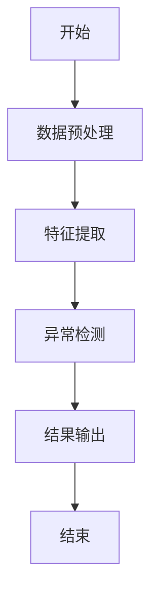
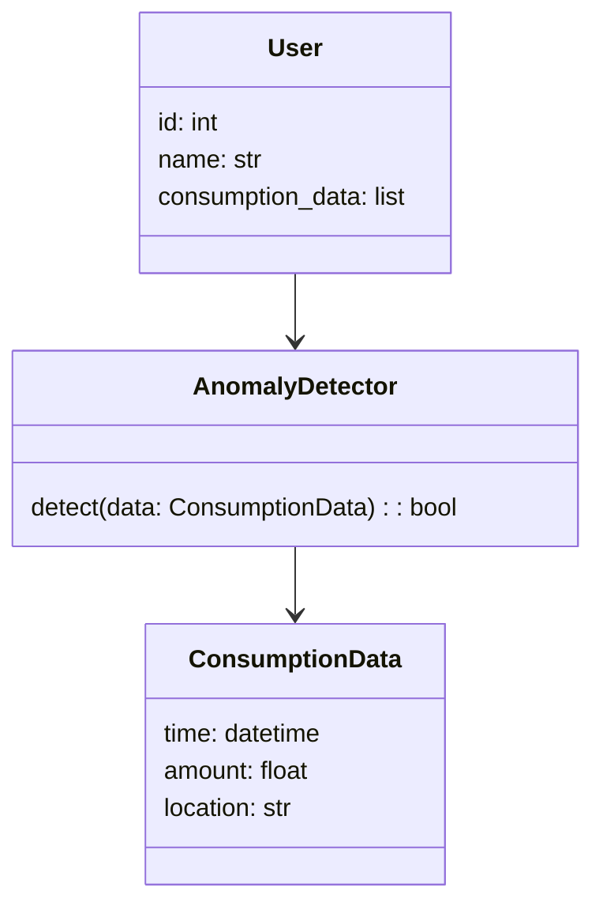

                 


# 《智能个人消费行为异常检测》

---

## 关键词：智能检测、消费行为、异常检测、人工智能、机器学习、数据挖掘、实时监测

---

## 摘要：  
本文将深入探讨如何利用人工智能技术对个人消费行为进行异常检测。通过分析消费数据的特征和模式，结合统计方法和机器学习算法，提出一种高效的智能检测方法，帮助用户实时监控和管理消费行为，预防潜在风险。本文将从背景、原理、算法、系统设计到项目实战进行详细阐述，为读者提供全面的技术指导。

---

## 第一部分：智能个人消费行为异常检测概述

### 第1章：个人消费行为异常检测的背景与问题

#### 1.1 问题背景  
消费行为的异常检测是金融、零售和电子商务领域中的重要问题。随着互联网和移动支付的普及，个人消费行为数据呈现出海量、高频和多维的特点。异常消费行为可能包括欺诈交易、恶意套现、异常消费模式等，这些行为不仅会影响个人的财务健康，还可能引发金融风险。因此，如何利用智能技术实时检测异常消费行为，成为当前研究的热点。

#### 1.2 问题描述  
异常消费行为的检测需要解决以下几个关键问题：  
1. **数据特征提取**：从海量消费数据中提取有效的特征，如时间特征、金额特征、行为模式特征等。  
2. **异常行为分类**：将消费行为分为正常和异常两类，并进一步细分异常类型（如欺诈、超预算消费等）。  
3. **实时检测与预警**：基于实时数据流，快速识别异常行为并发出预警。  

#### 1.3 问题解决思路  
1. **数据驱动**：通过分析历史消费数据，提取特征并建立模型。  
2. **智能算法**：利用机器学习算法（如随机森林、支持向量机、神经网络等）进行分类和预测。  
3. **多维度分析**：结合时间、地点、消费金额、消费频率等多个维度进行综合判断。  

---

## 第二部分：智能个人消费行为异常检测的核心概念

### 第2章：异常检测的基本原理

#### 2.1 数据特征提取  
消费数据的特征包括：  
- 时间特征：消费时间、消费频率、消费间隔等。  
- 金额特征：消费金额、单笔金额分布、金额波动等。  
- 行为模式特征：消费地点、消费方式（线上/线下）、品牌偏好等。  

#### 2.2 异常行为的判定标准  
- **统计方法**：基于均值、标准差等统计指标，判断消费金额是否偏离正常范围。  
- **机器学习方法**：基于分类模型，判断消费行为是否属于异常类别。  

#### 2.3 智能算法的核心逻辑  
- 数据预处理：清洗数据、处理缺失值、标准化等。  
- 特征工程：选择关键特征并进行特征组合。  
- 模型训练：使用训练数据训练分类模型。  
- 预测与评估：利用测试数据验证模型性能。  

---

## 第三部分：算法原理与实现

### 第3章：基于统计的异常检测算法

#### 3.1 算法流程图  


#### 3.2 Python实现代码  
```python
import numpy as np
import pandas as pd
from sklearn.ensemble import IsolationForest

# 数据加载与预处理
data = pd.read_csv('consumption_data.csv')
data = data.dropna()

# 特征提取
X = data[['amount', 'time_interval', 'location_id']]

# 模型训练
model = IsolationForest(n_estimators=100, contamination=0.05)
model.fit(X)

# 预测异常
y_pred = model.predict(X)
# y_pred为1表示正常，-1表示异常
```

#### 3.3 数学公式  
异常检测算法的数学模型如下：  
$$ score = \frac{(x - \mu)}{\sigma} $$  
其中，$\mu$ 是均值，$\sigma$ 是标准差，$x$ 是待检测的消费金额。  

---

## 第四部分：系统分析与架构设计

### 第4章：系统设计与实现

#### 4.1 问题场景介绍  
- 系统需要实时接收消费数据，分析并判断是否为异常行为。  
- 系统需要支持多用户、多场景的消费行为检测。  

#### 4.2 系统功能设计  


#### 4.3 系统架构设计  


---

## 第五部分：项目实战

### 第5章：消费行为异常检测系统实现

#### 5.1 环境安装  
- 安装Python和相关库（如pandas、scikit-learn、tensorflow）。  
- 安装Jupyter Notebook用于开发和测试。  

#### 5.2 核心代码实现  
```python
import pandas as pd
from sklearn.ensemble import RandomForestClassifier

# 数据加载
data = pd.read_csv('consumption.csv')

# 特征工程
X = data[['amount', 'time', 'location']]
y = data['is_anomaly']

# 模型训练
model = RandomForestClassifier(n_estimators=100)
model.fit(X, y)

# 模型评估
score = model.score(X, y)
print(f'模型准确率：{score}')
```

#### 5.3 实际案例分析  
假设用户消费数据如下：  
| 时间       | 金额（元） | 地点    |  
|------------|------------|---------|  
| 2023-01-01 | 100        | 超市    |  
| 2023-01-02 | 500        | 超市    |  
| 2023-01-03 | 2000       | 超市    |  

通过模型分析，发现第三天的消费金额突然激增，可能是异常行为。

---

## 第六部分：总结与展望

### 第6章：总结与拓展

#### 6.1 最佳实践  
- 数据预处理是关键，确保数据质量和完整性。  
- 特征选择需要结合业务场景，突出关键特征。  
- 模型选择应根据数据规模和复杂度灵活调整。  

#### 6.2 项目小结  
本文详细介绍了智能个人消费行为异常检测的背景、核心概念、算法实现和系统设计，并通过项目实战展示了具体实现方法。未来可以进一步研究实时流数据处理和模型优化技术。

#### 6.3 注意事项  
- 异常检测模型需要定期更新，避免过时。  
- 数据隐私保护是系统设计中的重要环节。  

#### 6.4 拓展阅读  
- 推荐阅读《Python机器学习实战》和《深度学习》等书籍，深入理解机器学习算法和模型优化技术。

---

## 作者：AI天才研究院/AI Genius Institute & 禅与计算机程序设计艺术 /Zen And The Art of Computer Programming

---

**本文由AI天才研究院倾情呈现，转载请注明出处。**

