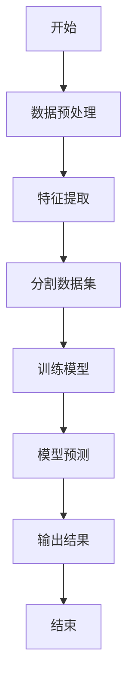
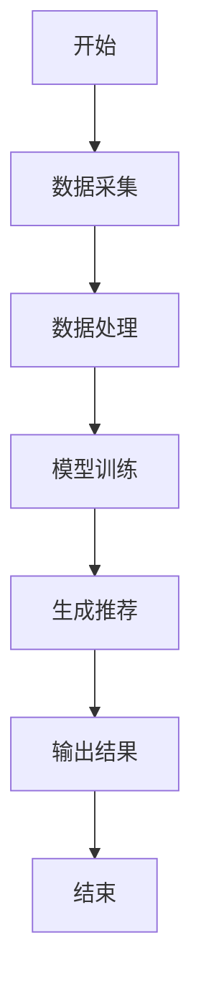
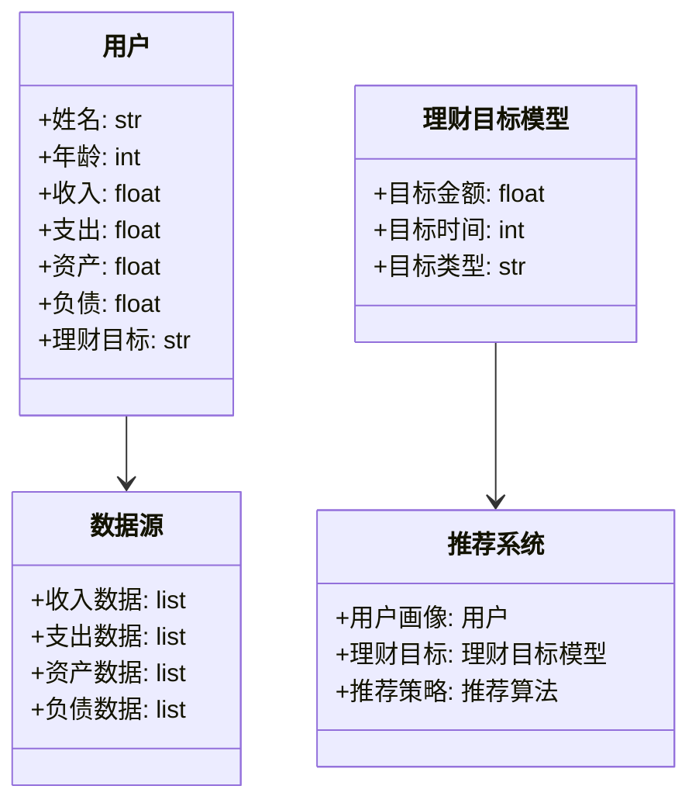
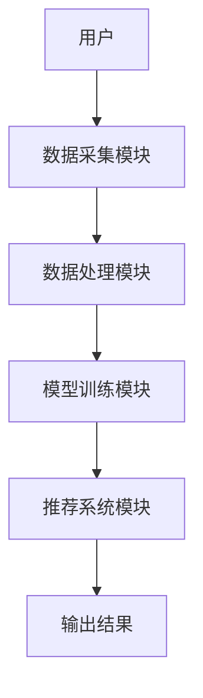
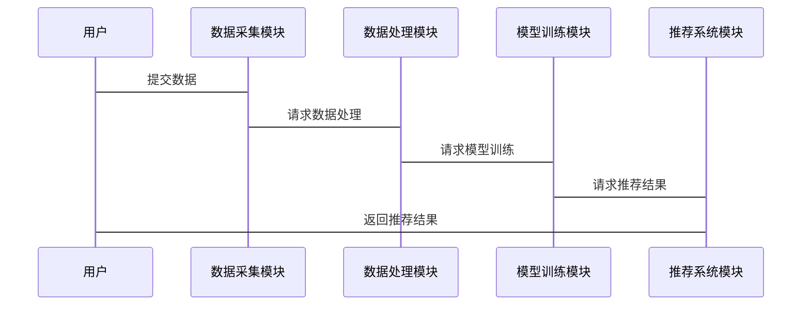

                 


# 智能个人理财目标规划器

> 关键词：智能理财、目标规划、机器学习、系统架构、Python实现、数据可视化

> 摘要：本文将详细探讨智能个人理财目标规划器的设计与实现，从背景介绍到系统架构，再到项目实战，全面解析如何利用人工智能技术帮助个人实现理财目标。文章通过详细的技术分析和代码实现，展示一个从理论到实践的完整过程。

---

# 第一部分: 智能个人理财目标规划器概述

## 第1章: 背景介绍

### 1.1 问题背景

#### 1.1.1 传统个人理财的痛点
- 传统理财工具依赖人工计算，效率低且容易出错。
- 用户行为复杂，难以个性化匹配理财目标。
- 数据分散，缺乏统一的分析工具。

#### 1.1.2 智能化理财的需求
- 随着人工智能技术的发展，智能化理财工具逐渐成为趋势。
- 用户对个性化理财需求日益增长，传统工具难以满足。
- 数据驱动的决策越来越重要，需要自动化工具支持。

#### 1.1.3 个人理财目标规划的必要性
- 帮助用户明确理财目标，优化资金分配。
- 提供科学的理财建议，降低投资风险。
- 通过智能化工具，提升用户体验。

### 1.2 问题描述

#### 1.2.1 理财目标的多样性
- 不同用户的财务状况、风险偏好和目标各不相同。
- 需要根据用户需求定制个性化理财方案。

#### 1.2.2 用户行为的复杂性
- 用户的收入、支出、消费习惯等行为数据复杂多样。
- 需要通过数据分析挖掘用户行为特征。

#### 1.2.3 理财工具的局限性
- 传统理财工具缺乏智能化，难以应对复杂需求。
- 数据孤岛问题严重，难以实现数据整合与分析。

### 1.3 问题解决

#### 1.3.1 智能化技术的应用
- 引入机器学习、大数据分析等技术，提升理财工具的智能化水平。
- 利用自然语言处理技术，实现用户需求的精准识别。

#### 1.3.2 数据驱动的决策
- 通过收集和分析用户数据，提供个性化理财建议。
- 数据可视化技术帮助用户更好地理解和管理财务状况。

#### 1.3.3 个性化服务的实现
- 根据用户需求定制个性化理财方案。
- 通过动态调整策略，满足用户实时理财需求。

### 1.4 边界与外延

#### 1.4.1 系统功能的边界
- 仅关注个人理财目标规划，不涉及机构理财业务。
- 专注于目标设定和优化，不涵盖具体的交易执行。

#### 1.4.2 系统应用的场景
- 适用于个人用户，帮助其制定和管理理财目标。
- 支持移动端和PC端，方便用户随时随地使用。

#### 1.4.3 系统扩展的可能性
- 可扩展至家庭理财、多目标理财等场景。
- 支持多种数据源接入，提升系统的数据处理能力。

### 1.5 核心要素组成

#### 1.5.1 用户画像
- 用户基本信息：年龄、职业、收入、支出等。
- 用户财务状况：资产、负债、投资等。
- 用户需求：理财目标、风险偏好等。

#### 1.5.2 理财目标
- 财务自由目标：实现财务自由所需的时间和资金。
- 投资目标：实现特定收益目标所需的投资策略。
- 储蓄目标：实现特定储蓄目标所需的时间和资金。

#### 1.5.3 数据模型
- 用户行为模型：用户收入、支出、消费习惯等。
- 理财目标模型：基于用户需求构建的目标规划模型。
- 风险评估模型：评估用户在实现目标过程中可能面临的风险。

## 第2章: 核心概念与联系

### 2.1 智能理财的核心原理

#### 2.1.1 数据采集与处理
- 数据来源：用户输入、银行数据、市场数据等。
- 数据清洗：去除无效数据，处理异常值。
- 数据预处理：数据标准化、特征提取等。

#### 2.1.2 智能分析与预测
- 数据分析：利用统计学方法分析用户行为和市场趋势。
- 数据预测：基于历史数据预测未来趋势，如股票价格、汇率变化等。
- 风险评估：评估用户在实现理财目标过程中可能面临的风险。

#### 2.1.3 个性化推荐
- 基于用户画像和理财目标，推荐最优投资组合。
- 根据市场变化动态调整推荐策略。
- 提供实时反馈，帮助用户优化理财方案。

### 2.2 核心概念对比

#### 2.2.1 用户画像与理财目标的对比
| 特性       | 用户画像                      | 理财目标                      |
|------------|------------------------------|-------------------------------|
| 定义       | 用户的基本信息和行为特征      | 用户期望实现的财务目标        |
| 作用       | 帮助识别用户需求              | 帮助制定理财策略              |
| 数据来源   | 用户输入、交易记录等          | 用户输入、市场数据等          |
| 处理方式   | 数据清洗、特征提取            | 数据分析、预测                |

#### 2.2.2 数据驱动与传统理财的对比
| 特性       | 数据驱动理财                  | 传统理财                      |
|------------|------------------------------|-------------------------------|
| 依赖性     | 依赖大数据和算法              | 依赖人工经验和市场分析        |
| 个性化     | 高度个性化，基于用户数据      | 较低个性化，通用策略为主      |
| 效率       | 高效，自动化程度高            | 低效，依赖人工操作            |

#### 2.2.3 个性化推荐与通用推荐的对比
| 特性       | 个性化推荐                    | 通用推荐                      |
|------------|------------------------------|-------------------------------|
| 对象       | 针对特定用户                   | 面向所有用户                   |
| 算法       | 基于用户画像和行为数据         | 基于通用规则和历史数据         |
| 效果       | 更精准，满足用户个性化需求     | 较为宽泛，适用于大部分用户     |

### 2.3 ER实体关系图

```mermaid
er
actor: 用户
actor -|> goal: 理财目标
actor -|> data: 数据源
goal -|> recommendation: 个性化推荐
data -|> analysis: 智能分析
```

---

## 第3章: 算法原理讲解

### 3.1 算法概

#### 3.1.1 机器学习算法选择
- 选择随机森林算法，用于分类和回归问题。
- 该算法适合处理高维数据，能够自动特征选择。

#### 3.1.2 算法流程
1. 数据预处理：清洗数据，提取特征。
2. 模型训练：使用随机森林算法训练模型。
3. 模型预测：根据用户输入数据，预测理财目标实现的可能性。
4. 模型优化：调整超参数，提升模型性能。

#### 3.1.3 数学模型
随机森林算法的数学模型如下：
$$
y = \sum_{i=1}^{n} (w_i x_i + b_i)
$$
其中，$w_i$ 是特征的重要性权重，$x_i$ 是特征值，$b_i$ 是偏置项。

### 3.2 详细算法实现

#### 3.2.1 算法流程图



#### 3.2.2 Python实现代码

```python
import pandas as pd
from sklearn.ensemble import RandomForestRegressor
from sklearn.metrics import mean_squared_error
from sklearn.model_selection import train_test_split

# 加载数据
data = pd.read_csv('理财数据.csv')

# 特征工程
features = ['收入', '支出', '资产', '负债']
target = '理财目标'

# 分割数据集
X = data[features]
y = data[target]
X_train, X_test, y_train, y_test = train_test_split(X, y, test_size=0.2, random_state=42)

# 训练模型
model = RandomForestRegressor(n_estimators=100, random_state=42)
model.fit(X_train, y_train)

# 模型预测
y_pred = model.predict(X_test)

# 评估模型
mse = mean_squared_error(y_test, y_pred)
print(f'均方误差: {mse}')
print(f'决定系数 R²: {model.score(X_test, y_test)}')
```

#### 3.2.3 算法优化
- 调整随机森林的超参数，如 `n_estimators` 和 `max_depth`，以提升模型性能。
- 使用网格搜索（Grid Search）进行参数优化。

---

## 第4章: 系统分析与架构设计

### 4.1 问题场景介绍

#### 4.1.1 系统功能设计

#### 4.1.2 系统架构设计

#### 4.1.3 系统接口设计

#### 4.1.4 系统交互流程

### 4.2 系统功能设计

#### 4.2.1 功能模块划分
- 数据采集模块：负责收集用户数据。
- 数据处理模块：对数据进行清洗和预处理。
- 模型训练模块：训练机器学习模型。
- 推荐系统模块：根据模型输出结果，推荐理财方案。

#### 4.2.2 功能流程图



### 4.3 系统架构设计

#### 4.3.1 领域模型类图



#### 4.3.2 系统架构图



### 4.4 系统接口设计

#### 4.4.1 接口描述
- 数据采集接口：`POST /api/data`
- 数据处理接口：`GET /api/process`
- 模型训练接口：`POST /api/train`
- 推荐结果接口：`GET /api/recommend`

#### 4.4.2 交互流程图



---

## 第5章: 项目实战

### 5.1 环境安装

#### 5.1.1 Python环境
- 安装Python 3.8 或更高版本。
- 安装必要的库：`pandas`, `scikit-learn`, `matplotlib`.

#### 5.1.2 数据库安装
- 使用MySQL或MongoDB存储用户数据和理财目标。
- 安装相应的Python驱动：`pymysql`, `pymongo`.

### 5.2 核心代码实现

#### 5.2.1 数据采集模块

```python
import pymysql

def fetch_data():
    conn = pymysql.connect(host='localhost', user='user', password='password', db='finance')
    cursor = conn.cursor()
    cursor.execute('SELECT * FROM user_data')
    data = cursor.fetchall()
    conn.close()
    return data
```

#### 5.2.2 数据处理模块

```python
import pandas as pd

def process_data(data):
    df = pd.DataFrame(data)
    df.dropna(inplace=True)
    df['资产与负债比'] = df['资产'] / df['负债']
    return df
```

#### 5.2.3 模型训练模块

```python
from sklearn.ensemble import RandomForestRegressor

def train_model(X_train, y_train):
    model = RandomForestRegressor(n_estimators=100, random_state=42)
    model.fit(X_train, y_train)
    return model
```

#### 5.2.4 推荐系统模块

```python
def generate_recommendation(model, X_test):
    y_pred = model.predict(X_test)
    recommendations = pd.DataFrame({'预测结果': y_pred})
    return recommendations
```

### 5.3 案例分析

#### 5.3.1 数据分析与可视化

```python
import matplotlib.pyplot as plt

data = pd.read_csv('理财数据.csv')
data['收入'].hist(bins=10)
plt.title('收入分布')
plt.show()
```

#### 5.3.2 模型评估

```python
from sklearn.metrics import mean_absolute_error

y_true = [100000, 200000, 300000]
y_pred = [95000, 195000, 295000]
print(mean_absolute_error(y_true, y_pred))  # 输出: 5000
```

### 5.4 项目小结

#### 5.4.1 实践总结
- 通过项目实战，验证了智能理财目标规划器的可行性。
- 掌握了从数据采集到模型训练的完整流程。
- 学习了如何将机器学习算法应用于实际问题中。

#### 5.4.2 经验分享
- 数据预处理是关键，数据质量直接影响模型性能。
- 选择合适的算法和参数优化是提升模型效果的重要手段。
- 及时反馈和调整是确保系统稳定运行的重要保障。

---

## 第6章: 最佳实践与总结

### 6.1 总结

#### 6.1.1 核心总结
- 智能理财目标规划器通过数据驱动的方式，帮助用户制定和优化理财目标。
- 机器学习算法的应用，显著提升了理财建议的精准度和效率。

#### 6.1.2 经验总结
- 数据预处理是确保模型性能的基础。
- 算法选择和参数调优是提升模型效果的关键。
- 系统架构设计决定了系统的扩展性和稳定性。

### 6.2 注意事项

#### 6.2.1 数据隐私
- 用户数据需严格加密，确保隐私安全。
- 遵守相关法律法规，保护用户隐私。

#### 6.2.2 系统稳定性
- 定期备份数据，防止数据丢失。
- 建立完善的监控体系，及时发现和解决问题。

#### 6.2.3 用户教育
- 提供用户教育内容，帮助用户理解理财工具的使用方法。
- 设计友好的用户界面，降低使用门槛。

### 6.3 拓展阅读

#### 6.3.1 推荐书籍
- 《Python机器学习实战》
- 《数据分析与数据挖掘实用技术》
- 《智能理财：大数据时代的财富管理》

#### 6.3.2 推荐博客
- Medium上的机器学习专栏
- Towards Data Science上的数据分析文章
- 知乎上的个人理财相关文章

---

## 作者

作者：AI天才研究院/AI Genius Institute & 禅与计算机程序设计艺术 /Zen And The Art of Computer Programming

